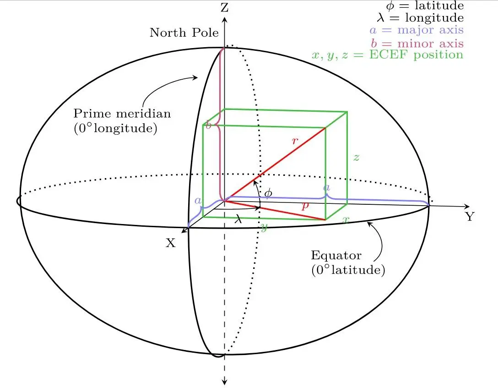

## Background


_image reference[^footnote]_

지구는 평평하지도 완벽한 구형(Sphere)도 아닌 비표준 타원체(Ellipsoid)임을 고려하면 서로 다른 경도 및 위도 위치에 있는 두 점 사이의 거리를 빠르고 정확하게 계산하는 완벽한 공식은 없습니다.

그래도 geotools 라이브러리를 사용하면 수학적으로 보정된 근사치를 꽤나 간단하게 얻어낼 수 있습니다.

<!-- truncate -->

## 의존성 추가

geotools 의 지구 타원체를 사용하기 위해서는 관련 라이브러리 의존성이 필요합니다.

```groovy
repositories {
    maven { url "https://repo.osgeo.org/repository/release/" }
    maven { url "https://download.osgeo.org/webdav/geotools/" }
    mavenCentral()
}

dependencies {
    ...
    implementation 'org.geotools:gt-referencing:26.2'
    ...
}

```

## 코드 작성

먼저 서울과 부산의 좌표를 enum class 로 작성해줍니다.

```kotlin
enum class City(val latitude: Double, val longitude: Double) {
    SEOUL(37.5642135, 127.0016985),
    BUSAN(35.1104, 129.0431);
}
```

그리고 테스트 코드를 통해 간단한 사용법을 살펴보겠습니다.

```kotlin
class EllipsoidTest {

    @Test
    internal fun createEllipsoid() {
        val ellipsoid = DefaultEllipsoid.WGS84  // GPS 시스템에서 사용하고 있는 WGS84 측량법을 활용하여 지구에 최대한 가까운 타원체를 만들어 준다

        val isSphere = ellipsoid.isSphere  // 구형인지 타원체인지 판단
        val semiMajorAxis = ellipsoid.semiMajorAxis  // 장축(적도 반지름), 타원체에서 긴 쪽의 반지름
        val semiMinorAxis = ellipsoid.semiMinorAxis  // 단축(극 반지름), 타원체에서 짧은 쪽의 반지름
        val eccentricity = ellipsoid.eccentricity  // 이심률, 해당 타원체가 얼마나 구형에 가까운지를 나타냄
        val inverseFlattening = ellipsoid.inverseFlattening  // 역평탄화 수치
        val ivfDefinitive = ellipsoid.isIvfDefinitive // 역평탄화가 이 타원체에 결정적일 수 있는지

        // 직교 거리
        val orthodromicDistance = ellipsoid.orthodromicDistance(
            City.SEOUL.longitude,
            City.SEOUL.latitude,
            City.BUSAN.longitude,
            City.BUSAN.latitude
        )

        println("isSphere = $isSphere")
        println("semiMajorAxis = $semiMajorAxis")
        println("semiMinorAxis = $semiMinorAxis")
        println("eccentricity = $eccentricity")
        println("inverseFlattening = $inverseFlattening")
        println("ivfDefinitive = $ivfDefinitive")
        println("orthodromicDistance = $orthodromicDistance")
    }
}
```

```text
isSphere = false
semiMajorAxis = 6378137.0
semiMinorAxis = 6356752.314245179
eccentricity = 0.08181919084262128
inverseFlattening = 298.257223563
ivfDefinitive = true
orthodromicDistance = 328199.9794919944
```

`DefaultEllipsoid.WGS84` 로 지구 타원체를 생성할 수 있습니다. 만약 `WGS84` 가 아닌 `SPHERE` 를 사용하면 타원이 아닌 반지름 6371km 의 구체가 만들어집니다.

distance 의 결과는 미터(m) 로 출력되므로 km 로 변환해보면 328km 가 나오는 것을 확인할 수 있습니다. 실제 구글에 검색해보면 325km 가 나오니 제가 임의로 선정한 좌표와 구글이 선정한 좌표에 차이가 있을 수 있음을 감안해보면 나쁘지 않은 수치입니다.

이 외에도 다양한 기능이 존재하는데요. 이 포스팅에서 모두 다루기에는 너무 방대해서 필요하다면 다른 포스팅에서 다뤄보겠습니다.

:::info

오차의 범위는 비즈니스 요구사항에 따라서 만족스럽지 못할 수 있기 때문에 실제 적용하시기 전에 geotools 의 다른 method 들도 충분히 테스트해보시기 바랍니다.

:::

---

[^footnote]: [An Overview of SRID and Coordinate System](https://www.alibabacloud.com/blog/an-overview-of-srid-and-coordinate-system_597004)
