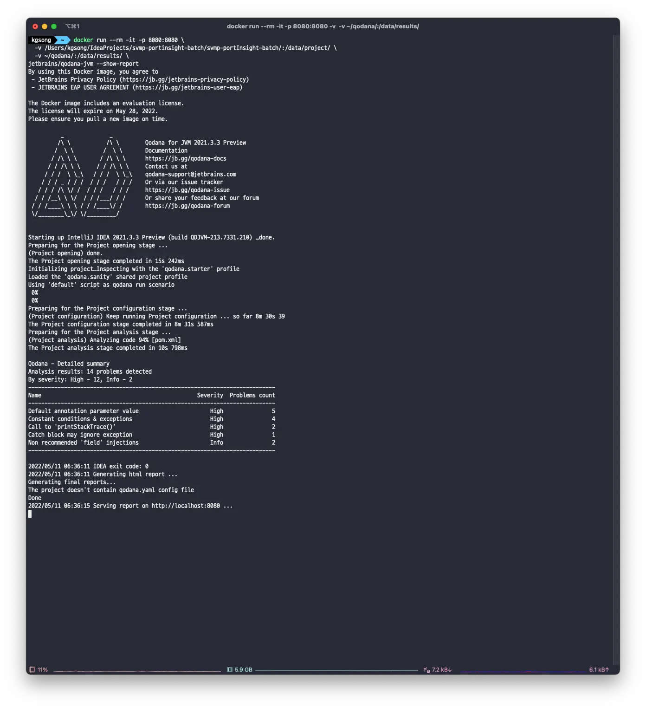

## Qodana?

Qodana 는 Jetbrains 에서 제공하는 코드 품질 개선 도구입니다. 기본적인 사용은 아주 간단하게 사용할 수 있어서 소개해보려고 합니다.

우선 Docker 가 설치되어 있는 환경이어야 합니다.

```bash
docker run --rm -it -p 8080:8080 \
  -v <source-directory>/:/data/project/ \
  -v <output-directory>/:/data/results/ \
jetbrains/qodana-jvm --show-report
```

저는 Java 애플리케이션을 분석할 것이므로 jvm 이미지를 사용해주었습니다. 만약 다른 언어를 사용하고 있다면 [Qodana](https://www.jetbrains.com/ko-kr/qodana/) 에서 찾아서 쓰시면 됩니다.

- `<source-directory>` 에 분석하고자 하는 프로젝트의 경로를 적어줍니다.
- `<output-directory>` 에는 분석 결과가 저장될 경로를 입력합니다. 아래에서 이어 설명합니다.

저는 분석 결과를 저장하기 위해서 root 경로에 qodana 라는 폴더를 생성한 뒤 사용하였습니다.

<!-- truncate -->

```bash
mkdir ~/qodana
# 이후 <output-directory> 를 ~/qobana 로 교체해줍니다.
```

이제 위에서 미리 적어둔 `docker run ~` 명령을 실행하고 잠시 기다리면 아래와 같은 결과를 확인할 수 있습니다.

저는 테스트를 위해 간단한 자바 애플리케이션을 사용했습니다.



이제 http://localhost:8080 으로 접근해보면


코드 분석 결과를 확인할 수 있습니다.

도커만 설치되어 있다면, 현재 진행 중인 프로젝트의 코드 분석 결과를 아주 간단하게 얻을 수 있습니다.

이런 분석툴은 일종의 코드 리뷰의 역할을 해주므로, 리뷰어의 피로도를 줄여줄 수 있고 리뷰어는 좀 더 섬세한 리뷰에만 집중할 수 있게 해줍니다. 코드 품질 관리에 적극적으로 활용하면 매우 편리한 개발 경험이 될 것 같습니다.
