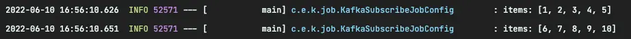

:::info

저는 Docker 를 사용하여 Kafka 설치 후 이번 글을 작성했지만 해당 내용은 이번 글에서 다루지 않습니다.

:::

## KafkaItemReader..?

Spring batch 에서는 Kafka Topic 의 데이터를 처리하는 경우를 위해서 `KafkaItemReader` 를 제공하고 있습니다.

간단한 배치를 하나 만들어보겠습니다.

## Example

먼저 관련 의존성을 추가해줍니다.

<!-- truncate -->

```gradle
dependencies {
    ...
    implementation 'org.springframework.boot:spring-boot-starter-batch'
    implementation 'org.springframework.kafka:spring-kafka'
    ...
}
```

`application.yml` 에 Kafka 관련 설정을 진행해줍니다.

```yaml
spring:
  kafka:
    bootstrap-servers:
      - localhost:9092
    consumer:
      group-id: batch
```

```java
@Slf4j
@Configuration
@RequiredArgsConstructor
public class KafkaSubscribeJobConfig {

    private final JobBuilderFactory jobBuilderFactory;
    private final StepBuilderFactory stepBuilderFactory;
    private final KafkaProperties kafkaProperties;

    @Bean
    Job kafkaJob() {
        return jobBuilderFactory.get("kafkaJob")
                .incrementer(new RunIdIncrementer())
                .start(step1())
                .build();
    }

    @Bean
    Step step1() {
        return stepBuilderFactory.get("step1")
                .<String, String>chunk(5)
                .reader(kafkaItemReader())
                .writer(items -> log.info("items: {}", items))
                .build();
    }

    @Bean
    KafkaItemReader<String, String> kafkaItemReader() {
        Properties properties = new Properties();
        properties.putAll(kafkaProperties.buildConsumerProperties());

        return new KafkaItemReaderBuilder<String, String>()
                .name("kafkaItemReader")
                .topic("test") // 1.
                .partitions(0) // 2.
                .partitionOffsets(new HashMap<>()) // 3.
                .consumerProperties(properties) // 4.
                .build();
    }
}
```

1. 데이터를 읽어들일 Topic 을 지정합니다.
2. Topic 의 partition 을 지정하며, 여러 partition 지정이 가능합니다.
3. KafkaItemReader 는 **offset 을 지정하지 않으면 0번 offset** 부터 읽습니다. 빈 맵을 넣어주면 마지막 offset 부터 데이터를 읽어옵니다.
4. 실행에 필수적인 property 들을 설정합니다.

:::tip

`KafkaProperties` 는 Spring 에서 kafka 를 편리하게 사용할 수 있도록 다양한 public interface 를 제공합니다.

:::

## 실행해보기

이제 배치를 실행시키면 `application.yml` 에 작성한 정보를 바탕으로 `consumer groups` 이 자동으로 생성되고 topic 을 구독하는 상태가 됩니다.

`kafka console producer` 를 사용해 `test` topic 에 1~10까지 데이터를 넣어보겠습니다.

```bash
kafka-console-producer.sh --bootstrap-server localhost:9092 --topic test
```


배치가 topic 을 정상적으로 구독하고 있는 모습을 확인할 수 있습니다.



`chunkSize` 를 5로 설정했기 때문에 5개씩 데이터를 묶어서 처리하게 됩니다.

여기까지 Spring Batch 에서 `KafkaItemReader` 를 사용하는 기본적인 방법에 대해 살펴보았고, 다음은 어떻게 테스트 코드를 작성할 수 있는지 알아보겠습니다.
