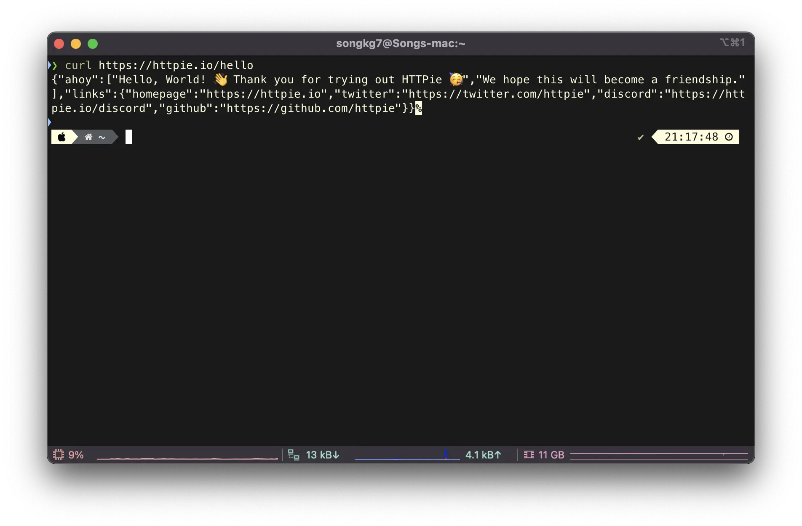
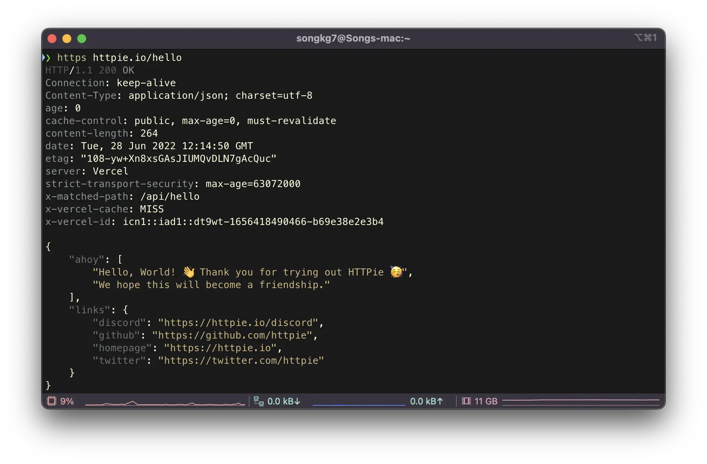

## Overview

> curl 명령어를 대체할 수 있는 CLI tool

평소 Linux 를 자주 사용하는 개발자라면 `curl` 명령어를 쓸 일이 많다. 서버에서 외부 API 요청을 보내려면 필수적인 명령어인데, 출력 결과의 가독성이 좋지 않다는 단점이 있었다. HTTPie 는 이런 단점을 해소해줄 수 있는 재밌는 툴이기에 소개해보려 한다.

<!-- truncate -->

## Install

Mac 유저의 경우 brew 를 사용하여 간단하게 설치할 수 있다.

```bash
brew install httpie
```

CentOS 라면 yum install 로 설치한다.

```bash
yum install epel-release
yum install httpie
```

## Usage

먼저 `curl` 을 사용하여 GET 요청을 보내는 법은 다음과 같다.

```bash
curl https://httpie.io/hello
```



그럼 이제 `HTTPie` 와 비교해보자.

```bash
https httpie.io/hello
```



명령어를 포함한 모든 부분에서 가독성이 훨씬 좋아진다. 응답 및 헤더값이 기본으로 포함되어 있어서 별도의 명령어를 사용하지 않아도 다양한 정보를 한 눈에 얻을 수 있다.

`https` 가 아닌 `http` 는 명령어가 구분되어 있다.

```bash
http localhost:8080
```

공식 사이트에서 설명하는 POST 요청은 다음과 같이 보낼 수 있다.

```bash
http -a USERNAME POST https://api.github.com/repos/httpie/httpie/issues/83/comments body='HTTPie is awesome! :heart:'
```

그 외 여러 기능은 [GitHub](https://github.com/httpie/httpie)에 설명되어 있으니 잘 활용한다면 큰 생산성 향상을 얻을 수 있다.

## Reference

- [httpie](https://github.com/httpie/httpie)
