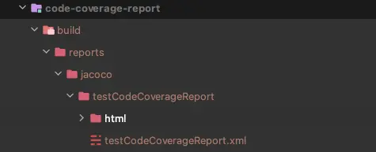

## Overview

gradle 7.4 부터 여러 jacoco test report 를 집계하여 통합적으로 볼 수 있는 기능이 추가되었다. 과거에는 여러 모듈에 걸친 테스트의 결과를 하나의 파일로 확인하기가 무척 어려웠지만, 이제는 매우 편리하게 리포트를 하나로 합칠 수 있게 되었다.

<!-- truncate -->

## Usage

### report 를 수집하는 역할만 가진 sub module 생성

현재 프로젝트의 구조는 application 이라는 모듈과, list, utils 이라는 application 에서 사용하는 모듈로 구성되어 있다.

code-coverage-report 를 추가하여 application, list, utils 모듈의 test report 를 수집한다.

그럼 프로젝트의 구성은 아래처럼 된다.

- application
- utils
- list
- code-coverage-report

### jacoco-report-aggregation plugin 추가

```gradle
// code-coverage-report/build.gradle
plugins {
    id 'base'
    id 'jacoco-report-aggregation'
}

repositories {
    mavenCentral()
}

dependencies {
    jacocoAggregation project(":application")
}
```

이제 `./gradlew testCodeCoverageReport` 를 사용하여 모든 모듈의 테스트 결과가 집계되어 있는 jacoco report 를 만들 수 있다.



:::warning

aggregation 기능을 이용하려면 jar 파일이 필요하니 `jar { enable = false }` 로 설정하고 쓴다면 true 로 바꿔줘야 한다.

:::

### 추가 22-09-28

gradle multi project 의 경우 단일 프로젝트일 때는 제대로 report 에서 제외되었던 package 들이 aggregate report 에서는 제외되지 않는 이슈가 있다.

아래 코드를 참고하여 설정을 추가해주면 특정 package 를 제외한 report 를 생성할 수 있다.

```gradle
testCodeCoverageReport {
    reports {
        csv.required = true
        xml.required = false
    }
    getClassDirectories().setFrom(files(
        [project(':api'), project(':utils'), project(':core')].collect {
            it.fileTree(dir: "${it.buildDir}/classes/java/main", exclude: [
                '**/dto/**',
                '**/config/**',
                '**/output/**',
            ])
        }
    ))
}
```

## Next step

Gradle 에서 `jacoco-aggregation-report` 와 함께 소개하고 있는 `jvm-test-suite` 라는 plugin 도 상당히 유용해 보인다. 상호 보완적인 플러그인이라 생각되므로 같이 활용해보자.

## Reference

- [Gradle 7.4 Release Notes](https://docs.gradle.org/7.4/release-notes.html)
