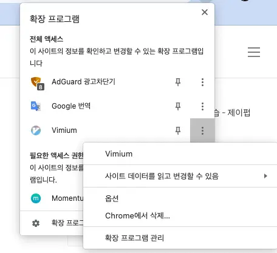

## Overview

최근 Vim 을 사용하게 되면서, 주변 모든 환경을 Vim 으로 맞추게 되었다. 그 중 safari 의 Vim 확장 프로그램인 Vimari 와 Chrome 의 확장인 Vimium 에서 몇가지 단축키가 다른 부분이 있어서 통일시키기 위해 특정 키를 새로 매핑했는데 vimium 에서 단축키를 매핑하는 법을 소개하고자 한다.

<!-- truncate -->

## Viminum 옵션창

chrome 확장에서 버튼을 눌러서 옵션을 열어주자.

이 부분을 수정해주면 단축키가 변경된다. 기본적인 매핑방법은 vim 과 동일하다. 개인적으로 vimari 의 탭 이동 단축키인 q, w 가 vimium 의 J, K 보다 편한 것 같아 변경해주었다.

만약 어떤 action 에 키를 매핑해야하는지 모르겠다면 옆에 show available commands 를 눌러보면 친절하게 설명해준다.

여기서 원하는 action 을 찾아서 특정 키에 매핑하면 되겠다.
