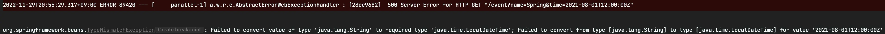
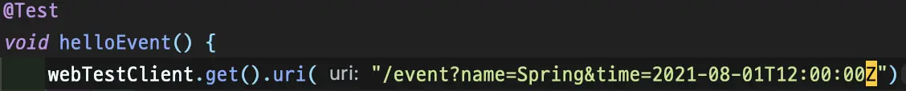

## Overview

`LocalDateTime` 같은 시간 형식을 url parameter 로 사용할 경우 기본 포맷에 맞지 않는다면 다음과 같은 에러 메세지를 보게 됩니다.

```console
Exception: Failed to convert value of type 'java.lang.String' to required type 'java.time.LocalDateTime';
```

특정 포맷도 convert 할 수 있도록 하기 위해서는 어떤 설정을 해줘야 할까요? 이번 글에서는 변환 방법에 대해서 알아봅니다.

<!-- truncate -->

## Contents

간단한 샘플 예제를 하나 만들어 보겠습니다.

```java
public record Event(
        String name,
        LocalDateTime time
) {
}
```

event 의 이름과 발생 시간을 담고 있는 간단한 객체입니다. `record` 를 사용하여 만들어줬습니다.

```java
@RestController
public class EventController {

    @GetMapping("/event")
    public Mono<Event> helloEvent(Event event) {
        return Mono.just(event);
    }

}
```

handler 는 전통적인 Controller model 을 사용해서 만들어줬습니다.

:::tip

Spring WebFlux 에서는 Router function 을 사용하여 요청을 관리할 수 있지만, 이 글은 WebFlux 에 관한 내용이 아니므로 `@RestController` 를 통한 방식을 선택했습니다.

:::

테스트 코드를 작성해보겠습니다.

```java
@WebFluxTest
class EventControllerTest {

    @Autowired
    private WebTestClient webTestClient;

    @Test
    void helloEvent() {
        webTestClient.get().uri("/event?name=Spring&time=2021-08-01T12:00:00")
                .exchange()
                .expectStatus().isOk()
                .expectBody()
                .jsonPath("$.name").isEqualTo("Spring")
                .jsonPath("$.time").isEqualTo("2021-08-01T12:00:00");
    }

}
```


테스트 코드를 실행하면 아래와 같은 요청이 발생하는 것과 같습니다.

```bash
$ http localhost:8080/event Accept=application/stream+json name==Spring time==2021-08-01T12:00
HTTP/1.1 200 OK
Content-Length: 44
Content-Type: application/stream+json

{
    "name": "Spring",
    "time": "2021-08-01T12:00:00"
}
```

기본 포맷으로 요청하면 정상적으로 응답을 받지만, 요청 포맷을 변경하면 어떨까요?





```bash
$ http localhost:8080/event Accept=application/stream+json name==Spring time==2021-08-01T12:00:00Z
HTTP/1.1 500 Internal Server Error
Content-Length: 131
Content-Type: application/stream+json

{
    "error": "Internal Server Error",
    "path": "/event",
    "requestId": "ecc1792e-3",
    "status": 500,
    "timestamp": "2022-11-28T10:04:52.784+00:00"
}
```

보시는 바와 같이 특정 포맷으로 응답을 받고 싶은 경우는 별도의 설정이 필요합니다.

### 1. `@DateTimeFormat`

가장 간단한 해결법은 변환하고 싶은 필드에 annotation 을 추가해주는 것입니다. 어떤 포맷으로 변환할 것인지 정의해주면 원하는 포맷으로 요청할 수 있습니다.

```java
public record Event(
        String name,

        @DateTimeFormat(pattern = "yyyy-MM-dd'T'HH:mm:ss'Z'")
        LocalDateTime time
) {
}
 ```

다시 테스트를 실행해주면 정상적으로 통과하는 것을 확인할 수 있습니다.

:::info

요청 포맷을 바꿀 수 있을 뿐이지 응답 포맷까지 변하진 않습니다. 응답 포맷 변경은 `@JsonFormat` 등의 annotation 을 통해서 설정 가능하지만 이 글에선 다루지 않습니다.

:::

간단하게 문제를 해결했지만, 항상 최선의 해결책은 아닙니다. 변환해야하는 필드가 많다면 하나하나 annotation 을 붙이는 건 꽤나 귀찮은 작업이 되고, 실수로 annotation 을 작성하지 않아서 버그가 발생할 수도 있습니다. `ArchUnit`[^fn_nth_2] 등의 test library 를 사용해서 체크하게 하는 것도 가능하지만, 코드를 파악하기 위해 들여야하는 노력이 늘어난다는 것은 부정할 수 없는 사실입니다.

### 2. `WebFluxConfigurer`

`WebFluxConfigurer` 를 구현하여 formatter 를 등록해주면 `LocalDateTime` 마다 일일히 annotation 을 작성해야 하는 일을 피할 수 있습니다.

`Event` 에서 `@DateTimeFormat` 을 제거해준 뒤 설정을 구성합니다.

```java
@Configuration
public class WebFluxConfig implements WebFluxConfigurer {

    @Override
    public void addFormatters(FormatterRegistry registry) {
        DateTimeFormatterRegistrar registrar = new DateTimeFormatterRegistrar();
        registrar.setUseIsoFormat(true);
        registrar.registerFormatters(registry);
    }
}
```

:::danger

`@EnableWebFlux` 를 사용하게되면 mapper 를 override 하기 때문에 애플리케이션이 의도한대로 동작하지 않을 수 있습니다.[^footnote]

:::

다시 테스트를 실행해보면 annotation 없이도 통과하는 것을 확인할 수 있습니다.


### 특정 필드만 다른 포맷 적용하기

간단합니다. field 에 직접 작성하는 방식인 `@DateTimeFormat` 의 우선도가 더 높기 때문에 원하는 필드에는 `@DateTimeFormat` 을 작성해주면 됩니다.

```java
public record Event(
        String name,

        LocalDateTime time,

        @DateTimeFormat(pattern = "yyyy-MM-dd'T'HH")
        LocalDateTime anotherTime
) {
}
```

```java
    @Test
    void helloEvent() {
        webTestClient.get().uri("/event?name=Spring&time=2021-08-01T12:00:00Z&anotherTime=2021-08-01T12")
                .exchange()
                .expectStatus().isOk()
                .expectBody()
                .jsonPath("$.name").isEqualTo("Spring")
                .jsonPath("$.time").isEqualTo("2021-08-01T12:00:00")
                .jsonPath("$.anotherTime").isEqualTo("2021-08-01T12:00:00");
    }
```


:::tip

URI 가 길어지면 UriComponentsBuilder 를 사용하는 것도 좋은 방법입니다.

```java
String uri = UriComponentsBuilder.fromUriString("/event")
        .queryParam("name", "Spring")
        .queryParam("time", "2021-08-01T12:00:00Z")
        .queryParam("anotherTime", "2021-08-01T12")
        .build()
        .toUriString();
```

:::

## Conclusion

`WebFluxConfigurer` 를 사용하는 방식은 전역적으로 일관된 포맷을 구현할 수 있습니다. 특정 포맷을 적용해야하는 필드가 여러 클래스에 걸쳐 분포한 경우, `@DateTimeFormat` 을 붙이는 것보다 훨씬 간편하게 적용할 수 있으니 상황에 맞게 적용하시면 됩니다.

- `@DateTimeFormat` : 적용이 간단. 전역 설정보다 우선도가 높으므로 특정 필드만 다른 포맷을 사용해야할 경우 등 타겟팅하여 적용하는 것이 가능.
- `WebFluxConfigurer` : 적용이 상대적으로 복잡하지만, 프로젝트 규모가 어느 정도 커져서 일관된 설정 적용이 필요할 경우 `@DateTimeFormat` 에 비해 압도적 유리. 일부 필드에 실수로 annotation 을 작성하지 않는 등의 휴먼 에러를 방지할 수 있음.

:::info

모든 예제 코드는 [GitHub](https://github.com/songkg7/java-practice/blob/main/spring-webflux-parameter-sample/src/test/java/com/example/springwebfluxparametersample/controller/EventControllerTest.java) 에서 확인하실 수 있습니다.

:::

## Reference

[^footnote]: [LocalDateTime is representing in array format](https://stackoverflow.com/questions/63682619/localdatetime-is-representing-in-array-format)

[^fn_nth_2]: [ArchUnit](https://www.archunit.org)
