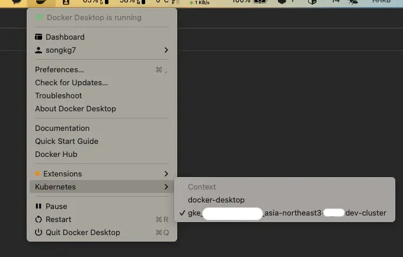

## Overview

Google 에서 제공하는 Cloud shell 을 통해 언제 어디서나 Web 을 통해서 `kubectl` 을 실행할 수 있다는 점은 매우 편리하지만 간단한 조회 명령 한 줄을 위해서 Web 접근 및 인증 등 다소 귀찮은 작업이 필요하다는 단점이 있습니다. 이번 글에서는 Google Cloud Kubernetes 를 local 에서 CLI 를 통해 빠르게 관리하기 위한 방법을 공유합니다.

<!-- truncate -->

## Contents

### GCP CLI 설치

먼저 gcp cli 를 설치해야 합니다. [gcp-cli](https://cloud.google.com/sdk/gcloud?hl=ko) 링크를 참조하여 자신에게 맞는 운영체제를 확인 후 설치합니다.

### 접속

설치가 끝났다면 다음 명령어를 통해 인증과정까지 완료해줍니다.

```bash
gcloud init
```

GCP kubernetes engine 으로 접근하여 cluster 의 연결 정보를 가져와야 합니다.


명령줄 액세스를 복사한 후, 터미널에서 실행해봅니다.

```bash
gcloud container clusters get-credentials sv-dev-cluster --zone asia-northeast3-a --project {projectId}
```

```console
Fetching cluster endpoint and auth data.
CRITICAL: ACTION REQUIRED: gke-gcloud-auth-plugin, which is needed for continued use of kubectl, was not found or is not executable. Install gke-gcloud-auth-plugin for use with kubectl by following https://cloud.google.com/blog/products/containers-kubernetes/kubectl-auth-changes-in-gke
kubeconfig entry generated for sv-dev-cluster.
```

### Plugin 설치

현재 사용 중인 쿠버네티스 버전이 v1.26 버전보다 이하일 경우, `gke-gcloud-auth-plugin` 을 설치해달라는 에러가 출력될 수 있습니다. 다음 명령어를 통해 플러그인을 설치해줍니다.

:::info

kubectl 및 커스텀 Kubernetes 클라이언트의 기존 버전에는 클라이언트와 Google Kubernetes Engine 간의 인증을 관리하는 제공업체별 코드가 포함되어 있습니다. v1.26부터는 이 코드가 더 이상 OSS kubectl에 포함되지 않습니다. GKE 사용자는 별도의 인증 플러그인을 다운로드하고 사용하여 GKE별 토큰을 생성해야 합니다. 새로운 바이너리인 gke-gcloud-auth-plugin은 GKE를 지원하는 kubectl 인증을 확장하는 데 Kubernetes Client-go 사용자 인증 정보 플러그인 메커니즘을 사용합니다. 플러그인이 이미 kubectl에서 지원되므로 v1.26이 제공되기에 앞서 지금 새로운 메커니즘으로 전환할 수 있습니다. - Google

:::

```bash
gcloud components install gke-gcloud-auth-plugin
```

```console
Your current Google Cloud CLI version is: 408.0.1
Installing components from version: 408.0.1

┌────────────────────────────────────────────┐
│    These components will be installed.     │
├────────────────────────┬─────────┬─────────┤
│          Name          │ Version │   Size  │
├────────────────────────┼─────────┼─────────┤
│ gke-gcloud-auth-plugin │   0.4.0 │ 7.1 MiB │
└────────────────────────┴─────────┴─────────┘

For the latest full release notes, please visit:
  https://cloud.google.com/sdk/release_notes

Do you want to continue (Y/n)?  y

╔════════════════════════════════════════════════════════════╗
╠═ Creating update staging area                             ═╣
╠════════════════════════════════════════════════════════════╣
╠═ Installing: gke-gcloud-auth-plugin                       ═╣
╠════════════════════════════════════════════════════════════╣
╠═ Installing: gke-gcloud-auth-plugin                       ═╣
╠════════════════════════════════════════════════════════════╣
╠═ Creating backup and activating new installation          ═╣
╚════════════════════════════════════════════════════════════╝

Performing post processing steps...done.

Update done!
```

다시 연결 명령어를 실행해보면 error 메세지 없이 cluster 와 정상적으로 연결되는 것을 확인할 수 있습니다.

```bash
gcloud container clusters get-credentials sv-dev-cluster --zone asia-northeast3-a --project {projectId}
```

```console
Fetching cluster endpoint and auth data.
kubeconfig entry generated for sv-dev-cluster.
```

연결이 성공하면 docker desktop 에도 변화가 생기는데요. 다음처럼 Kubernetes 탭에 새로운 정보가 표시되는 것을 확인할 수 있습니다.



이후 local 에서도 `kubectl` 을 통해서 GKE 의 리소스를 직접 확인할 수 있게 됩니다.

```bash
kubectl get deployments
NAME                  READY   UP-TO-DATE   AVAILABLE   AGE
my-application        1/1     1            1           20d
```

## Conclusion

지금까지 local 에서 효율적으로 GKE 자원을 관리하기 위한 방법을 간단하게 알아보았습니다. `kubectl` 을 로컬에서 사용하게 되면 자동완성 등의 확장기능을 사용할 수 있게 되므로 훨씬 편리하게 쿠버네티스를 관리할 수 있습니다. GKE 를 사용한지 얼마되지 않으신 분들이라면 꼭 한번 시도해보시길 강력하게 추천드립니다.

## Reference

[k8s-plugin](https://cloud.google.com/blog/products/containers-kubernetes/kubectl-auth-changes-in-gke?hl=en)
