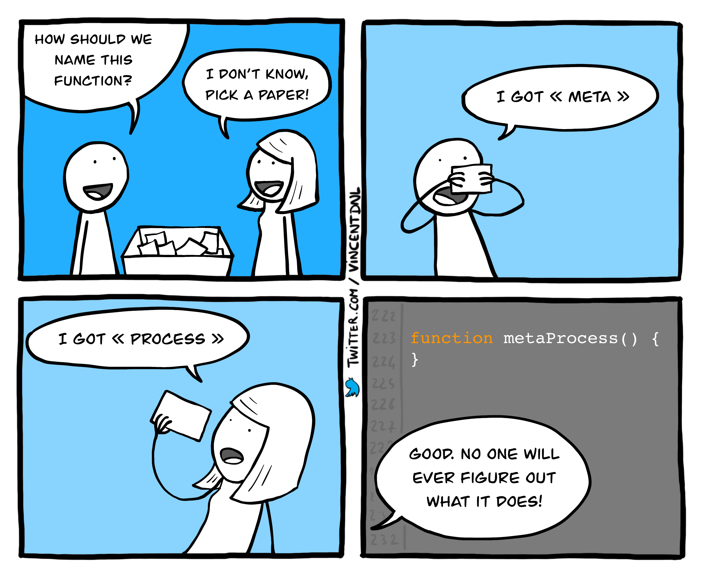
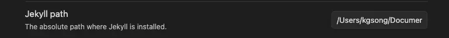
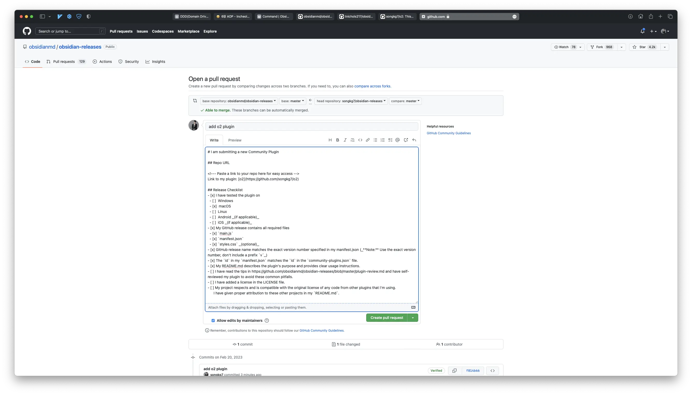

## Overview

Obsidian 은 마크다운 파일간 링크를 통해 그래프 뷰를 제공하여 편리하게 정보를 저장하고 탐색할 수 있도록 해줍니다. 하지만 이를 위해서 오리지널 마크다운 문법 외적으로 Obsidian만의 고유 문법을 강요하는데요. 이 때문에 Obsidian에서 글을 작성하면 다른 플랫폼에서 마크다운 문서를 읽을 때 호환되지 않는 영역이 존재하게 됩니다.

저는 글 작성기준(23년 2월) Jekyll 블로그를 사용하여 포스팅을 하고 있기 때문에 Obsidian 에서 글을 작성하게 되면 블로그 발행을 위해 이후 수작업으로 문법을 수정해줘야하는 워크플로우가 있었습니다. 구체적으로는 다음과 같습니다.

:::info

현재(24년 5월 이후) 보고 계신 블로그는 Docusaurus 를 사용하고 있습니다.
~~O2 에서 Docusaurus 로 변환하는 기능은 지원하지 않으며, 추후 개발 예정입니다.~~
O2 2.0 부터 Docusaurus 를 지원합니다.

:::

- [[]]을 사용한 파일링크는 Obsidian 고유 문법
- img 파일을 비롯한 attachments 경로 재설정
- `title.md` -> `yyyy-MM-dd-title.md`
- callout 문법


_layer 간의 경계를 넘어가는 이중 점선 화살표는 수작업이 필요한 부분입니다._

Obsidian 과 Jekyll 을 병행해서 사용하는 이상 이 문법 변환 과정 및 attachment 복사 과정을 자동화해야할 필요가 있었습니다.

Obsidian 은 Notion 과는 다르게 커뮤니티 플러그인을 통해 기능의 확장이 가능하니 한 번 직접 만들어보기로 합니다. 공식 문서를 좀 살펴보니 Obsidian 은 plugin 을 NodeJS 기반으로 만들도록 가이드하고 있더군요. 언어의 선택지가 넓지 않은 것이 좀 아쉽지만 TypeScript 도 평소 관심가지던 언어라서, 공부해볼겸 NodeJS/TS 환경을 구성했습니다.

<!-- truncate -->

## 구현 과정

### 이름 짓기

먼저 개발에서 가장 중요한 부분을 먼저 해결하고 진행합니다.

생각보다 그렇게 오래 걸리진 않았는데요, 'convert Obsidian syntax to Jekyll' 이라는 description 을 작성하다가 갑자기 떠오른 아이디어로 plugin 의 이름을 결정했기 때문입니다.

Obsidian 문법을 다른 플랫폼의 문법으로 바꾼다는 의미로 Obsidian to, O2 라고 프로젝트 이름을 붙였습니다.



### 변환을 위한 준비

아무튼 그럴듯한 이름도 지어놓았고, 그럼 이제 어떤 파일을 어떻게 변환해야 할까요?

블로그 포스팅을 위한 워크플로우는 다음과 같습니다.

1. `ready` 라는 폴더에 초안을 작성합니다.
2. 원고가 완성되면 첨부파일들을 포함하여 Jekyll 프로젝트로 파일을 복사합니다. 이 과정에서 Obsidian 문법을 Jekyll 문법으로 적절하게 변경해줍니다.
3. `ready` 라는 폴더에 있던 원고를 `published` 로 이동하여 발행된 원고임을 Obsidian 에서도 알 수 있게 합니다.

이 방식을 그대로 프로그래밍하기로 했습니다. 다만 기존엔 문법 수정 작업을 VScode 에서 Jekyll 프로젝트를 열어둔채로 진행했는데, 플러그인의 workspace 는 Obsidian 이므로 원본 파일이 수정되지 않도록 주의하기 위해 복사본을 내부에서 생성 및 수정하여 Jekyll 문법으로 변환하기로 했습니다.

이 단계까지를 가볍게 정리하자면 다음과 같습니다.

1. `/ready`의 원고 `A.md` 는 `/published` 로 복사하고 `/published/A.md` 는 수정하지 않음
2. `/ready/A.md` 의 제목 및 문법 변환
3. `/ready/yyyy-MM-dd-A.md` 를 Jekyll 발행을 위한 경로로 이동

이제 구현을 시작해봅니다.

### 원본 복사

```typescript
// ready 폴더에 있는 마크다운 파일만 가져온다
function getFilesInReady(plugin: O2Plugin): TFile[] {
    return this.app.vault.getMarkdownFiles()
        .filter((file: TFile) => file.path.startsWith(plugin.settings.readyDir))
}

// published 폴더로 원본파일을 복사
async function copyToPublishedDirectory(plugin: O2Plugin) {
    const readyFiles = getFilesInReady.call(this, plugin)
    readyFiles.forEach((file: TFile) => {
        return this.app.vault.copy(file, file.path.replace(plugin.settings.readyDir, plugin.settings.publishedDir))
    })
}
```

`/ready` 폴더 안의 마크다운 파일들을 가져온 뒤 `file.path` 를 `publishedDir` 로 바꿔주면 간단하게 복사가 됩니다.

### Attachments 복사 및 경로 재설정

```typescript
function convertResourceLink(plugin: O2Plugin, title: string, contents: string) {
    const absolutePath = this.app.vault.adapter.getBasePath()
    const resourcePath = `${plugin.settings.jekyllResourcePath}/${title}`
    fs.mkdirSync(resourcePath, { recursive: true })

    const relativeResourcePath = plugin.settings.jekyllRelativeResourcePath

    // 변경하기 전 resourceDir/image.png 를 assets/img/<title>/image.png 로 복사
    extractImageName(contents)?.forEach((resourceName) => {
        fs.copyFile(
            `${absolutePath}/${plugin.settings.resourceDir}/${resourceName}`,
            `${resourcePath}/${resourceName}`,
            (err) => {
                if (err) {
                    new Notice(err.message)
                }
            }
        )
    })
    // 문법 변환
    return contents.replace(ObsidianRegex.IMAGE_LINK, ``)
} 
```

attachments 는 vault 의 영역을 벗어난 파일의 이동이 필요하므로 Obsidian 이 기본 제공하는 API 만으로는 구현할 수 없습니다. 때문에 `fs` 를 사용해서 파일시스템에 직접 접근합니다.

:::info

파일시스템에 직접 접근한다는 것은 모바일에서의 사용이 어려워진다는 의미이므로, Obsidian [공식 문서](https://github.com/obsidianmd/obsidian-releases/blob/master/plugin-review.md#nodejs-and-electron-api)에서는 이 경우 `manifest.json`의 `isDesktopOnly` 를 `true` 로 명시하도록 가이드하고 있습니다.

:::

마크다운 파일을 Jekyll 프로젝트로 이동하기 전 Obsidian image link 문법을 parsing 하여 image 파일명을 알아낸 다음 Jekyll 의 `resource` 폴더로 이동시켜서 마크다운 기본 이미지 링크로 변환되었을 때 attachments 를 찾을 수 있도록 처리합니다.

뭔가 말이 굉장히 어렵네요 😂 . 간단하게 설명하면 마크다운 파일과 첨부파일들의 링크가 깨지지 않도록 유지하면서 이동시키기 위한 작업입니다.

이제 Jekyll `resource` 에도 Obsidian에서 사용했던 attachments 가 들어있습니다. 그럼 Obsidian image link 들이 Jekyll `resource` 를 참조할 수 있도록 변환해줍니다. 이 때 정규표현식을 사용하게 되는데 정규표현식에 관한 내용은 이후 문단에서 설명합니다.

### Callout 문법 변환

#### Obsidian callout

```
> [!NOTE] callout title
> callout contents
```

지원 키워드 : tip, info, note, warning, danger, error 등

#### Jekyll chirpy callout

```
> callout contents
{: .promt-info}
```

지원 키워드 : tip, info, warning, danger

보시는 바와 같이 둘의 문법은 다소 상이하기 때문에 이 부분을 치환하기 위해서 정규표현식을 사용하고 replacer 를 구현해줘야 합니다.

```typescript
export function convertCalloutSyntaxToChirpy(content: string) {
    function replacer(match: string, p1: string, p2: string) {
        if (p1.toLowerCase() === 'note') {
            p1 = 'info'
        }
        if (p1.toLowerCase() === 'error') {
            p1 = 'danger'
        }
        return `${p2}\n{: .prompt-${p1.toLowerCase()}}`
    }

    return content.replace(ObsidianRegex.CALLOUT, replacer)
}
```

Jekyll 에서 지원하지 않는 키워드는 비슷한 역할을 하는 다른 키워드로 변환해주었습니다.

### 완료된 파일의 이동

현재 사용하고 있는 Jekyll 기반 블로그는 발행을 위해 post 들이 위치해야하는 경로가 정해져있습니다. 다만 클라이언트마다 Jekyll 프로젝트가 위치한 경로가 다를 것이기 때문에 custom 한 path 처리를 위해 parameter 로 알아내야할 필요가 있었습니다. 이 부분은 설정 탭을 구성해서 받아오기로 하고 아래와 같은 입력 폼을 만들었습니다.



이렇게 모든 변환이 완료된 파일을 Jekyll 의 `_post` 경로로 이동시켜주면 변환작업이 완료됩니다.

```typescript
async function moveFilesToChirpy(plugin: O2Plugin) {
    // vault 외부로 파일을 이동시키기 위해서는 절대경로가 필요하다
    const absolutePath = this.app.vault.adapter.getBasePath()
    const sourceFolderPath = `${absolutePath}/${plugin.settings.readyDir}`
    const targetFolderPath = plugin.settings.targetPath()

    fs.readdir(sourceFolderPath, (err, files) => {
        if (err) throw err

        files.forEach((filename) => {
            const sourceFilePath = path.join(sourceFolderPath, filename)
            const targetFilePath = path.join(targetFolderPath, filename)

            fs.rename(sourceFilePath, targetFilePath, (err) => {
                if (err) {
                    console.error(err)
                    new Notice(err.message)
                    throw err
                }
            })
        })
    })
}
 ```

### 정규표현식

```typescript
export namespace ObsidianRegex {
    export const IMAGE_LINK = /!\[\[(.*?)]]/g
    export const DOCUMENT_LINK = /(?<!!)\[\[(.*?)]]/g
    export const CALLOUT = /> \[!(NOTE|WARNING|ERROR|TIP|INFO|DANGER)].*?\n(>.*)/ig
}
```

Obsidian 만의 특별한 문법들은 정규표현식을 사용해서 처리했습니다. 그룹 기능을 사용하여 특정 부분만 추출해서 변환하는 등의 작업을 편리하게 구현할 수 있도록 했습니다.

### Community plugin release 를 위한 PR 생성

이제 community plugin 으로 등록하기 위해 [PR](https://github.com/obsidianmd/obsidian-releases/pull/1678) 을 작성해주는 것으로 마무리합니다. 당연하지만 커뮤니티 가이드라인을 지키지 않으면 반려될 수 있으니 주의해야 합니다. 또한, Obsidian 에서 플러그인을 개발할 때 주의해야할 부분들을 문서로 안내하고 있으니 최대한 맞춰서 개발합니다.



기존 PR 들을 좀 살펴보니 merge 에는 대략 2~4주 정도 걸리는 것 같네요. 나중에 피드백이 오면 다시 수정하도록 하고 맘편히 기다리면 되겠습니다.

## Conclusion

'이 정도는 3일이면 뚝딱이지 않을까~?' 싶었지만 해외여행을 하며 플러그인 구현까지 하려하니 결국 release PR 생성까지 약 일주일이 소요되었습니다 😂


_비행기를 타고 가면서 JUnit 을 개발한 켄트 백과 에릭 감마도 이렇게 코딩했을까..._

Java 나 Kotlin 만 사용하다가 TypeScript 를 사용하려니 익숙하지 않고, 지금 쓰고 있는 코드가 Best practice 가 맞는지 확신이 들지 않아서 정말 어려웠습니다. 하지만 덕분에 `anync-await` 같은 JS 진영의 문법도 자세히 공부하게 되었으니 또 다른 기술 스택이 하나 생긴 것 같아 뿌듯하네요. 이렇게 글감도 하나 생기고 말입니다.

가장 좋은 점은 더 이상 블로그 포스팅에 수작업이 거의 필요하지 않다는 점! 플러그인을 통한 문법 변환 후에는 github 에 push 하기 전에 전체적으로 맞춤법 검사 정도만 해도 될 정도로 편해졌습니다. ~~물론 아직 버그가 많...~~

이후로는 TypeScript 를 조금씩 공부해가면서 플러그인의 안티패턴을 제거하고 조금 더 깔끔한 모듈이 되도록 설계를 개선해나갈 예정입니다.

혹시 저와 같은 고민을 갖고 계시다면 프로젝트에 기여하시는 등의 방법으로 함께 만들어가도 좋을 것 같네요! 언제든지 환영합니다 😄

:::info

전체 코드는 [GitHub](https://github.com/songkg7/o2)에서 확인하실 수 있습니다.

:::

## Next step 🤔

- 자잘한 버그들 수정
- footnote syntax 지원
- image resize syntax 지원
- 변환 과정에서 에러 발생시 롤백을 위한 트랜잭션 구현
- 다른 모듈 추가를 위한 추상화 처리

---

## Release 🚀

약 6일간의 Code review 를 거쳐서 PR 이 merge 되었습니다. 이제 Obsidian Community plugin 에서 사용할 수 있게 되었습니다. 🎉


## Reference

- [Obsidian plugins](https://marcus.se.net/obsidian-plugin-docs/getting-started/create-your-first-plugin)
