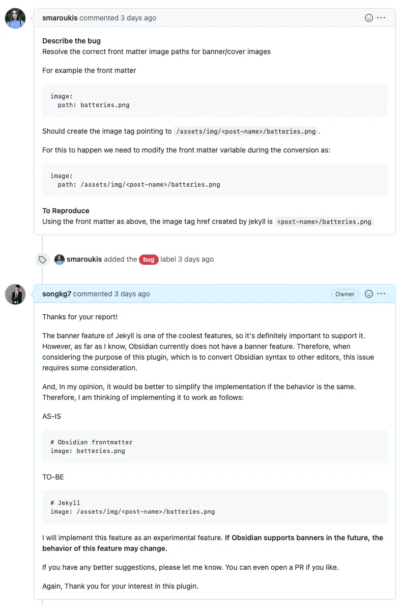
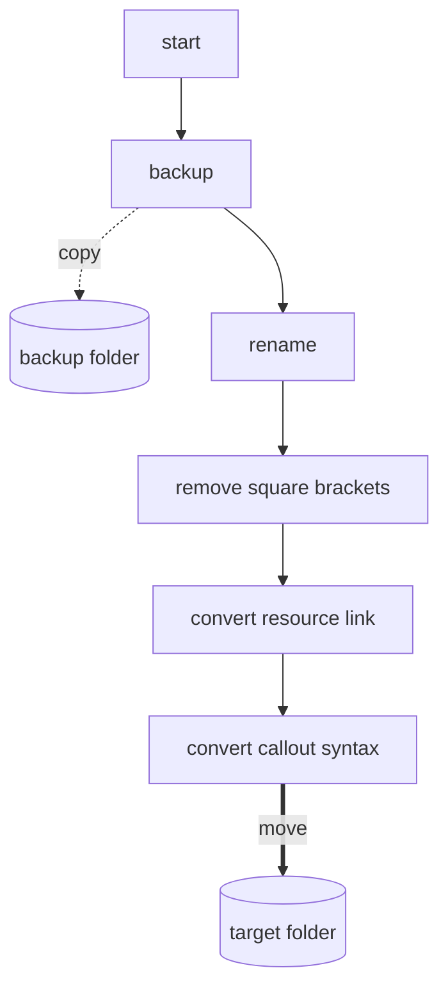
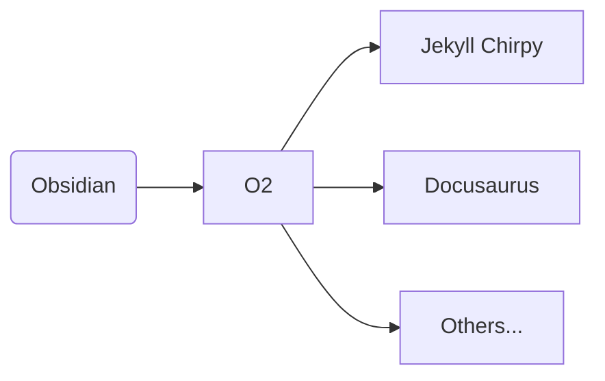
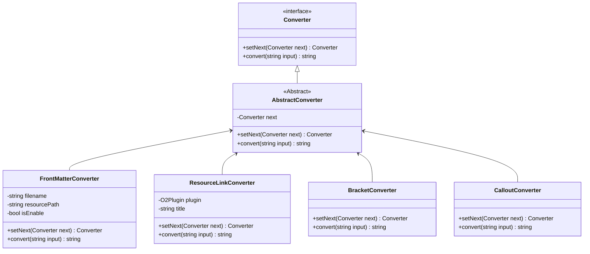
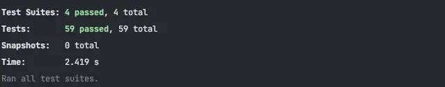

[O2](https://github.com/songkg7/o2) 프로젝트를 좀 더 유연하게 관리할 수 있도록 디자인 패턴을 사용하여 구조를 개선하는 과정을 이야기합니다.

<!-- truncate -->

## Problem

~~더 글로리를 보던~~ 열심히 개발을 하던 어느 날, 모처럼 [Issue](https://github.com/songkg7/o2/issues/50) 가 하나 올라옵니다.



[Issue](https://github.com/songkg7/o2/issues/50) 내용을 반영하는 것은 어렵지 않았기에 '~~이딴 플러그인을 쓰는 사람~~ 관심을 가져주는 사람이 있다니 빨리 고쳐줘야지' 하며 코드를 살펴보던 중 그동안 미뤄놨던 문제가 수면 위로 드러나기 시작했습니다.


아래는 기존에 작성해뒀던 마크다운 문법 변환 코드의 구현입니다.

:::warning

코드가 너무 길어 부득이하게 일부 생략된 코드로 설명합니다. 전체코드를 보고 싶으시다면 O2 plugin [v1.1.1](https://github.com/songkg7/o2/releases/tag/1.1.1) 을 참고해주세요 🙏

:::

```typescript
export async function convertToChirpy(plugin: O2Plugin) {
    try {
        await backupOriginalNotes(plugin);
        const markdownFiles = await renameMarkdownFile(plugin);
        for (const file of markdownFiles) {
            // remove double square brackets
            const title = file.name.replace('.md', '').replace(/\s/g, '-');
            const contents = removeSquareBrackets(await plugin.app.vault.read(file));
            // change resource link to jekyll link
            const resourceConvertedContents = convertResourceLink(plugin, title, contents);

            // callout
            const result = convertCalloutSyntaxToChirpy(resourceConvertedContents);

            await plugin.app.vault.modify(file, result);
        }

        await moveFilesToChirpy(plugin);
        new Notice('Chirpy conversion complete.');
    } catch (e) {
        console.error(e);
        new Notice('Chirpy conversion failed.');
    }
}
```

아무래도 TypeScript 에도 익숙하지 않았고 Obsidian 사용법에도 익숙하지 않은 상태에서 코드를 구현해나가다보니까 전체적인 설계보다 기능의 구현에 급급했습니다. 이제는 새로운 기능을 추가하려고 하니 side effect 를 예상하기 어려워짐과 동시에, 왜 이렇게 코드를 구현했는지 개발자의 의도 전달이 명확하지 않은 상태가 되고 있었습니다.

먼저 정확한 코드의 흐름 파악을 위해 현재 동작을 그래프로 그려보면 아래와 같습니다.



그나마 기능들을 함수로 분리하여 사용하고는 있었지만 절차지향적으로 작성되어 코드 라인의 순서가 전체 동작에 큰 영향을 주는 상태였습니다. 이 상태에서 기능을 하나 추가하려고 한다면, 정확한 위치에 기능을 구현해야 전체 변환 과정이 망가지지 않을 것입니다. 그럼 어디가 정확한 위치일까요? 아마 '코드를 봐야 알겠다' 라고 대답할 수 밖에 없을 겁니다. 현재는 하나의 큰 파일 안에 대부분의 코드가 작성되어 있기 때문에 거의 전체 코드를 분석해야하는 것이나 마찬가지니까요. 객체지향으로 말하자면 **SRP 가 제대로 지켜지지 않았다**고 볼 수 있습니다.

이 상태는 아무리 좋게 말해도 유지보수하기 쉽다고는 할 수 없을 것 같습니다. O2 플러그인은 제가 직접 사용하기 위해 만든 플러그인이기도 하기 때문에, 'TS가 익숙하지 않아서 그렇다'라는 자기합리화를 하며 유지보수하기 힘든 스파게티 코드를 양산하는 것을 두고 볼 수는 없었습니다.

Issue 를 해결하기 전에 ~~더 글로리는 잠시 꺼둔 채로~~ 구조 개선을 먼저 하기로 합니다.

## 어떤 구조로 구현해야할까?

O2 플러그인은 문법 변환 플러그인으로써, Obsidian 의 마크다운 문법을 여러가지로 변환이 가능해야 한다는 명확한 요구사항이 있습니다.



그렇기 때문에, 확장성에 가장 큰 중점을 두고 구조를 설계해야 합니다.

각각의 **플랫폼 로직을 모듈화**하고, **변환 과정을 추상화**하여 일종의 템플릿처럼 구현해두면 다른 플랫폼 문법 지원을 위해 새로운 기능을 구현할 때 전체적인 흐름을 재구현해야할 필요없이 개발자는 단지 문법의 변환이라는 작은 단위의 기능 구현에만 집중할 수 있을 겁니다.

이 내용을 바탕으로 설계의 요구사항을 적어보면 다음과 같습니다.

1. 문자열(마크다운 파일의 내용)을 순서에 맞춰서(혹은 상관없이) 변환해야 함
2. 외부 설정값에 따라서 특정 변환 로직을 건너뛰거나 추가되는 등 동적으로 제어가 가능해야 함
3. 새로운 기능의 구현이 간단해야 하며 기존 코드에 거의 영향을 주지 않거나 최소한이여야 함

순서대로 실행되는 일종의 흐름이 있고, 사이사이에 기능을 추가할 수 있어야하므로 다양한 Design pattern 중 Chain of responsibility 패턴이 적절하다고 생각되어 적용하기로 했습니다.

### 디자인 패턴 적용

처리->처리->처리->완성!
: Chain of responsibility 에 대한 요약

```typescript
export interface Converter {
    setNext(next: Converter): Converter;
    convert(input: string): string;
}

export abstract class AbstractConverter implements Converter {
    private next: Converter;

    setNext(next: Converter): Converter {
        this.next = next;
        return next;
    }

    convert(input: string): string {
        if (this.next) {
            return this.next.convert(input);
        }
        return input;
    }
}
```

`Converter` 는 `convert(input)` 을 통해 특정 문자열을 변환해주는 역할을 가지고 있는 interface 입니다. `setNext` 로 다음에 처리할 `Converter` 를 지정하고, `Converter` 를 다시 반환해주면서 `setNext` 를 메서드 체이닝으로 사용할 수 있게 합니다.

추상화를 통해 큰 틀이 만들어졌으니, 하나의 파일 안에서 구현되어있던 변환로직들을 분리하여 각각의 `Converter` 로 구현함으로써 각 기능에 대한 책임을 부여합니다. 아래는 Callout 문법 변환 로직을 분리한 `CalloutConverter` 입니다.

```typescript
export class CalloutConverter extends AbstractConverter {
    convert(input: string): string {
        const result = convertCalloutSyntaxToChirpy(input);
        return super.convert(result);
    }
}

function convertCalloutSyntaxToChirpy(content: string) {
    function replacer(match: string, p1: string, p2: string) {
        return `${p2}\n{: .prompt-${replaceKeyword(p1)}}`;
    }

    return content.replace(ObsidianRegex.CALLOUT, replacer);
}
```

이제 각 클래스간의 관계는 아래와 같습니다.



이제 가장 작은 단위의 기능만 구현된 각각의 `Converter` 들을 조합하여 동작을 순서대로 수행하게끔 chain 을 구성해줍니다. 이 패턴의 이름이 Chain of responsibility(책임 연쇄)인 이유입니다.

```typescript
export async function convertToChirpy(plugin: O2Plugin) {
    // ...
    // convert chain 생성
    frontMatterConverter.setNext(bracketConverter)
        .setNext(resourceLinkConverter)
        .setNext(calloutConverter);

    // head 인 frontMatterConverter 에게 변환 작업을 요청하면 연결된 converter 들이 순서대로 동작한다.
    const result = frontMatterConverter.convert(await plugin.app.vault.read(file));
    await plugin.app.vault.modify(file, result);
    // ...
}
```

이제 로직이 각자의 책임에 어울리는 위치로 분리되었기 때문에 코드를 읽기가 한결 수월해졌네요. 기능을 새로 추가해야하는 경우엔 필요한 `Converter` 만 구현하면 됩니다. 또한 다른 `Converter` 가 어떻게 동작하는지는 알 필요 없이 `setNext` 를 통해 기능을 추가할 수 있습니다. 각각의 `Converter` 가 캡슐화 원칙을 지키며 독립적으로 동작하기 때문입니다.

마지막으로 테스트를 모두 통과하는지 확인해보고 [PR](https://github.com/songkg7/o2/pull/51)을 생성합니다.



### Next Step

처음보다는 구조가 훨씬 좋아졌지만 아쉽게도 단점이 하나 남아있는데요, `setNext` 를 통해 연결한 구조에서는 가장 앞에 있는 `Converter` 를 호출해줘야 정상 동작합니다. 가장 앞에 있는 `Converter` 가 아닌 다른 `Converter` 를 호출하게 된다면 의도와는 다르게 결과물이 생성될 수 있습니다. 만약 `frontMatterConverter` 앞에 `NewConverter` 를 구현하여 연결해줬지만, `frontMatterConverter.convert(input)` 를 수정해주지 않는다면 `NewConverter` 는 적용되지 않겠죠?

```mermaid
flowchart LR
new[NewConverter] --> fm[FrontMatterConverter]
fm --> bc[BracketConverter]
call(convert) -.call.-> fm
 ```

이런 부분은 개발자가 직접 신경써줘야 되는 부분 중 하나이기 때문에 얼마든지 실수의 여지가 있으므로 이후 개선해야할 부분 중 하나입니다. 예를 들면, `Converter` 를 직접 호출하지 않고 변환 과정을 실행시키기 위해 일종의 `Context` 를 구현하여 `Converter` 들을 담아놓고 `Context` 의 함수를 호출하는 방식으로 개선할 수 있겠습니다. 이 내용은 다음 버전에서 구현해볼 예정입니다.

---

### 2023-03-12 Update

[PR](https://github.com/songkg7/o2/pull/61) 에 의해 같은 기능을 수행하지만 상속을 사용하지 않고 컴포지션을 통해 좀 더 유연한 구조를 갖도록 수정됐습니다.

```mermaid
classDiagram
class ConverterChain {
 -List~Converter~ converters
 +chaining(Converter converter) ConverterChain
 +converting(string input) string
}
class Converter {
 <<interface>>
 +convert(string input) string
}
ConverterChain*--Converter

class FrontMatterConverter {
  -string filename
  -string resourcePath
  -bool isEnable
  +convert(string input) string
}
Converter <|-- FrontMatterConverter

class ResourceLinkConverter {
  -O2Plugin plugin
  -string title
  +convert(string input) string
}
Converter <|-- ResourceLinkConverter

class WikiLinkConverter {
  +convert(string input) string
}
Converter <|-- WikiLinkConverter

class CalloutConverter {
  +convert(string input) string
}
Converter <|-- CalloutConverter
```

## Conclusion

이번 글에서는 절차지향적으로 작성된 하나의 거대한 파일을 디자인 패턴을 통해 역할 및 책임을 재분배하여 좀 더 객체지향적이고 유지보수하기 쉬워진 코드로 만드는 과정을 적어봤습니다.

:::info

전체 코드는 [GitHub](https://github.com/songkg7/o2) 에서 보실 수 있습니다.

:::
