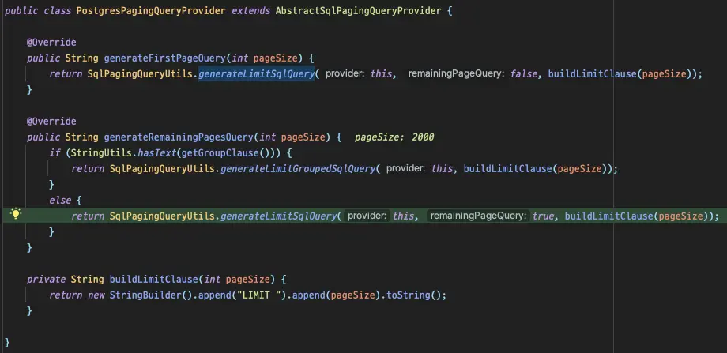

Spring Batch 를 사용하며 억 단위의 데이터가 존재하는 테이블을 조회할때 겪었던 문제와 해결 과정을 이야기합니다.

<!-- truncate -->

## Environment

- Spring Batch 5.0.1
- PostgreSQL 11

## Problem

대량의 데이터를 조회하기 위해 `JdbcPagingItemReader` 를 사용하던 중 시간이 지날수록 쿼리가 급격하게 느려지는 현상을 확인하고 자세히 코드를 살펴봅니다.

### 기본 동작

아래 쿼리는 `PagingQueryProvider` 에 의해 자동으로 생성되어 실행되는 쿼리입니다.

```sql
SELECT *
FROM large_table
WHERE id > ?
ORDER BY id
LIMIT 1000;
```

보시다시피 Spring Batch 에서는 `JdbcPagingItemReader` 를 사용할 경우 offset 을 사용하는 대신 where 절을 생성하여 paging 처리를 해줍니다. 덕분에 수억건의 데이터가 존재하는 테이블을 조회하더라도 지연없이 빠르게 읽는 것이 가능합니다.

:::tip

`LIMIT` 이 있더라도 `OFFSET` 은 이전 데이터를 전부 다시 읽어야 합니다. 따라서, 읽어야하는 데이터가 많아지면 많아질수록 점점 느려지게 됩니다. 자세한 정보는 게시글[^fn-nth-1]을 참조해주세요.

:::

### 여러 개의 정렬 조건을 사용하는 경우

**문제는 복합키를 사용하는 테이블을 조회해야하는 경우**입니다. `PagingQueryProvider` 는 sortKey 를 기반으로 where 절을 생성해주는데요, 3개의 컬럼으로 구성된 복합키를 sortKey 로 사용하게 되면 아래와 같은 쿼리를 생성해줍니다.

```sql
SELECT *
FROM large_table
WHERE ((create_at > ?) OR
       (create_at = ? AND user_id > ?) OR
       (create_at = ? AND user_id = ? AND content_no > ?))
ORDER BY create_at, user_id, content_no
LIMIT 1000;
```

하지만 **where 절에 OR 연산이 있는 쿼리는 인덱스를 제대로 타지 않습니다**. OR 연산은 나열된 조건 중 하나라도 만족하면 실행되어야 하다보니 Optimizer 가 여러 연산을 반복하게 되고 정확한 판단을 내리기 어렵게 됩니다. 좀 더 자세한 정보를 보기 위해 explain 을 실행해보니 아래와 같은 결과를 확인할 수 있었습니다.

```log
Limit  (cost=0.56..1902.12 rows=1000 width=327) (actual time=29065.549..29070.808 rows=1000 loops=1)
  ->  Index Scan using th_large_table_pkey on large_table  (cost=0.56..31990859.76 rows=16823528 width=327) (actual time=29065.547..29070.627 rows=1000 loops=1)
"        Filter: ((""create_at"" > '2023-01-28 06:58:13'::create_at without time zone) OR ((""create_at"" = '2023-01-28 06:58:13'::create_at without time zone) AND ((user_id)::text > '441997000'::text)) OR ((""create_at"" = '2023-01-28 06:58:13'::create_at without time zone) AND ((user_id)::text = '441997000'::text) AND ((content_no)::text > '9070711'::text)))"
        Rows Removed by Filter: 10000001
Planning Time: 0.152 ms
Execution Time: 29070.915 ms
```

30s 가까운 시간이 걸리는데, 인덱스를 대상으로 where 절의 필터링을 먼저 수행하기 때문에 99% 의 데이터가 버려지게 됩니다. 어차피 버릴 데이터를 읽기 위해 연산을 수행하여 불필요한 시간 낭비가 발생하는 것이죠.

PostgreSQL 에서는 복합키를 tuple 로 관리하기 때문에 tuple 을 사용하는 쿼리를 작성해야 복잡한 where 절에서도 Index scan 의 장점을 활용할 수 있습니다.

```sql
SELECT *
FROM large_table
WHERE (create_at, user_id, content_no) > (?, ?, ?)
ORDER BY create_at, user_id, content_no
LIMIT 1000;
```

```log
Limit  (cost=0.56..1196.69 rows=1000 width=327) (actual time=3.204..11.393 rows=1000 loops=1)
  ->  Index Scan using th_large_table_pkey on large_table  (cost=0.56..20122898.60 rows=16823319 width=327) (actual time=3.202..11.297 rows=1000 loops=1)
"        Index Cond: (ROW(""create_at"", (user_id)::text, (content_no)::text) > ROW('2023-01-28 06:58:13'::create_at without time zone, '441997000'::text, '9070711'::text))"
Planning Time: 0.276 ms
Execution Time: 11.475 ms
```

필터링으로 버려지는 데이터없이 인덱스를 통해 바로 조회되는 것을 확인할 수 있습니다.

즉, `JdbcPagingItemReader` 에 의해 실행되는 쿼리가 tuple 을 사용하게 한다면, 복합키를 sortKey 로 사용할 때 또한 매우 빠르게 처리가 가능하다는 의미입니다.

즉시 코드를 뜯어봅니다.

## PagingQueryProvider 마개조하기

### 분석

잠깐 언급했듯이, query 를 생성해주는 역할은 `PagingQueryProvider` 가 가지고 있습니다. 현재 저는 PostgreSQL 을 사용하기 때문에 `PostgresPagingQueryProvider` 가 선택되어 사용됩니다.


_group by 절을 포함하고 있는지에 따라서 생성되는 쿼리가 다르다._

`SqlPagingQueryUtils` 의 `buildSortConditions` 를 살펴보면 문제가 되는 쿼리를 어떤식으로 생성하는지 확인할 수 있습니다.


이중 for문 안에서 sortKey 를 기반으로 쿼리를 생성하는 것을 볼 수 있습니다.

### `buildSortConditions` customizing

직접적으로 쿼리 생성에 관련된 코드를 확인했으니 이 코드를 수정해주면 원하는 동작을 실행시킬 수 있겠습니다. 하지만 해당 코드를 직접 오버라이드할 수 없어서 `PostgresOptimizingQueryProvider` 라는 클래스를 생성하고 클래스 안에서 코드를 재구현해줬습니다.

```java
private String buildSortConditions(StringBuilder sql) {
    Map<String, Order> sortKeys = getSortKeys();
    sql.append("(");
    sortKeys.keySet().forEach(key -> sql.append(key).append(", "));
    sql.delete(sql.length() - 2, sql.length());
    if (is(sortKeys, order -> order == Order.ASCENDING)) {
        sql.append(") > (");
    } else if (is(sortKeys, order -> order == Order.DESCENDING)) {
        sql.append(") < (");
    } else {
        throw new IllegalStateException("Cannot mix ascending and descending sort keys"); // tuple 의 한계점
    }
    sortKeys.keySet().forEach(key -> sql.append("?, "));
    sql.delete(sql.length() - 2, sql.length());
    sql.append(")");
    return sql.toString();
}
```

### 테스트 코드

새로 구현한 부분에 문제가 없는지 테스트 코드를 통해 검증합니다.

```java
@Test
@DisplayName("Offset 을 대신하여 생성되는 Where clause 는 (create_at, user_id, content_no) > (?, ?, ?) 이다.")
void test() {
    // given
    PostgresOptimizingQueryProvider queryProvider = new PostgresOptimizingQueryProvider();
    queryProvider.setSelectClause("*");
    queryProvider.setFromClause("large_table");

    Map<String, Order> parameterMap = new LinkedHashMap<>();
    parameterMap.put("create_at", Order.ASCENDING);
    parameterMap.put("user_id", Order.ASCENDING);
    parameterMap.put("content_no", Order.ASCENDING);
    queryProvider.setSortKeys(parameterMap);

    // when
    String firstQuery = queryProvider.generateFirstPageQuery(10);
    String secondQuery = queryProvider.generateRemainingPagesQuery(10);

    // then
    assertThat(firstQuery).isEqualTo("SELECT * FROM large_table ORDER BY create_at ASC, user_id ASC, content_no ASC LIMIT 10");
    assertThat(secondQuery).isEqualTo("SELECT * FROM large_table WHERE (create_at, user_id, content_no) > (?, ?, ?) ORDER BY create_at ASC, user_id ASC, content_no ASC LIMIT 10");
}
```


원하는대로 동작하는 것을 확인하고, 배치를 실행시켜봅니다.


_웹툰 하이브 中_

query 의 변화를 인지하지 못하고 여전히 6개의 parameter 가 전달되며 `out of range` 를 발생시킵니다.


아무래도 쿼리가 변경됐다고 해서 파라미터를 주입하는 부분이 자동으로 인식하진 못하는 것 같으니, 파라미터가 주입되는 부분을 찾기 위해 다시 디버깅을 해봅니다.

## JdbcOptimizedPagingItemReader

파라미터는 `JdbcPagingItemReader` 가 직접 만들어주고 있었는데요, `JdbcPagingItemReader` 의 `getParameterList` 에서 반복문을 돌며 SQL 에 주입될 parameter 개수를 증가시키는걸 확인할 수 있었습니다.


_반복문으로 돌면서 sortKey size 에 적합한 parameter 를 생성한다._

이 메서드만 override 하면 되겠다고 생각했지만 안타깝게도 `private` 이라 불가능합니다. 고민 끝에 `JdbcPagingItemReader` 를 통째로 복사하여 `getParameterList` 부분만 수정했습니다.

아래는 `JdbcOptimizedPagingItemReader` 에 재구현된 `getParameterList` 입니다.

```java
private List<Object> getParameterList(Map<String, Object> values, Map<String, Object> sortKeyValue) {
    // ...
    // where 절에 설정되어야 하는 파라미터를 증가시키지 않고 반환한다.
    return new ArrayList<>(sortKeyValue.values());
}
```

`sortKeyValue` 를 추가하는 로직은 필요없으므로, 바로 `parameterList` 에 담고 반환합니다.

다시 배치를 실행시켜봅니다.

파라미터가 필요없는 첫번째 쿼리가 발생하고,

```log
2023-03-13T17:43:14.240+09:00 DEBUG 70125 --- [           main] o.s.jdbc.core.JdbcTemplate               : Executing SQL query [SELECT * FROM large_table ORDER BY create_at ASC, user_id ASC, content_no ASC LIMIT 2000]
```

앞선 쿼리의 결과로 파라미터를 전달받으며 이후 쿼리들이 실행됩니다.

```log
2023-03-13T17:43:14.253+09:00 DEBUG 70125 --- [           main] o.s.jdbc.core.JdbcTemplate               : Executing prepared SQL statement [SELECT * FROM large_table WHERE (create_at, user_id, content_no) > (?, ?, ?) ORDER BY create_at ASC, user_id ASC, content_no ASC LIMIT 2000]
```

정확하게 의도한대로 쿼리가 실행됩니다! 🎉

1000만건 이상의 페이징 처리에서는 30s 씩 걸리던 쿼리가 0.1s 단위까지 줄었으니 300배에 가까운 엄청난 성능 향상이네요.


이제는 아무리 많은 데이터가 있어도 쿼리가 느려질 걱정없이 ms 안에 읽기가 가능합니다. 😎

## Conclusion

이번 글에서는 복합키를 사용하고 있는 환경에서 Spring Batch 를 최적화하기 위해 사용한 방법을 소개했습니다. 다만, 이 방법에도 단점이 있는데요, 복합키를 구성하고 있는 컬럼들의 정렬 조건이 모두 같아야 한다는 것입니다. 복합키로 생성되는 인덱스 조건 안에 `desc` 나 `asc` 가 섞여있을 경우는 별도의 인덱스를 통해 해결해야 합니다 😢

오늘의 내용을 한 줄로 요약하고 글을 마무리합니다.

**"복합키는 가급적 사용하지 말고, 비즈니스와 관련없는 대리키를 사용하자"**

## Reference

- [Stack overflow](https://stackoverflow.com/questions/34110504/optimize-query-with-offset-on-large-table)

---

[^fn-nth-1]: https://jojoldu.tistory.com/528
