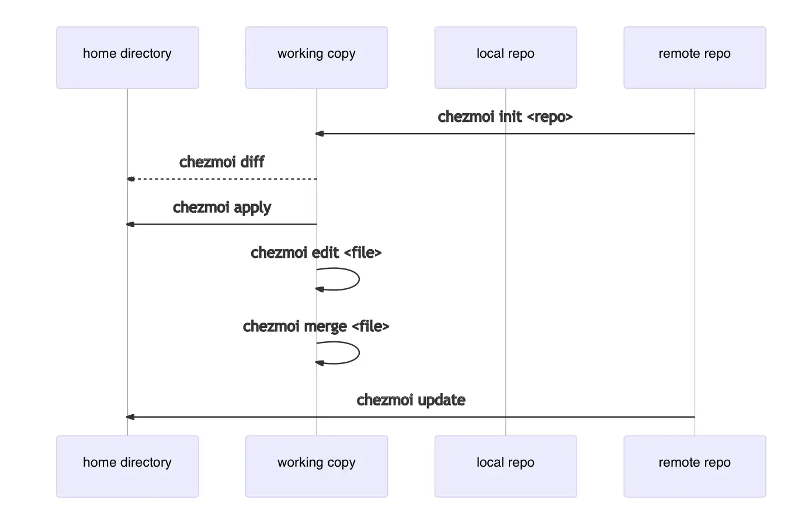

새로운 맥북을 사서 기분이 좋았다가 개발 환경을 다시 세팅해줄 생각에 머리가 어지러웠던 적은 없으신가요? 업무 중 기가 막힌 툴을 찾았지만, 집에서 개인 환경에 다시 설정할 생각에 귀찮으셨던 적은 없으신가요? github 으로 설정들을 관리하고 싶지만, 보안성이 신경쓰여 push 할때도 한 참 고민하신 적은 없으신가요?

아마 복수의 기기를 사용하고 계시다면 한 번쯤은 이런 고민을 해보셨을 것 같은데요, 플랫폼에 상관없이 설정들을 일관되게 관리하려면 어떻게 해야할까요?

<!-- truncate -->

## Problem

`.zshrc` 를 비롯한 수많은 소프트웨어들의 설정파일들은 $HOME(이하 루트) 을 포함하여 다양한 경로에 존재합니다. 하지만 이 파일들의 버전 관리를 위해서 루트에 Git 을 설정하는 것은 너무나 부담스럽습니다. 굉장히 넓은 범위의 스캔이 이루어지기 때문에 오히려 파일을 관리하는 것이 힘들어지기 때문입니다.

회사에서 사용 중인 맥북 하나, 집에서 사용하는 아이맥, ~~스타벅스 출입증인~~ 개인 맥북까지, 총 3대의 기기를 사용하면서 일관된 개발환경을 유지하기란 사실상 불가능했습니다.

> 회사에서 vim 의 단축키 설정 하나 살짝 수정했다고 퇴근 후 나머지 2대의 기기에서 같은 작업을 해야한다는건... 😭

심지어 애플 실리콘 시대가 되면서 Intel 맥들과의 엄청난 괴리감이 생기며 통일된 환경과는 더욱 멀어지게 되었죠. 저는 이 문제에 대해서 꽤 오랜 기간 고민해왔었습니다. 회사에서 업무 중 자주 사용하는 alias 를 집에서는 깜박하고 설정해주지 않았다거나 하는 일이 잦았기 때문입니다.

그동안 문제 해결을 위해 시도해봤던 몇가지 방법을 간략하게 정리해보면,

1. **특정 폴더에 관리할 dotfile 들을 몰아놓고 그 폴더를 git 프로젝트로써 관리하기**
    1. dotfile 들의 위치는 제각각입니다. root 가 아니더라도 정해진 위치가 있는 경우가 대부분 입니다.
    2. git 이 설정되어 있는 폴더에서 직접 작업할 수 없으며, 다른 기기에서 여전히 복사 붙여넣기가 반복됩니다.
2. **Symbolic link**
    1. 새로운 기기에서 설정하기 위해서는 모든 파일들의 심볼릭 링크를 정확한 위치에(...) 다시 생성해줘야 합니다. 관리해야할 파일이 많다면 굉장히 피곤한 작업을 해야 합니다.
    2. 사용법이 git 에 비해 복잡하고 신경써야 될 부분도 많습니다.

결국 git 방식을 쓰되 설정 파일이 루트가 아닌 것들에 대해서만 사용하고(`~/.ssh/config`, `~/.config/nvim` 등) 루트를 위치로 쓰는 것들은(`~/.zshrc`, `~/.gitconfig` 등) 반쯤 포기하고 지냈었습니다. **chezmoi** 를 알게 되기 전까지는요!

그럼 이제 이 어려운 문제를 너무나 우아하게 해결해주는, **chezmoi** 에 대해 소개합니다.

## What is Chezmoi?

> Manage your dotfiles across multiple diverse machines, securely.
> \- chezmoi.io

**chezmoi** 는 수많은 dotfiles 들을 여러 환경, 기기에서 일관되게 관리할 수 있게 해주는 툴입니다. 공식문서에서 설명하듯 단 몇가지 설정으로 '보안성'까지 챙겨줄 수 있습니다. dotfiles 이 어디에 있는지, 어디에 있어야 하는지는 전혀 신경쓸 필요가 없습니다. 우리는 그저 **chezmoi 에게 관리해야할 dotfile 을 알려주기만 하면 됩니다**.

### Concept

어떻게 이런 마법같은 일이 가능할까요? 🤔

대략적으로 말하면 **chezmoi** 는 dotfile 을 `~/.local/share/chezmoi` 에 저장합니다. 그리고 `chezmoi apply` 를 실행하면 **chezmoi** 는 각 dotfile 의 변경상태를 확인하고, 원하는 상태와 일치할 수 있도록 최소한의 변경 작업이 수행됩니다. 더 자세한 Concept 은 [reference manual](https://www.chezmoi.io/reference/concepts/) 을 확인해주세요.

지금부터 간단하게 사용방법을 설명합니다.

## chezmoi 로 관리 시작하기

**chezmoi** 를 [설치](https://www.chezmoi.io/install/)했다면 다음 명령어로 초기화 작업을 수행합니다.

```bash
chezmoi init
```

이 작업은 로컬 기기의 `~/.local/share/chezmoi`(working directory) 에 dotfile 들이 저장될 새로운 git repository 를 생성합니다. 기본적으로 **chezmoi** 는 working directory 의 수정 내용을 로컬 기기에 반영합니다.

`~/.zshrc` 파일을 이후 **chezmoi** 를 통해 관리하고 싶다면 아래 명령어를 실행합니다.

```bash
chezmoi add ~/.zshrc
```

`~/.zshrc` 파일이 `~/.local/share/chezmoi/dot_zshrc` 로 복사된 것을 확인할 수 있습니다.

**chezmoi** 가 관리하는 `~/.zshrc` 를 수정하려면 아래 명령어를 사용합니다.

```bash
chezmoi edit ~/.zshrc
```

이 명령어는 `~/.local/share/chezmoi/dot_zshrc` 를 `$EDITOR` 로 열어줍니다. 테스트를 위해 몇가지를 수정해주고 저장합니다.

:::info

`$EDITOR` 가 env 목록에 없다면 기본값인 `vi` 를 사용합니다.

:::

working directory 에서 어떤 내용이 변경되었는지는 아래 명령어로 확인합니다.

```bash
chezmoi diff
```

**chezmoi** 의 변경 내역을 로컬 기기에 반영하고 싶다면 아래 명령어를 사용합니다.

```bash
chezmoi apply -v
```

**chezmoi** 의 모든 명령어는 `-v`(verbose) 옵션을 사용할 수 있습니다. 이 옵션은 어떤 내용이 로컬에 반영되는지를 시각적으로 명확하게 확인할 수 있도록 콘솔에 관련 내용을 출력합니다. `-n`(dry run) 옵션을 사용하면 명령이 실행은 되지만 반영되지는 않습니다. 따라서 `-v` 옵션과 `-n` 옵션을 함께 사용함으로써 잘 모르는 명령어를 실행시켜야할 때 어떤 동작이 진행되는지 미리 확인해볼 수 있습니다.

이제 직접 소스 디렉토리에 접근해서 remote repository 로 **chezmoi** 의 내용을 push 해보겠습니다. **repository 의 이름은 dotfiles 로 하는 것을 추천**드리는데, 이유는 뒤에서 다시 설명하겠습니다.

```bash
chezmoi cd
git add .
git commit -m "Initial commit"
git remote add origin https://github.com/$GITHUB_USERNAME/dotfiles.git
git push
```

:::tip

`chezmoi.toml` 파일을 통해 관련 설정을 작성해주면 repository 동기화 과정을 자동화하여 조금 더 편리하게 사용할 수 있습니다.

:::

**chezmoi** 의 working directory 에서 빠져나오기 위해서는 아래 명령을 사용합니다.

```bash
exit
```

여기까지의 과정을 시각적으로 살펴보면 아래와 같습니다.


## 다른 기기에서 **chezmoi** 설정 사용하기

드디어 우리가 **chezmoi** 를 쓰는 이유입니다. 두 번째 기기에서 **chezmoi** 를 사용하여 내용을 가져와보겠습니다. 저는 ssh 를 사용하도록 url 을 입력해줬습니다. 역시 **chezmoi** 가 미리 설치되어 있다고 가정합니다.

```bash
chezmoi init git@github.com:$GITHUB_USERNAME/dotfiles.git
```

이렇게 특정 repository 를 지정해서 초기화를 수행하면 해당 repository 에 submodule 이나 필요한 외부 소스파일이 있는지 자동으로 확인하게 되고 옵션에 따라서 chezmoi config 파일을 자동으로 생성해줍니다.

**chezmoi** 가 두번째 기기에 어떤 변경을 가져올지 위에서 확인해봤던 `diff` 를 통해 살펴봅니다.

```bash
chezmoi diff
```

만약 내용을 전부 반영해도 좋을 것 같다면, 역시 살펴봤던 `apply` 명령을 사용합니다.

```bash
chezmoi apply -v
```

로컬에 반영하기 전 일부 파일은 수정해야겠다면 `edit` 을 사용해주세요.

```bash
chezmoi edit $FILE
```

또는 merge tool 을 사용하여 마치 git 병합을 사용하는 것처럼 로컬에 변경 내용을 반영할 수도 있습니다.

```bash
chezmoi merge $FILE
```

:::tip

`chezmoi merge-all` 을 사용하면 병합이 필요한 모든 파일을 대상으로 merge 가 동작합니다.

:::

아래 명령어를 사용하면 이 모든 과정을 한 번에 수행합니다.

```bash
chezmoi update -v
```

역시 시각적으로 살펴보면 아래와 같습니다.



두 번째 기기에서 수행해야했던 모든 과정을 초기화 시점에 한 번에 적용할 수도 있습니다...! 만약 두 번째 기기가 이제 막 새로 산 기기라면 굉장히 유용할 것 같네요.

```bash
chezmoi init --apply https://github.com/$GITHUB_USERNAME/dotfiles.git
```

제가 앞서 repository 의 이름을 `dotfiles` 로 할 것을 추천드렸는데요, repository 의 이름이 `dotfiles` 라면 좀 전의 명령어의 축약형을 사용할 수 있기 때문입니다.

```bash
chezmoi init --apply $GITHUB_USERNAME
```


정말이지.. 굉장히 편리합니다...🥹 가히 23년에 알게된 오픈소스 중 최고의 오픈소스가 될 것이라고 말할 수 있을 것 같네요.

## Conclusion

**chezmoi** 는 감탄스러울 정도로 문서화가 잘 되어 있고, 상당히 활발하게 개발이 진행되고 있습니다. Golang 으로 개발되서인지 괜히 속도도 빠른 것 같은 느낌이 드네요 😄. 또한 shell script 에 대해 어느 정도 지식이 있다면 상당히 수준 높은 자동화도 구현할 수 있어서 여러 기기간 설정에 있어서 정말 손댈게 없을 정도로 편리한 환경을 만들 수 있습니다.

이번 글에서는 기본적인 사용법에 대해 적어보았으니, 다음 글에서는 기본적인 **chezmoi** 의 설정 파일 관리 및 보안성 유지에 대해서 살펴보겠습니다.

:::info

제 설정이 궁금하시다면 [여기](https://github.com/songkg7/dotfiles) 에서 확인하실 수 있습니다.

:::

## Reference

- [chezmoi](https://www.chezmoi.io)
