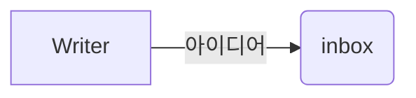
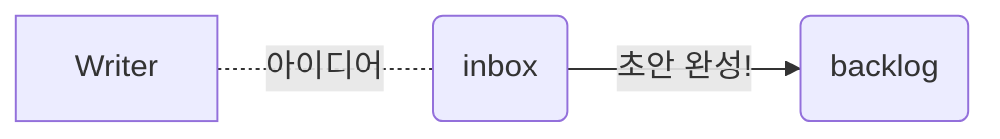
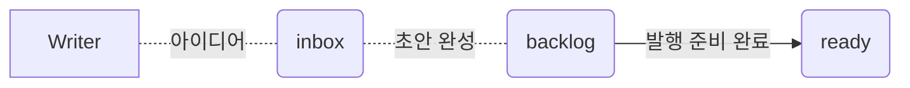
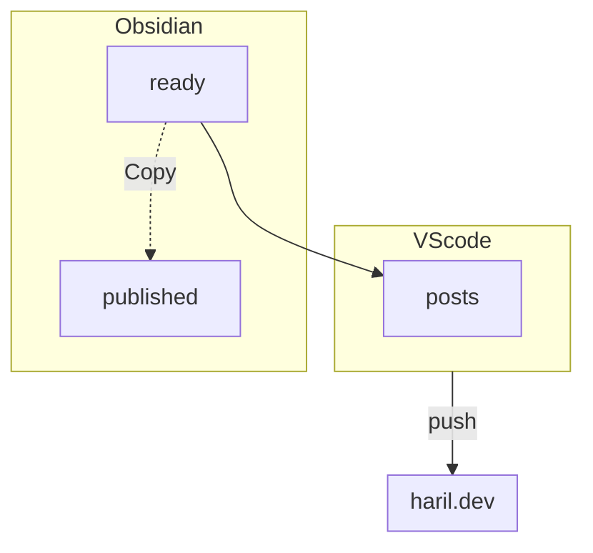
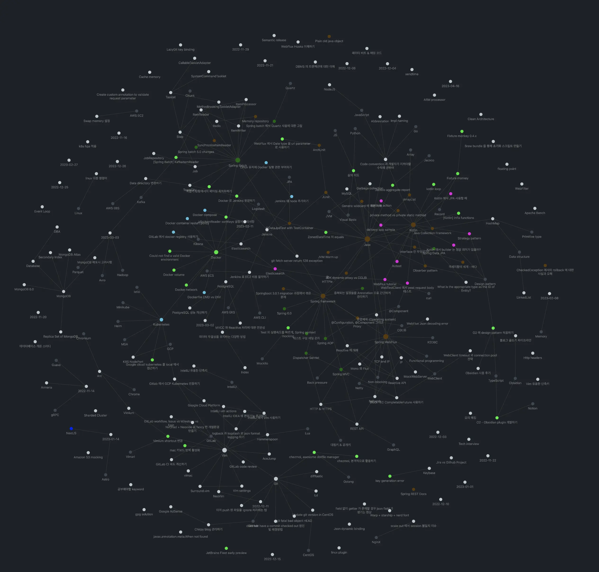

저는 대부분의 글은 마크다운 에디터인 Obsidian 을 사용하고, GitHub page 로 블로그를 호스팅하고 있습니다. 두 가지 서로 다른 플랫폼에서 흐름이 끊기지 않고 글 쓰는 습관을 유지하려면 어떻게 해야하는지, 제가 사용하고 있는 방법을 소개합니다.

:::info

이 글은 글또에서 진행한 [성윤](https://github.com/zzsza)님의 프레젠테이션에서 영감을 받아 작성하였습니다.

:::

<!-- truncate -->

## 소재 수집

회사 일, 사이드 프로젝트를 하면서, 혹은 공부를 할 때 등등 여러가지 상황에서 잘 모르는 주제에 대해 접하게 될 때가 있습니다. 저는 그럴 때마다 바로 새로운 노트를 하나 생성합니다[^fn-nth-1]. 이 노트에는 잘 몰랐던 키워드를 중심으로 1~2줄 남짓으로 짧은 개요를 작성합니다.

처음부터 디테일하게 정리하려고 하지는 않습니다. 아직 잘 모르는 주제라서 너무 피곤해지거든요. 더구나 방금 새로 알게 된 내용이 지금 당장은 중요하지 않은 내용일수도 있습니다. 하지만 이후 같은 내용으로 노트를 생성하는 일을 막기 위해 검색이 쉽도록 노트 제목에 신경을 쓰거나 태깅을 해둡니다.

중요한 점은 **이 과정이 수시로 진행된다는 점**입니다. 이미 비슷한 주제의 노트가 생성되어 있다면, 약간의 살이 붙을 겁니다. 반복되다보면 어느샌가 괜찮은 글 하나가 됩니다.

처음 생성되는 노트들은 inbox 라는 이름의 디렉토리에 저장합니다.

## 학습 및 정리

inbox 에는 글들이 쌓여만 갑니다... 좀 쳐내야겠죠?

활용성이 높고 정리하기에 좋은 소재를 찾았다면, 해당 주제에 대해 공부하면서 대략적인 초안을 작성합니다. 이 때까지도 블로그 목적의 글을 쓰기보다는 스스로의 학습을 목적으로 글을 씁니다. 어디까지나 단순한 메모여서 문체나 표현 방식이 다소 자유롭습니다. ~~글 구성을 재미있게 하기 위해 dog드립을 추가해놓는다거나..~~

이렇게 작성된 초안은 나름의 평가를 거쳐, 블로그에 올릴만한 주제인가 아닌가를 판단합니다. 저는 다른 커뮤니티 혹은 블로그에서 너무 많이 생산된 주제의 글이라면 나름의 차별화를 위해서 따로 포스팅하지 않는 편입니다.

:::info

다만 기술적 내용이 아닌, 어떤 문제에 대한 해결과정 소개 등 개인적 경험에 관한 내용은 타 블로그에 내용이 중복되는 포스팅이 있더라도 느낀 점이 다를 수 있으므로 되도록이면 작성합니다.

:::

정리된 글은 backlog 디렉토리로 옮깁니다.

## 블로그 글 선정

inbox 만큼은 아니지만, backlog 에도 어느 정도 완성된 상태의 글들이 쌓여갑니다. 일종의 버퍼처럼 대략 10개 정도의 글들이 꾸준히 머물고 있는 것 같습니다. 시간이 지나면서 글 내용에 대한 생각이 변하여 수정이 필요하다거나, 잘못된 정보가 포함되어 학습이 추가적으로 필요하다고 판단되는 몇몇 글들은 다시 inbox 로 강등(...)됩니다. 잘못된 정보를 퍼트리는 것을 방지하기 위해 개인적으로 할 수 있는 최소한의 검증 장치입니다. 모든 고난과 시련을 거치고 살아남은 글들은 개인적 학습을 위한 글에서 다른 사람에게 보여주기 위한 글로 다듬어 나갑니다.

나름 만족스러운 글이 되었다면 블로그 발행을 위한 디렉토리인, ready 로 옮깁니다.

## 업로드

업로드를 위한 모든 준비가 끝났다면, O2 를 사용하여 ready 에 있는 파일들을 Jekyll 프로젝트 폴더로 옮깁니다.

:::info

[O2](https://github.com/songkg7/o2) 는 Obsidian 을 사용하여 작성한 노트를 마크다운 포맷으로 변환해주는 Obsidian 의 커뮤니티 플러그인입니다.

:::

_image link 들이 자동으로 변환되는 모습을 확인할 수 있습니다._

ready 에 있던 노트들은 Jekyll 프로젝트로 옮겨지기 전 published 디렉토리로 복사되고, 백업을 위해 보관됩니다. Obsidian 고유 문법을 모두 기본 마크다운 문법으로 변환하고, 첨부파일이 있다면 Jekyll 프로젝트 폴더로 노트와 함께 복사합니다. 첨부파일 경로가 변하면서, Obsidian 에서는 잘 되었던 마크다운 링크가 깨지겠지만 걱정할 필요는 없습니다. 이 모든 과정은 O2 에 의해 자동화[^fn-nth-2]되어 있으므로, 어떤 수작업도 필요하지 않습니다. 😄 [^fn-nth-3]

이제 작업툴을 옮겨서 Obsidian 이 아닌 VScode 로 옵니다. Jekyll 블로그는 관리할 때 가끔 code 도 다뤄야 합니다. 이런 부분은 단순한 마크다운 에디터로 할 수 있는 범위를 벗어나다보니 Obsidian 에서 계속 작업하기에는 아무래도 애로사항이 있을 수 밖에 없습니다.

대략적으로 문법 및 문맥을 다시 한 번 검수해주고, `npm run publish` 를 실행하면 블로그 글 발행 과정이 마무리됩니다.

:::info

publish 에 관해서는 [이 글](https://haril.dev/blog/2023/04/26/Image-optimazation-for-SEO)에서 확인하실 수 있습니다.

:::

## 퇴고

수시로 살펴보면서 미쳐 찾지 못한 문법적 오류나, 어색한 표현 등을 조금씩 다듬어 줍니다. 이 과정은 따로 끝나는 시점이 정해져있지 않습니다. 그냥 때때로 블로그를 살펴보면서 꾸준히 교정해줍시다.

블로그 글을 위한 파이프라인은 사실 여기까지지만, 더 좋은 글을 적기 위해 활용하는 방법에 대해 간략하게 설명해봅니다.

## Optional. 데이터 분석

Obsidian 은 graph view 기능을 제공합니다. 해당 기능을 활용하면 작성한 노트들이 서로 어떻게 유기적으로 연결되어 있는지를 가시화하여 데이터 분석에 활용할 수 있습니다.

_위 그래프에서 밝은 초록색만이 블로그에 발행된 글_

대부분의 노트는 여전히 공부 중인 주제이거나, 블로그 발행 적합성 심사(...)에서 탈락한 글입니다. 이 그래프를 보면 제가 발행한 글들은 어느 정도 안쪽에 위치하며 간선이 많은 것을 볼 수 있는데, 제가 관련 내용을 복합적으로 이해하고 다른 주제의 노트들과 연관시키며 작성한 글을 주로 발행했다는 의미로 해석할 수 있습니다.

이 외에도 알 수 있는 정보들은 대략적으로 다음과 같습니다.

- 가장 안쪽에 있고, 간선도 가장 많지만 블로그 글로 발행하지 않았다는건 너무 대중적인 주제여서 발행하지 않았을 가능성이 높습니다. ~~아니면 그냥 귀찮았거나...~~
- 외곽에 간선없이 흩어져있는 노드들은 파편화된 지식들로 아직 깊이있게 알지 못한다는 의미로 해석할 수 있습니다. 알지 못하기 때문에 어느 곳에도 링크되지 못하고 떠돌아다니는 것이니까요 😂 . 이런 노드들은 안쪽으로 연결되기 위해 관련 주제를 추가적으로 학습할 필요가 있습니다.
- 가장 외곽에 있으면서도 발행된 글들은 새로운 지식을 습득하는 과정에서 다소 충동적으로 발행된 글일 가능성이 높기 때문에, 내용에 오류는 없는지 수시로 살펴볼 필요가 있습니다.

저는 나름의 객관화된 데이터들을 바탕으로 제가 얼마나, 어느 정도 아는지를 수시로 체크하면서 지식의 범위를 꾸준히 확장하기 위해 노력하고 있습니다. 🧐

## Conclusion

지금까지 저의 글쓰기 파이프라인과 더불어 Obsidian 을 활용한 데이터 분석으로 자기 자신을 정확히 알기 위해 활용할 수 있는 방법에 대해서 간략히 소개해보았습니다. 글을 쓴다는 것이 일로 다가오는 것이 아니라, 자연스러운 일상이 되기를 바랍니다!

- 떠오른 아이디어를 빠르게 메모로 옮겨야 작업 중인 컨텍스트를 잃지 않으면서도 수시로 글을 쓰는 것이 가능하다. 상황에 맞게 적절한 툴을 선택하고 활용하자
- 글을 쓰는 것이 일처럼 느껴지지 않으려면, 아무 것도 없는 상태에서 몇시간씩 글을 붙잡고 있는것보다 하루에 5분이라도 꾸준히 덧대어 쓰는 것이 효율적이다
- 블로그 발행 과정은 분명히 귀찮은 일이므로, 최대한 자동화하여 워크플로우를 단순하게 유지하자. 글 쓰기에만 집중하자!
- 스스로 얼마나 알고 있고, 어떤 걸 모르고 있는지를 파악(자기 객관화)하자. 블로그 글 주제 선정이나, 학습 방향을 정하는 것에 큰 도움이 된다.

:::info

제가 작성하는 모든 글(블로그에 포스팅되지 않는 초안 포함)은 [GitHub](https://github.com/songkg7/haril-vault) 를 통해 Public 으로 관리되고 있습니다.

:::

---

[^fn-nth-1]: 저는 과거 음악을 공부할 때부터 항상 노트를 근처에 뒀습니다. 자려고 누워있을 때가 뭔가 가장 잘되는 시간이였거든요. 그건 지금도 크게 다르지 않은 것 같습니다. 버그 해결 방법은 언제나 잠들기 직전 떠오르는걸 보면...

[^fn-nth-2]: [O2 플러그인 개발기](https://haril.dev/blog/2023/02/22/develop-obsidian-plugin)

[^fn-nth-3]: 포스팅할 때마다 버그 이슈가 추가되는 중이지만...😭 ~~???: 그거 기능이에요~~
