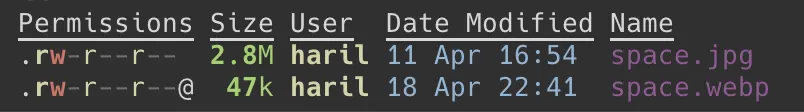
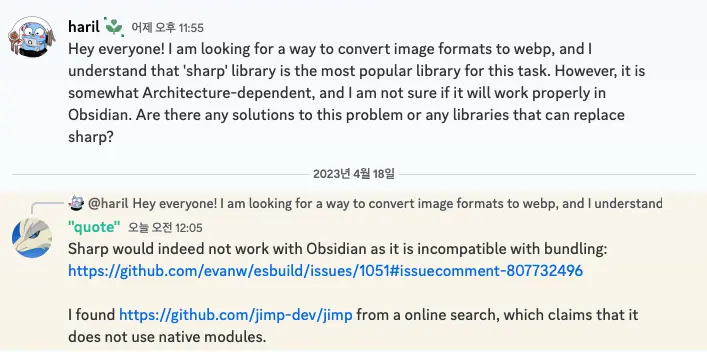
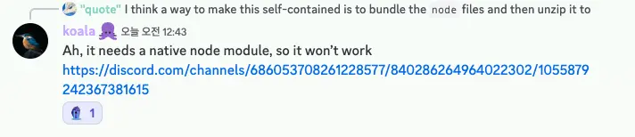
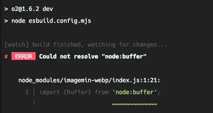
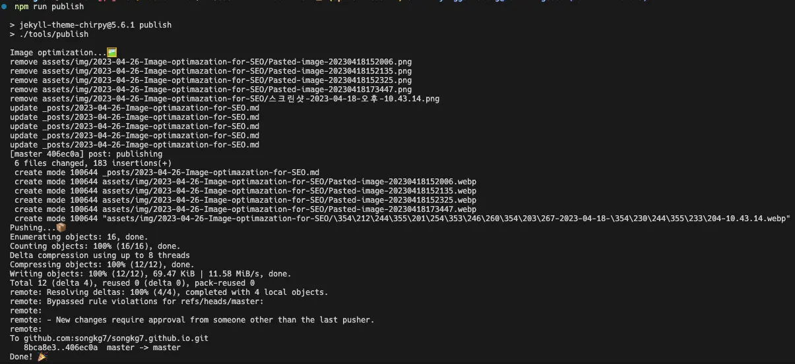

블로그 포스팅 자동화 과정 중 SEO 를 위한 이미지 최적화에 대해 이야기합니다. 성공이 아닌 실패에 대한, Plan B 로 돌아가야만 했던 이야기입니다.

:::info

코드는 [GitHub](https://github.com/songkg7/songkg7.github.io-legacy/blob/master/tools/imagemin.js)에서 확인하실 수 있습니다.

:::

<!-- truncate -->

## 문제 인식

SEO 최적화를 위해서는 포스팅에 포함되는 이미지의 크기가 최대한 작을수록 좋다. 검색 엔진 크롤링봇들의 효율이 향상되고, 페이지 로딩이 빨라져서 사용자 경험에도 긍정적인 영향을 준다.

그렇다면 어떤 이미지 포맷을 사용해야할까? 🤔

구글에서는 이 문제를 해결하기 위해 **WebP** 라는 이미지 포맷을 직접 개발했고, 사용을 적극 권장하고 있다. 광고로 먹고 사는 구글에게 있어서도 이미지 최적화는 사용자가 빠르게 웹사이트 광고에 도달하게 해주기 때문에 수익성과도 직접적으로 연관되어 있다.

실제로 2.8MB 정도의 jpg 파일을 webp 로 변환한 결과, 47kb 수준으로 감소했다. **1/50 이상 줄어든 것**이다! 사실 품질 손실이 일부 발생하지만 웹페이지에서는 체감하기 힘들었다.



이 정도면 문제 해결을 위한 동기는 충분히 마련되었다. 구현을 위해 정보를 수집해보자.

## 해결 방법 접근

### Plan A. O2 에 기능으로 추가하기

이미 블로그 포스팅을 하기 위해 직접 개발한 [O2](https://github.com/songkg7/o2) 라는 플러그인이 있다. `WebP` 변환 작업이 이 플러그인의 기능 중 일부로 포함되는 것이 가장 이상적인 방법이라고 생각했기 때문에, 먼저 이 방법을 시도했다.

이미지 프로세싱 관련 라이브러리로는 `sharp` 가 가장 유명한 라이브러리이지만, OS 의존적이여서 Obsidian 플러그인으로는 사용할 수가 없다. 혹여나 잘못 알고 있는 것이 아닐까 하여 Obsidian community 에서 해당 내용을 질문하고 사용할 수 없다는 명확한 답변을 받았다.





_관련 커뮤니티 대화 기록_

어쩔 수 없이 `sharp` 의 대안으로 `imagemin` 을 선택해서 사용하기로 했다.

하지만 치명적인 문제가 있었는데, `imagemin` 은 esbuild 를 실행할 때 platform 이 node 여야 동작한다. 하지만, obsidian plugin 은 platform 이 browser 여야 동작했다. 모든 플랫폼에서 사용가능하다는 neutral 옵션으로 하니까 둘 다 동작 안하더라...



당장 O2 에 적용할 수 있을만한 라이브러리는 찾지 못해서 임시로 간단한 스크립트를 구현하여 포맷 변경 작업을 처리하기로 했다 ㅠ

### Plan B. npm script

플러그인에 기능을 추가하는 것이 아니라 jekyll 프로젝트 내부에 직접 스크립팅을 하면 간단하게 포맷 컨버팅을 할 수 있다.

```javascript
async function deleteFilesInDirectory(dir) {
  const files = fs.readdirSync(dir);

  files.forEach(function (file) {
    const filePath = path.join(dir, file);
    const extname = path.extname(filePath);
    if (extname === '.png' || extname === '.jpg' || extname === '.jpeg') {
      fs.unlinkSync(filePath);
      console.log(`remove ${filePath}`);
    }
  });
}

async function convertImages(dir) {
  const subDirs = fs
    .readdirSync(dir)
    .filter((file) => fs.statSync(path.join(dir, file)).isDirectory());

  await imagemin([`${dir}/*.{png,jpg,jpeg}`], {
    destination: dir,
    plugins: [imageminWebp({ quality: 75 })]
  });
  await deleteFilesInDirectory(dir);

  for (const subDir of subDirs) {
    const subDirPath = path.join(dir, subDir);
    await convertImages(subDirPath);
  }
}

(async () => {
  await convertImages('assets/img');
})();
```

이 방법은 빠르게 원하는 기능을 구현 할 수 있지만, O2 가 제어하는 프로세스 외부에 존재하기 때문에 포맷을 변경한 후 사용자는 직접 변경된 이미지를 다시 마크다운 문서에 링크해줘야 하는 작업이 추가된다.

굳이 이 방법을 사용해야한다면, 정규표현식을 사용해서 모든 파일에 링크된 이미지 확장자를 `webp` 로 변경해버리기로 했다. 그럼 이미지를 다시 문서에 링크해줘야 하는 작업을 생략할 수 있을 것이다.

```javascript
// 중략
async function updateMarkdownFile(dir) {
  const files = fs.readdirSync(dir);

  files.forEach(function (file) {
    const filePath = path.join(dir, file);
    const extname = path.extname(filePath);
    if (extname === '.md') {
      const data = fs.readFileSync(filePath, 'utf-8');
      const newData = data.replace(
        /(!\^\*]\((.*?)\.(png|jpg|jpeg)\))/g,
        (match, p1, p2, p3) => {
          return p1.replace(`${p2}.${p3}`, `${p2}.webp`);
        }
      );
      fs.writeFileSync(filePath, newData);
    }
  });
}

(async () => {
  await convertImages('assets/img');
  await updateMarkdownFile('_posts');
})();
```

그리고 script 로 적어놓아 블로그 글을 발행할 때 실행시킨다.

```bash
#!/usr/bin/env bash

echo "Image optimization️...🖼️"
node tools/imagemin.js

git add .
git commit -m "post: publishing"

echo "Pushing...📦"
git push origin master

echo "Done! 🎉"
```

```bash
./tools/publish
```

termianl 에서 sh 을 직접 실행하는건 왠지 우아하지 못하다고 느껴진다. `package.json` 에 추가해서 조금 더 깔끔하게 사용해보자.

```json
{
  "scripts": {
    "publish": "./tools/publish"
  }
}
```

```bash
npm run publish
```


_꽤 잘 된다._

우선은 이렇게 마무리했다.

## Conclusion

이번 과정으로 인해 블로그 포스팅 파이프라인은 아래처럼 변하게 되었다.

**Before**


**After**


결과만 놓고 보면 그렇게 나쁘지 않은 것 같기도...? 🤔

O2 플러그인 기능의 일부로 이미지 포맷을 변경 기능을 추가해주고 싶었지만, 여러가지 이유로 (당장은) 적용하지 못해서 다소 아쉽다. JS 와 sh 을 사용한 방법은 사용자에게 추가적인 액션을 요구하고, 유지보수가 쉽지 않다. 해당 기능을 어떻게 O2 내부로 가져올 수 있을지 꾸준히 고민해봐야겠다.

## Reference

- [Sharp](https://sharp.pixelplumbing.com/)
- [Imagemin](https://github.com/imagemin/imagemin)
- [Github issue](https://github.com/songkg7/o2/issues/99)
