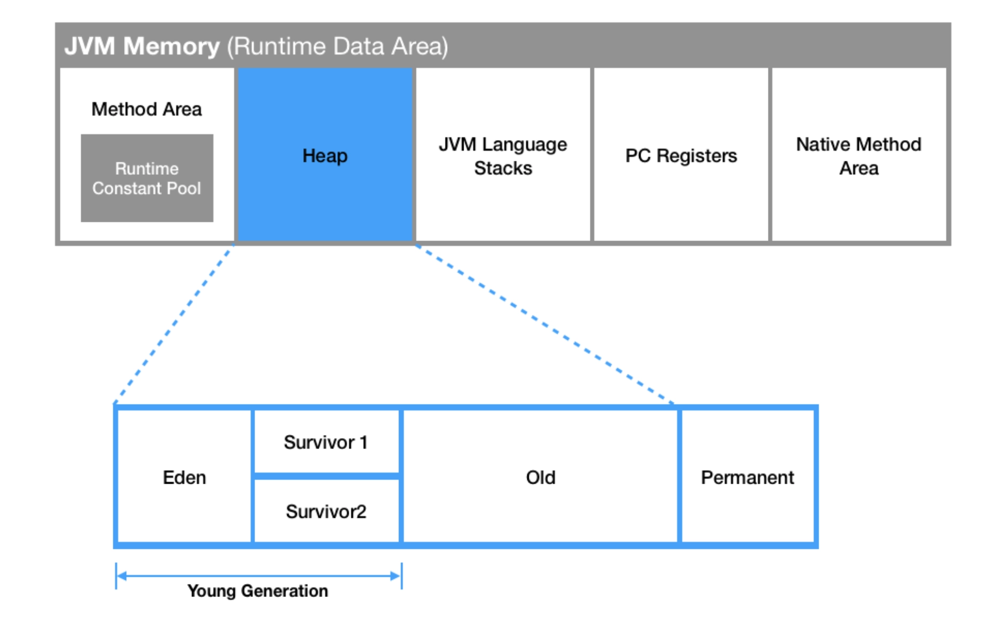
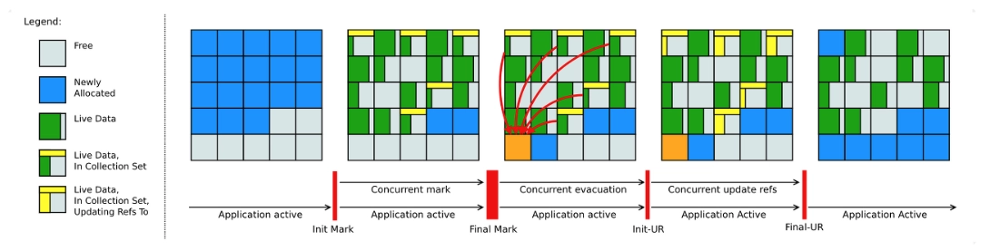

## Overview

JVM 의 Garbage collection(이하 GC) 에 대해서 정리해봅니다.

<!-- truncate -->

## What is GC?

JVM Memory 는 여러 영역으로 구분되어 있다.



Heap 영역은 new 연산자 등으로 생성된 객체와 배열 등을 저장하는 공간이다. Heap 영역에 생성된 객체나 배열은 다른 객체에서 참조될 수 있다. GC 는 바로 이 Heap 영역에서 발생한다.

만약 Java 로 작성된 프로그램이 종료되지 않고 계속 실행된다면 메모리 안에 데이터가 쌓이기만 할 것이다. 이러한 문제를 GC 를 통해 해결한다.

어떻게 해결한다는 것일까? JVM 은 **도달할 수 없는 객체(unreachable)을 GC 의 대상으로 설정**한다. 어떤 객체가 도달할 수 없는 객체가 되는지는 다음 코드를 보면 이해할 수 있다.

```java
public class Main {
 public static void main(String[] args) {
  Person person = new Person("a", "곧 참조되지 않음");
  person = new Person("b", "참조가 유지됨.");
 }
}
```

최초로 person 을 초기화할 때 생성된 `a` 는 바로 다음 줄에서 person 에 `b` 가 재할당되며 도달할 수 없는 객체가 된다. 이제 `a` 는 다음 GC 가 일어날 때 메모리에서 해제되게 된다.

## Stop the world


_The World! 시간이여, 멈춰라! - 죠죠의 기묘한 모험 중_

GC 을 실행하기 위해 JVM 이 애플리케이션 실행을 멈추는 것. **Stop the world 가 발생하면 GC 를 실행하는 쓰레드를 제외한 나머지는 모두 작업을 멈춘다.** GC 작업을 완료한 이후에야 중단했던 작업을 다시 시작한다. 어떤 GC 알고리즘을 사용하더라도 stop the world 는 발생하며, 대개 GC 튜닝이란 stop the world 시간을 줄이는 것이다.

:::warning

Java 는 프로그램 코드에서 메모리를 명시적으로 지정하여 해제하지 않는다. 가끔 명시적으로 해제하려고 해당 객체를 `null` 로 지정하는 것은 큰 문제가 되지 않으나, `System.gc()` 를 호출하는 것은 시스템의 성능에 매우 큰 영향을 끼치므로 절대로 사용하면 안된다. 심지어 `System.gc()` 는 실제로 GC 가 일어날 것이라는 보장을 해주지 않는다.

:::

## GC 가 발생하는 2가지 영역

Java 에서는 개발자가 프로그램 코드로 메모리를 명시적으로 해제하지 않기 때문에 가비지 컬렉터(Garbage Collector)가 더 이상 필요없는 (쓰레기) 객체를 찾아 지우는 작업을 한다. 이 가비지 컬렉터는 두 가지 전제 조건 하에 만들어졌다.

- 대부분의 객체는 금방 접근 불가능 상태(unreachable)가 된다.
- 오래된 객체에서 젊은 객체로의 참조는 아주 적게 존재한다.

### 대부분의 객체는 금방 접근 불가능 상태가 된다

```java
for (int i = 0; i < 10000; i++) {
    NewObject obj = new NewObject();  
    obj.doSomething();
}
```

10,000건의 `NewObject` 는 루프 안에서 사용되고 밖에서는 사용할 일이 없다. 그러므로 이 객체가 메모리를 계속 점유하고 있으면 다른 코드를 실행하기 위한 자원은 계속 줄어들 것이다.

### 오래된 객체에서 젊은 객체로의 참조는 아주 적게 존재한다

이해를 돕기 위해 다음 코드를 보자.

```java
Model model = new Model("value");
doSomething(model);

// 더 이상 model 을 사용하지 않음
```

먼저 생성된 model 은 `doSomething` 안에서 사용된 뒤 이후로는 잘 사용되지 않을 것이다. 경우에 따라 다시 사용하는 경우도 있겠지만 GC는 기본적으로 그런 경우는 적다고 가정한 상태에서 설계되었다. Oracle 에서 측정한 아래 통계를 살펴보면 대부분의 객체가 생성된 직후 GC에 의해 정리되므로 그 가설은 어느 정도 맞다고 볼 수 있겠다.


이러한 가설을 **weak generational hypothesis** 라 한다. 이 가설의 장점을 최대한 살리기 위해서 HotSpot VM 에서는 크게 2개로 물리적 공간을 나누었다. 둘로 나눈 공간이 Young 영역과 Old 영역이다.


- Young 영역(Young Generation 영역): 새롭게 생성한 객체의 대부분이 여기에 위치한다. 대부분의 객체가 금방 접근 불가능한 상태가 되기 때문에 매우 많은 객체가 Young 영역에 생성되었다가 사라진다. 이 영역에서 객체가 사라질 때 Minor GC 가 발생한다고 말한다.
- Old 영역(Old Generation 영역): 접근 불가능 상태로 되지 않아 Young 영역에서 살아남은 객체가 여기로 복사된다. 대부분 Young 영역보다 크게 할당하며, 크기가 큰 만큼 Young 영역보다 GC 는 적게 발생한다. 이 영역에서 객체가 사라질 때 Major GC(혹은 Full GC)가 발생한다고 말한다.

각 객체는 Minor GC 에서 살아남을 때마다 카운트가 증가하는 age bit 를 가지고 있으며, age bit 가 **MaxTenuringThreshold** 라는 설정값을 초과하게 되는 경우 Old 영역으로 이동하게 된다. 하지만 age bit 가 설정값을 초과하지 않더라도 Survivor 영역의 메모리가 부족한 경우 객체가 Old 로 이동될 수 있다.

:::info

Permanent 는 생성된 객체의 주소값이 저장되는 공간이다. 클래스 로더에 의해 load 되는 Class, Method 등에 대한 Meta 정보가 저장되는 영역이고 JVM 에 의해 사용된다. Java 7 까지는 Heap 영역에 존재했다.

:::

## GC 의 종류

Old 영역은 기본적으로 데이터가 가득차면 GC 를 실행한다. GC 방식에 따라서 처리 절차가 달라지므로, 어떤 GC 방식이 있는지 살펴보면 이해가 쉬울 것이다.

### Serial GC

> -XX:+UseSerialGC

Serial GC 를 이해하기 위해서는 먼저 Mark sweep compact 라는 알고리즘에 대해 이해하고 넘어가야 한다. 이 알고리즘의 첫 단계는 Old 영역에 살아있는 객체를 식별(Mark)하는 것이다. 그 다음에는 힙(Heap)의 앞 부분부터 확인하여 살아있는 것만 남긴다(Sweep). 마지막 단계에서는 각 객체들이 연속되게 쌓이도록 힙의 가장 앞 부분부터 채워서 객체가 존재하는 부분과 객체가 없는 부분으로 나눈다(Compaction).

:::warning

Serial GC 는 적은 메모리와 CPU 코어 개수가 적을 때 적합한 방식이다. Serial GC 를 사용하면 애플리케이션의 성능이 많이 떨어진다.

:::

### Parallel GC

> -XX:+UseParallelGC

- Java 8 의 기본 GC

Serial GC 와 기본적인 알고리즘은 같지만, Young 영역의 Minor GC 를 멀티쓰레드로 수행한다.

### Parallel Old GC

> -XX:+UseParallelOldGC

- Parallel GC 를 개선한 버전

이름에서 알 수 있듯 Old 영역과 관련된 GC 방식이다. Young 영역만 멀티쓰레드로 수행했던 ParallelGC 와는 다르게 Old 영역에서도 멀티쓰레드로 GC 를 수행한다.

### CMS GC(Concurrent Mark Sweap)

애플리케이션의 쓰레와 GC 쓰레드가 동시에 실행되어 stop the world 시간을 최대한 줄이기 위해 고안된 GC 이다. GC 대상을 파악하는 과정이 여러 단계로 수행되기 때문에 다른 GC 대비 CPU 사용량이 높다.

결국 Java9 버전부터 deprecated 되었고, **Java14에서는 사용이 중지**되었다.

### G1GC (Garbage First)

> -XX:+UseG1GC

- CMS GC 를 대체하기 위해 jdk 7 에서 최초로 release 된 GC
- Java 9+ 의 기본 GC
- 4GB 이상의 힙 메모리, stop the world 시간이 0.5초 정도 필요한 상황에 사용(Heap 이 너무 작을 경우 다른 알고리즘 사용을 권장)

G1GC 의 경우 이전까지의 지식을 모두 버려야 한다. 완전히 새롭게 설계된 GC 방식이기 때문이다.

Q. G1GC가 이후 버전에서는 디폴트, 앞선 CMS와 비교해서 어떤 장/단점이 있을까?

- 장점
  - g1gc는 scan 하는 도중 해당리전에 대한 compacting도 수행한다.
  - 별도의 STW 없이도 여유 메모리 공간을 압축하는 기능을 제공한다.
    - Compacting으로 STW 발생 시간 최소화
  - String Deduplication Optimize
  - 사이즈, 카운트 등 튜닝 가능성 존재
- 단점
  - Full GC 수행 시 Single Thread로 동작한다.
  - 작은 heap 공간을 가지는 애플리케이션에서는 빈번한 Full GC 발생 가능

### Shenandoah GC

> -XX:+UseShenandoahGC

- Java 12 에서 release
- 레드햇에서 개발
- 기존 CMS 가진 메모리 단편화, G1 이 가진 pause 이슈 해결
- 강력한 Concurrency 와 가벼운 GC 로직으로 heap 사이즈에 영향을 받지 않고 일정한 pause 시간이 특징



### ZGC

> -XX:+UnlockExperimentalVMOptions -XX:+UseZGC

- Java 15 에서 release
- 대량의 메모리(8MB~16TB)를 low latency 로 처리하기위해 디자인된 GC
- G1의 Region 처럼, ZGC 는 ZPage 라는 영역을 사용하며, G1 의 Region 은 크기가 고정인데 비해, ZPage 는 2MB 배수로 동적 운영됨 (큰 객체가 들어오면 2^ 로 영역을 구성해서 처리)
- ZGC 가 내세우는 최대 장점 중 하나는 힙 크기가 증가하더라도 **stop the world 의 시간이 절대 10ms 를 넘지 않는다**는 것


## Conclusion

다양한 종류의 GC 가 있지만, 대부분의 경우에는 기본적으로 제공되는 GC 를 사용하면 된다. GC 튜닝을 하기 위해서는 힙 덤프 등의 GC 로그를 살펴봐야하는 등 굉장한 노력이 든다. GC 로그를 분석하는 방법은 다른 글에서 다루도록 하겠다.

## Reference

- [Naver D2](https://d2.naver.com/helloworld/1329)
- [tecoble](https://tecoble.techcourse.co.kr/post/2021-08-30-jvm-gc/)
- [Oracle](https://docs.oracle.com/javase/8/docs/technotes/guides/vm/gctuning/generations.html)
- [Java 의 GC 는 어떻게 동작하나](https://mirinae312.github.io/develop/2018/06/04/jvm_gc.html)
- [java 가비지 컬렉션 동작 원리](https://inpa.tistory.com/entry/JAVA-☕-가비지-컬렉션GC-동작-원리-알고리즘-💯-총정리)
- [Baeldung](https://www.baeldung.com/jvm-garbage-collectors)
