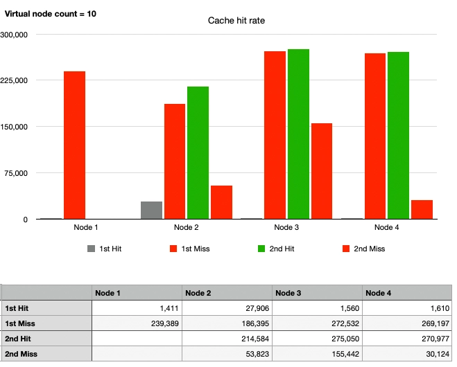

대규모 시스템을 설계하는데 필요한 구성 요소에는 어떤 것들이 있을까요?

이번 글에서는 라우팅 시스템 등에서 자주 사용되는 안정 해시(Consistent Hash)를 직접 구현해보고 데이터를 기반으로 이야기해봅니다.

:::info

전체 코드는 [Github](https://github.com/songkg7/consistent-hashing-sample)에서 확인하실 수 있습니다.

:::

글이 다소 길기 때문에 이후로는 편의상 '~한다.' 체로 설명합니다. 🙏

<!-- truncate -->

## 해시란?

안정 해시에 대해서 알아보기 전에 간략하게 해시에 대해서 짚어보자.

해시의 사전적 의미는 '임의 길이의 데이터 문자열을 입력으로 받아서 고정 크기의 출력, 일반적으로는 숫자와 문자열로 이루어진 해시 값 또는 해시 코드를 생성하는 수학적 함수'이다.

쉽게 풀어 이야기하면 같은 문자열 입력은 항상 같은 해시 코드를 반환한다는 것이다. 해시의 이런 특성을 이용하여 암호화나 파일의 위변조 판정 등 다양한 용도로 사용된다.

## 그래서, 안정 해시란?

안정 해시(Consistent Hashing)란 분산되어 있는 서버 혹은 서비스에 데이터를 균등하게 나누기 위한 기술이다.

굳이 안정 해시를 사용하지 않더라도 데이터를 균등하게 나누는게 불가능하지는 않다. 다만, **안정 해시는 수평적 확장을 용이하게 하는 것에 초점**이 맞춰져 있다. 안정 해시를 살펴보기 전에 왜 안정 해시가 등장하게 되었는지를 간단한 해시 라우팅 방식을 통해 살펴보자.

### 노드 기반 해시 라우팅 방식

> hash(key) % n


이 방식은 단순하면서도 매우 효율적으로 트래픽을 분산해준다.

하지만 수평 확장에 매우 취약한 단점이 있다. node 목록이 변화하면 트래픽이 재분배되면서 기존 노드가 아닌 새로운 노드로 라우팅될 확률이 크게 증가한다.

만약 특정 노드에 캐시를 해두는 방식으로 트래픽을 관리하고 있다면, 모종의 이유에 의해 **노드가 그룹에서 이탈했을 경우 대량의 캐시 미스**를 일으켜 서비스의 장애를 야기할 수 있다.


4개의 노드로 실험해본 결과 **1개 노드만 이탈해도 캐시 적중률이 27% 로 급격히 하락**하는걸 확인할 수 있었다. 실험 방식은 이후 문단에서 자세히 살펴본다.

### 안정 해시 라우팅 방식

안정 해시는 대량의 캐시 미스 발생 가능성을 최대한 낮추기 위해 고안된 개념이다.


아이디어는 간단하다. 해시 공간의 시작과 끝을 이어서 일종의 고리(ring)을 만든 후, 해시 공간 위에 노드들을 배치한다. 노드들은 각각의 해시 공간을 할당받고 트래픽을 기다리게 된다.

:::info

노드들을 배치하기 위해 사용하는 해시 함수는 나머지 연산과는 무관하다.

:::

이제 안정 해시로 구현된 이 라우터로 트래픽이 들어오는 상황을 가정해보자.


해시 함수를 통과한 트래픽은 링 위에서 가장 가까운 노드를 향해 라우팅된다. B 노드는 이후 같은 요청이 들어올 때를 대비해서 `key1` 을 캐시해둔다.

많은 트래픽이 들어온다고 가정할 때도 이와 같은 원리로 트래픽은 각자의 노드를 찾아 라우팅되게 된다.

#### 안정 해시의 장점

##### 노드 목록이 변하더라도 캐시가 Miss 될 확률이 적다

E 노드가 추가된 상황을 가정해보자.


이전에 들어왔던 키는 이전과 같은 지점에 배치된다. D 와 C 노드 사이에 배치되던 키 중 일부는 새로운 E 노드로 향하게 되면서 캐시가 미스하게 되지만, 나머지 노드들은 캐시 미스가 발생하지 않는다.

네트워크에 에러가 발생하여 C 노드가 사라진 상황을 가정해도 결과는 비슷하다.


C 노드로 향했던 키들이 D 노드로 향하여 캐시 미스가 발생하지만 그 외 공간에 배치된 키들은 캐시 미스가 발생하지 않는다.

결론적으로, 노드 목록에 어떠한 변화가 생기던지간에 변경된 노드와 직접적으로 관련된 키들만 캐시 미스가 발생하기 때문에 노드 수 기반의 해시 라우팅에 비하여 캐시 적중률을 끌어올릴 수 있게 된다.

#### 안정 해시의 문제점

다른 모든 설계들이 그렇듯이, 우아하게만 보이는 안정 해시에도 문제점은 있다.

##### 파티션을 균일하게 유지하기 어렵다


_서로 다른 크기의 해시 공간을 갖게 된 노드들_

어떤 key 가 생성될지 모르는 이상, 해시 함수의 결과값을 정확히 예측하는 것은 매우 어렵다. 그러므로 해시 결과에 의해 링 위 포지션이 정해지는 안정 해시는 노드가 균등한 해시 공간을 가지고 링 위에 분포할 것이라고 보장할 수 없다.

##### 균등 분포를 달성하기 어렵다


_D 노드가  담당하는 해시공간이 너무 넓으면 트래픽이 쏠릴 수 있다._

노드가 해시 링 위에 균등한 파티션을 가지고 배치되지 않기 때문에 생기는 문제이다. 운이 없으면 위 예처럼 D 노드가 담당하는 해시 공간이 다른 노드에 비해 비정상적으로 크게 설정될 수 있다. 이 상태는 특정 노드에 트래픽이 쏠리면서 전체적인 장애를 유발하는, 핫스팟이라고 하는 문제를 초래할 수 있다.

## 가상 노드(Virtual Node)

해시 공간은 유한하다. 그러므로 해시 공간에 배치된 노드 수가 굉장히 많다면 표준편차가 감소하여 노드 하나가 없어진다 하더라도 다음 노드에 큰 부하는 가지 않을 것이다. 문제는 현실 세계에서 **물리 노드의 수는 곧 비용**이라는 점이다.

그래서 물리 노드(Physical node)를 모방하는 가상 노드(Virtual node)를 구현하여 이를 영리하게 해결한다.


가상 노드는 내부적으로 물리 노드의 해시값을 가리키고 있다. 일종의 분신술(...?)이라고 생각하면 된다. 본체인 물리 노드는 해시 링 위에 배치되지 않고, 복제된 가상 노드들만이 해시 링 위에서 트래픽을 기다리고 있다. 트래픽이 가상 노드에 할당되면 내부에 존재하는 실제 노드의 해시 값으로 라우팅되는 원리이다.

## 안정 해시 D.I.Y

지금까지는 이론적 설명이었다. 개인적으로 어떤 개념을 학습할 때 **직접 구현해보는 것만큼 확실한 학습 방법은 없다**고 생각한다. 직접 구현해보자.

### Hash 알고리즘 선택

이름에도 해시가 포함되니 어떻게 보면 당연하지만, 안정 해시를 구현할 때는 적절한 해시 알고리즘을 선택하는 것이 매우 중요하다. 해시 함수의 속도가 성능과 직결되기 때문이다. 일반적으로 널리 사용되는 해시 알고리즘은 MD5 와 SHA-256 이 있다.

- MD5: 속도가 보안보다 중요한 어플리케이션. SHA-256 에 비해 해시 공간은 작다. 2^128
- SHA-256: 더 긴 해시 크기와 더 강력한 암호화 속성. 속도는 MD5 에 비해 느리다. 2^256, 1.15792 x 10^77 정도의 매우 큰 해시 공간을 갖기 때문에 충돌이 거의 발생하지 않는다.

라우팅에서는 보안보다 속도가 중요하고 해시 충돌 걱정이 덜하기 때문에 MD5 로도 충분하다고 생각되어 MD5 로 해시 함수를 구현했다.

```java
public class MD5Hash implements HashAlgorithm {
    MessageDigest instance;

    public MD5Hash() {
        try {
            instance = MessageDigest.getInstance("MD5");
        } catch (NoSuchAlgorithmException e) {
            throw new IllegalStateException("no algorithm found");
        }
    }

    @Override
    public long hash(String key) {
        instance.reset();
        instance.update(key.getBytes());
        byte[] digest = instance.digest();
        long h = 0;
        for (int i = 0; i < 4; i++) {
            h <<= 8;
            h |= (digest[i]) & 0xFF;
        }
        return h;
    }
}
```

:::tip

Java 에서는 `MessageDigest` 를 통해서 MD5 알고리즘을 사용하는 해시 함수를 편리하게 구현할 수 있다.

:::

### Hash Ring

```java
// businessKey 를 hash 하고 ring 에 배치된 다음 해시값(node)을 찾는다.
public T routeNode(String businessKey) {
    if (ring.isEmpty()) { // ring 이 비어있으면 node 가 없다는 의미이므로 null 을 반환
        return null;
    }
    Long hashOfBusinessKey = this.hashAlgorithm.hash(businessKey);
    SortedMap<Long, VirtualNode<T>> biggerTailMap = ring.tailMap(hashOfBusinessKey);
    Long nodeHash;
    if (biggerTailMap.isEmpty()) {
        nodeHash = ring.firstKey();
    } else {
        nodeHash = biggerTailMap.firstKey();
    }
    VirtualNode<T> virtualNode = ring.get(nodeHash);
    return virtualNode.getPhysicalNode();
}
```

hash ring 은 `TreeMap` 을 사용하여 구현했다. `TreeMap` 은 저장과 동시에 key(해시값)의 오름차순으로 정렬을 유지하기 때문에 `tailMap(key)` 메서드를 통해서 key(해시값)보다 큰 값들을 찾아올 수 있고, 큰 key 를 찾을 수 없다면 `firstKey` 로 가장 작은 key 와 연결하여 링을 구현한다.

:::info

`TreeMap` 이 익숙하지 않다면, 이 [링크](https://coding-factory.tistory.com/557)를 참조해주기 바란다.

:::

### 테스트

일반 라우팅 방법에 비해 안정 해시 라우팅은 얼마나 효과적일까? 모처럼 직접 구현했으니 이 의문을 스스로 해결해보자. 개략적인 테스트 설계는 다음과 같다.

- 1M 트래픽을 처리한 이후, 노드 목록에 변화를 주고 다시 같은 트래픽이 들어오는 상황을 가정
- 4대의 물리 노드

간단한 테스트 코드[^fn-nth-1]를 통해서 수치화했고, 이를 그래프로 그려보니 6개의 케이스를 도출해낼 수 있었다. 하나씩 살펴보자.

#### Case 1. Simple Hash, Node 변화없음


1M 건의 요청을 보내고 이어서 다시 1M 의 같은 요청을 보냈다. 노드의 변화가 없기 때문에 두 번째 요청부터는 100%의 캐시 히트율을 기록하는 것을 확인할 수 있다.

:::info

낮은 수치지만 첫번째 요청에서도 캐시가 히트할 수 있었던 것(회색 그래프)은 테스트를 설계할 때 랜덤한 문자열을 키로 사용했기 때문에 낮은 확률로 중복된 키 값이 존재했기 때문이다.

:::

노드들의 그래프 높이가 비슷한 것을 보아 `hash % N` 을 사용한 라우팅은 예상대로 모든 트래픽이 아주 잘 분산되는 것 또한 확인할 수 있다.

#### Case 2. Simple Hash, 1대의 노드 이탈


캐시 히트를 표시해주는 초록색 그래프가 확연히 낮아진 것을 볼 수 있다. 1번 Node 가 이탈하면서 2, 3, 4번 노드로 트래픽이 분산되었는데 운이 좋아서 이전과 같은 노드로 향한 트래픽은 캐시가 적중할 수 있었지만, 대부분은 다른 노드로 향하게 되면서 캐시가 적중하지 못하는 것이다.

#### Case 3. Consistent Hash, Node 변화 없음, 가상 노드 없음


:::info

물리 노드는 해시 링 위에 배치되지 않음을 생각해볼 때, 가상 노드가 물리 노드의 수를 증가시키는 역할을 하려면 가상 노드가 적어도 2개 이상 존재해야 한다. 그러므로 1개의 가상 노드를 사용한다는 것은 사실상 가상 노드를 사용하지 않는 상태이다.

:::

Case 1 과 마찬가지로, 첫 번째 요청에서 캐시가 바로 히트할 수는 없으므로 붉은 그래프가 먼저 상승하며 두 번째 요청에서는 100% 캐시 적중하므로 녹색 그래프와 붉은 그래프의 높이가 같게 된다.

하지만 노드마다 그래프의 높이가 다른 것을 확인할 수 있는데, 이게 바로 안정 해시의 단점이였던 **균일하지 않은 파티션으로 인하여 골고루 분산되지 않는 트래픽**인 것이다.

#### Case 4. Consistent Hash, 1대의 노드 이탈, 가상 노드 없음


1번 노드를 이탈시킨 이후, Case 2 와 비교해보면 캐시 적중률이 압도적으로 뛰어난 것을 확인할 수 있다.

하지만 좀 더 자세히 살펴보면, 첫 번째 요청에서 1번 노드로 향했던 트래픽이 두 번째 트래픽에서 그대로 2번 노드로 향한 것을 볼 수 있다. 2번 노드는 캐시에 적중한 트래픽을 포함하여 총 45만건 정도의 요청을 처리했다. 노드 3번의 22만건 처리에 비하면 2배 이상 높은 수치이다. 반면 3번과 4번 노드의 처리량은 기존대비 변화가 전혀 없다. 여기서 안정 해시의 장점이기도 하면서 동시에 단점이 되는 일종의 **핫스팟 현상을 확인**할 수 있다.

#### Case 5. Consistent Hash, 1대의 노드 이탈, 10대의 가상 노드

이번에는 파티션 균등 배분 및 핫스팟 현상 해소를 위해 가상 노드를 적용해보자.



전체적으로 그래프에 변화가 일어난다. 1번 노드로 향할 예정이었던 트래픽들은 2, 3, 4번 노드들로 나눠진 것으로 보인다. 여전히 균등하게 나눠진 파티션은 아닌 것 같지만 Case 4와 비교했을 때 핫스팟 문제는 점점 해결되고 있다. 가상 노드 10대로는 부족한 것 같으니 충분히 늘려보자.

#### Case 6. Consistent Hash, 1대의 노드 이탈, 100대의 가상 노드


드디어 2, 3, 4번 노드의 그래프가 비슷해졌다. 1번 노드 이탈 후 해시 링 위에는 물리 노드당 100대의 가상 노드, 즉 300대의 가상 노드가 존재하고 있다. 정리해보면 다음과 같다.

- Case 1 과도 견줄 수 있을만큼 트래픽이 균일하게 분산되는 것을 확인할 수 있다.
- 1번 노드가 이탈하더라도 이후 1번 노드로 향할 트래픽이 여러 노드들로 분산되면서 핫스팟 문제를 발생시키지 않는다.
- 1번 노드로 향할 트래픽 외에는 여전히 캐시에 적중한다.

충분한 가상 노드를 배치하니 나머지 연산을 통해 분산하던 라우팅 방식에 비해 수평 확장에 굉장히 유리해졌다는 것을 확인할 수 있었다.

## 마무리

지금까지 대규모 시스템 설계 5장에 나오는 안정 해시에 대해 살펴봤습니다. 안정 해시가 어떤 것인지, 어떤 문제를 해결하기 위해 존재하는지 이해하는데에 도움이 되셨기를 바랍니다.

별도의 case 로 언급하지는 않았지만 이후 가상 노드를 몇 대까지 늘려야 완전한 균등 분포를 달성할 수 있을지 신경 쓰여서 10000대까지 늘려보았는데요, 어느 정도 충분한 가상 노드 대수를 확보하면 더 이상 가상 노드 대수를 늘려도 효과는 미미했습니다. 이론상으로는 가상 노드를 늘리면 늘릴수록 편차는 0에 수렴하고, 균등 분포를 달성할 수 있습니다. 하지만 가상 노드를 늘리는 것은 해시 링 위에 많은 인스턴스가 존재하는 것이고 따라서 불필요한 오버헤드가 발생할 수 있습니다. 새로운 노드가 추가되거나 삭제될 때마다 해시 링위에서 가상 노드를 찾아서 정리해주는 작업이 필요해지기 때문[^fn-nth-2]입니다. 운영 중인 환경에서는 데이터를 기반으로 적절한 수의 가상 노드를 설정하시길 바랍니다.

## Reference

- [Java HashMap 은 어떻게 동작하는가](https://d2.naver.com/helloworld/831311)
- [안정 해시 설계](https://donghyeon.dev/%EC%9D%B8%ED%94%84%EB%9D%BC/2022/03/20/%EC%95%88%EC%A0%95-%ED%95%B4%EC%8B%9C-%EC%84%A4%EA%B3%84/)
- [Lonor/websocket-cluster](https://github.com/Lonor/websocket-cluster)

[^fn-nth-1]: [SimpleHashRouterTest](https://github.com/songkg7/consistent-hashing-sample/blob/main/src/test/java/com/example/consistenthashingsample/router/SimpleHashRouterTest.java)

[^fn-nth-2]: 특히 TreeMap 으로 구현된 Hash Ring 의 경우 삽입, 삭제가 발생할 때마다 내부 원소들의 재배치가 발생하기 때문에 대량의 삽입, 삭제는 다소 비효율적입니다.
