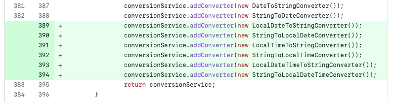

Spring Batch 5.0 이 되면서 변경된 사항들을 정리합니다.

<!-- truncate -->

## What's new?

### `@EnableBatchProcessing` 은 더 이상 권장되지 않음

```java
@AutoConfiguration(after = { HibernateJpaAutoConfiguration.class, TransactionAutoConfiguration.class })
@ConditionalOnClass({ JobLauncher.class, DataSource.class, DatabasePopulator.class })
@ConditionalOnBean({ DataSource.class, PlatformTransactionManager.class })
@ConditionalOnMissingBean(value = DefaultBatchConfiguration.class, annotation = EnableBatchProcessing.class) // 5.0 부터 추가되었습니다.
@EnableConfigurationProperties(BatchProperties.class)
@Import(DatabaseInitializationDependencyConfigurer.class)
public class BatchAutoConfiguration {
// 생략
}
```

이전에는 `@EnableBatchProcessing` 어노테이션을 통해서 스프링 배치의 스프링 부트 자동설정을 활성화할 수 있었습니다. 하지만 이제는 스프링 부트의 자동설정을 사용하기 위해서는 삭제해야 합니다. `@EnableBatchProcessing` 명시하는 방법 또는 `DefaultBatchConfiguration` 을 상속하여 활성화되는 빈은 이제 스프링 부트의 자동설정을 밀어내고(back-off), 애플리케이션의 설정을 커스텀하는 용도로 사용됩니다.

따라서 `@EnableBatchProcessing` 이나 `DefaultBatchConfigration` 을 사용하면 `spring.batch.jdbc.initialize-schema` 등의 기본 설정이 동작하지 않습니다. 또한 부트를 실행시킬 때 Job 이 자동으로 실행되지 않으므로 Runner 의 구현이 필요합니다.

### 다중 Job 실행은 더 이상 지원되지 않음

지금까지는 하나의 배치에 여러개의 Job 이 있었다면 한꺼번에 실행할 수 있었습니다. 하지만 이제 단일 Job 을 감지하면 부트가 실행될 때 Job 을 실행시킵니다. 만약 여러 개의 Job 이 context 에 존재한다면, 부트를 실행할 때 `spring.batch.job.name` 을 통해 실행시킬 Job 을 명시해줘야 합니다.

### JobParameter 지원 범위 확대

v4 에서의 스프링 배치는 Job parameter 로 `Long`, `String`, `Date`, `Double` 만 사용이 가능했었습니다. v5 에서는 여기에 더해 converter 를 직접 구현하는 것으로 모든 종류의 타입을 JobParameter 로 사용할 수 있도록 개선되었습니다.

그러나 아직 스프링 배치의 기본 변환 서비스가 `LocalDate` 및 `LocalDateTime` 을 지원하지 않아서 예외가 발생합니다. 기본 conversion service 에 converter 를 직접 구현하여 제공하는 것으로 문제를 해결할 수 있으나, `JobParametersBuilder` 가 관련 메서드를 제공함에도 실제로 변환되지 않고 예외를 던지는 것은 문제라고 생각됩니다. 이미 이에 대한 [issue](https://github.com/spring-projects/spring-batch/issues/4257)가 열려있고, `5.0.1` 에서 수정될 예정이라고 하네요.

```java
JobParameters jobParameters = jobLauncherTestUtils.getUniqueJobParametersBuilder()
		.addLocalDate("date", LocalDate.now()) // builder method 가 제공되나 사용하면 exception..
		.toJobParameters();
```


_해당 issue 가 해결된 모습_

이 issue 는 2023-02-23 에 5.0.1 이 릴리즈되며 해결되었습니다.

### initializeSchema

```yaml
spring:
  datasource:
    url: jdbc:postgresql://localhost:5432/postgres?currentSchema=mySchema
    username: postgres
    password: 1234
    driver-class-name: org.postgresql.Driver
  batch:
    jdbc:
      initialize-schema: always
      table-prefix: mySchema.BATCH_
  sql:
    init:
      mode: always
```

currentSchema 옵션을 지정해줘야 정확하게 동작합니다.

## Reference

- [Spring Boot 3.0 Migration Guide](https://github.com/spring-projects/spring-boot/wiki/Spring-Boot-3.0-Migration-Guide#spring-batch-changes)
- [What's New in Spring Batch 5.0](https://docs.spring.io/spring-batch/docs/current/reference/html/whatsnew.html#job-parameters-handling-updates)
