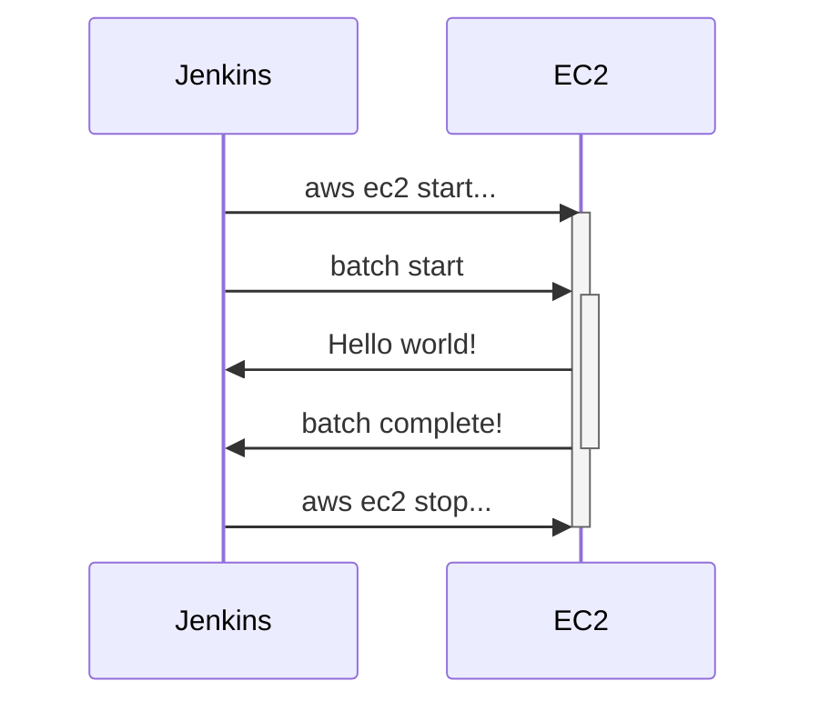
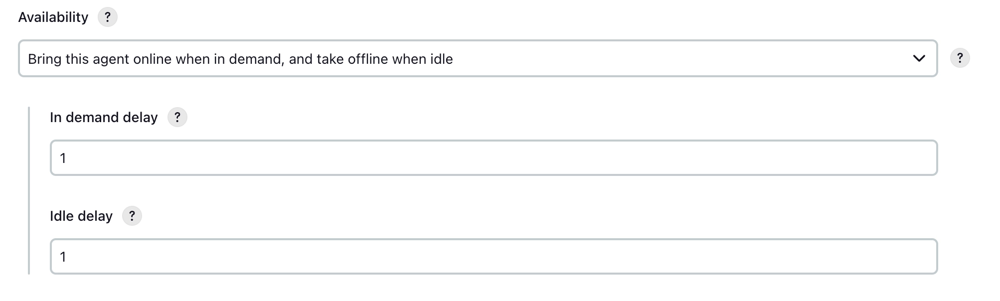

특정 시간, 특정 조건에서만 실행되야하는 배치성 애플리케이션이 존재할 때 리소스 비용을 최적화하는 아주 간단한 방법에 대해서 공유합니다.

## Problem

1. 배치는 특정한 시간에만 실행된다. 정산같은 집계 성격의 경우, 1일, 1달, 1년 등 일정 주기로 실행되어야 하는 경우가 대부분이다.
2. 반응 속도는 크게 중요하지 않고, 실행된다는 보장이 중요하다.
3. 특정 시간에만 필요한 리소스를 위해 24시간 EC2 를 유지해야하는 것은 비효율적이다.
4. 클라우드 서버 리소스가 필요한 순간에만 EC2 를 준비상태로 만들 수 없을까?

물론 가능합니다. AWS ECS, AWS EKS 등 여러가지 자동화 솔루션들도 있지만, Jenkins 로 배치 및 EC2 서버를 직접 관리한다고 가정하고 환경을 구성해봅니다.

<!-- truncate -->

## Architecture



이러한 구조로 infra 를 설계한다면 24시간 EC2 리소스를 유지할 필요없이 배치가 실행되기 위해 리소스가 필요해질 때만 비용이 청구되도록 할 수 있습니다.

## Jenkins

### Jenkins Node 관리 정책



요청이 큐에서 대기할 경우에만 node 를 활성화합니다. 불필요한 error 로그가 남는 것을 최소화할 수 있습니다. 추가로 1분 동안 활동이 없으면 idle 상태로 전환합니다.

## AWS CLI

### AWS CLI 설치

AWS CLI를 사용하면 terminal 환경에서도 AWS 의 자원을 관리할 수 있습니다.

아래 명령을 사용하여 현재 사용 중인 인스턴스 목록을 가져올 수 있습니다.

```bash
aws ec2 describe-instances
```

원하는 리소스의 정보를 확인했다면 target 으로 지정하여 특정 동작을 실행하게 할 수 있습니다. 명령은 다음과 같습니다.

#### EC2 start

```bash
aws ec2 start-instances --instance-ids {instanceId}
```

#### EC2 stop

```bash
aws ec2 stop-instances --instance-ids {instanceId}
```

## Scheduling

배치가 한달에 한 번 실행되도록 cron 표현식을 작성해주면 끝입니다.


```text
H 9 1 * *
```

이제 EC2 는 평소에는 Stop 상태로 유지되다가 한 달에 한 번 Jenkins 에 의해 깨어나서 배치를 처리해주게 됩니다.

## Conclusion

EC2 를 사용하지 않을 때도 Running 상태로 유지하는 것은 비용 측면에서 비효율적입니다. 이번 글에서는 Jenkins 와 간단한 명령어들의 조합만으로도 EC2 를 원하는 순간에만 사용할 수 있다는 점을 보여드렸습니다.

물론 EKS 와 같은 고수준의 클라우드 오케스트레이션 툴은 더 우아하게 이런 문제를 해결해줍니다. 하지만 때로는 단순한 방법이 가장 효율적인 방법이 되기도 하니, 상황에 맞는 방법을 선택하시기를 바라며 글을 마무리합니다.
