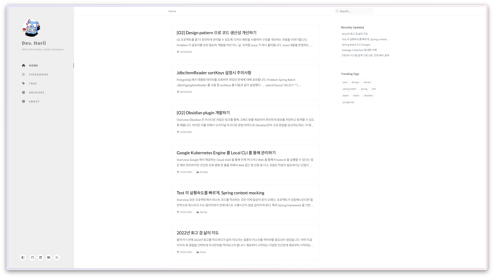

## 개요

이번 글은 나름 의미가 있는 글입니다. 올초부터 진행해왔던 글또의 마지막 글이 될 예정이거든요. 후기를 겸하여 그동안의 블로그 여정을 정리해봅니다.

<!-- truncate -->

## 블로그 플랫폼 선택기준

저는 편리한 포스팅을 위해서 아래 조건을 만족하는 플랫폼을 찾고 있었습니다.

- 마크다운 사용이 편리할 것
- 이미지 업로드가 편리할 것
- 꾸준히 유지보수가 진행중이여야할 것(오픈소스의 경우)

티스토리는 마크다운의 지원이 아쉽고 이미지 업로드가 번거로웠습니다. Velog 는 개발자들에게 아주 유명한 플랫폼이지만, 최근 들어 관리되고 있지 않은 모습이 신경 쓰여서 선택하지 않았습니다.

결국 마크다운을 완벽하게 지원하면서 이미지의 업로드가 쉬워야하고 장기적으로 유지보수가 가능한 플랫폼으로는 GitHub Page + Jekyll 이 가장 합리적이라고 생각했습니다. Jekyll 을 관리하기 위해서는 Ruby 관련 지식이 필요하지만 대략적으로는 알고 있었고, 필요할 때마다 학습하는 방법으로 관리하기로 하고 현재까지 운영 중입니다.

## SEO 는 뜻대로 되지 않고

이것저것 시도해보면서 모든 페이지가 인덱싱되도록 노력해봤지만, 생각대로 잘 되지는 않네요. 크롤링이 도대체 언제쯤 시작할지...

다만 관련 분야를 공부하게 되는 계기가 되었고, 인내심이 필요하다는 것도 알게 되었습니다.

_그래프의 중간에 생긴 함정(?)은 robot.txt 실험 결과물_

그래도 페이지가 발견되긴 했으니, '유입을 늘리다보면 자연스럽게 인덱싱되겠지' 하며 기다리고 있습니다. 실제로 조금씩 인덱싱된 페이지 수가 늘긴 하더라구요. ~~인덱싱 속도보다 빠르게 글을 발행하고 있지만...~~ 원하는 페이지가 인덱싱되서 검색에 노출이 될 때까지 걸리는 시간을 임의로 조절하기 어려운 점은 아쉽지만, 구글의 크롤링 정책을 바꿀 순 없으니 어쩔 수 없을 것 같습니다.

## 글 소재의 변화

사실 저는 티스토리에서 처음 블로그를 시작했는데요, 알고리즘 공부를 한창 시작하던 때여서 문제풀이 위주로 글을 썼었습니다.

_취준생 시절 티스토리 블로그_

실무를 하다보니, 알고리즘 해법은 알고리즘 문제 사이트에서 더 잘 설명되어 있고, 단순한 지식의 나열은 그냥 공식 문서를 보는게 더 낫겠다는 생각이 들기 시작했습니다. 제 블로그도 그런 심심한 블로그가 되기를 원하지는 않았습니다.

다른 사람과는 **차별화되는, 개성적인 블로그를 만들고 싶다**는 마음이 지금까지 이어지면서 컨텐츠의 질을 높이고 차별화하기 위해 글을 써나가고 있습니다. 개인적으로 만족하는 컨텐츠로는 [직접 오픈소스를 만들어가는 이야기](https://haril.dev/blog/2023/02/22/develop-obsidian-plugin), [읽지만 말고 구현하기](https://haril.dev/blog/2023/06/04/Consistent-Hashing) 등이 있습니다.

_현재 블로그_

## Obsidian 플러그인 오픈소스로 공개

오직 블로그 포스팅만을 위한 플러그인을 직접 개발해서 사용 중입니다. [O2](https://github.com/songkg7/o2) 라고 부르고 있는데요, Obsidian 과 Jekyll 간 작업의 연속성을 위한 플러그인입니다. 이 플러그인을 위해서 TypeScript 도 속성으로 학습해야했네요 😅

감사하게도, 대략 400명 정도의 사용자가 저와 함께 하고 있네요(23년 7월 기준). ~~대부분 10분 안에 삭제하셨을 것 같지만... DAU 1..~~

초기에는 버그도 많았지만, 현재는 자잘한 이슈를 많이 처리해서 안정화 단계에 진입해있습니다. 만약 Obsidian 을 즐겨 쓰시면서 블로그 플랫폼으로 Jekyll 을 사용하고 계시다면 한 번 쯤 관심가져주시면 감사하겠습니다!

Obsidian Discord Community 에서 `plugin dev` role 도 획득해서 활동 중이니 Obsidian 관련 질문이 있으시면 언제든지 환영합니다!

## 성장률

처음 블로그를 시작하면서 꾸준한 동기부여 및 방향 설정을 위해 Google Analytics 는 반드시 사용해야겠다고 생각했습니다. 조금씩 우상향하는 그래프를 보니 나름 뿌듯하더라구요. 블로그 초기 방문자가 몇 명 안된다면 오히려 악효과가 난다는 의견도 있지만, 개인적으로는 오히려 동기부여가 되었습니다. 많은 사람들이 들어오게 하고 싶다는 일종의 '오기'가 생겨서 좋았습니다.

아래는 제 블로그의 1년간의 성장률입니다.

그래프만 다이나믹할 뿐 사실 많은 파워블로거 분들에 비하면 아직 그렇게 많은 수치는 아닙니다. 이게 바로 통계의 함정이라는거겠지요... 그래도 결과적으로는 우상향을 그리고 있어서 좋네요.

글또를 하면서 글 퀼리티에 조금 더 신경쓴 영향인지, 알음알음 외부 링크가 걸리면서 바이럴이 되기 시작했습니다. 특히 **서핏이라는 커뮤니티 사이트에 자주 큐레이션이 되기 시작**하면서 특히 유입이 좋았네요. 제 부족한 글을 선정해주신 큐레이터 분께 감사합니다. 앞으로 더 열심히 쓰고 다듬어 보겠습니다.

## 앞으로의 목표

올해 하반기 + 내년의 목표를 크게 정리해보면 아래와 같습니다.

1. 단순 지식 공유를 넘어선, 개성적이고 실용적인, 고퀼리티의 글을 발행하도록 노력하기
2. 새 사용자 수 3만 이상
3. 매달 2개 이상의 글 발행하기
4. 영어 학습을 위한 영문 포스팅

특히 영문 포스팅은 어떤 방식으로 어떤 플랫폼을 사용해야할지 고민이 많습니다. 나중에는 영어 외의 언어로도 포스팅을 하고 싶으니, 결과적으로는 **다국어 지원과 관련된 부분에 대한 고민**이 되겠네요. 글또 9기를 진행(제발 뽑아주세요)하면서 점점 구체화해나갈 예정입니다.

지금까지 제 여정에 함께해주셔서 감사합니다. 앞으로도 잘 부탁드리겠습니다 🙏
