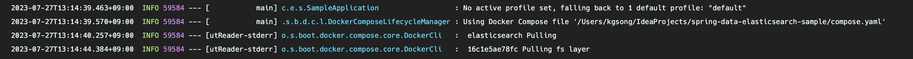
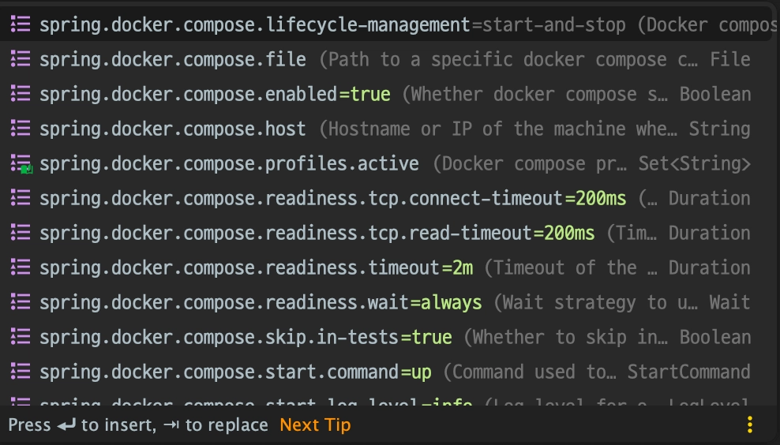

Spring Boot 3.1 부터 추가된 Docker Compose Support 에 대해서 간단하게 소개합니다.

:::info

잘못된 부분이 있다면 피드백 부탁드립니다!

:::

<!-- truncate -->

## Overview

Spring framework 으로 개발하다보면 DB 환경 구성을 위해서 로컬에 직접 설치해서 쓰는 것보다, Docker 를 사용하는 경우가 많은 것 같습니다. 보통은 아래의 워크플로우로 작업하게 됩니다.

1. bootRun 전에 `docker run` 을 통해 DB 를 미리 running 상태로 만들어둔다
2. bootRun 을 통해 개발, 검증 등 필요한 작업을 한다
3. bootRun 을 종료하고 `docker stop` 을 통해 컨테이너 DB 또한 종료한다

개발 전후로 docker run, stop 해주는 작업은 꽤나 번거로운 작업이였는데요, 이제 Spring Boot 3.1 부터는 `docker-compose.yaml` 을 사용하여 Spring 의 라이프사이클과 Docker container 의 라이프사이클을 일치시켜줄 수 있습니다.

## Contents

먼저 의존성을 추가해줍니다.

```groovy
dependencies {
    // ...
    developmentOnly 'org.springframework.boot:spring-boot-docker-compose'
    // ...
}
```

이후 아래처럼 compose 파일을 작성해줍니다.

```yaml
services:
  elasticsearch:
    image: 'docker.elastic.co/elasticsearch/elasticsearch:7.17.10'
    environment:
      - 'ELASTIC_PASSWORD=secret'
      - 'discovery.type=single-node'
      - 'xpack.security.enabled=false'
    ports:
      - '9200' # random port mapping
      - '9300'
```



bootRun 시 compose 파일을 자동으로 인식하고 `docker compose up` 작업이 먼저 실행됩니다.

그런데 container port 를 임의의 host port 와 매핑한다면, `docker compose down` 이 발생할 때마다 `application.yml` 을 계속 업데이트해줘야 하는게 아닐까요? 다행히도 Spring Boot 3.1 부터는 compose 파일만 작성해두면 나머지는 Spring Boot 가 알아서 해줍니다. 정말 놀랍도록 편리합니다...!

만약 compose 파일 경로를 바꿔야 한다면 `file` property 를 수정하시면 됩니다.

```yaml
spring:
  docker:
    compose:
      file: infrastructure/compose.yaml
```

lifecycle 과 관련된 property 또한 있기 때문에 컨테이너 생명 주기를 적절하게 변화시킬 수 있습니다. 부트를 종료할 때마다 container 가 stop 되는 것이 싫다면, `start_only` 옵션을 사용하시면 될 것 같습니다.

```yaml
spring:
  docker:
    compose:
      lifecycle-management: start_and_stop # none, start_only
```

그 외에도 다양한 옵션이 있으니 살펴보시면 원하시는걸 선택하는데 도움이 되실 것 같습니다.



## Conclusion

아무리 테스트 코드를 작성한다지만, 실제 DB 와의 반응을 확인해보는건 개발 과정에서 필수였습니다. 그리고 그 환경을 구성하는건 지루한 숙제와 같았죠. container 기술이 등장하며 설정이 매우 간편해졌지만, Spring Boot 를 시작하기 전과 후 `docker` 명령어를 잊지 말고 실행해줘야하는 점은 분명히 번거로운 점이였습니다.

이제 Spring Boot 3.1 부터는 개발자가 잊고 container 를 띄우지 않거나, 내리지 않아서 메모리를 잡고 있는 상황을 막아줄 것 같으니 개발자는 더욱 개발에만 집중할 수 있게 될 것 같네요. 정말 자연스럽게 Docker 가 Spring 과 통합된 점이 신기하면서도 편리합니다. 꼭 써보시길 바랍니다!

## Reference

- [Docker Compose Support in Spring Boot 3.1](https://spring.io/blog/2023/06/21/docker-compose-support-in-spring-boot-3-1)
