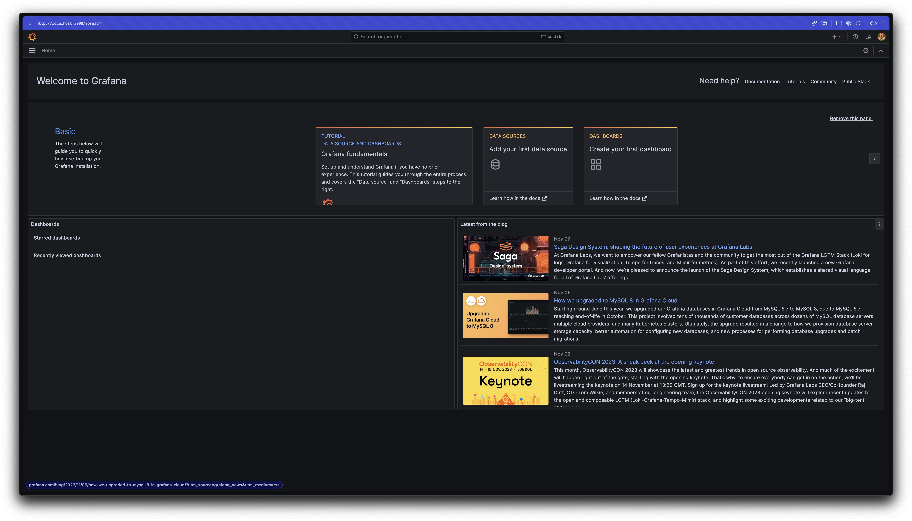

## Overview

> Spring MVC 웹 애플리케이션은 동시 사용자를 몇 명까지 수용할 수 있을까? 🤔

자신이 만든 서버가 어떤 상태여야 많은 유저를 수용하면서 안정적인 서비스를 제공할 수 있을지에 대한 대략적인 수치를 가늠하기 위해 Spring MVC 의 tomcat 설정을 중심으로 네트워크의 변화를 살펴봅니다.

이후는 작성의 편의를 위해 문어체를 사용합니다 🙏

:::info

기술적인 오류나 오타 등의 잘못된 내용이 있다면 댓글로 알려주시면 감사하겠습니다 🙇‍♂️

:::

<!-- truncate -->

## Test Scenario

- 동시에 200명 이상의 사용자가 API 를 요청하는 상황을 가정
- 해당 API 가 너무 빨리 응답하는 것을 방지하고, 어느 정도의 지연을 모의하기 위해 5초의 대기시간을 갖도록 구현
- Spring MVC 의 tomcat 설정을 조절해가면서 트래픽 처리량을 검증
- 테스트 데이터의 오염을 방지하기 위해 API 는 EC2 에 배포해놓은 상태에서, 로컬에서 부하를 발생

## Environment

- EC2 t4g.small (Amazon Linux 2core 2GB 64bit ARM)
- SpringBoot 3.1.5
- Spring MVC
- Spring Actuator
- K6

## Test Application

먼저 API 를 간단하게 구현한다.

```java
@RestController
public class HelloController {

    @GetMapping("/hello")
    public String hello() throws InterruptedException {
        TimeUnit.SECONDS.sleep(5); // 처리 시간을 시뮬레이션
        return "Hello, World!";
    }
}
```

어느 정도 오버로드가 발생하는 API 라고 가정하기 위해 5초의 지연 시간을 주었다. 지연 시간이 없다면 요청이 너무 빠르게 처리되어 네트워크 동작을 확인하기 어려울 수 있다. 이번 글에서 조절할 설정은 다음과 같다.

```yaml
server:
  tomcat:
    threads:
      max: 200                # 생성할 수 있는 thread의 총 개수
    max-connections: 8192     # 수립가능한 connection의 총 개수
    accept-count: 100         # 작업큐의 사이즈
    connection-timeout: 20000 # timeout 판단 기준 시간, 20초
```

서버에서의 원활한 설정값 수정을 위해 모든 부분을 시스템 환경변수로 대체한다.

```yaml
server:
  tomcat:
    threads:
      max: ${TOMCAT_MAX_THREADS:200}
    max-connections: ${TOMCAT_MAX_CONNECTIONS:8192}
    accept-count: ${TOMCAT_ACCEPT_COUNT:100}
    connection-timeout: ${TOMCAT_CONNECTION_TIMEOUT:20000}
```

Docker Image 를 빌드하기 위해 Dockerfile 을 작성한다.

```dockerfile
# java 17 multi stage build
FROM gradle:8.4.0-jdk17 as builder
WORKDIR /app
COPY . .
RUN gradle clean build

FROM openjdk:17-ea-11-jdk-slim
WORKDIR /app
COPY --from=builder /app/build/libs/*.jar app.jar
EXPOSE 8080
ENTRYPOINT ["java", "-jar", "app.jar"]
```

```bash
docker build -t sample-server .
```

테스트를 위한 애플리케이션 준비는 거의 다 됐다. 이후는 적당한 registry 에 이미지를 push 하고, EC2 에서 `docker run` 을 실행하기만 하면 된다. 분량상 EC2 를 생성하고 이미지를 배포하는 과정은 생략한다.

## K6

[K6](https://k6.io/) 는 Grafana Lab 에서 만든 현대적인 부하테스트 툴이다. JavaScript 로 테스트 시나리오를 작성할 수 있으며, 굉장히 다양한 상황을 모의하여 테스트할 수 있다. [Apache JMeter](https://jmeter.apache.org/) 또한 이번 테스트를 위해 사용할 수 있는 좋은 옵션 중 하나이지만, K6 는 테스트 결과를 시각화해줄 Grafana 와 통합하기 좋고 사용법이 어렵지 않아 쉽게 다양한 상황을 검증해볼 수 있다. 따라서 이번 테스트를 위해서는 K6 를 사용하기로 한다. 최근은 특히 JMeter 보다는 K6 를 먼저 고려하고 있다.

### K6 설치

```bash
brew install k6
```

### 모니터링 구성

도커 컴포즈로 Grafana 와 InfluxDB 를 간단하게 실행해준다.

```yaml
version: "3.7"

services:
  influxdb:
    image: bitnami/influxdb:1.8.5
    container_name: influxdb
    ports:
      - "8086:8086"
      - "8085:8088"
    environment:
      - INFLUXDB_ADMIN_USER_PASSWORD=bitnami123
      - INFLUXDB_ADMIN_USER_TOKEN=admintoken123
      - INFLUXDB_HTTP_AUTH_ENABLED=false
      - INFLUXDB_DB=myk6db
  granafa:
    image: bitnami/grafana:latest
    ports:
      - "3000:3000"
```

```bash
docker compose up -d
```

InfluxDB 가 정상동작하는지 확인해보자. 만약 아래 명령어가 실행되지 않는다면, `brew install influxdb-cli` 를 통해 커맨드를 먼저 설치해줘야 한다.

```bash
influx ping
# OK
```

http://localhost:3000 으로 접근하여 그라파나가 정상적으로 동작하는 것을 확인한다.



:::info

Grafana 의 초기 계정정보는 아이디와 비밀번호 모두 admin 을 입력하면 된다. 비밀번호를 변경하라고 나오겠지만, 이번에 그라파나를 사용하는 이유는 운영이 아니라 테스트이므로 skip 해도 무방할 것이다.

:::

InfluxDB 를 datasource 로 설정한 뒤 [K6 dashboard](https://grafana.com/grafana/dashboards/2587-k6-load-testing-results/) URL 을 복사하여 import 해주면 모니터링 구성이 완료된다.


_5분이면 모니터링 환경 구성 끝...!_

### Test script 작성

스파이크 테스트를 수행하기 위해서 아래와 같은 스크립트를 작성해주었다.

```js
// spike-test.js
import http from 'k6/http';
import { check } from 'k6';

export const options = {
    scenarios: {
        spike: {
            executor: 'constant-vus',
            vus: 300,
            duration: '1s',
        },
    },
};

export default function () {
    const res = http.get('http://{EC2_INSTANCE_IP}/hello');
    check(res, { 'is status 200': (r) => r.status == 200 });
};
```

간단하게 중요한 키워드만 설명해보면,

- `constant-vus`: 테스트 실행 전 고정된 유저를 미리 생성해주는 executor
- `vus`: virtual users 로, 테스트에 사용할 유저 수를 의미한다

## 테스트 실행 및 분석

아래 명령을 실행하면 테스트가 수행된다.

```bash
k6 run --out influxdb=http://localhost:8086/myk6db spike-test.js
```

### 300 requests

먼저 가볍게 300 개의 요청을 던져보자. 예상되는 동작은 다음과 같다.

- 스레드 풀의 max 스레드 수는 200개이고, 작업 큐(acceptCount)는 100이다. 따라서 200개의 요청은 바로 처리되고 이어서 100개의 요청이 처리될 것이다


예상대로 5초 간격으로 200개의 요청이 먼저 처리되고 뒤이어 100개의 나머지 요청이 처리되었다.

### 1000 requests


역시나 5초 간격으로 요청을 처리하는 것을 확인할 수 있다. 총 처리 시간은 25s 남짓이 걸린다. 가장 빠르게 접근한 사용자는 5.01s 만에 결과를 확인하겠지만, 그렇지 못한 사용자는 25s 를 기다려야 결과를 확인할 수 있다.

이 시점에 기본 톰캣 설정의 `connection-timeout` 인 20s 를 넘었다. 하지만 타임아웃 에러는 발생하지 않았고, 20s 이상을 기다려서라도 모두 처리되었다. `connection-timeout` 이 request 발생 순간부터는 아니라는 것을 추측할 수 있는 대목이다. 자세한 부분은 이후 다시 설명한다.

### 2000 requests

이쯤에서 한 번 고비가 찾아온다.

K6 에서는 일정 시간 이상 실행되는 테스트를 안전하게 중지하는 `gracefulStop`[^fn-nth-1] 기능이 존재한다. 이 기능은 30s 가 기본값으로 설정되어 있어서 **timeout 을 보기 전에 테스트를 중단**시키므로, 스크립트를 좀 수정해서 더 오랜 기간 테스트가 수행되도록 해야 한다.

```js
import http from 'k6/http';
import { check } from 'k6';

export const options = {
    scenarios: {
        spike: {
            executor: 'constant-vus',
            vus: 2000,
            duration: '1s',
            gracefulStop: '5m', // 추가
        },
    },
};

export default function () {
    const res = http.get('http://54.180.78.85/hello');
    check(res, { 'is status 200': (r) => r.status == 200 });
};
```


`gracefulStop` 시간을 늘린 이후로는 타임아웃을 보기 전에 먼저 테스트가 종료되는 일이 발생하지 않는다.

### 3000 requests

다시 한 번 고비가 온다.


이번에는 요청이 1분 정도 대기하게 되면서 request timeout 이 발생한다.

200 스레드로 3000 개의 요청을 처리하므로, 5초의 대기시간까지 고려해보면 운이 없는 유저의 요청은 3000 / 200 * 5 = 75(s) 를 대기해야 한다. 따라서 타임아웃 회피를 위해서는 응답시간을 15초 이상 단축해야 하며, 슬슬 tomcat 의 기본설정으로는 request timeout 을 피하기 어려워보인다. 해결을 위해 몇 가지 방법을 생각해볼 수 있다.

1. 타임아웃 시간을 늘려 유저를 더 기다리게 한다.
2. thread sleep 을 5초에서 조금 줄이는 식으로 처리 속도를 더 빠르게 한다.
3. thread pool 의 사이즈를 200 에서 500 정도로 늘리면 동시 처리량이 늘어나면서 해결될 것이다.

이번 테스트의 목적을 생각해보면 3번이 가장 적절하다고 판단하기 때문에, 이번에는 thread 개수를 좀 더 늘려보는 방향으로 선택했다.

이전에 `application.yml` 에 미리 환경변수를 주입 받을 수 있도록 해뒀다. 한 번 활용해보자.

```bash
docker run -d -p "80:8080" \
    -e TOMCAT_MAX_THREADS=500 \
    --name sample-server \
    --restart always \
    123456789012.dkr.ecr.ap-northeast-2.amazonaws.com/sample-server:v1
```

`-e TOMCAT_MAX_THREADS=500` 옵션을 통해서 컨테이너 내부에 환경변수를 넣어줬다. 이 환경변수는 `application.yml` 에 존재하는 자신의 자리로 찾아가서 스레드풀 설정을 변화시킨다.

이후 다시 한 번 테스트를 해보면...


예상대로 타임아웃 없이 처리되는 것을 확인할 수 있다.

스레드를 추가적으로 생성해야하기에 서버의 리소스를 이전보다는 쓰게 되겠지만, 처리속도가 월등히 빨라져서 75s 에서 30s 로 줄어들게 되었다. 이런 식으로 스레드만 늘려줘도 성능 개선이 가능한 것을 확인할 수 있다.

### 6000 requests


스레드 풀을 500 으로 늘렸지만, 6000 requests 부터는 다시 request timeout 이 발생한다. 동시처리량을 더 늘려야할 필요가 있다. 좀 전에 했던 방법처럼 스레드 개수를 더 늘리면 어떨까? 스레드가 너무 많으면 리소스 경합이 발생하므로 그다지 바람직하지 못하지만, 우선 가능할 때까지 스레드를 늘리는 방향으로 생각해보자. 이전과 같은 방식을 사용하여 1000 개로 늘려줬다.


_thread pool 1000 에서 다시 성공_

다행히 스레드 1000개 정도는 2core 2GB 의 EC2 성능으로도 충분한 것 같다. resource 사용량도 크게 높아지지 않았으며 안정적이였다.

### 10k requests

드디어 최소한의 설정 수정으로 10k 의 동시 요청에 도달했다. 하지만 지금까지 볼 수 없던 에러가 쏟아지기도 했다.


- cannot allocate memory
- connection reset by peer
- request timeout (20s 에서 발생)
- i/o timeout

먼저, 정확한 에러 원인 파악을 위해 테스트 실행 시점에 TCP 연결이 몇 개나 수락되는지 모니터링해봤다. 리눅스에서 소켓 모니터링을 위해 사용할 수 있는 `ss` 명령어를 사용했다.

```bash
# TCP 수 모니터링
watch ss -s
```


_closed 가 10k 에 미치지 못한다. 정상적으로 커넥션이 생성되었다면 10k 를 넘었을 것이다._

10k 의 TCP 커넥션을 맺을 수 없는 것을 확인했다. 지금까지는 유저의 수대로 정확하게 TCP 커넥션이 증가하는 것을 확인했는데 처음으로 커넥션 개수가 요청 수보다 모자라기 시작한다.


정상적으로 종료되지 않은 커넥션이 정리될때까지 약간의 텀을 두고 몇 번을 반복해도 8293 vus 만 성공했다. 왜 그럴까?

이 시점에서 몇 가지 생각해볼 수 있는 부분을 정리해보며 가설을 만들어보자.

1. `max-connections` 속성은 애플리케이션의 TCP 최대 커넥션 개수와 연관이 있을 것이다.
2. request timeout 은 TCP 연결을 맺지 못한 상태로 20s 가 경과하여 발생한 connection-timeout 에러일 것이다.
3. `accept-count` 속성도 마찬가지로 TCP 최대 커넥션 개수와 연관이 있을 것이다. (8192 + 100 이 8293 의 근사치이기 때문에)
4. `max-connections` 을 증가시키면 커넥션을 더 많이 맺을 수 있기 때문에, connection timeout 을 회피할 수 있을 것이다.

이 후 단계는 위 가설을 하나씩 검증해본다. 도커는 OS 를 공유하기 때문에, 모든 테스트가 독립적이도록 설정을 바꿔야할 때마다 기존에 동작 중이였던 컨테이너는 정지 후 새로운 컨테이너를 생성하며 진행했다.

#### 1. Max Connections

> `max-connections` 은 애플리케이션의 TCP 최대 커넥션 개수와 연관이 있을 것이다?

먼저 max connection 값을 20k 로 증가시키고 테스트를 실행한다.


오호... 이전과는 다르게 커넥션이 10k 를 넘겨서 생성되었다.


심지어 아무런 에러 없이 성공한다. 이로써 `max-connections` 은 OS 에 생성되는 **커넥션의 수와 직접적으로 관련되어 있다**고 생각할 수 있다.

#### 2. Connection Timeout

> request timeout 은 TCP 연결을 맺지 못한 상태로 20s 가 경과하여 발생한 `connection-timeout` 설정 관련 에러일 것이다?

이번에는 `max-connections` 를 다시 기본값으로 하고, `connection-timeout` 을 30s 로 수정한 후 다시 테스트를 실행해보자.

```yaml
max-connections: 8192
connection-timeout: 30000
```

여전히 20s 를 지날 즈음 request timeout 이 발생했다. 그렇다면, `connection-timeout` 은 연결의 시작 시점과는 무관하다고 생각할 수 있다.

사실 이 설정은 클라이언트와 **연결을 맺은 이후 종료할 때까지의 타임아웃**[^fn-nth-2]이다. 테스트 실행 시점 20s 에 발생하는 timeout 에러는 `maxConnections`, `acceptCount` 가 모두 가득차서 더 이상 커넥션이 수락되지 않아 발생하는 timeout 에러이다.

즉, `connection-timeout` 옵션과는 **관련이 없으며** 관련 내용은 바로 다음에서 자세히 설명한다.

#### 3. Accept Count

> `accept-count` 속성도 마찬가지로 TCP 최대 커넥션 개수와 연관이 있을 것이다?

이번에는 `accept-count` 만 늘려보자.

```yaml
max-connections: 8192
accept-count: 2000 # 작업 큐
```

`accept-count` 가 100 일 때 성공한 요청 수는 8293 이였다. 2000 으로 늘리면 10k 이상의 요청을 처리할 수 있을까? 혹은 TCP 연결 수락 개수와 작업 큐가 직접적인 관련은 없을테니 여전히 실패할까? 백문이불여일견, 직접 확인해보자.


결과는 아주 인상적이다. `max-connections` 을 전혀 늘리지 않았고 `accept-count` 만 늘려주었는데 10k 이상의 TCP 연결이 수락되었다.

몇몇 블로그에서는 `accept-count` 에서 대기하는 작업(request)은 TCP connection 을 맺지 않는다고 설명하고 있었다. '내가 혹시 설정을 잘못했나?' 싶어서 actuator 를 활용하여 애플리케이션의 설정을 확인해봤지만, 의도한대로 설정된 상태다.


_actuator 는 동작 중인 애플리케이션의 상태를 확인하는데 매우 유용하게 사용할 수 있다_

`ServerProperties` 클래스의 javaDoc 을 살펴보면 이 의문에 대한 힌트를 발견할 수 있다.

```java
/**
 * Maximum number of connections that the server accepts and processes at any
 * given time. Once the limit has been reached, the operating system may still
 * accept connections based on the "acceptCount" property.
 */
private int maxConnections = 8192;

/**
 * Maximum queue length for incoming connection requests when all possible request
 * processing threads are in use.
 */
private int acceptCount = 100;
```

`maxConnections` 필드에 작성된 주석을 살펴보자.

> Once the limit has been reached, the operating system may still accept connections based on the "acceptCount" property (제한에 도달한 뒤에도, 운영체제는 "acceptCount" 속성에 따라 여전히 커넥션을 수락할 수 있습니다.)

`maxConnections` 제한에 도달하면, `acceptCount` 의 값만큼 OS 가 추가 커넥션을 수락하게 한다는 내용이다. 8192(maxConnections) + 100(accept) = 8293[^fn-nth-3] 일 것이라는 기존의 가설을 뒷받침해주는 부분이다.

정리하자면,

1. `max-connections` 을 초과한 요청은 `acceptCount` 만큼 **TCP connection 이 수락된 상태에서 작업 큐(이런 이유로 acceptorQueue 라고도 한다)에서 대기**한다.
2. NIO Connector 는 작업 큐에서 요청을 가져와서 남아있는 worker thread 에게 할당한다.
3. `acceptCount` 만큼의 **작업 큐마저 꽉 찬다면 TCP connection 을 맺지 못하고 대기하다가 request timeout 이 발생**한다.

`acceptCount` 는 최대 커넥션 개수와 너무나 밀접한 관계에 있다고 할 수 있겠다.


:::info

그렇다면 `threads.max`, `max-connections`, `accept-count` 를 모두 1로 할당하면 어떻게 될까? 처리량에 따라서 시간 안에 connection 이 수락되지 않은 요청은 timeout 이 발생할 것이다. 현재 환경에서는 3개가 성공하고 7개가 실패했다. 여기서 `acceptCount` 를 10으로 늘리면, 모든 요청에 커넥션이 수락되므로 모두 성공한다.

:::

#### 4. Max Connections 와 Connection Timeout

> `max-connections` 을 증가시키면 커넥션을 맺은 상태이기 때문에 connection timeout 을 회피할 수 있을 것이다?

2번에서 살펴봤던 내용과 다소 일맥상통하는 부분이 있는 내용이다. `connection-timeout` 은 커넥션을 수락한 이후 종료되기 전까지의 유예 시간과 관련된 타임아웃 설정이다. `max-connections` 을 증가시켜서 회피할 수 있는 타임아웃은 커넥션 자체가 수락되지 못해 발생하는 타임아웃이다. `max-connections` 으로 타임아웃을 회피할 수 있긴 하지만 그 종류가 다르다.

#### 10k problem 결론

maxConnections 과 acceptCount 모두 최대 커넥션에 영향을 주므로 둘의 합이 10k 를 넘게 한다면 동시 발생하는 10k 커넥션도 꽤 여유롭게 수락할 수 있다. 적절한 비율은 커넥션 생성 비용 및 스레드 생성 개수를 따져봐야할 것이다.


_10k 성공_

## 얼마나 처리 가능할까?

OS level 의 설정을 조절하지 않고(ulimit 등) 애플리케이션 설정만 조절하는 것으로도 15000 vus 까지는 에러없이 처리할 수 있었다.


설정은 아래처럼 사용했다.

```yaml
thread:
  max: 2000
max-connections: 50000
accept-count: 5000
```

다소 과격한(?) `max-connections` 과 `accept-count` 값인데, `max-connections` 값이 크다해서 실제로 그만큼 커넥션이 수락된다는 보장이 있진 않다. 이 설정으로도 20k 이상의 요청에서는 `cannot assign requested address` 를 비롯한 다양한 에러가 발생하며 커넥션이 수락되지 않았다. 소켓이나 포트 할당과 관련된 네트워크 문제가 아닐까 싶은데 정확하게 알아내지는 못해서 이 부분은 다음 기회에 네트워크를 추가적으로 학습해나가면서 확인해봐야할 것 같다.

또 한가지 주의해야할 점은, 커넥션을 많이 수락할 수 있다는 것이 요청을 다 처리할 수 있다는 의미는 아니라는 점이다. 커넥션이 수락되어도 처리속도가 충분히 빠르지 않다면 결국 클라이언트는 60s 안에 응답을 받지 못해 매우 많은 요청이 request timeout 으로 종료될 것이다.

> `max-connections` 는 그릇에 최대로 채울 수 있는 물의 양이며, 애플리케이션의 처리 속도(throughput)는 물을 퍼내는 속도와 같다. 정해진 시간 안에 물을 다 퍼내지 못하면 OS 라는 관리자는 그릇에 남은 물을 바닥에 다 쏟아버린다.

## 마무리

- `max-connections`, `accept-count` 는 애플리케이션이 사용하는 커넥션 수에 영향을 준다.
- `threads.max` 는 처리량(throughput)에 직접적인 영향을 주는 중요한 속성이다.
- `connection-timeout` 은 커넥션을 맺지 못할 때 발생하는 request timeout 과는 관련이 없다.
- `max-connections` 이 충분히 큰 값으로 설정되어 있더라도, OS 가 수용할 수 있는 커넥션에는 한계가 있다.
- `accept-count` 는 `max-connections` 을 초과했을 때 OS 가 connection 을 `accept-count` 만큼 추가적으로 수락할 수 있도록 하는 속성이다.

최근 '1대의 서버를 사용할 때 Spring MVC 가 동시 접속자를 몇 명이나 처리할 수 있나요?' 라는 질문에 애매모호하게 대답할 수 밖에 없던게 아쉬워서 여기까지 오게 되었다. 조건에 따라서 변동폭이 매우 클 수 있어서 수치로 정량화하기 조심스럽고 어려운 내용이지만 그래도 정리해본다.

**"서버의 성능, 초당 처리량(throughput) 과 같은 조건에 따라 매우 크게 차이가 나지만, AMI 2core 2GB 에서 5초 정도의 지연시간이 있는 API 는 최소 15000 명의 사용자가 동시에 요청해도 에러를 보여주지 않을 수 있습니다."**

~~뭔가를 알게 될수록 모르는 것들만 더 늘어나는 것 같다...~~

:::info

글에 사용된 코드는 GitHub [test-script](https://github.com/songkg7/spike-test), [sample-server](https://github.com/songkg7/sample-server)에서 확인하실 수 있습니다.

:::

## 미처 다루지 못한 내용들

아래 내용들은 이 글을 작성하면서 정리했던 내용들이지만 주제에서 다소 벗어나 있거나, 별도로 분리할만한 주제라고 생각한 목록들입니다.

- EC2 에 SSM 으로 접속하기, ECR 사용법, AWS Identity Center 로 SSO 를 설정해보자
- allocate memory error 는 서버 측 메모리를 늘리거나, swap 메모리를 설정하는 것이 해결방법이 될 수 있다
- i/o timeout 의 발생 원인을 살펴보기
- BIO Connector 와 NIO Connector 의 차이점과 동작 흐름을 살펴보기
- 커넥션, 소켓, 포트. 3가지 개념의 유사성과 동시 유저 접근과의 상관관계 살펴보기

## Reference

- [Grafana K6 로 부하테스트 시각화하기](https://velog.io/@heka1024/Grafana-k6%EC%9C%BC%EB%A1%9C-%EB%B6%80%ED%95%98-%ED%85%8C%EC%8A%A4%ED%8A%B8%ED%95%98%EA%B8%B0)
- [K6 spike test](https://k6.io/docs/test-types/spike-testing/)
- [100k_concurrent_server](https://shdkej.com/blog/100k_concurrent_server/)
- [spring-boot-configure-tomcat](https://www.baeldung.com/spring-boot-configure-tomcat)
- [https://junuuu.tistory.com/835](https://junuuu.tistory.com/835)
- [NIO Connector 와 BIO Connector 에 대해 알아보자](https://velog.io/@cjh8746/%EC%95%84%ED%8C%8C%EC%B9%98-%ED%86%B0%EC%BA%A3%EC%9D%98-NIO-Connector-%EC%99%80-BIO-Connector%EC%97%90-%EB%8C%80%ED%95%B4-%EC%95%8C%EC%95%84%EB%B3%B4%EC%9E%90)
- [about-springboot-tomcat-acceptcount-pool](https://stackoverflow.com/questions/65779046/about-springboot-tomcat-acceptcount-pool)
- [tomcat-8.5-doc](https://tomcat.apache.org/tomcat-8.5-doc/config/http.html)

---

[^fn-nth-1]: [K6 graceful stop](https://k6.io/docs/using-k6/scenarios/concepts/graceful-stop/)
[^fn-nth-2]: [spring-boot-configure-tomcat](https://www.baeldung.com/spring-boot-configure-tomcat#3-server-connections)
[^fn-nth-3]: 1의 오차는 여전히 미스터리이다.
