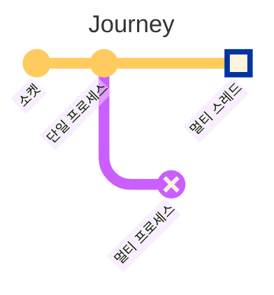
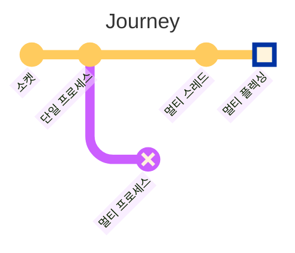
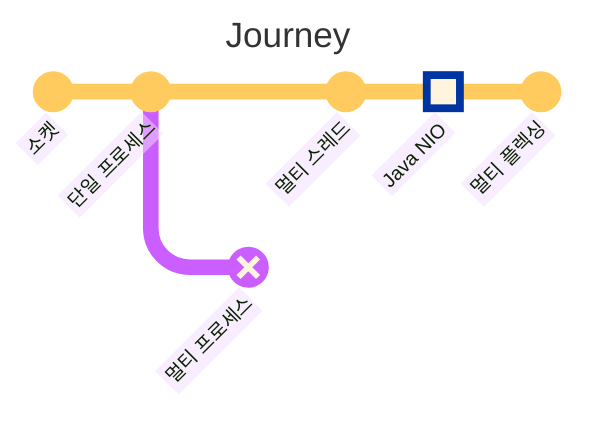
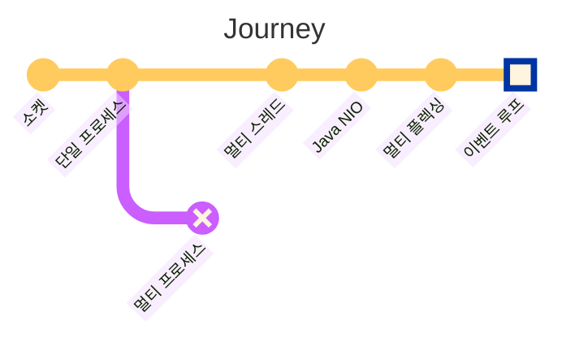
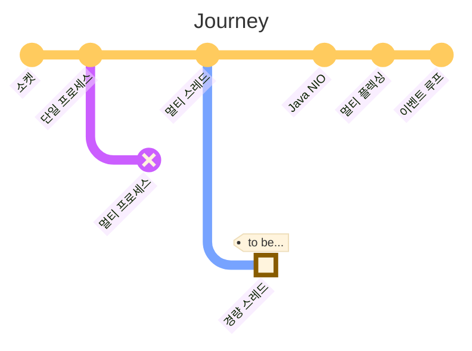

## Overview

여러 클라이언트의 요청을 동시에 핸들링할 수 있는 서버 애플리케이션을 구현하는 건 이제 너무나 쉽습니다. Spring MVC만 사용해도 뚝딱 만들어낼 수 있으니까요. 하지만, 엔지니어로서, 그 이면의 원리가
너무나 궁금합니다 🤔. 이번 글에서는 당연한 것처럼 느껴지는 것들에 '왜' 라는 질문을 던져보며, 다중 접속 서버를 구현하기 위해 어떤 고민이 있었는지 되짚어보는 여정을 떠나봅니다.

:::info

예제 코드는 [GitHub](https://github.com/songkg7/journey-to-a-multi-connect-server) 에서 확인하실 수 있습니다.

:::

## 소켓(Socket)


먼저 '소켓' 에서 출발합니다. 네트워크 프로그래밍 관점에서 소켓은, '네트워크상에서 데이터를 주고받기 위해 파일처럼 사용되는 통신 엔드포인트' 입니다. '파일처럼 사용되는' 이라는 설명이 중요한데, 파일
디스크립터(file descriptor, fd) 를 통해 접근되고 파일과 유사한 I/O 연산을 지원하기 때문입니다.

- 파일과 유사하게 다뤄야 하다 보니 많은 요청을 위해서는 그만큼의 파일을 열 수 있어야 하겠습니다.
- 예전에는 1개의 프로세스가 열 수 있는 파일 개수가 4096개로 제한되어 있었습니다.
- `ulimit` 을 사용하면 이 제한을 확인할 수 있습니다.
- 요즘은 `unlimited` 가 기본이라 크게 신경쓸 필요는 없지만, 오래된 리눅스 버전을 사용하는 경우는 주의해야 합니다.
- `Too Many Open Files` 라는 에러가 발생하면 이를 확인해보세요.

:::info[왜 소켓을 port 가 아닌 fd 로 식별할까요?]

자신의 ip, port, 상대방의 ip, port 를 사용하여 소켓을 식별하는 데 사용할 수 있지만 fd 를 사용하는 이유는 연결이 수락되기 전 소켓에는 아무런 정보가 없기 때문이고 ip 와 port 의 조합은 단순한 정수인 fd 보다
많은 데이터가 필요하기 때문입니다.

:::

소켓을 사용하여 서버 애플리케이션을 구현하려면 다음과 같은 과정을 거쳐야 합니다.

<!-- truncate -->


- socket() 으로 소켓 생성
- bind(), listen() 으로 연결 준비
- accept() 로 연결 수락
- 수락 후 바로 다른 소켓을 할당 = 다른 연결을 수락할 수 있어야 하기 때문

이 때 연결에 사용되는 소켓을 리스닝 소켓이라고 합니다. 이 리스닝 소켓은 연결을 수락하는 역할만 하므로, 클라이언트와의 연결에는 다른 소켓이 별도로 생성되어 사용됩니다.

서버에서 클라이언트와의 연결을 어떻게 생성하고 유지하는지 알아보았으니, Java 로 서버 애플리케이션을 구현해보겠습니다.

## 단일 프로세스 서버


```java
try (ServerSocket serverSocket = new ServerSocket(PORT)) {
    while (true) {
        try (
                Socket clientSocket = serverSocket.accept();
                BufferedReader in = new BufferedReader(new InputStreamReader(clientSocket.getInputStream()));
                PrintWriter out = new PrintWriter(clientSocket.getOutputStream(), true)
        ) {
            String inputLine;
            while ((inputLine = in.readLine()) != null) {
                System.out.println("Echo: " + inputLine);
            }
            System.out.println("Client disconnected.");
        } catch (IOException e) {
            System.out.println("Exception in connection with client: " + e.getMessage());
        }
    }
} catch (IOException e) {
    System.out.println("Could not listen on port " + PORT + ": " + e.getMessage());
}
```

1. `ServerSocket` 에 port 를 bind 한 뒤 무한루프를 돌며 클라이언트의 요청을 기다립니다.
2. 클라이언트 요청이 발생하면 `accept` 를 호출하여 연결을 수락하고 새로운 `Socket` 을 생성합니다.
3. 데이터를 읽거나 쓸 때는 `Socket` 을 `Stream` 과 함께 사용합니다.

앞서 살펴본 소켓 개념을 바탕으로 간단한 서버 애플리케이션이 완성되었습니다. 이제 이 글을 보고 계신 여러분도 프레임워크를 사용하지 않고도 서버 애플리케이션을 구현하실 수 있게 되었네요 🎉

하지만 이 서버 애플리케이션에는 몇 가지 아쉬운 점이 있습니다. **여러 요청을 동시에 처리하기 어렵다**는 점이에요. **단일 프로세스로 동작하기 때문에 한 번에 하나의 요청만 처리할 수 있고, 이후 요청을
처리하려면 앞선 연결이 종료되어야 가능**합니다.

예시를 통해 살펴보겠습니다.


hello1 응답은 잘 돌아오지만, hello2 응답은 hello1 연결이 종료되어야 돌아오는 걸 확인할 수 있습니다.

- 하나의 클라이언트가 연결할 때는 문제가 없지만 다수의 클라이언트가 연결하는 경우에는 문제
- 처음 연결한 클라이언트가 연결을 종료하기 전까진 큐에 들어가 대기해야 하기 때문
- 여러 요청을 동시에 처리할 수 없으므로 리소스를 효율적으로 사용할 수 없다

이 문제를 해결하려면 2가지 방법을 고려해볼 수 있습니다.

- 멀티 프로세스
- 멀티 스레드

Java 에서 멀티 프로세스를 직접 다루기는 어렵습니다. 아쉬움을 뒤로 하고, 멀티 스레드로 발걸음을 옮겨봅니다.

## 멀티 스레드 서버



멀티 스레드 방식은, 하나의 프로세스 안에서 요청이 들어올 때마다 별개의 스레드를 생성한 뒤 처리를 위임하는 방식으로 구현됩니다. 이를 그림으로 나타내면 다음과 같습니다.


클라이언트 관점에서 표현해보면 아래처럼 표현할 수 있습니다.


코드로 구현해보면 아래와 같습니다.

```java
try (ServerSocket serverSocket = new ServerSocket(PORT)) {
    LOGGER.info("Server is running on port " + PORT);

    while (true) {
        Socket clientSocket = serverSocket.accept(); // 메인 스레드가 요청을 수락하면서 클라이언트 소켓 생성
        new Thread(new ClientHandler(clientSocket)).start(); // 워커 스레드에 위임
    }
} catch (IOException e) {
    LOGGER.severe("Could not listen on port " + PORT + ": " + e.getMessage());
}
```

```java
public class ClientHandler implements Runnable {
    // 생략...

    @Override
    public void run() {
        try (
                BufferedReader in = new BufferedReader(new InputStreamReader(clientSocket.getInputStream()));
                PrintWriter out = new PrintWriter(clientSocket.getOutputStream(), true)
        ) {
            String inputLine;
            while ((inputLine = in.readLine()) != null) {
                out.println("Echo: " + inputLine); // Echo back the received message
            }
        } catch (IOException e) {
            LOGGER.severe("Error handling client: " + e.getMessage());
        } finally {
            try {
                clientSocket.close();
            } catch (IOException e) {
                LOGGER.severe("Failed to close client socket: " + e.getMessage());
            }
        }
    }
}
```


요청이 들어올 때마다 스레드를 하나씩 생성하므로 이제는 동시에 여러 요청이 들어와도 처리할 수 있습니다. 그럼 우리의 여정은 여기까지인 걸까요?
JVM 의 특성을 고려해보면, 조금 더 최적화할 수 있을 것 같습니다.

- **스레드 생성 및 유지는 서버 리소스를 사용하는 작업**이고 그렇게 저렴한 동작은 아닙니다. Java 에서는 스레드를 생성하면 stack 공간이 할당되는데, 이 stack 공간은 CPU 아키텍처에 따라 다르지만
  약 1MB 정도의 공간이 할당됩니다.
- 10000개의 요청이 동시에 발생한다면, 단순 계산으로도 서버에는 10GB 이상의 메모리가 필요해진다는 의미가 됩니다.
- 서버 리소스는 무한하지 않기 때문에 최대 스레드 개수를 제한하기로 합니다. **스레드 풀** 개념이 등장합니다.
- Spring MVC 가 바로 이런 생각들을 바탕으로 구현된 프레임워크입니다.

최적화까지 완료했습니다. [몇 가지 실험](https://haril.dev/blog/2023/11/10/Spring-MVC-Traffic-Testing) 을
통해 [c10k problem](http://www.kegel.com/c10k.html) 정도는 가볍게 해결할 수 있다는 것 또한 증명했습니다. 하지만, 뭔가 찝찝합니다 🤔.

- 스레드가 블로킹 되면 될수록, 애플리케이션은 점점 비효율적으로 동작합니다. context switching 과정에서 경합이 발생하기 때문입니다.
- 소켓에 데이터가 들어왔는지 확인하고 읽어들이기 위해 스레드들은 모두 한정된 CPU 자원을 가지고 polling 경쟁을 벌입니다.
- 즉, 네트워크 요청이 많을수록 애플리케이션은 느려집니다.
- **스레드풀을 사용한다는 건, 결국 동시에 처리할 수 있는 최대 요청 수에 천장이 있다**는 의미입니다.
- 우리는 더 높은 목표를 추구하는 엔지니어로서, 이 천장을 돌파하고 싶어집니다.

## 멀티 플렉싱 서버



스레드가 블로킹되는 것은 서버 애플리케이션 입장에서는 부담스러운 오버헤드였습니다. 어떻게 해야 스레드가 블로킹되지 않게 하면서 많은 요청을 처리할 수 있을까요?

답은 멀티 플렉싱에 있습니다. 멀티 플렉싱은 적은 스레드로 많은 요청을 처리할 수 있게 하는 기술입니다. 멀티플렉싱을 사용하면 10만 동시접속 서버 정도는 우습게 구현할 수 있습니다. 이번 여정의 메인 메뉴이기도
하지요.

멀티 플렉싱에 대해 자세히 살펴보기 전에 먼저 Java 의 I/O 에 대해 이해할 필요가 있습니다.

### Java NIO



Java NIO 는 너무 느렸던 기존의 I/O API 를 대체하기 위해 jdk 1.4 부터 도입된 API 입니다. Java I/O 는 왜 느렸을까요?

- JVM 이 커널 메모리 영역에 직접 접근할 수없었기 때문에, 커널 버퍼를 JVM 메모리에 복사해야하는 과정이 필요했고, 이 과정이 블로킹으로 동작했습니다.
- JVM 메모리(heap)에 복사된 이후 GC 가 필요했기 때문에 추가적인 오버헤드도 있었습니다.
- NIO 에서는 **커널 메모리 영역에 직접 접근**할 수 있는 API 가 추가되었고, 이것이 ByteBuffer 입니다.
- 더 이상 커널 영역에서의 복사가 필요하지 않게 되었습니다. Zero copy 가 실현된 것이죠.

Java NIO 에는 3가지 핵심적인 컴포넌트가 있습니다. 바로 **Channel, Buffer, Selector** 입니다.

#### Channel

서버에서 클라이언트와 데이터를 주고 받을 때 채널을 통해서 버퍼(ByteBuffer)를 이용해 읽고 씁니다.

- FileChannel: 파일에 데이터를 읽고 쓴다
- DatagramChannel: UDP 를 이용해 네트워크에서 데이터를 읽고 쓴다
- **SocketChannel**: TCP 를 이용해 네트워크에서 데이터를 읽고 쓴다.
- **ServerSocketChannel**: 클라이언트의 TCP 연결 요청을 수신(listening)할 수 있으며, SocketChannel 은 각 연결마다 생성된다.

#### Buffer

데이터를 읽고 쓰는데 사용하는 컴포넌트입니다. 양방향으로 동작해야하기 때문에 `flip()` 이라는 메서드로 쓰기 모드와 읽기 모드를 전환합니다. 모든 데이터를 읽은 후에는 버퍼를 지우고 다시 쓸 준비를 해야 하며,
이 때 `clear()` 메서드를 호출해서 전체 버퍼를 지울 수 있습니다.

버퍼는 몇 가지 특징을 가지고 있습니다.

- `capacity`: 생성할 때 크기를 지정해야하며, 변경할 수 없습니다.
- `position`: 다음에 읽거나 쓸 요소의 인덱스를 나타냅니다.
- `limit`: 버퍼 내에서 데이터를 읽거나 쓸 수 있는 첫 번째 제한 위치를 나타냅니다.
- `mark`: 위치를 한 번 표시하고 나중에 다시 그 위치로 되돌아갈 수 있게 해주는 기능입니다.

#### Selector

Selector 는 멀티플렉싱을 가능하게 하는 핵심 컴포넌트입니다. C 로 구현된 select, epoll, kqueue 를 Java 에서도 쉽게 사용할 수 있게 합니다.


- 여러 개의 채널에서 발생하는 이벤트를 모니터링합니다.
- 하나의 스레드로 여러 채널을 모니터링하는게 가능합니다.
- 내부적으로 SelectorProvider 에서 운영체제와 버전에 따라서 사용가능한 멀티플렉싱 기술을 선택해 사용합니다.
    - select, poll, epoll, kqueue 등이 있으며 Linux 라면 epoll 이, MacOS 라면 kqueue 가 사용됩니다.
    - debug 하는 머신에 따라서 다른 구현 기술이 사용될 수 있기 때문에 debug 시 주의해야하는 부분입니다.

코드로 살펴볼까요?

##### 셀렉터 생성

```java
Selector selector = Selector.open();
```

`open` 메서드를 통해 selector 를 생성할 수 있습니다. 상술했듯이 `SelectorProvider` 를 통해 OS 에 맞는 멀티플렉싱 기술이 선택되어 반환됩니다.

##### 채널 등록

```java
ServerSocketChannel channel = ServerSocketChannel.open();
channel.bind(new InetSocketAddress("localhost", 8080));
channel.configureBlocking(false); // non-blocking mode
SelectionKey key = channel.register(selector, SelectionKey.OP_READ);
```

`ServerSocketChannel` 을 생성하고 port 를 binding 하고 나면 non-blocking 모드로 동작할 수 있도록 false 를 설정합니다. 이후 셀렉터에 채널을 등록할 때는 어떤 이벤트를 모니터링할 지 전달해줄 수 있는데, 이벤트에는 네 가지 종류가 있으며 SelectionKey 에 상수값으로 등록되어 있습니다.

- `OP_CONNECT`
- `OP_ACCEPT`
- `OP_READ`
- `OP_WRITE`

##### 셀렉터를 이용하여 채널 선택

셀렉터는 어떤 채널이 준비가 완료되었는지 알기 위해서 select 를 호출합니다. select 는 데이터가 준비된 채널이 있다면 준비된 채널의 수를 반환해주고, 준비된 채널이 하나도 없다면 준비된 채널이 생길 때까지 블로킹되게 됩니다.

```java
selector.select(); // blocking
```

재밌지 않나요? 논블로킹 I/O 의 구현이라 해서 모든 내부 동작이 논블로킹 I/O 로만 동작하는 것은 아니였습니다. 준비된 채널이 없는데 데이터를 읽으려한다면 정상적으로 동작할 수 있을까요? 생각해보면 이런
상황에서는 블로킹을 통해 데이터가 준비될 때까지 기다리는
동작이 오히려 자연스럽습니다.

여기서 한 가지 의문이 생깁니다. **읽을 수 있는 데이터가 존재할 때까지 블로킹된다면 멀티 스레드와 도대체 무슨 차이가 있는걸까요?** 🤔

**멀티 스레드 모델에서는 하나의 스레드가 하나의 요청**만 처리할 수 있었지만, **멀티 플렉싱 모델에서는 하나의 스레드가 다수의 요청**을 처리할 수 있다는 점이 다릅니다. 여러 요청 중 먼저 준비된 요청부터
스레드가 처리할 수 있는 메커니즘을 셀렉터를 통해 제공하기 때문에, **스레드가 블로킹되는 시간을 멀티 스레드 모델에 비해 크게 줄일 수 있게 되는 것**이지요.

:::tip

민속 놀이인 '무궁화 꽃이 피었습니다' 로 비유해보면 어떨까요?

일반적으로 술래(= Thread) 는 게임 참가자(= Channel)들을 모두 기억해뒀다가(= Selector) 참가자들을 동시에 감시합니다.
동시에 감시할 수 있는 능력이 없어서 술래가 맨투맨(man to man)으로 붙어있게 된다면 멀티 스레드 모델이 되겠네요 😂.

:::

물론 필요하다면 select 도 논블로킹으로 동작시킬 수 있습니다. `selectNow` 를 호출하면 됩니다.

```java
selector.selectNow(); // non-blocking
```

이후 `selectedKeys()` 메서드를 사용해 준비된 채널의 집합을 받아올 수 있습니다.

```java
Set<SelectionKey> keys = selector.selectedKeys();
```

### 멀티 플렉싱 서버 구현

지금까지 살펴본 개념을 바탕으로 멀티 플렉싱 기반의 서버를 다음처럼 구현할 수 있습니다.

```java
try (
        ServerSocketChannel channel = ServerSocketChannel.open();
        Selector selector = Selector.open()
) {
    channel.bind(new InetSocketAddress(PORT));
    channel.configureBlocking(false); // non-blocking mode
    LOGGER.info("Server started on port " + PORT);

    channel.register(selector, SelectionKey.OP_ACCEPT);
    ByteBuffer buffer = ByteBuffer.allocate(256);

    while (true) {
        selector.select(); // blocking

        // 선택된 키 셋 반복
        Iterator<SelectionKey> keys = selector.selectedKeys().iterator();
        while (keys.hasNext()) {
            SelectionKey key = keys.next();
            keys.remove();

            if (key.isAcceptable()) {
                // 새로운 클라이언트 연결 수락
                accept(channel, selector);
            } else if (key.isReadable()) {
                // 클라이언트로부터 데이터 읽기
                read(key, buffer);
            }
        }
    }
}
```

- `ServerSocketChannel` 을 논블로킹 모드로 설정합니다.
- 채널에 이벤트와 함께 셀렉터를 등록합니다.
- 등록된 이벤트가 발생할 때까지 대기합니다. `select` 를 사용하면 이벤트가 발생했을 때 블로킹에서 해제되도록 할 수 있습니다.
- 이벤트를 트리거한 채널 목록을 가져옵니다. 채널 정보는 `SelectionKey` 를 통해 확인할 수 있습니다.
- 적절한 핸들러에 위임하여 이벤트를 처리합니다.

Blocking I/O 와 어떤 차이가 있는지 간단하게 정리해보면 아래와 같습니다.

#### Blocking I/O


- read 를 호출한 순간에는 데이터가 도착하지 않았을 수 있다.
- 네트워크는 그 특성상 응답이 언제 돌아올지 확신할 수 없다.
- 데이터가 네트워크를 통해 커널 공간에 도착해 사용자 공간의 프로세스 버퍼에 복사될 때까지 시스템콜이 반환되지 않는다.
- 스레드가 블로킹되어 다른 작업을 처리할 수 없다.

#### Non-blocking 기반의 I/O 멀티플렉싱 모델


- **select 함수를 호출해서 여러 개의 소켓 중 읽을 준비가 된 소켓이 생길 때까지 대기 (blocking)**
- 준비가 된 소켓이 반환되면, read 함수를 호출
- 여러 소켓을 바라보다가 준비가 된 소켓부터 반환받아서 데이터를 처리하기 때문에, 블로킹되는 시간이 짧다.

지금까지 멀티 플렉싱에 대해 살펴봤습니다. 너무 어렵게 느껴지시나요? 여러분이 한 번이라도 Netty 를 사용해보신 적이 있다면, 이미 멀티 플렉싱을 사용하고 계셨던 겁니다. Netty 가 바로 nio
기반의 멀티 플렉싱을 사용하기 쉽도록 만들어진 프레임워크이기 때문입니다.

## 이벤트 루프(Event Loop)



Netty 를 살펴보다보면 이벤트 루프라는 개념이 등장합니다. 이벤트 루프는 뭘까요? NodeJS 를 접해보셨다면 이 단어는 흔히 들어보셨을겁니다. 위키피디아에 이벤트루프를 검색해보면 아래처럼
설명해줍니다.

> 큐와 같은 자료구조에 이벤트가 발생하는지 무한루프를 돌며 지켜보다가, 이벤트를 처리할 수 있는 적절한 핸들러에 동작을 위임하여 처리하는 것

무한루프, 이벤트 처리... 뭔가 우리가 지금까지 확인해봤던 동작하고 비슷하지 않나요? 이벤트루프가 바로 멀티 플렉싱을 바탕으로 구현된 개념이기 때문입니다.

```java
// Event Loop
while (true) {
    selector.select();
    Set<SelectionKey> selected = selector.selectedKeys();
    for (SelectionKey selectionKey : selected) {
        dispatch(selectionKey);
    }
    selected.clear();
}
```

JVM 의 main 스레드는 루프 안에서 이벤트가 발생할 때까지 대기했다가 적절한 핸들러에 이벤트를 위임합니다.

이제 우리는 논블로킹 멀티 플렉싱 서버에서 왜 블로킹 동작을 발생시키면 안되는지에 대해서도 이해할 수 있습니다. 기본적으로 main 스레드만 동작하기 때문에 루프 밖에서 스레드가 블로킹될 경우, select 를
호출하여
이벤트를 위임하는 동작 자체가 점점 느려질 수 있기 때문이지요.

마찬가지로 계산 위주의 작업(= CPU intensive) 은 스레드의 동작 자체를 지연시키기 때문에 이벤트 루프와 어울리지 않습니다. 이런 작업이 빈번하게 발생할 경우에는 별도의 스레드를 생성해서 작업을 위임하는
것으로, main 스레드의 루프를 방해하지 않도록 구현해야 합니다.

## Conclusion

지금까지 다중 접속 서버를 구현하기 위해 어떤 고민들이 있었는지, 한 단계씩 살펴보았습니다.

- 단일 프로세스는 다중 접속을 처리할 수 없었고,
- 멀티 프로세스, 멀티 스레드는 리소스가 너무 많이 필요했으며,
    - 스레드풀은 리소스 문제는 해결했지만, 많은 요청을 동시에 처리하기는 여전히 부족했습니다.
- 멀티플렉싱을 사용하여 하나의 스레드로도 많은 요청을 처리할 수 있게 합니다.
    - 어떤 요청이 처리할 준비가 되었는지 알아낼 수 있는 셀렉터가 핵심이였습니다.

이번 여정은 여기까지입니다. 뭔가 홀가분한 느낌이 드네요.

아, 사실 우리가 방문하지 않은 곳이 하나 남았습니다. 정말 흥미로운 주제지만, 다음 여정을 위해 남겨두도록 하겠습니다.



## Reference

- https://engineering.linecorp.com/ko/blog/do-not-block-the-event-loop-part1
- https://mark-kim.blog/understanding-non-blocking-io-and-nio/
- https://oliveyoung.tech/blog/2023-10-02/c10-problem/
