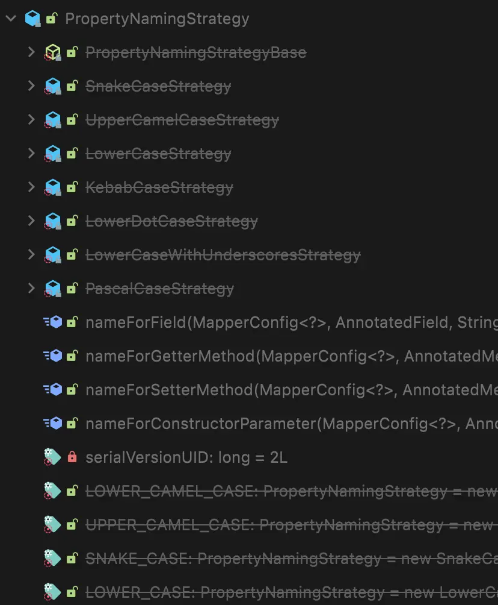

Sometimes, the JSON naming conventions used in an API may differ from the naming strategy within your application.

```json
{
  "Title": "Frozen",
  "Year": "2013",
  "Type": "movie",
  "Poster": "https://m.media-amazon.com/images/M/MV5BMTQ1MjQwMTE5OF5BMl5BanBnXkFtZTgwNjk3MTcyMDE@._V1_SX300.jpg",
  "imdbID": "tt2294629"
}
```

```java
private String title;
private String year;
private String imdbId;
private String type;
private String poster;
```

If the variable names do not match the JSON keys, the data will not be populated.

In such cases, you can use `@JsonProperty(value)` to map the data without changing the variable names in the project. However, if there are many fields with different naming strategies, using `@JsonProperty(value)` on each field can clutter the code with too many annotations.

This is where the `@JsonNaming` annotation comes in handy, allowing you to change the naming strategy of a class at once.

## @JsonNaming

### Before v2.12

You can elegantly solve this as follows:

```java
@Data
@JsonNaming(value = PropertyNamingStrategy.UpperCamelCaseStrategy.class)
public class Movie {

    private String title;
    private String year;

    @JsonProperty("imdbID")  // Only where needed!
    private String imdbId;
    private String type;
    private String poster;

}
```


_This method is deprecated and marked with a strikethrough._

However, this method has been deprecated since Jackson 2.12, so let's explore the newer approach.

### After v2.12

Starting from version 2.12, you should use `PropertyNamingStrategies`.

```java
@JsonNaming(value = PropertyNamingStrategies.UpperCamelCaseStrategy.class)
```

While a detailed explanation of the internal implementation may be too lengthy and off-topic, it is recommended to take a look as it is quite interestingly implemented!

:::info

In brief, the updated internal implementation involves an abstract class called `NamingBase`, which inherits the original `PropertyNamingStrategy`, and then the naming strategy inherits from `NamingBase`. `NamingBase` is used as a kind of intermediate implementation class.

:::
