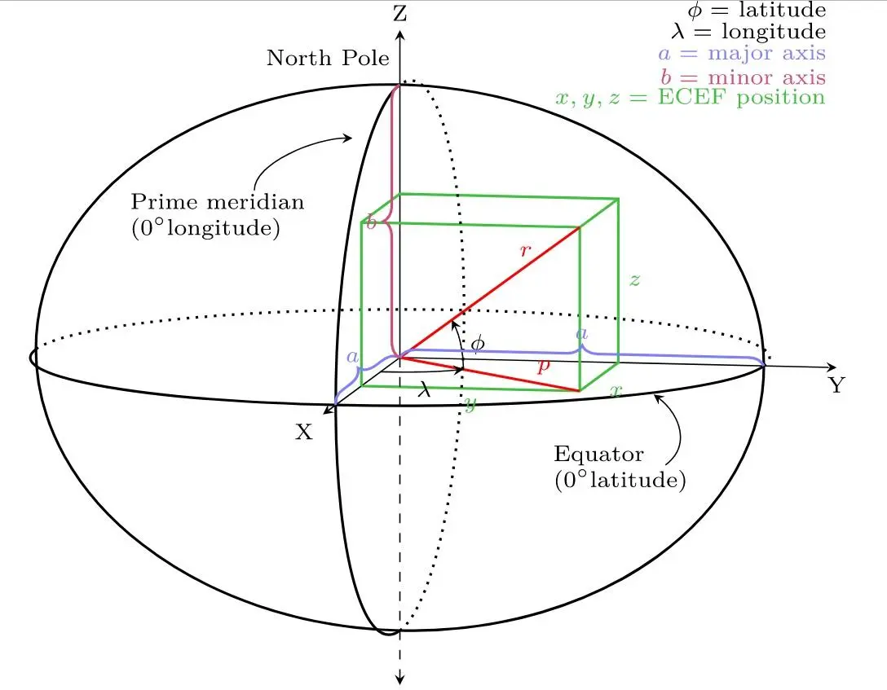

## Background


_image reference[^footnote]_

Considering that the Earth is neither flat nor a perfect sphere, but an irregular ellipsoid, there is no perfect formula for quickly and accurately calculating the distance between two points at different longitudes and latitudes.

However, by using the geotools library, you can obtain mathematically corrected approximations quite easily.

## Adding Dependencies

To use the Earth ellipsoid in geotools, you need to add the relevant library dependencies.

```groovy
repositories {
    maven { url "https://repo.osgeo.org/repository/release/" }
    maven { url "https://download.osgeo.org/webdav/geotools/" }
    mavenCentral()
}

dependencies {
    ...
    implementation 'org.geotools:gt-referencing:26.2'
    ...
}
```

## Writing Code

First, define the coordinates of Seoul and Busan as an enum class.

```kotlin
enum class City(val latitude: Double, val longitude: Double) {
    SEOUL(37.5642135, 127.0016985),
    BUSAN(35.1104, 129.0431);
}
```

Next, let's look at a simple usage example through a test code.

```kotlin
class EllipsoidTest {

    @Test
    internal fun createEllipsoid() {
        val ellipsoid = DefaultEllipsoid.WGS84  // Creates an ellipsoid that is as close to the Earth as possible using the WGS84 geodetic system used in GPS

        val isSphere = ellipsoid.isSphere  // Determines if it is a sphere or an ellipsoid
        val semiMajorAxis = ellipsoid.semiMajorAxis  // Equatorial radius, the longer radius of the ellipsoid
        val semiMinorAxis = ellipsoid.semiMinorAxis  // Polar radius, the shorter radius of the ellipsoid
        val eccentricity = ellipsoid.eccentricity  // Eccentricity, indicates how close the ellipsoid is to a sphere
        val inverseFlattening = ellipsoid.inverseFlattening  // Inverse flattening value
        val ivfDefinitive = ellipsoid.isIvfDefinitive // Indicates if the inverse flattening is definitive for this ellipsoid

        // Orthodromic distance
        val orthodromicDistance = ellipsoid.orthodromicDistance(
            City.SEOUL.longitude,
            City.SEOUL.latitude,
            City.BUSAN.longitude,
            City.BUSAN.latitude
        )

        println("isSphere = $isSphere")
        println("semiMajorAxis = $semiMajorAxis")
        println("semiMinorAxis = $semiMinorAxis")
        println("eccentricity = $eccentricity")
        println("inverseFlattening = $inverseFlattening")
        println("ivfDefinitive = $ivfDefinitive")
        println("orthodromicDistance = $orthodromicDistance")
    }
}
```

```text
isSphere = false
semiMajorAxis = 6378137.0
semiMinorAxis = 6356752.314245179
eccentricity = 0.08181919084262128
inverseFlattening = 298.257223563
ivfDefinitive = true
orthodromicDistance = 328199.9794919944
```

You can create an Earth ellipsoid with `DefaultEllipsoid.WGS84`. If you use `SPHERE` instead of `WGS84`, a sphere with a radius of 6371km will be created.

The distance result is in meters (m), so converting it to kilometers shows approximately 328km. If you search on Google, you may find 325km, so considering that there may be differences between the coordinates I chose and those chosen by Google, this is not a bad figure.

There are many other functions available as well. However, covering them all in this post would be too extensive, so if needed, I will cover them in another post.

:::info

The margin of error may not be satisfactory depending on business requirements, so before actual implementation, make sure to thoroughly test other methods in geotools.

:::

---

[^footnote]: [An Overview of SRID and Coordinate System](https://www.alibabacloud.com/blog/an-overview-of-srid-and-coordinate-system_597004)
