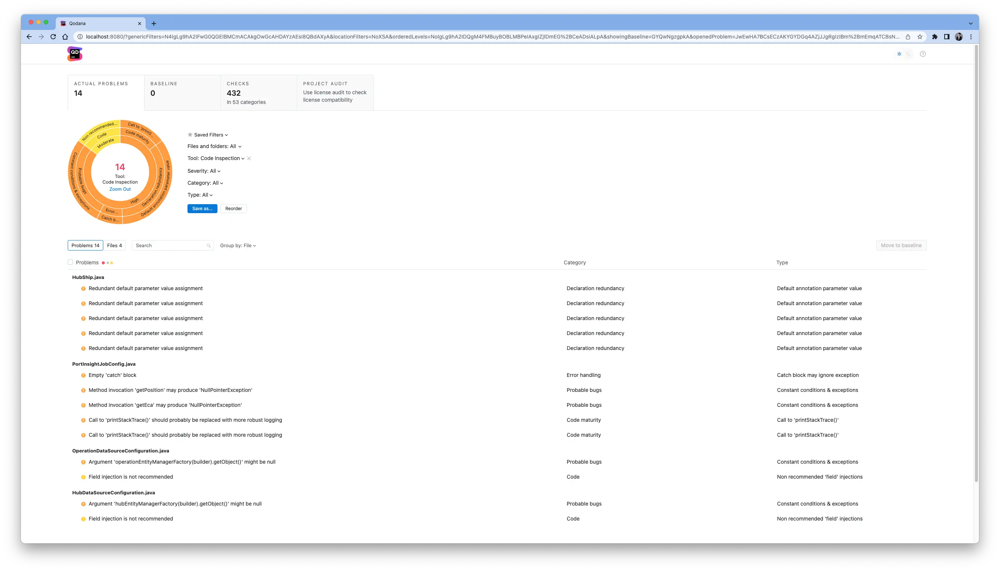

## What is Qodana?

Qodana is a code quality improvement tool provided by JetBrains. It is very easy to use, so I would like to introduce it briefly.

First, you need an environment with Docker installed.

```bash
docker run --rm -it -p 8080:8080 \
  -v <source-directory>/:/data/project/ \
  -v <output-directory>/:/data/results/ \
jetbrains/qodana-jvm --show-report
```

I am analyzing a Java application, so I used the jvm image. If you are using a different language, you can find the appropriate image on [Qodana's website](https://www.jetbrains.com/ko-kr/qodana/).

- Replace `<source-directory>` with the path to the project you want to analyze.
- Enter the path where the analysis results will be stored in `<output-directory>`. I will explain this further below.

To store the analysis results, I created a folder named qodana in the root directory.

```bash
mkdir ~/qodana
# Then replace <output-directory> with ~/qobana.
```

Now, execute the `docker run ~` command written above and wait for a while to see the results as shown below.

I used a simple Java application for testing.


Now, if you access http://localhost:8080, you can see the code analysis results.



If you have Docker installed, you can easily obtain the code analysis results of your current project.

Such analysis tools serve as a form of code review, reducing the reviewer's fatigue and allowing them to focus on more detailed reviews. Actively utilizing code quality management tools like this can lead to a very convenient development experience.
