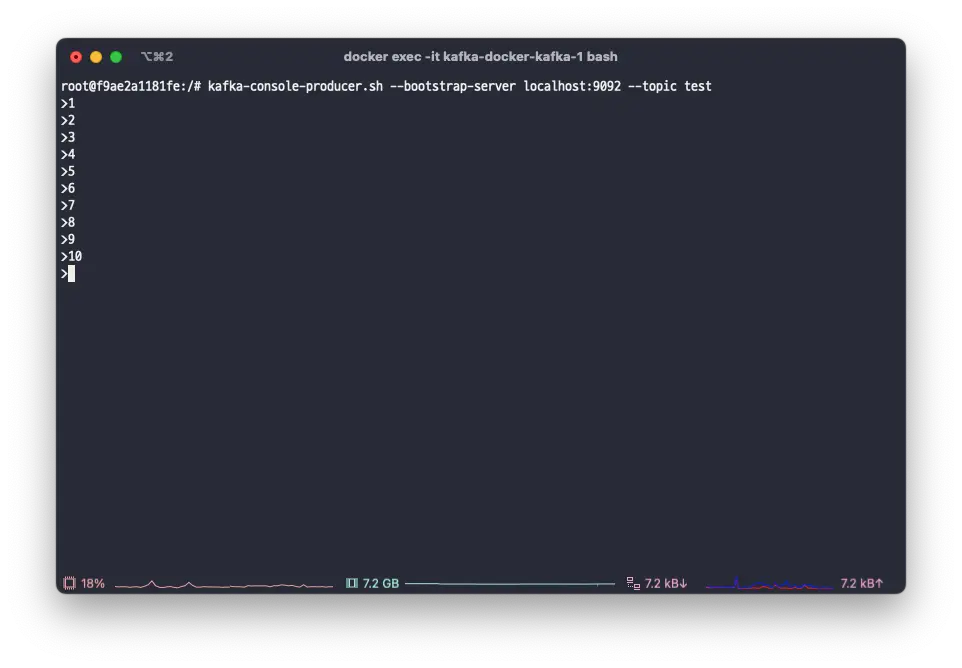
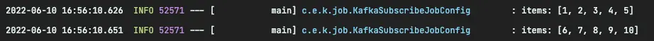

:::info

I used Docker to install Kafka before writing this post, but that content is not covered here.

:::

## What is KafkaItemReader..?

In Spring Batch, the `KafkaItemReader` is provided for processing data from Kafka topics.

Let's create a simple batch job.

## Example

First, add the necessary dependencies.

```gradle
dependencies {
    ...
    implementation 'org.springframework.boot:spring-boot-starter-batch'
    implementation 'org.springframework.kafka:spring-kafka'
    ...
}
```

Configure Kafka settings in `application.yml`.

```yaml
spring:
  kafka:
    bootstrap-servers:
      - localhost:9092
    consumer:
      group-id: batch
```

```java
@Slf4j
@Configuration
@RequiredArgsConstructor
public class KafkaSubscribeJobConfig {

    private final JobBuilderFactory jobBuilderFactory;
    private final StepBuilderFactory stepBuilderFactory;
    private final KafkaProperties kafkaProperties;

    @Bean
    Job kafkaJob() {
        return jobBuilderFactory.get("kafkaJob")
                .incrementer(new RunIdIncrementer())
                .start(step1())
                .build();
    }

    @Bean
    Step step1() {
        return stepBuilderFactory.get("step1")
                .<String, String>chunk(5)
                .reader(kafkaItemReader())
                .writer(items -> log.info("items: {}", items))
                .build();
    }

    @Bean
    KafkaItemReader<String, String> kafkaItemReader() {
        Properties properties = new Properties();
        properties.putAll(kafkaProperties.buildConsumerProperties());

        return new KafkaItemReaderBuilder<String, String>()
                .name("kafkaItemReader")
                .topic("test") // 1.
                .partitions(0) // 2.
                .partitionOffsets(new HashMap<>()) // 3.
                .consumerProperties(properties) // 4.
                .build();
    }
}
```

1. Specify the topic from which to read the data.
2. Specify the partition of the topic; multiple partitions can be specified.
3. If no **offset is specified in KafkaItemReader**, it reads from offset 0. Providing an empty map reads from the last offset.
4. Set the essential properties for execution.

:::tip

`KafkaProperties` provides various public interfaces to conveniently use Kafka in Spring.

:::

## Try it out

Now, when you run the batch job, `consumer groups` are automatically created based on the information in `application.yml`, and the job starts subscribing to the topic.

Let's use the `kafka console producer` to add data from 1 to 10 to the `test` topic.

```bash
kafka-console-producer.sh --bootstrap-server localhost:9092 --topic test
```



You can see that the batch job is successfully subscribing to the topic.



Since we set the `chunkSize` to 5, the data is processed in batches of 5.

So far, we have looked at the basic usage of `KafkaItemReader` in Spring Batch. Next, let's see how to write test code.