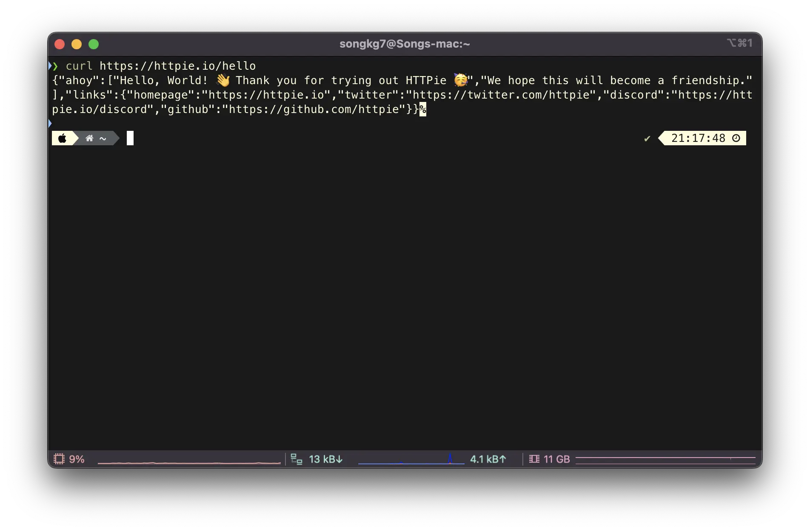

## Overview

> CLI tool that can replace the curl command

If you are a developer who frequently uses Linux, you probably use the `curl` command often. It is an essential command for sending external API requests from a server, but it has the disadvantage of poor readability in the output. HTTPie is an interesting tool that can alleviate this drawback, so let's introduce it.

## Install

For Mac users, you can easily install it using brew.

```bash
brew install httpie
```

For CentOS, you can install it using yum.

```bash
yum install epel-release
yum install httpie
```

## Usage

First, here is how you would send a GET request using `curl`.

```bash
curl https://httpie.io/hello
```



Now, let's compare it with `HTTPie`.

```bash
https httpie.io/hello
```


The readability is much better in every aspect of the command. The response and header values are included by default, so you can get various information at a glance without using separate commands.

Note that `https` and `http` are distinguished in the command.

```bash
http localhost:8080
```

You can send a POST request as described on the official website.

```bash
http -a USERNAME POST https://api.github.com/repos/httpie/httpie/issues/83/comments body='HTTPie is awesome! :heart:'
```

Various other features are explained on [GitHub](https://github.com/httpie/httpie), so if you make good use of them, you can greatly improve productivity.

## Reference

- [httpie](https://github.com/httpie/httpie)
