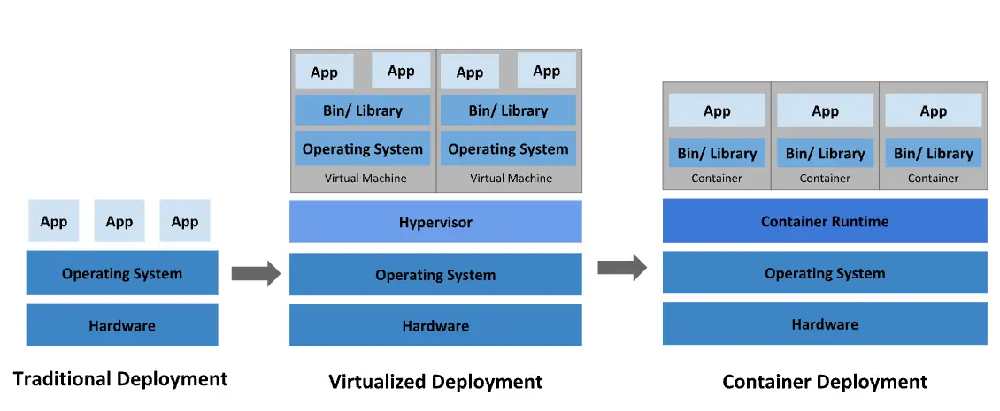

:::info

This article is written for internal information sharing and is explained based on a Java development environment.

:::

## What is Docker?

:::info

A containerization technology that allows you to create and use Linux containers, and also the name of the largest company supporting this technology as well as the name of the open-source project.

:::


_The image everyone has seen at least once when searching for Docker_

Introduced in 2013, Docker has transformed the infrastructure world into a container-centric one. Many applications are now deployed using containers, with Dockerfiles created to build images and deploy containers, becoming a common development process. In the 2019 DockerCon presentation, it was reported that there were a staggering 105.2 billion container image pulls.

Using Docker allows you to handle containers like very lightweight modular virtual machines. Additionally, containers can be built, deployed, copied, and moved from one environment to another flexibly, supporting the optimization of applications for the cloud.

## Benefits of Docker Containers

### Consistent Behavior Everywhere

As long as the container runtime is installed, Docker containers guarantee the same behavior anywhere. For example, team member A using Windows OS and team member B using MacOS are working on different OSs, but by sharing the image through a Dockerfile, they can see the same results regardless of the OS. The same goes for deployment. If the container has been verified to work correctly, it will operate normally without additional configuration wherever it is run.

### Modularity

Docker's containerization approach focuses on the ability to decompose, update, or recover parts of an application without needing to break down the entire application. Users can share processes among multiple applications in a microservices-based approach, similar to how service-oriented architecture (SOA) operates.

### Layering and Image Version Control

Each Docker image file consists of a series of layers, which are combined into a single image.

Docker reuses these layers when building new containers, making the build process much faster. Intermediate changes are shared between images, improving speed, scalability, and efficiency.

### Rapid Deployment

Docker-based containers can reduce deployment time to mere seconds. Since there is no need to boot the OS to add or move containers, deployment time is significantly reduced. Moreover, the fast deployment speed allows for cost-effective and easy creation and deletion of data generated by containers, without users needing to worry about whether it was done correctly.

In short, **Docker technology emphasizes efficiency and offers a more granular and controllable microservices-based approach**.

### Rollback

When deploying with Docker, images are used with tags. For example, if you deploy using version 1.2 of an image, and version 1.1 of the image is still in the repository, you can simply run the command without needing to prepare the jar file again.

```bash
docker run --name app image:1.2
docker stop app

## Run version 1.1
docker run --name app image:1.1
```

## Comparing Before and After Using Docker

Using Docker containers allows for much faster and more flexible deployment compared to traditional methods.

### Deployment Without Docker Containers

1. Package the `jar` file to be deployed on the local machine.
2. Transfer the `jar` file to the production server using file transfer protocols like `scp`.
3. Write a service file using `systemctl` for status management.
4. Run the application with `systemctl start app`.

If multiple apps are running on a single server, the complexity increases significantly in finding stopped apps. The process is similarly cumbersome when running multiple apps on multiple servers, requiring commands to be executed on each server, making it a tiring process.

### Deployment With Docker Containers

1. Use a `Dockerfile` to create an image of the application. → Build ⚒️
2. Push the image to a repository like Dockerhub or Gitlab registry. → Shipping🚢
3. Run the application on the production server with `docker run image`.

You don't need to waste time on complex path settings and file transfer processes. Docker works in any environment, ensuring it runs anywhere and uses resources efficiently.

Docker is designed to manage single containers effectively. However, as you start using hundreds of containers and containerized apps, management and orchestration can become very challenging. To provide services like networking, security, and telemetry across all containers, you need to step back and group them. This is where Kubernetes[^footnote] comes into play.

## When Should You Use It?

Developers can find Docker extremely useful in almost any situation. In fact, Docker often proves superior to traditional methods in development, deployment, and operations, so Docker containers should always be a top consideration.

1. When you need a development database like PostgreSQL on your local machine.
2. When you want to test or quickly adopt new technologies.
3. When you have software that is difficult to install or uninstall directly on your local machine (e.g., reinstalling Java on Windows can be a nightmare).
4. When you want to run the latest deployment version from another team, like the front-end team, on your local machine.
5. When you need to switch your production server from NCP to AWS.

## Example

A simple API server:

```bash
docker run --name rest-server -p 80:8080 songkg7/rest-server
```

```bash
# Using curl
curl http://localhost/ping

# Using httpie
http localhost/ping
```

Since port 80 is mapped to the container's port 8080, you can see that communication with the container works well.

:::tip[**Commonly Used Docker Run Options**]

`--name`
: Assign a name to the container

`-p`
: Publish a container's port(s) to the host

`--rm`
: Automatically remove the container when it exits

`-i`
: Interactive, keep STDIN open even if not attached

`-t`
: Allocate a pseudo-TTY, creating an environment similar to a terminal

`-v`
: Bind mount a volume

:::

## Conclusion

Using Docker containers allows for convenient operations while solving issues that arise with traditional deployment methods. Next, we'll look into the `Dockerfile`, which creates an image of your application.

## Reference

- [Redhat - What is Docker?](https://www.redhat.com/ko/topics/containers/what-is-docker)

---

[^footnote]: [Kubernetes](https://haril.dev/en/blog/2022/07/22/kubernetes-start)
