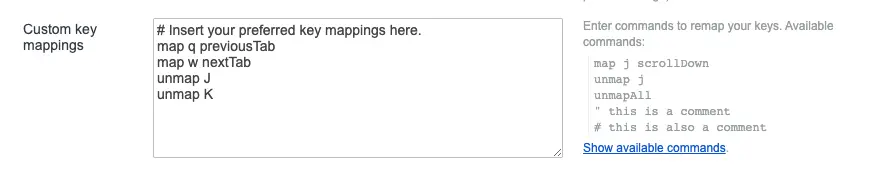

## Overview

Recently, as I started using Vim, I've been aligning all my environments with Vim. Among them, I noticed that there are some differences in the shortcuts between Vimari, the Vim extension for Safari, and Vimium, the extension for Chrome. To unify them, I decided to remap specific keys. In this guide, I will introduce how to remap shortcuts in Vimium.

## Vimium Options Window

Click the button in the Chrome extension to open the options.

By modifying this section, you can change the shortcuts. The basic mapping method is the same as in Vim. Personally, I found it more convenient to change the tab navigation shortcuts from q, w in Vimari to J, K in Vimium.

If you're unsure which key to map to a specific action, you can click on "show available commands" next to it for a helpful explanation.

From here, you can find the desired action and map it to a specific key.