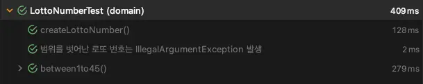

:::info

예제 코드는 [GitHub](https://github.com/songkg7/java-practice/tree/main/fixture-monkey-demo)에서 보실 수 있습니다.

:::

:::info

이 글은 오픈소스를 개인적으로 살펴보며 작성한 글이므로 잘못된 부분이 있을 수 있습니다. 얼마든지 지적해주시면 감사하겠습니다.

:::

:::warning

FixtureMonkey 가 0.4.x 로 release 되면서 이 글에서 설명한 부분 중 일부 부분이 개선되거나 변경되었습니다.

:::

## Overview

Naver 에서 2021 년에 공개한 오픈소스이며, 테스트를 위한 객체 생성을 편리하게 할 수 있도록 도와준다.

아마 테스트 코드를 작성하는 것에 익숙한 분들은 테스트 코드 작성의 많은 시간이 테스트를 위한 데이터를 생성하는 것이라는 것에 공감하실 것이라고 생각한다. 그래서 테스트 객체를 생성하는 시간을 줄이고자 Factory 를 구현하여 사용하곤 했는데, Fixture monkey 를 사용하면 훨씬 더 편리하게 테스트 객체를 생성할 수 있다.

## 구현 예제

도메인 구현 방법에 따른 객체 생성 예제를 위해 `ArbitraryGenerator` 를 위주로 설명한다. `ArbitraryGenerator` 는 객체를 생성하는 역할을 갖고 있으며 조건을 따라 객체를 생성해준다.

메인이 되는 도메인으로는 이해하기 쉬운 개념인 로또를 사용해서 만들어보자. 실제 로또 생성기를 구현하는 것은 아니므로 데이터 관점에서 바라봐주시길 바란다.

### 기본 domain

`LottoNumber` 를 먼저 구현해보자.

```java
@Setter
@NoArgsConstructor
public class LottoNumber {

    private int number;

    public LottoNumber(int number) {
        this.number = number;
    }
}
```

Fixture monkey 를 사용한 테스트는 아래처럼 작성할 수 있다.

```java
class LottoNumberTest {

    @Test
    void createLottoNumber() {
        FixtureMonkey fixtureMonkey = FixtureMonkey.create();
        LottoNumber lottoNumber = fixtureMonkey.giveMeOne(LottoNumber.class);

        System.out.println("lottoNumber: " + lottoNumber);

        assertThat(lottoNumber).isNotNull();
    }

}
```

```console
lottoNumber: LottoNumber(number=-1640)
```

랜덤한 숫자로 `LottoNumber` 가 하나 생성되었다. 객체 생성 전략은 `ArbitraryGenerator` 에 의해 결정되는데, 기본값은 `BeanArbitraryGenerator` 로 설정되어 있으며 간단한 동작 설명은 아래와 같다.

- JavaBeans 스펙에 따라 객체를 생성합니다.
- `NoArgsConstructor` 와 `Setter` 가 필요합니다.

이를 보면 알 수 있듯이 `Setter` 가 필요하다. 하지만 실무에서나 토이 프로젝트에서나 `Setter` 는 객체의 불변성을 훼손하기 때문에 특별한 이유가 있는 경우를 제외하고 이상 잘 사용하지 않는다. DTO 같은 Data class 라면 사용할 수 있겠지만, Kotlin 의 경우 모든 클래스가 기본적으로 불변이며 java 의 경우도 16 버전부터 공식기능이 된 Record 를 사용하여 DTO 를 생성한다면 불변 클래스가 된다.

따라서, `BeanArbitraryGenerator` 는 대부분의 상황에서 기본 전략으로 쓰기 부적합하다.

## 객체 생성 전략 ArbitraryGenerator

### ConstructorPropertiesArbitraryGenerator

`Setter` 를 제거하고 사용하려면 `ConstructorPropertiesArbitraryGenerator` 를 사용해야하니 코드를 약간 수정해보자.

```java
public class LottoNumber {

    private final int number;

    @ConstructorProperties({"number"}) // 해당 generator 의 사용 조건
    public LottoNumber(int number) {
        this.number = number;
    }

}
```

```java
class LottoNumberTest {

    @Test
    void createLottoNumber() {
        FixtureMonkey fixtureMonkey = FixtureMonkey.builder()
                .defaultGenerator(ConstructorPropertiesArbitraryGenerator.INSTANCE)
                .build();
        LottoNumber lottoNumber = fixtureMonkey.giveMeOne(LottoNumber.class);

        System.out.println("lottoNumber: " + lottoNumber);

        assertThat(lottoNumber).isNotNull();
    }

}
```

`LottoNumber` 에서 `Setter` 를 제거하고 `FixtureMonkey.builder()` 를 사용해서 기본 동작하는 Generator 를 바꿔주면 `Setter` 가 없어도 객체 생성을 할 수 있다.
`@ConstructorProperties` 가 필요하지만 이에 대한 내용은 조금 뒤에 다룬다.

### 불변 객체엔 BuilderArbitraryGenerator

이번에는 공식 문서에서 불변객체 생성이 가능하다고 알려주고 있는 `BuilderArbitraryGenerator` 를 한 번 살펴보자.

```java
@Builder
public class LottoNumber {

    private int number;

}
```

```java
...
 FixtureMonkey fixtureMonkey = FixtureMonkey.builder()
   .defaultGenerator(BuilderArbitraryGenerator.INSTANCE)
   .build();
...
```

테스트를 실행해보니 잘 생성해주는 것 같다. `@Builder` 를 응용할 수 있는 또 다른 예제를 살펴보자.

```java
public class LottoNumber {

    private final int number;

    private LottoNumber(int number) {
        this.number = number;
    }

    public static LottoNumber of(int number) {
        return new LottoNumber(number);
    }

}
```

이 코드는 Static factory method(이하 SFM) 를 사용한 형태이다(자세한건 Effective Java 1장을 참조). SFM 를 사용하면 생성자에 이름을 붙여서 사용할 수 있는데, 생성자 대신 이름을 붙인 static method 의 사용을 강제하기 위해 생성자에 `private` 를 붙인 형태로 많이 사용한다.

하지만 역시 `package-private` 뿐만 아니라 기본 `NoArgsConstructor` 도 없기 때문에 일반적인 방법으론 Fixture monkey 를 이용할 수 없다.

SFM 을 사용하면서 Fixture monkey 를 사용하려면 어쩔 수 없이 생성자의 접근 제한 레벨을 조정하거나, 아래처럼 `@Builder` 의 접근 제어를 `private` 으로 설정한 후 `BuilderArbitraryGenerator` 를 사용해야 한다.

```java
public class LottoNumber {

    private final int number;

    @Builder(access = AccessLevel.PRIVATE)
    private LottoNumber(int number) {
        this.number = number;
    }

    public static LottoNumber of(int number) {
        return new LottoNumber(number);
    }

}
```

이러나 저러나 production 코드의 수정이 가해지는 것은 피할 수 없지만 그나마 `@Builder` 를 통한 방법은 허용할 수 있는 수준이 아닌가 생각한다. 생성자 자체의 접근 제어를 `package-private` 으로 조절하는 것보다 `@Builder` 를 `private` 으로 사용하는 편이 **캡슐화를 더욱 엄격하게 유지할 수 있기 때문**이다.

### FieldReflectionArbitraryGenerator

Reflection 을 사용하여 field 에 값을 주입하는 방식의 객체 생성 전략이다. `final`, `transient` 의 경우 생성할 수 없고, `package-private` 이상의 `NoArgsConstructor` 가 필요하다.

```java
public class LottoNumber {

    private int number;

    LottoNumber() {
    }

// 이하 생략
```

```java
@Test
void fieldReflection() {
    FixtureMonkey monkey = FixtureMonkey.builder()
            .defaultGenerator(FieldReflectionArbitraryGenerator.INSTANCE)
            .build();

    LottoNumber lottoNumber = monkey.giveMeBuilder(LottoNumber.class)
            .set("number", 1)
            .sample();

    assertThat(lottoNumber).isEqualTo(LottoNumber.of(1));
}
```

## Usage

마저 Lotto 의 기능을 구현해보자. `LottoNumber` 는 1~45 범위에서만 생성되어야 한다. 하지만 현재 테스트에서는 랜덤한 숫자로 생성되어 -1640 같은 명백하게 이상한 숫자도 생성되고 있다. 랜덤으로 생성하되 그 범위를 조절할 수 있어야 원하는 테스트를 실행할 수 있다.

```java
@RepeatedTest(1000) // 1000회 반복 테스트 실행, 모든 테스트마다 랜덤한 숫자가 생성되므로 테스트의 신뢰성이 더욱 견고해진다.
void between1to45() {
    LottoNumber number = fixtureMonkey.giveMeBuilder(LottoNumber.class)
      .set("number", Arbitraries.integers().between(1, 45))
      .sample();

    assertThat(number).isGreaterThanOrEqualTo(LottoNumber.of(1));
    assertThat(number).isLessThanOrEqualTo(LottoNumber.of(45));
}
```

테스트 통과를 위해 `LottoNumber` 를 수정해준다.

```java
public class LottoNumber implements Comparable<LottoNumber> {

    private final int number;

    @Builder(access = PRIVATE)
    private LottoNumber(int number) {
        this.number = number;
    }

    public static LottoNumber of(int number) {
        validateNumber(number);
        return new LottoNumber(number);
    }

    private static void validateNumber(int number) {
        if (number >= 1 && number <= 45) {
            return;
        }
        throw new IllegalArgumentException("로또 번호는 1~45 사이의 숫자만 가능합니다.");
    }

    @Override
    public int compareTo(LottoNumber o) {
        return Integer.compare(number, o.number);
    }
}
```



테스트가 전부 통과하는 것을 확인할 수 있다.

만약 `LottoNumber` 를 여러개 생성하고 싶은 경우 아래처럼 사용할 수 있다.

```java
@Test
@DisplayName("6개의 무작위 로또 번호 생성 검증")
void createRandomLottoNumbers() {
    List<LottoNumber> lottoNumbers = fixtureMonkey.giveMeBuilder(LottoNumber.class)
      .set("number", Arbitraries.integers().between(1, 45))
      .sampleList(6);

    assertThat(lottoNumbers).hasSize(6);
}
```

## 아쉬운 점

처음 사용하기 시작했을 땐 테스트 코드를 위한 지루한 데이터 생성을 더 이상 하지 않아도 될 것처럼 보였으나, 실제 프로젝트에서 사용해보니 아쉬운 점이 몇 가지 있었다.

추후 개선되길 바라며 몇가지 소개해본다.

### Reflection 을 사용함에도 기본 생성자를 요구

`FieldReflectionArbitraryGenerator` 는 위에서 설명한 것처럼 `package-private` `NoArgsConstructor` 가 필요하다. 또한 `final`, `transient` 는 생성할 수 없어서 여전히 production 코드를 수정해야하는 문제가 있을 수 있다.

:::info

Fixture monkey 공식 문서에는 `package-public` 이라고 되어있지만, 일반적으로 Java 에서 `default` 접근 제어자를 뜻하는 `package-private` 으로 작성합니다.

:::

사실 Java 의 `Reflection` 은 `final` field 도 수정할 수 있고 `private` 이여도 데이터를 읽어올 수 있으므로 field 나 constructor 에 `final` 이 붙어있는 것만으로는 Reflection 을 통한 객체 생성을 막을 수 없다.

`FieldReflectionArbitraryGenerator` 의 `generateObject()` 에서 `ReflectionUtils.newInstance(clazz)` 를 호출하여 객체를 생성해오기 때문에 내부적으로 기본 생성자가 호출된다.

```java
...
    Combinators.BuilderCombinator builderCombinator = Combinators.withBuilder(
      () -> ReflectionUtils.newInstance(clazz));
...
```


_위 method 에 의해 class 의 `NoArgsConstructor` 가 호출된다._

그렇다면 `ReflectionUtils` 에 생성하고자 하는 class 의 생성자 정보를 전달하면 field 에 기본 생성자가 없더라도 생성이 가능할 것이다. 다음 코드는 Reflection 을 통해 private 생성자를 찾아낸 후, 해당 생성자로 객체를 생성하는 테스트이다.

```java
@Test
void private_final_reflection() {
    Constructor<?>[] declaredConstructors = LottoNumber.class.getDeclaredConstructors();
    for (Constructor<?> declaredConstructor : declaredConstructors) {
        System.out.println("declaredConstructor: " + declaredConstructor);
    }

    // new instance by declared constructor
    LottoNumber lottoNumber = (LottoNumber) ReflectionUtils.newInstance(declaredConstructors[0], 1);
    System.out.println("lottoNumber: " + lottoNumber);

    // new instance by method
    Method method = ReflectionUtils.findMethod(LottoNumber.class, "of", int.class).get();
    LottoNumber lottoNumber2 = (LottoNumber) ReflectionUtils.invokeMethod(method, null, 1);
    System.out.println("lottoNumber2: " + lottoNumber2);
}
```

```console
declaredConstructor: private domain.LottoNumber(int)
lottoNumber: LottoNumber(number=1)
lottoNumber2: LottoNumber(number=1)

Process finished with exit code 0
```

물론 이론상 가능하다는 것이고 실제로 기능을 반영하려면 아키텍처에 관련된 많은 고민이 필요할 것이다.

### Record 를 사용할 수 없다

Java 16 부터 정식으로 추가된 `record` 는 DTO 같은 데이터를 담는 객체를 설계할 때 아주 유용한데, `record` 는 기본적으로 불변 객체로 생성되며 생성자는 `AllArgsConstructor` 하나만 존재한다. 따라서 대부분의 객체 생성에 `NoArgsConstructor` 가 필요한 Fixture monkey 에서는 `record` 타입을 지원하지 않는다.

### 일부 Generator 는 production 코드의 수정이 필요할 수 있다

**Test 를 위한 설계가 아닌, Test 가 쉬운 설계를 해야 한다**는 말은 요즘들어 자주 들을 수 있게 되었다. 이 말이 진리인지 아닌지를 떠나서 Test 를 쓰기 위해서 구조적으로나 기능적으로 불필요했던 코드를 작성해야하는 것은 어딘지 꺼림칙한 느낌을 준다. 하물며 생성자의 접근 범위를 상향해야하는 것은 더욱 그렇다. 불필요한 `NoArgsConstructor` 를 추가하여 객체의 필드를 초기화하지 않고 생성할 수 있게 하는 방법을 여는 것, 생성자가 개방됨으로써 Static factory method 의 존재 의의가 희석되는 것 모두 개발자가 의도하지 않았던 상황을 만들어낼 수 있다.

단지 `ConstructorPropertiesArbitraryGenerator` 를 사용하기 위해서, `@ConstructorProperties` 라는 자주 사용되지 않는 어노테이션을 사용해야 되는 점도 마치 Swagger 를 사용하는 듯한 인상을 준다. Swagger 가 annotaion 으로 문서화를 하도록 강요하면서 production 코드를 얼마나 지저분하게 만드는지 떠올려보면 아무런 거리낌없이 받아들이기 힘든 부분이 분명 존재한다.

물론 **"은총알은 없다"** 라는 말을 떠올려보면 어느 정도 트레이드오프(trade-off)가 필요한 영역이라고 생각되며, 상황에 따라 적절한 생성 전략을 선택하면 되겠다. 향후 업데이트로 다른 객체 생성 전략이 추가될 것 같기도 하니 기대할만한 오픈소스임에는 틀림없다고 생각한다.

## Conclusion

평소 테스트를 작성하면서 테스트 객체 생성을 위한 Factory 를 직접 구현하여 테스트를 적곤 했었는데, 그 귀찮음을 한 방에 날려줄 있다는 점이 매력적이다. 아직은 아쉬운 부분이 몇 군데 보이지만 얼마든지 개선될 수 있는 점이고 기여할만한 부분이 있다면 얼마든지 PR 을 생성해보려고 한다. 이후 발전 방향이 기대된다.

:::info

이 글에선 [Bean validation 을 사용한 유효성 검사](https://naver.github.io/fixture-monkey/kr/docs/v0.3.x/features/supportedvalidationannotation/) 를 미처 설명하지 못했지만 주목할만한 기능이니 꼭 살펴보시길 바란다.

:::

## Reference

- [Github ofiicial](https://github.com/naver/fixture-monkey)
- [Fixture Monkey](https://naver.github.io/fixture-monkey/kr/)
