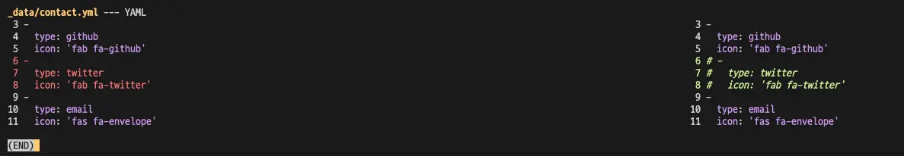

## Overview

Difftastic is a tool designed to make using `git diff` more convenient. It can be very useful for those who frequently use the `git diff` command in the terminal.

## Usage

```bash
brew install difftastic
```

Global setting:

```bash
git config --global diff.external difft
```

Now, when you use the `git diff` command, you can see much more intuitive diff results compared to before.



## Reference

- [Difftastic](https://difftastic.wilfred.me.uk/introduction.html)