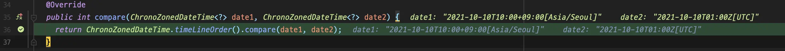
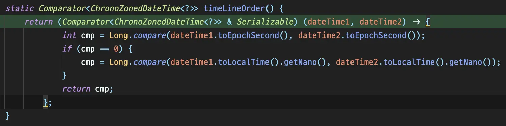
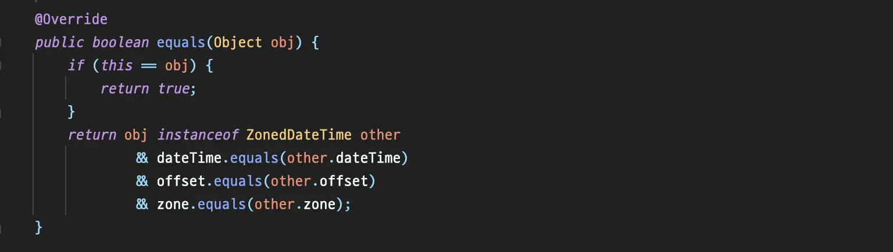

## Overview

In Java, there are several objects that can represent time. In this article, we will discuss how time comparison is done with `ZonedDateTime`, which is one of the objects that contains the most information.

## Different but the same time?

Let's write a simple test code to find any peculiarities.

```java
ZonedDateTime seoulZonedTime = ZonedDateTime.parse("2021-10-10T10:00:00+09:00[Asia/Seoul]");
ZonedDateTime utcTime = ZonedDateTime.parse("2021-10-10T01:00:00Z[UTC]");

assertThat(seoulZonedTime.equals(utcTime)).isFalse();
assertThat(seoulZonedTime).isEqualTo(utcTime);
```

This code passes the test. Although `equals` returns `false`, `isEqualTo` passes. Why is that?

In reality, the two `ZonedDateTime` objects in the above code represent the same time. However, since `ZonedDateTime` internally contains `LocalDateTime`, `ZoneOffset`, and `ZoneId`, when compared using `equals`, it checks if the objects have the same values rather than an absolute time.

Therefore, `equals` returns `false`.


_ZonedDateTime#equals_

However, it seems that `isEqualTo` works differently in terms of how it operates in time objects.

In fact, when comparing `ZonedDateTime`, `isEqualTo` calls `ChronoZonedDateTimeByInstantComparator#compare` instead of invoking `ZonedDateTime`'s `equals`.




_Comparator#compare is called._

By looking at the internal implementation, it can be seen that the comparison is done by converting to seconds using `toEpochSecond()`. This means that it compares absolute time through `compare` rather than comparing objects through `equals`.

Based on this, the comparison of `ZonedDateTime` can be summarized as follows:

`equals`
: Compares objects

`isEqualTo`
: Compares absolute time

Therefore, when comparing objects that include `ZonedDateTime` indirectly, `equals` is called, so if you want to compare based on the absolute value of `ZonedDateTime`, you need to override the `equals` method inside the object.

```java
public record Event(
        String name,
        ZonedDateTime eventDateTime
) {
    @Override
    public boolean equals(Object o) {
        if (this == o) {
            return true;
        }
        if (o == null || getClass() != o.getClass()) {
            return false;
        }
        Event event = (Event) o;
        return Objects.equals(name, event.name)
                && Objects.equals(eventDateTime.toEpochSecond(), event.eventDateTime.toEpochSecond());
    }

    @Override
    public int hashCode() {
        return Objects.hash(name, eventDateTime.toEpochSecond());
    }
}
```

```java
@Test
void equals() {
    ZonedDateTime time1 = ZonedDateTime.parse("2021-10-10T10:00:00+09:00[Asia/Seoul]");
    ZonedDateTime time2 = ZonedDateTime.parse("2021-10-10T01:00:00Z[UTC]");

    Event event1 = new Event("event", time1);
    Event event2 = new Event("event", time2);

    assertThat(event1).isEqualTo(event2); // pass
}
```

## Conclusion

- If you want to compare absolute time when `equals` is called between `ZonedDateTime`, you need to convert it, such as using `toEpochSecond()`.
- When directly comparing `ZonedDateTime` with `isEqualTo` in test code or similar scenarios, `equals` is not called, and internal conversion is performed, so no separate conversion is needed.
- If there is a `ZonedDateTime` inside an object, you may need to override the object's `equals` method as needed.