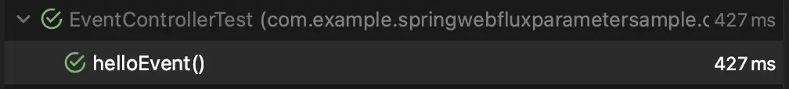

## Overview

When using time formats like `LocalDateTime` as URL parameters, if they do not match the default format, you may encounter an error message like the following:

```console
Exception: Failed to convert value of type 'java.lang.String' to required type 'java.time.LocalDateTime';
```

What settings do you need to make to allow conversion for specific formats? This article explores the conversion methods.

## Contents

Let's create a simple sample example.

```java
public record Event(
        String name,
        LocalDateTime time
) {
}
```

This is a simple object that contains the name and occurrence time of an event, created using `record`.

```java
@RestController
public class EventController {

    @GetMapping("/event")
    public Mono<Event> helloEvent(Event event) {
        return Mono.just(event);
    }

}
```

The handler is created using the traditional Controller model.

:::tip

In Spring WebFlux, you can manage requests using Router functions, but this article focuses on using `@RestController` as it is not about WebFlux.

:::

Let's write a test code.

```java
@WebFluxTest
class EventControllerTest {

    @Autowired
    private WebTestClient webTestClient;

    @Test
    void helloEvent() {
        webTestClient.get().uri("/event?name=Spring&time=2021-08-01T12:00:00")
                .exchange()
                .expectStatus().isOk()
                .expectBody()
                .jsonPath("$.name").isEqualTo("Spring")
                .jsonPath("$.time").isEqualTo("2021-08-01T12:00:00");
    }

}
```


When running the test code, it simulates the following request.

```bash
$ http localhost:8080/event Accept=application/stream+json name==Spring time==2021-08-01T12:00
HTTP/1.1 200 OK
Content-Length: 44
Content-Type: application/stream+json

{
    "name": "Spring",
    "time": "2021-08-01T12:00:00"
}
```

If the request is made in the default format, a successful response is received. But what if the request format is changed?


```bash
$ http localhost:8080/event Accept=application/stream+json name==Spring time==2021-08-01T12:00:00Z
HTTP/1.1 500 Internal Server Error
Content-Length: 131
Content-Type: application/stream+json

{
    "error": "Internal Server Error",
    "path": "/event",
    "requestId": "ecc1792e-3",
    "status": 500,
    "timestamp": "2022-11-28T10:04:52.784+00:00"
}
```

As seen above, additional settings are required to receive responses in specific formats.

### 1. `@DateTimeFormat`

The simplest solution is to add an annotation to the field you want to convert. By defining the format you want to convert to, you can request in the desired format.

```java
public record Event(
        String name,

        @DateTimeFormat(pattern = "yyyy-MM-dd'T'HH:mm:ss'Z'")
        LocalDateTime time
) {
}
 ```

Running the test again will confirm that it passes successfully.

:::info

Changing the request format does not change the response format. Response format changes can be set using annotations like `@JsonFormat`, but this is not covered in this article.

:::

While this is a simple solution, it may not always be the best. If there are many fields that need conversion, manually adding annotations can be quite cumbersome and may lead to bugs if an annotation is accidentally omitted. Using test libraries like `ArchUnit`[^fn_nth_2] to check for this is possible, but it increases the effort required to understand the code.

### 2. `WebFluxConfigurer`

By implementing `WebFluxConfigurer` and registering a formatter, you can avoid the need to add annotations to each `LocalDateTime` field individually.

Remove the `@DateTimeFormat` from `Event` and configure the settings as follows.

```java
@Configuration
public class WebFluxConfig implements WebFluxConfigurer {

    @Override
    public void addFormatters(FormatterRegistry registry) {
        DateTimeFormatterRegistrar registrar = new DateTimeFormatterRegistrar();
        registrar.setUseIsoFormat(true);
        registrar.registerFormatters(registry);
    }
}
```

:::danger

Using `@EnableWebFlux` can override the mapper, causing the application to not behave as intended.[^footnote]

:::

Running the test again will show that it passes without any annotations.


### Applying Different Formats to Specific Fields

This is simple. Since the method of directly adding `@DateTimeFormat` to the field takes precedence, you can add `@DateTimeFormat` to the desired field.

```java
public record Event(
        String name,

        LocalDateTime time,

        @DateTimeFormat(pattern = "yyyy-MM-dd'T'HH")
        LocalDateTime anotherTime
) {
}
```

```java
    @Test
    void helloEvent() {
        webTestClient.get().uri("/event?name=Spring&time=2021-08-01T12:00:00Z&anotherTime=2021-08-01T12")
                .exchange()
                .expectStatus().isOk()
                .expectBody()
                .jsonPath("$.name").isEqualTo("Spring")
                .jsonPath("$.time").isEqualTo("2021-08-01T12:00:00")
                .jsonPath("$.anotherTime").isEqualTo("2021-08-01T12:00:00");
    }
```



:::tip

When the URI becomes long, using UriComponentsBuilder is a good approach.

```java
String uri = UriComponentsBuilder.fromUriString("/event")
        .queryParam("name", "Spring")
        .queryParam("time", "2021-08-01T12:00:00Z")
        .queryParam("anotherTime", "2021-08-01T12")
        .build()
        .toUriString();
```

:::

## Conclusion

Using `WebFluxConfigurer` allows for globally consistent formats. If there are multiple fields across different classes that require specific formats, using `WebFluxConfigurer` is much easier than applying `@DateTimeFormat` to each field individually. Choose the appropriate method based on the situation.

- `@DateTimeFormat`: Simple to apply. Has higher precedence than global settings, allowing for targeting specific fields to use different formats.
- `WebFluxConfigurer`: Relatively complex to apply, but advantageous in larger projects where consistent settings are needed. Helps prevent human errors like forgetting to add annotations to some fields compared to `@DateTimeFormat`.

:::info

You can find all the example code on [GitHub](https://github.com/songkg7/java-practice/blob/main/spring-webflux-parameter-sample/src/test/java/com/example/springwebfluxparametersample/controller/EventControllerTest.java).

:::

## Reference

[^footnote]: [LocalDateTime is representing in array format](https://stackoverflow.com/questions/63682619/localdatetime-is-representing-in-array-format)

[^fn_nth_2]: [ArchUnit](https://www.archunit.org)