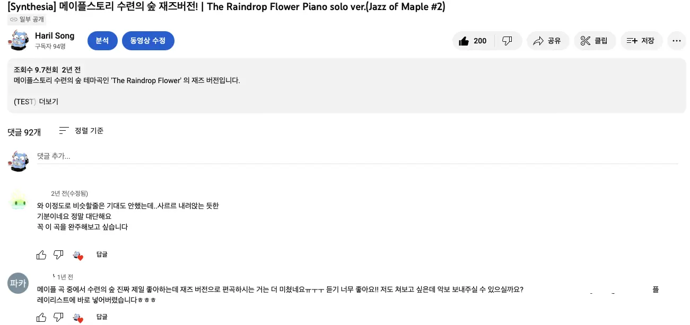
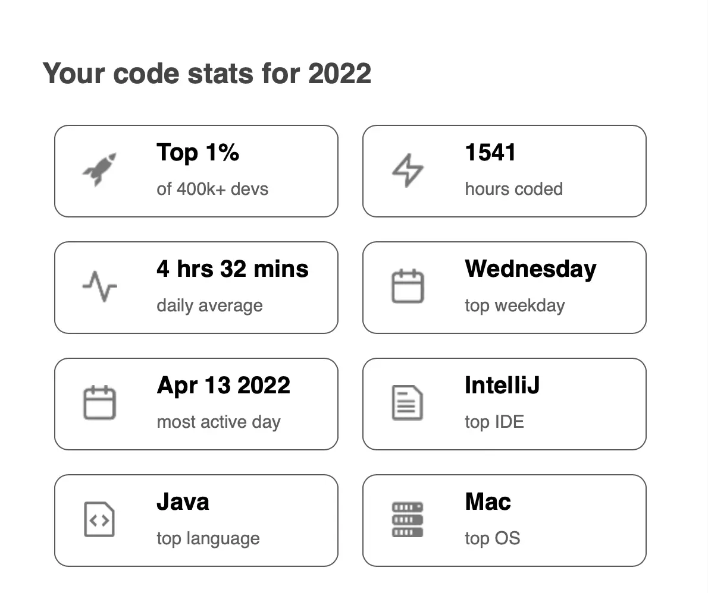

## 들어가기 전에

2022년 회고를 적으려다가 삶의 지도라는 일종의 자소서를 적어야할 필요성이 생겼습니다. 하여 지금까지의 제 경험을 간략하게 자서전처럼 적어보고자 합니다.

## ~~제로부터 시작하는~~ 다양한 인간관계

_제로부터 시작하는 학교 생활..._

군인이셨던 부모님의 직업 특성상, 이사를 굉장히 자주 다녔다. 초등학교는 7번쯤 바뀐 것 같다. 친구들과 친해지고 학교 생활에 적응될 때쯤, 전학을 가게 된다. 주변에서는 아쉽지 않았냐고들 물어보지만, 이제와서 생각해보면 별 생각이 없었던 것 같다. 오히려 집이 바뀌게 되니 새로운 분위기가 된다며 좋아했던 것 같다. 물론, 친해진 친구들이 있을 땐 헤어짐이 아쉽기도 했지만 반복된 환경의 변화로 좀 무뎌지게 되었던 것 같다.

중학교 때쯤 되어서는 초기화되는 인간관계가 별로 아쉽지도 않게 되었는데, 인간 관계란 화초와도 같아서 자주 물을 주고 신경써주지 않으면 금방 시들게 된다는걸 너무 일찍 알아버렸다.

어쩌다가 흑역사가 생겨도 '아 리셋(?)하면 그만이지~' 라고 생각하기도 했다. 그렇게 이상하게 긍정적인 나의 한 부분이 형성되었다.

지금도 새로운 사람과의 만남에 아주 적극적으로 나선다고 할 수는 없을 것 같다. 하지만 잦은 환경 변화를 이미 수없이 경험해본 덕에, 막상 예상하지 못한 상황을 마주하게 되어도 빠르게 적응하고 사람들과도 금방 친해지는 편이다. 살아오면서 아쉬움도 많았지만 정말 많은 유형의 사람들을 만나볼 수 있었고, 그들과의 만남이 나의 성장에 큰 도움이 되었다.

## 음악, 그리고 고뇌

18번째 봄, 그 당시 나는 피아노에 심취해있었다. 히사이시 조와 유키 구라모토, 류이치 사카모토 등의 일본 음악가들의 음악을 자주 들었는데 서정적인 특성의 음악이 마음을 항상 간지럽혔다. 이 기분이 좋았다. 어느날 문득, 직접 곡을 써서 연주하고 싶다는 생각이 들었다. 어쩌면 자연스러운 일이였을지도 모르겠다. 항상 피아노 앞에 앉아있었으니까. 그렇게 음악을 전공하게 되었다.

한 번 시작하면 꽤 잘한다고 인정받을 때까지 하는 편이다. 진학한 예술대학에서도 나의 그런 점을 마음에 들어한걸까. 교수님에게 작곡가 J님을 소개받았고, 그렇게 그의 어시스턴트로 일하게 되었다. 21살의 늦가을쯤이였던 것 같다.

어시스턴트 일은 음악 전공자라면 누구나 할 수 있을 법한 일들이였기 때문에 특별히 어려울 게 없었지만, 굉장히 유명하신 J님의 작업을 옆에서 지켜볼 수 있다는건 특별한 일이였다. 매번 나의 실력이 진짜 프로들에 비해 얼마나 형편없는지 뼈저리게 느낄 수 있었다. 그렇다고 단순히 열등감만을 느끼며 의욕이 사라진 것은 아니였고, 오히려 좋은 자극이 됐다.

> '어떻게 하면 저렇게 곡을 쓸 수 있을까? 평소에 어떤 생각을 해야할까? 어떤 것을 더 배워야할까? 얼마나 노력해야 하는걸까?'

이것저것 나름 시도해봤다. 곡을 잘 쓰기 위해서. 유명한 작곡가들처럼, 소설에 나오는 예술가들처럼, 마치 원래 있었던 것처럼 자연스럽게 작품을 만들어내는 이들처럼 되고 싶었다. 하지만 내게는 뭔가 결여되어 있었다. 아무리 곡을 써도 마음에 들지 않았고, 완성되지 않았다. 항상 자기복제를 반복했다. 뭔가 결여되어 있는게 틀림없었다.

_이 때는 몰랐지만 이제와서 생각해보면 이 때 부족했던건 **절박함**이였던 것 같다. 물질적으로 모자람이 없었고, 목표가 흐릿했으며, 이미 유명 엔터테인먼트와 함께 일하고 있다는 생각이 날 안일하게 만들었던 것 같다._

자신의 부족한 부분만 드러내는 것 같은 느낌이 들기 시작하니, 더 이상 곡을 쓰는게 즐겁지 않았다. 하지만 그렇게 좋아하던 창작 활동이 즐겁지 않다는 사실을 인정하기는 쉽지 않았다. 24번째의 겨울, 그렇게 현실에서 도망치듯 입대했다.

## 군악대와 프로그래밍

이 글을 읽고 계신 모두의 예상대로, 본인은 SSS급 인재였다[^fn-nth-1].

악보를 읽는 능력은 물론이요 악기를 다룰 줄 아는 전공자에, 유관 경력까지. 군악대가 원하는 완벽한 인재상이였을 것이다. 군악대에 지명되어 다른 선택지가 사라진 순간, 기뻤지만 아쉬웠다. 아버지의 직업이 군인인 영향으로, 군대 문화는 어려서부터 익숙했고 이왕 온거 가장 육체적으로 힘든 곳[^fn-nth-2]에서 최선을 다해서 시간을 보내리라 다짐했었다. 하지만 군악대에 선발되자 다른 곳에 지원할 수 없게 되었다. 당초 계획과는 달랐지만, '어디서든 열심히 하면 되지' 라는 생각으로 받아들였다.

군악대는 특성상 악기 연습이 대부분의 일과 시간을 차지하기 때문에 사수가 어느 정도 만족하는 레벨에 도달하면 나름 자유로운 분위기였다. 일병이 될 때쯤 군악대에서 처음 배우게 된 테너 색소폰으로 모든 행사곡을 외워서 연주할 수 있었고, 제식 또한 완벽[^fn-nth-3]했다. 그렇게 평화로운 일상을 손에 넣었다.

그러던 어느날 군악대 내의 행정 업무를 겸해보지 않겠냐는 제안을 받게 되었는데, 한여름 열심히 제초 작업 중이였던 나에게 에어컨 빵빵한 실내에 앉아있던 선임 행정병의 제안은 거부할 수 없는 선악과나 다름없었다.

_참았어야 했다._

교수님의 꼬드김에 대학원에 오게된 조교마냥 낚여버린 나는 악보 앞과 컴퓨터 앞에 번갈아가며 앉게 됐다. 마냥 편할 줄로만 알았던 행정 업무도 나름 애로사항이 있었는데, 반복적인 업무가 너무 많아서 개인시간이 없어지는 것이 문제였다. 머릿 속이 일하기 싫다며 비명을 지르고 있었다.

> '어떻게 해야 이 지루한 업무에서 해방되서 놀고 먹을 수 있을까?'

그렇게 자동화에 대해 고민하기 시작했다.

군대라는 제한된 환경에서 자동화를 할 수 있는 방법은 많지 않다. 그 중에 하나는 엑셀에서 Visual Basic 을 실행할 수 있다는 것[^fn-nth-4]이다. 운 좋게 과거의 엑셀 파일에서 매크로의 흔적을 발견하게 되었고, 프로그래밍에 대한 일종의 힌트를 얻을 수 있었다.

이후로 엑셀을 이리저리 만져보며 매크로의 동작 원리를 이해하기 위한 리버스 엔지니어링을 시도[^fn-nth-5]했다. 일주일쯤 지나자 간단한 프로그래밍이 가능했다. 한 달쯤 지나자 절반 정도의 업무는 매크로로 해결했다. 두 달쯤 지났을 땐, 공문서 작성을 제외한 대부분의 일을 자동화했다. 세 달쯤 되자 다른 부대에서 나에게 엑셀을 배워가고 있었다. 나는 반복적인 행정 업무에서 해방됨과 동시에, 다른 업무[^fn-nth-6]를 하고 있는 자신을 발견했다.

> '뭔가 이상한데.... 지금쯤 놀고 먹고 있어야 하지 않나...?'

**하지만, 더 이상 지루하지 않았다.** 늘 새로웠고, 도전적으로 다가왔다. 모든 업무는 새로운 자동화의 대상일 뿐이였다.

## 팬데믹으로 인한 개점 휴업. 오히려 좋아 Season 1

2019년 7월, 26번째 여름, 드디어 '매크로에 미친 놈'이라는 명예스러운(?) 타이틀을 내려놓고 사회로 돌아왔다. 군악대에서의 생활은 즐거웠기에 전역날은 너무도 아쉬웠다. 하지만 이제 사회로 나가기 위한 준비를 해야했다.

입대 전 함께 일하던 작곡가 J님의 공연에 수시로 참여하면서, 이것저것 시도해볼겸 유튜브에 여러 장르의 편곡 영상을 업로드했다. 조악한 실력임에도 불구하고 유튜브 조회수는 꽤 잘 나왔다. 나중에 정리하며 보니 댓글도 많이 달린건 100개 가까이 달리더라.

_생각보다 반응이 괜찮았다. (현재 영상은 비공개)_

 하지만 아무래도 금전적인 보상이 없는 일을 꾸준히 하기는 어려웠다. 엎친대 덮친 격으로 대 코로나 시대가 시작되면서, 대부분의 공연이 취소되고 관련 수입을 기대하기 어려워졌다. 내가 실업자나 다름없다는걸 깨닫기까지는 오랜 시간이 걸리지 않았다.

> '나는 뭘 해야할까. 앞으로 어떻게 살아가야하는걸까?'

군대가 그리워졌다. 이동의 자유는 없어도 미래에 대한 걱정이 없어서 매일이 즐거웠는데, 바깥 사회의 현실은 너무나 가혹했다. 어차피 시간도 많은데 내 자신이 했던 일에 대해서 정리해놔야겠다는 생각이 들었다.

기억을 더듬어가며 군대에서 만들었던 자동화를 다시 구현해보려다가, 곧 그만두었다. 사회에서 쓰지도 못하는거 만들어서 뭐하냐는 생각이였다. 그런 것보다 좀 더 실용적인 걸 해보고 싶었다. 프로그래밍에 대해서 검색하다보니 [생활코딩](https://opentutorials.org/course/1)에 대해 알게 되었다. 처음으로 [Web 프로그래밍](https://github.com/songkg7/Web-n)을 해보게 되었고, JS 나 Python 에도 어느 정도 익숙해질 수 있었다. 자연스럽게 군대에서 자동화에 썼던 프로그래밍 언어가 Visual Basic 이였다는 것을 알게 되었다. 서서히 지식의 범위가 확장되며 머릿속이 정리되고 있었다.

:::info

군대에서는 메모장으로 코딩을 해야 했다. 처음으로 IDE 라는걸 알게 된 순간은... 정말이지 말로 표현하기 힘들 정도의 행복이였다.

:::

음악을 처음 시작했을 때처럼 '더 잘하고 싶다'는 욕구가 다시 타올랐다. 인강이라는 인강은 닥치는대로 구매하여 수강했고, 개인 포트폴리오를 위한 정적 웹사이트를 만들었으며 지인의 사업 마케팅을 위해 [인스타그램 좋아요 및 댓글을 자동으로 써주는 프로그램](https://github.com/songkg7/instagram-auto-like)도 만들었다[^fn-nth-7].

서서히 마음이 기울고 있었다.

## 국비학원, 선생님보다 잘하는 학생이 되다

27번째 겨울, 개발 공부를 시작한지 1년 정도 되었을까. 여느때처럼 인강을 들으며 코딩을 하다가 슬슬 내 실력이 어느 정도나 되는지 검증하고 싶어졌다. 아무래도 전공자가 아니다보니 부족함이 많을 것 같은데, 객관적인 평가를 받은 후 앞으로의 공부 방향을 정하고 싶었다[^fn-nth-8]. 다시 대학교를 가는건 투자 대비 너무 비효율적이라고 생각해서 선택지에서 제외했다. 부트캠프 혹은 국비교육으로 가닥을 잡고, 저울질을 하다가 가장 빠르게 시작할 수 있는 곳이 국비학원이였기 때문에 국비학원을 선택하게 되었다.

이 문단 소제목에서 알 수 있듯이, 안타깝게도 국비학원의 강사님은 내 실력을 정확하게 판단해줄 수 있는 멘토가 아니였다. 동작 원리에 대한 설명보다 단순히 '이런 식으로 하면 동작은 하니 이렇게 해라~' 는 식의 주입식 교육이였다. 지적 갈증 해소는 커녕 답답함만 쌓여 갔다. 내가 JPA 에 대해 질문을 해도 '그건 요즘 실무에서 쓰기 힘드니 mybatis 를 더 공부하는게 좋다'라는 대답이 돌아왔다. 안타깝게도 나는 김영한님의 열렬한 신봉자로서 어떤 내용의 실무인지에 대한 설명 없이, JPA 가 실무에서 쓰기 힘들다는 막연한 설명엔 전혀 동의할 수 없었다. 강사님께는 죄송하지만 이후 코로나로 인한 원격 수업이 시작되자 별개의 모니터로 인강을 수강하며 원하는 내용의 지식을 같이 배워나갔다.

[팀 프로젝트](https://github.com/songkg7/X-mall)가 시작되었을 땐, 팀장으로서 팀원들에게 매일같이 내 지식을 공유하려고 노력했다. mybatis 의 장단점부터 JPA 란 무엇인지 등등. 독학한 지식을 바탕으로 팀원들에게 강의를 하면서도 스스로 배우는게 많았다. 얼마되지 않아 팀원들에게 '경근님이 강사님보다 설명 잘해주시는거 같아요 ㅎㅎ' 같은 피드백을 받을 수 있었다. **'혼자 가면 빨리 가지만, 같이 가면 멀리 간다'**는 어딘가에서 봤던 그럴듯한 말이 떠올라 더 적극적으로 지식을 전파하려 노력했다.

## 다시 혼자

국비 학원의 커리큘럼이 모두 끝났을 때, 내게는 아쉬움이 한가득이였다.

1. 내가 어느 정도의 지식을 가지고 있는건지 객관적인 피드백을 얻지 못해서 앞으로의 공부 방향에 대해 감을 잡을 수 없었다.
2. 내 질문에 답해줄 수 있는 지식을 가진 멘토를 찾지 못했다.
3. 원격 수업으로 인하여 폭넓은 인간관계를 형성하기 어려웠다.

대부분의 학원 동기들은 SI 업체로 취직하게 되었다. 아마 우리나라 국비교육 현실이리라. 하지만 나는 학원 수업을 들으며 SI 는 무슨 수를 써서라도 피해야겠다는 생각이 강하게 들었던터라 학원에서 추천해주는 회사는 모두 거절했다. 다른 사람들에 비해 어느 정도 잘한다는 자신감은 있었기 때문에 더 좋은 스타트업으로 가고 싶었다.

다시 독학의 나날을 보내게 되었다.

## Series C 보다 Seed 를 선택한 이유

학원을 수료하고 약 5개월 뒤, 11곳의 스타트업에 지원했고 8곳은 응답이 오지 않았으며 1곳은 최종 면접에서 탈락, 나머지 2곳에 합격했다.

참고로, 커리어의 시작을 대기업에서 하면 여러모로 유리하다는 말을 많이 들었지만, 대기업에는 지원하지 않았는데 이유는 다음과 같다.

- 이미 완성된 서비스가 아니라 최초 설계부터 운영까지의 사이클을 경험해보고 싶었다.
- 큰 서비스의 특정 부분만 담당하는 것보다 여러 범위에 전체적으로 관여할 수 있기를 바랐다.
- 물질적인 보상이 적더라도 스스로를 몰아넣을 수 있는 환경에서의 빠른 성장을 원했다.
- 나중에 스타트업 창업을 해보고 싶다는 막연한 꿈이 있었다.

나에게 합류 제안이 있었던 스타트업(Series C)도 마찬가지였다. 이 스타트업은 이미 어느정도 인지도가 있는 회사였고, 내가 합류함으로 인해 회사에 엄청난 영향을 끼칠 수 있는 가능성은 많지 않아보였다. 나의 커리어 최종 목표 후보에는 창업도 포함되어 있었기 때문에 가급적 초기 단계부터 경험해보는게 유리할 것 같다고 판단했다.

그래서 Seed 단계였던 현 회사를 선택했다.

Seed 에서 Exit 까지 경험해보는 전설적인 커리어는 기대하지 않았지만, 최소한 사람들이 알만한 스타트업 정도로는 만들어보자는 포부를 안고 첫 출근을 했다.

## 멘토없는 회사. 오히려 좋아 Season 2

기대를 잔뜩 안고 처음으로 회사의 코드를 보게 된 그 날의 기억이 아직도 생생하다. 코드는 분명 Java 였는데 C 언어의 향기가 가득했다.

- C 언어 스타일의 공백, 줄바꿈
- 절차지향적인 코드
- 아무 의미없는 interface 의 남용으로 인한 안티 패턴
- immutable 에 대한 부족한 이해
- 운영을 고려하지 않는 아키텍쳐

눈 앞이 아찔해졌다. 개발자로서 실제 운영하는 서비스에, 코드에 충분히 정성을 쏟지 않았다는 사실에 화가 났다. Seed 스타트업의 개발조직 수준은 원래 이 정도인가싶어 실망스러웠다. 또 내 실력을 객관적으로 평가받을 수 없는건가. 언제까지 혼자 공부해야하는걸까. 빠르게 성장하고 싶은데 그러지 못할까봐 두려웠고, 뒤쳐질까봐 걱정되는 나날들은 괴로웠다.

그러나 이미 벌어진 일에 대해 안타까워해봐야 소용이 없었다. 왜 스타트업에 오려고 했는지 다시 돌아볼 필요가 있었다. 스타트업에서 IT 대기업, 유니콘들의 방식을 기대할 수 없는 것은 어쩌면 당연했다.

> '어떻게 해야 이 스타트업을 유니콘의 반열로 올라서게 할 수 있을까?'

그게 내가 이 회사에서 해야하는 고민이자 역할이라고 생각했다. 이런 생각에 도달하자, 레거시 코드들은 내가 이 회사에 채용된 이유라고 보이기 시작했다. 내가 해야하는 일이니 남아있는게 당연했던 것이다!

## 개발자를 넘어 아키텍트로

입사 이후 12월 현재까지 3개 정도의 서비스를 최초 설계부터 구현까지 도맡았다. 역할이 명확하게 나누어진 대기업과는 다르게 스타트업이니 가능한 일이리라. 적용하고자 했던 것들은 다음과 같다.

- 통일된 코드 스타일 및 lint testing
- 테스트 코드 작성 및 Jacoco 를 활용한 테스트 커버리지 유지
- CI/CD pipeline 최적화를 통한 개발 생산성 향상
- 코드 리뷰
- 이슈 트래킹
- Event Driven Design
- Container 배포 환경 구성
- structured logging

'아니 몇 개는 당연한거 아니야?' 라고 생각하시는 분들도 계시겠지만, 놀랍게도 대부분은 대충 적용되거나 아예 없었다. 문서화는 커녕 git 조차 쓰지 않던 프로젝트도 있었기 때문에 신규 입사자의 온보딩이 매우 비효율적으로 진행되고 있었다. 새로 시작하는 프로젝트는 이후 다른 개발자(한 달 뒤의 자신을 포함)가 유지보수하게 된다고 하더라도 히스토리를 명확하게 파악하고, 코드 분석에 걸리는 시간을 최대한 줄여주기 위해서 노력했다.

모든 내용은 사내에 공유하면서, 전체적으로 비슷한 개발 레벨을 유지해야만 했다. 모두가 낯선 workflow 에 긍정적이였던 것은 아니지만[^fn-nth-9], 그래도 대부분 적극적인 자세로 배우기 위해 노력했다. 특히 높은 테스트 커버리지는 개발팀 내에서 만족도가 높아서 앞으로도 잘 유지될 수 있을거라고 생각한다.

## 이제는 Series A

최근 Series A 투자를 완료했다. 처음 입사 목표였던 Series 상승은 달성하게 되었다.

하지만 여전히 사적으로나 공적으로나 해결해야할 숙제가 많다. 여기에 그 내용을 전부 적을 순 없지만, 대략 정리를 해본다.

- 인증 관련 레거시 개선
- DB 정규화
- 중앙집중적 Log 수집 및 시각화
- APM 을 활용한 서비스 병목 구간 파악 및 쿼리 개선
- Unit Test 커버리지 개선 및 E2E Test 작성
- 유연하고 안정적인 서비스를 위한 개발 문화 확립
- 모든 서비스의 컨테이너화

위의 모든 내용을 달성해야 Series B, 그 이상을 바라볼 수 있지 않을까. 당연한 모든 것들이 서비스의 성장에 밀려서 지연되고 있다. 회사가 존재해야 서비스도 존재할 수 있기 때문에 지표 개선은 반드시 필요하고 우선시되지만, 엔지니어로서 당연히 구축해야하는 것들에서 언제까지고 눈을 돌릴 순 없을 것 같다. 적절히 병행할 수 있는 방법을 찾기 위해 꾸준히 노력해야겠다.

## 그리고 이후

약 7년의 음악 활동은 정말 소중한 일이였다. 작곡가 J 형님과는 아직도 가끔씩 함께 일하고 있으니 거의 10년에 가까운 인연을 이어가고 있다. 음악은 부정할 수 없는 인생의 일부이며, 나를 구성하고 있는 소중한 하나의 축이다.

또 다른 하나의 축이 된, 개발자로서의 삶은 여러 우연이 겹쳐 이루어졌다.

- **우연히** 나 자신과 음악에 대해 고민하던 때,
- **우연히** 군악대에 가게 되어,
- **우연히** 행정 업무를 하게 되고,
- **우연히** 프로그래밍을 접하게 되고,
- **우연히** 코로나로 음악 활동을 지속하기 힘들어졌고,
- **우연히** 프로그래밍이라는 분야가 나의 지적 갈증을 꾸준히 채워줄 수 있다는 것을 알게 되었다.

이 정도의 우연이면 거의 필연이지 않을까? 이렇게 글로 정리해보니 인생은 우연과 선택의 연속이라는 말이 더 크게 와닿는다.

2022년에는 개인적 역량의 상승은 물론이고 여러모로 많은 경험을 해볼 기회가 있었던 것 같아서 뿌듯하다. 입사 전 혼자 만들었던 어설픈 Web 과는 다르게 이제는 소소하게나마 [Google](https://github.com/googleapis/java-logging-logback/pull/969)[^fn-nth-10]을 비롯하여 다양한 오픈소스 프로젝트에도 기여했으며 여러 방식으로 새로운 인사이트를 얻고 있다. 2023년에는 더 많은 오픈소스에 기여하면서, 외부 활동에도 더 적극적으로 시간을 투자해볼 생각이다.

_2022년 통계_

음악가였던 내가 개발자로서의 삶을 살아가며 어떤 일들을 경험하게 될지 기대된다.

---

[^fn-nth-1]: 원래 군대 이야기란게 다 이렇다.
[^fn-nth-2]: e.g. 최전방 수색대대
[^fn-nth-3]: 다시 한 번, 원래 군대 이야기란게 다 이렇다.
[^fn-nth-4]: Visual Basic 이 뭔지 알게 된 것은 전역 이후이다.
[^fn-nth-5]: 인터넷 사용이 자유롭지 않았기 때문에, 학습 방법이 제한적이였다.
[^fn-nth-6]: 자동화 업무. ~~하지만 절반은 여자 아이돌 사진으로 엑셀 커스텀해주는 일이였다.~~
[^fn-nth-7]: 그리고 곧 계정이 정지됐다. 가계정이여서 다행이였다.
[^fn-nth-8]: 이 때까지도 아직 진로를 확정하지 못했다.
[^fn-nth-9]: 특히 주니어 개발자의 다소 도전적인 제안에 모두가 귀기울여주는 조직은 흔하지 않다.
[^fn-nth-10]: [java-logging-logback](https://github.com/googleapis/java-logging-logback)
