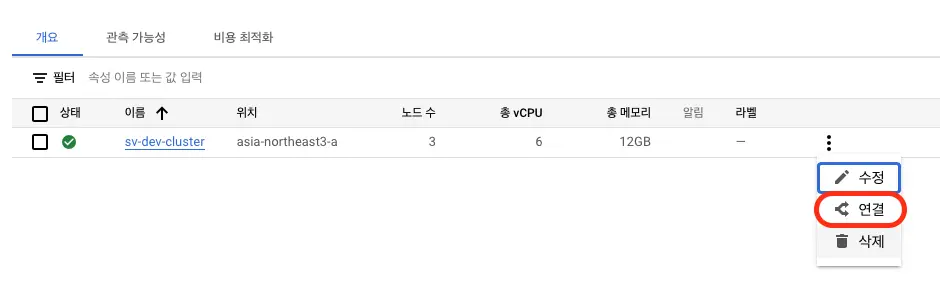

## Overview

While it is very convenient to be able to run `kubectl` through Google's Cloud Shell via the web from anywhere, there is a drawback of needing to go through the hassle of web access and authentication for simple query commands. This article shares a method for quickly managing Google Cloud Kubernetes using a local CLI.

## Contents

### Installing GCP CLI

First, you need to install the GCP CLI. Refer to the [gcp-cli](https://cloud.google.com/sdk/gcloud?hl=ko) link to check for the appropriate operating system and install it.

### Connection

Once the installation is complete, proceed with the authentication process using the following command:

```bash
gcloud init
```

You need to access the GCP Kubernetes Engine and fetch the connection information for the cluster.




Copy the command for command-line access and execute it in the terminal.

```bash
gcloud container clusters get-credentials sv-dev-cluster --zone asia-northeast3-a --project {projectId}
```

```console
Fetching cluster endpoint and auth data.
CRITICAL: ACTION REQUIRED: gke-gcloud-auth-plugin, which is needed for continued use of kubectl, was not found or is not executable. Install gke-gcloud-auth-plugin for use with kubectl by following https://cloud.google.com/blog/products/containers-kubernetes/kubectl-auth-changes-in-gke
kubeconfig entry generated for sv-dev-cluster.
```

### Plugin Installation

If the current Kubernetes version being used is below v1.26, you may encounter an error requesting the installation of `gke-gcloud-auth-plugin`. Install the plugin using the following command.

:::info

Prior to v1.26, client-specific code for managing authentication between the client and Google Kubernetes Engine was included in the existing versions of kubectl and custom Kubernetes clients. Starting from v1.26, this code is no longer included in the OSS kubectl. GKE users need to download and use a separate authentication plugin to generate GKE-specific tokens. The new binary, gke-gcloud-auth-plugin, extends the kubectl authentication for GKE using the Kubernetes Client-go user authentication information plugin mechanism. Since the plugin is already supported in kubectl, you can switch to this new mechanism before v1.26 is provided. - Google

:::

```bash
gcloud components install gke-gcloud-auth-plugin
```

```console
Your current Google Cloud CLI version is: 408.0.1
Installing components from version: 408.0.1

┌────────────────────────────────────────────┐
│    These components will be installed.     │
├────────────────────────┬─────────┬─────────┤
│          Name          │ Version │   Size  │
├────────────────────────┼─────────┼─────────┤
│ gke-gcloud-auth-plugin │   0.4.0 │ 7.1 MiB │
└────────────────────────┴─────────┴─────────┘

For the latest full release notes, please visit:
  https://cloud.google.com/sdk/release_notes

Do you want to continue (Y/n)?  y

╔════════════════════════════════════════════════════════════╗
╠═ Creating update staging area                             ═╣
╠════════════════════════════════════════════════════════════╣
╠═ Installing: gke-gcloud-auth-plugin                       ═╣
╠════════════════════════════════════════════════════════════╣
╠═ Installing: gke-gcloud-auth-plugin                       ═╣
╠════════════════════════════════════════════════════════════╣
╠═ Creating backup and activating new installation          ═╣
╚════════════════════════════════════════════════════════════╝

Performing post processing steps...done.

Update done!
```

re-run the connection command, and you should see that the cluster is connected without any error messages.

```bash
gcloud container clusters get-credentials sv-dev-cluster --zone asia-northeast3-a --project {projectId}
```

```console
Fetching cluster endpoint and auth data.
kubeconfig entry generated for sv-dev-cluster.
```

Once the connection is successful, you will also notice changes in Docker Desktop. Specifically, new information will be displayed in the Kubernetes tab.


Afterwards, you can also directly check GKE resources locally using `kubectl`.

```bash
kubectl get deployments
NAME                  READY   UP-TO-DATE   AVAILABLE   AGE
my-application        1/1     1            1           20d
```

## Conclusion

We have briefly explored efficient ways to manage GKE resources locally. Using `kubectl` locally enables extended features like autocomplete, making Kubernetes management much more convenient. If you are new to using GKE, I strongly recommend giving it a try.

## Reference

[k8s-plugin](https://cloud.google.com/blog/products/containers-kubernetes/kubectl-auth-changes-in-gke?hl=en)
