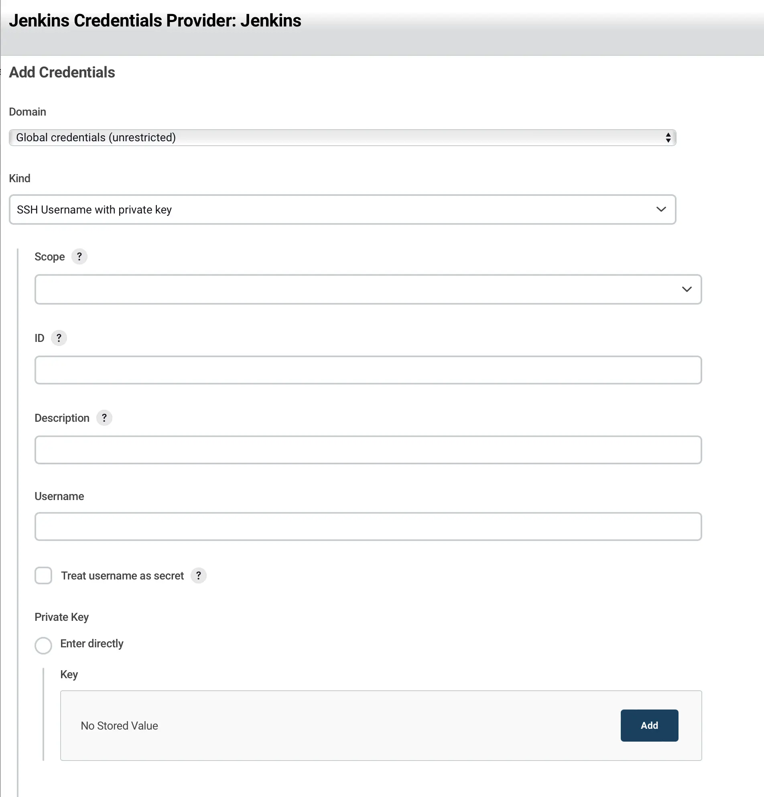

## Overview

This article explains how to install and operate Jenkins using Docker.

## Contents

### Install

#### Docker

```bash
docker run --name jenkins-docker -d -p 8080:8080 -p 50000:50000 -v /home/jenkins:/var/jenkins_home -u root jenkins/jenkins:lts 
```

Mount a volume to persist Jenkins data on the host machine. Unlike TeamCity, Jenkins manages all configurations in files. Setting up a mount makes authentication information and data management much more convenient, so be sure to configure it. Common target paths are `/home/jenkins` or `/var/lib/jenkins`.

For the purpose of this article, it is assumed that the path `/home/jenkins` has been created.

### Authentication

To ensure security and access control for both the master and nodes, create a user named 'jenkins' and proceed as follows.

#### Setting User Access Permissions

```bash
chown -R jenkins /var/lib/jenkins
```

#### Managing SSH Keys

If you don't have keys, generate one using `ssh-keygen` to prepare a private key and a public key.

When prompted for a path, enter `/home/jenkins/.ssh/id_rsa` to ensure the key is created under `/home/jenkins/.ssh`.

#### GitLab

In GitLab's personal settings, there is an SSH setting tab. Add the public key.

When selecting Git in the pipeline, a repository path input field is displayed. Entering an SSH path starting with git@~ will show a red error. To resolve this, create a credential. Choose SSH credential to create one, and the ID value can be a useful value, so it is recommended to enter it.

#### Node Configuration

Nodes are a way to efficiently distribute Jenkins roles.

To communicate with the node, generate a key on the master using `ssh-keygen`. If you already have one that you are using, you can reuse it.



- `ID`: This value allows Jenkins to identify the SSH key internally, making it easier to use credentials in Jenkinsfiles, so it's best to set a meaningful value. If not set, a UUID value will be generated.
- `Username`: The Linux user. Typically, 'jenkins' is used as the user, so enter 'jenkins'. **Be cautious as not entering this may result in a reject key error**.

#### Docker Access Permissions

If the docker group does not exist, create it. Usually, it is automatically created when installing Docker.

```bash
sudo groupadd docker
```

Grant Jenkins user permission to run Docker by running the following command.

```bash
sudo gpasswd -a jenkins docker
# Adding user jenkins to group docker
```

```bash
sudo chmod 666 /var/run/docker.sock
```

Restart the Docker daemon to apply the changes.

```bash
systemctl restart docker
```

You should now be able to run the `docker ps` command.

### Restart

When updating Jenkins version or installing, removing, or updating plugins, Jenkins restarts. However, if you are managing it with Docker, the container goes down, preventing Jenkins from starting. To enable restart, you need to set a restart policy on the container.

```bash
docker update --restart=always jenkins-docker
```

After this, the jenkins-docker container will always remain in a running state.

## Caution

When updating plugins, carefully check if they are compatible with the current version of Jenkins in operation. Mismatched versions between Jenkins and plugins can often lead to pipeline failures.

## Reference

[Managing Jenkins with Docker](https://dev-overload.tistory.com/40)