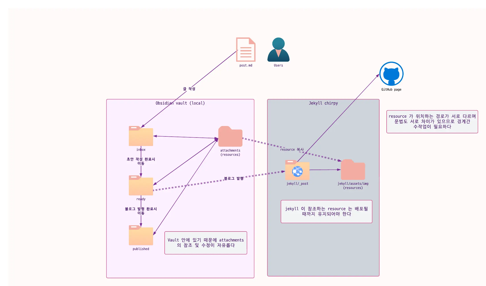
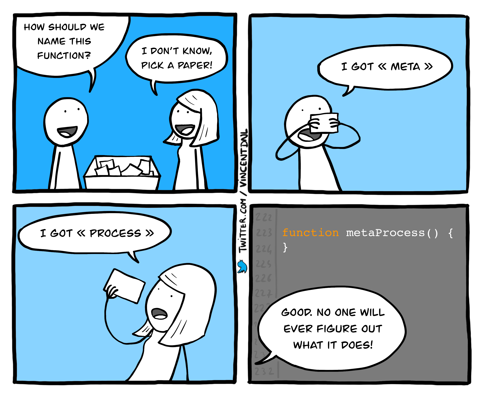
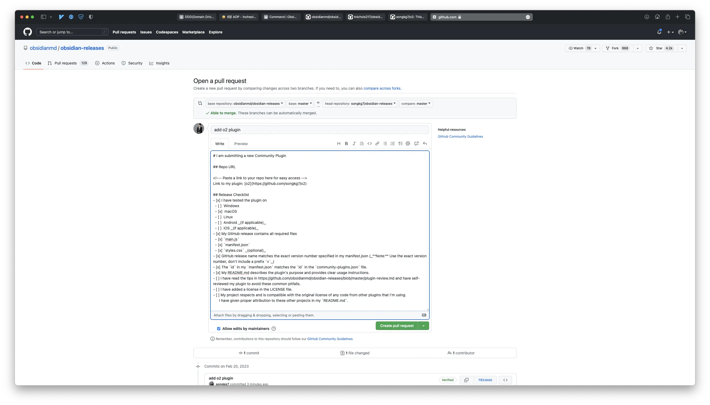
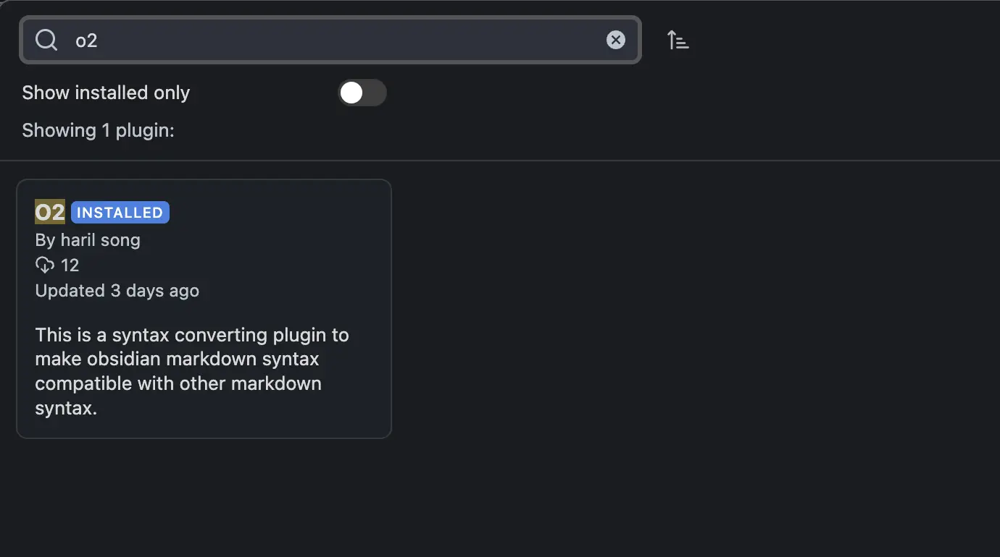

## Overview

Obsidian provides a graph view through links between Markdown files, making it convenient to store and navigate
information. However, to achieve this, Obsidian enforces its own unique syntax in addition to the original Markdown
syntax. This can lead to areas of incompatibility when reading Markdown documents from Obsidian on other platforms.

Currently, I use a Jekyll blog for posting, so when I write in Obsidian, I have to manually adjust the syntax later for
blog publishing. Specifically, the workflow involves:

- Using [[]] for file links, which is Obsidian's unique syntax
- Resetting attachment paths, including image files
- Renaming `title.md` to `yyyy-MM-dd-title.md`
- Callout syntax


_Double-dashed arrows crossing layer boundaries require manual intervention._

As I use both Obsidian and Jekyll concurrently, there was a need to automate this syntax conversion process and
attachment copying process.

Since Obsidian allows for functionality extension through community plugins unlike Notion, I decided to try creating one
myself. After reviewing the official documentation, I found that Obsidian guides plugin development based on NodeJS.
While the language options were limited, I had an interest in TypeScript, so I set up a NodeJS/TS environment to study.

## Implementation Process

### Naming

I first tackled the most important part of development.

It didn't take as long as I thought, as I came up with the project name 'O2' based on a sudden idea while writing a
description, 'convert Obsidian syntax to Jekyll,' for the plugin.



### Preparation for Conversion

With a suitable name in place, the next step was to determine how to convert which files.

The workflow for blog posting is as follows:

1. Write drafts in a folder named `ready`.
2. Once the manuscript is complete, copy the files, including attachments, to the Jekyll project, appropriately
   converting Obsidian syntax to Jekyll syntax in the process.
3. Move the manuscript from the `ready` folder to `published` to indicate that it has been published.

I decided to program this workflow as is. However, instead of editing the original files in a Jekyll project open in
VScode, I opted to create and modify copies internally in the plugin workspace to prevent modification of the original
files and convert them to Jekyll syntax.

To summarize this step briefly:

1. Copy the manuscript `A.md` from `/ready` to `/published` without modifying `/published/A.md`.
2. Convert the title and syntax of `/ready/A.md`.
3. Move `/ready/yyyy-MM-dd-A.md` to the path for Jekyll publishing.

Let's start the implementation.

### Copying Original Files

```typescript
// Get only Markdown files in the ready folder
function getFilesInReady(plugin: O2Plugin): TFile[] {
    return this.app.vault.getMarkdownFiles()
        .filter((file: TFile) => file.path.startsWith(plugin.settings.readyDir))
}

// Copy files to the published folder
async function copyToPublishedDirectory(plugin: O2Plugin) {
    const readyFiles = getFilesInReady.call(this, plugin)
    readyFiles.forEach((file: TFile) => {
        return this.app.vault.copy(file, file.path.replace(plugin.settings.readyDir, plugin.settings.publishedDir))
    })
}
```

By fetching Markdown files inside the `/ready` folder and replacing `file.path` with `publishedDir`, copying can be done
easily.

### Copying Attachments and Resetting Paths

```typescript
function convertResourceLink(plugin: O2Plugin, title: string, contents: string) {
    const absolutePath = this.app.vault.adapter.getBasePath()
    const resourcePath = `${plugin.settings.jekyllResourcePath}/${title}`
    fs.mkdirSync(resourcePath, {recursive: true})

    const relativeResourcePath = plugin.settings.jekyllRelativeResourcePath

    // Copy resourceDir/image.png to assets/img/<title>/image.png before changing
    extractImageName(contents)?.forEach((resourceName) => {
        fs.copyFile(
            `${absolutePath}/${plugin.settings.resourceDir}/${resourceName}`,
            `${resourcePath}/${resourceName}`,
            (err) => {
                if (err) {
                    new Notice(err.message)
                }
            }
        )
    })
    // Syntax conversion
    return contents.replace(ObsidianRegex.IMAGE_LINK, ``)
} 
```

Attachments require moving files outside the vault, which cannot be achieved using Obsidian's default APIs. Therefore,
direct file system access using `fs` is necessary.

:::info

Direct file system access implies difficulty in mobile usage, so the
Obsidian [official documentation](https://github.com/obsidianmd/obsidian-releases/blob/master/plugin-review.md#nodejs-and-electron-api)
guides specifying `isDesktopOnly` as `true` in `manifest.json` in such cases.

:::

Before moving Markdown files to the Jekyll project, the Obsidian image link syntax is parsed to identify image
filenames, which are then moved to Jekyll's `resource` folder so that the Markdown default image links are converted
correctly, allowing attachments to be found.

### Callout Syntax Conversion

#### Obsidian callout

```
> [!NOTE] callout title
> callout contents
```

Supported keywords: tip, info, note, warning, danger, error, etc.

#### Jekyll chirpy callout

```
> callout contents
{: .promt-info}
```

Supported keywords: tip, info, warning, danger

As the syntax of the two differs, regular expressions are used to substitute this part, requiring implementation of a
replacer.

```typescript
export function convertCalloutSyntaxToChirpy(content: string) {
    function replacer(match: string, p1: string, p2: string) {
        if (p1.toLowerCase() === 'note') {
            p1 = 'info'
        }
        if (p1.toLowerCase() === 'error') {
            p1 = 'danger'
        }
        return `${p2}\n{: .prompt-${p1.toLowerCase()}}`
    }

    return content.replace(ObsidianRegex.CALLOUT, replacer)
}
```

Unsupported keywords in Jekyll are converted to other keywords with similar roles.

### Moving Completed Files

The Jekyll-based blog I currently use has a specific path where posts need to be located for publishing. Since the
Jekyll project location may vary per client, custom path handling is required. I decided to set this up through a
settings tab and created an input form like the one below.


Once all conversions are done, moving the files to the `_post` path in Jekyll completes the conversion process.

```typescript
async function moveFilesToChirpy(plugin: O2Plugin) {
    // Absolute path is needed to move files outside the vault
    const absolutePath = this.app.vault.adapter.getBasePath()
    const sourceFolderPath = `${absolutePath}/${plugin.settings.readyDir}`
    const targetFolderPath = plugin.settings.targetPath()

    fs.readdir(sourceFolderPath, (err, files) => {
        if (err) throw err

        files.forEach((filename) => {
            const sourceFilePath = path.join(sourceFolderPath, filename)
            const targetFilePath = path.join(targetFolderPath, filename)

            fs.rename(sourceFilePath, targetFilePath, (err) => {
                if (err) {
                    console.error(err)
                    new Notice(err.message)
                    throw err
                }
            })
        })
    })
}
 ```

### Regular Expressions

```typescript
export namespace ObsidianRegex {
    export const IMAGE_LINK = /!\[\[(.*?)]]/g
    export const DOCUMENT_LINK = /(?<!!)\[\[(.*?)]]/g
    export const CALLOUT = /> \[!(NOTE|WARNING|ERROR|TIP|INFO|DANGER)].*?\n(>.*)/ig
}
```

Special syntax unique to Obsidian was handled using regular expressions for parsing. By using groups, specific parts
could be extracted for conversion, making the process more convenient.

### Creating a PR for Community Plugin Release

Finally, to register the plugin in the community plugin repository, I conclude by creating
a [PR](https://github.com/obsidianmd/obsidian-releases/pull/1678). It is essential to adhere to community guidelines;
otherwise, the PR may be rejected. Obsidian provides guidance on what to be mindful of when developing plugins, so it's
crucial to follow these guidelines as closely as possible.



Based on previous PRs, it seems that merging takes approximately 2-4 weeks. If feedback is received later, I will make
the necessary adjustments and patiently wait for the merge.

## Conclusion

I thought, 'This should be a quick job, maybe done in 3 days,' but trying to implement the plugin while traveling abroad
ended up taking about a week, including creating the release PR 😂


_I wonder if Kent Beck and Erich Gamma, who developed JUnit, coded like this on a plane..._

Switching to TypeScript from Java or Kotlin made things challenging, as I wasn't familiar with it, and I wasn't
confident if the code I was writing was best practice. However, thanks to this, I delved into JS syntax
like `async-await` in detail, adding another technology stack to my repertoire. It's a proud feeling. This also gave me
a new topic to write about.

The best part is that there's almost no need for manual work in blog posting anymore! After converting the syntax with
the plugin, I only need to do a spell check before pushing to GitHub. ~~Of course, there are still many bugs...~~

Moving forward, I plan to continue studying TypeScript gradually to eliminate anti-patterns in the plugin and improve
the design for cleaner modules.

If you're facing similar dilemmas, contributing to the project or collaborating in other ways to build it together would
be great! You're welcome anytime 😄

:::info

You can check out the complete code on [GitHub](https://github.com/songkg7/o2).

:::

## Next Steps 🤔

- Fix minor bugs
- Support footnote syntax
- Support image resize syntax
- Implement transaction handling for rollback in case of errors during conversion
- Abstract processing for adding other modules

---

## Release 🚀

After about 6 days of code review, the PR was merged. The plugin is now available for use in the Obsidian Community
plugin repository. 🎉



## Reference

- [Obsidian plugins](https://marcus.se.net/obsidian-plugin-docs/getting-started/create-your-first-plugin)
