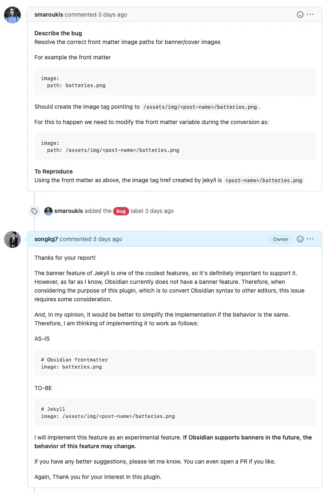
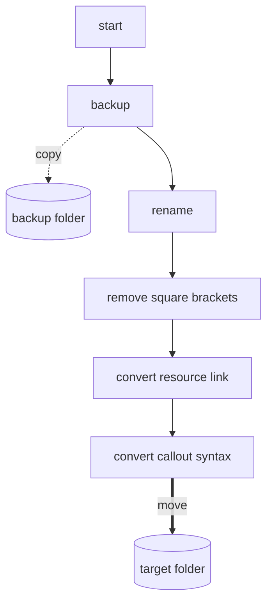
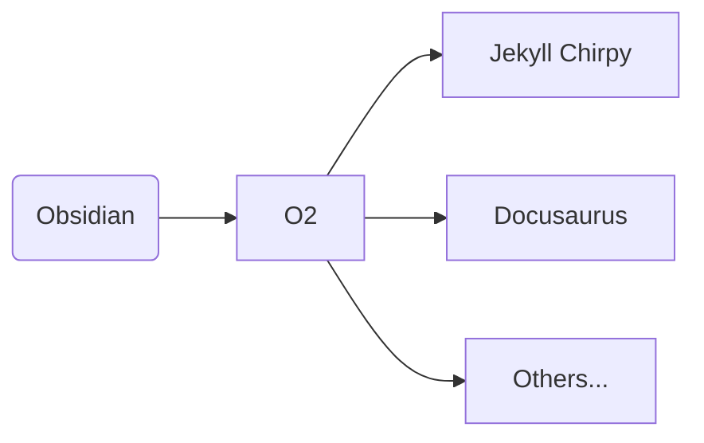
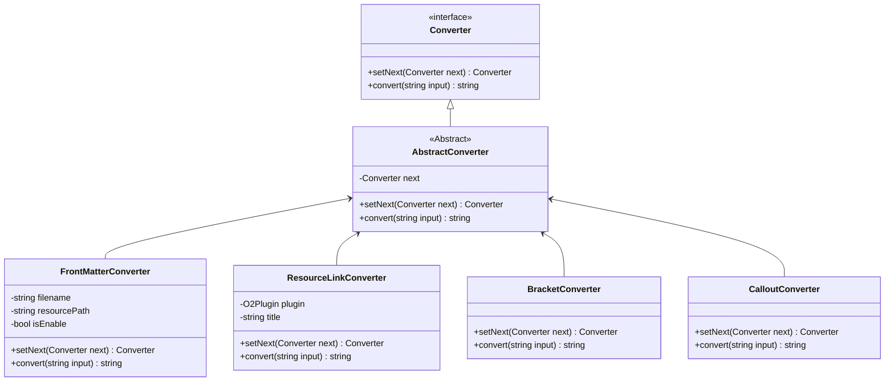

This article discusses the process of using design patterns to improve the structure of the [O2](https://github.com/songkg7/o2) project for more flexible management.

## Problem

While diligently working on development, a sudden [Issue](https://github.com/songkg7/o2/issues/50) was raised one day.



Reflecting the contents of the [Issue](https://github.com/songkg7/o2/issues/50) was not difficult. However, as I delved into the code, an issue that had been put off for a while started to surface.


Below is the implementation of the Markdown syntax conversion code that had been previously written.

:::warning

Due to the length of the code, a partial excerpt is provided. For the full code, please refer to O2 plugin [v1.1.1](https://github.com/songkg7/o2/releases/tag/1.1.1) 🙏

:::

```typescript
export async function convertToChirpy(plugin: O2Plugin) {
    try {
        await backupOriginalNotes(plugin);
        const markdownFiles = await renameMarkdownFile(plugin);
        for (const file of markdownFiles) {
            // remove double square brackets
            const title = file.name.replace('.md', '').replace(/\s/g, '-');
            const contents = removeSquareBrackets(await plugin.app.vault.read(file));
            // change resource link to jekyll link
            const resourceConvertedContents = convertResourceLink(plugin, title, contents);

            // callout
            const result = convertCalloutSyntaxToChirpy(resourceConvertedContents);

            await plugin.app.vault.modify(file, result);
        }

        await moveFilesToChirpy(plugin);
        new Notice('Chirpy conversion complete.');
    } catch (e) {
        console.error(e);
        new Notice('Chirpy conversion failed.');
    }
}
```
Being unfamiliar with TypeScript and Obsidian usage, I had focused more on implementing features rather than the overall design. Now, trying to add new features, it became difficult to anticipate side effects, and the code implementation lacked clear communication of the developer's intent.

To better understand the code flow, I created a graph of the current process as follows.



Although I had separated functionalities into functions, the code was still procedurally written, where the order of code lines significantly impacted the overall operation. Adding a new feature in this state would require precise implementation to avoid breaking the entire conversion process. So, where would be the correct place to implement a new feature? Most likely, the answer would be 'I need to see the code.' Currently, with most of the code written in one large file, it was almost equivalent to needing to analyze the entire code. In object-oriented terms, one could say that the **Single Responsibility Principle (SRP)** was not being properly followed.

This state, no matter how positively described, did not seem easy to maintain. Since the O2 plugin was created for my personal use, I could not justify producing spaghetti code that was difficult to maintain by rationalizing, 'It's because I'm not familiar with TS.'

Before resolving the Issue, I decided to first improve the structure, putting the glory aside for a moment.

## What Structure Should Be Implemented?

The O2 plugin, as a syntax conversion plugin, must be capable of converting Obsidian's Markdown syntax into various formats, which is a clear requirement.



Therefore, the design should focus primarily on scalability.

Each **platform logic should be modularized**, and the **conversion process abstracted** to implement it like a template. This way, when implementing new features for supporting different platform syntaxes, developers can focus only on the small unit of implementing syntax conversion without needing to reimplement the entire flow.

Based on this, the design requirements are as follows:

1. Strings (content of Markdown files) should be converted in order (or not) as needed.
2. Specific conversion logic should be skippable or dynamically controllable based on external settings.
3. Implementing new features should be simple and should have minimal or no impact on existing code.

As there is a sequence of execution, and the ability to add features in between, the Chain of Responsibility pattern seemed appropriate for this purpose.

### Applying Design Patterns

Process->Process->Process->Done!
: Summary of Chain of Responsibility

```typescript
export interface Converter {
    setNext(next: Converter): Converter;
    convert(input: string): string;
}

export abstract class AbstractConverter implements Converter {
    private next: Converter;

    setNext(next: Converter): Converter {
        this.next = next;
        return next;
    }

    convert(input: string): string {
        if (this.next) {
            return this.next.convert(input);
        }
        return input;
    }
}
```

The `Converter` interface plays a role in converting specific strings through `convert(input)`. By specifying the next `Converter` to be processed with `setNext`, and returning the `Converter` again, method chaining can be used.

With the abstraction in place, the conversion logic that was previously implemented in one file was separated into individual `Converter` implementations, assigning responsibility for each feature. Below is an example of the `CalloutConverter` that separates the Callout syntax conversion logic.

```typescript
export class CalloutConverter extends AbstractConverter {
    convert(input: string): string {
        const result = convertCalloutSyntaxToChirpy(input);
        return super.convert(result);
    }
}

function convertCalloutSyntaxToChirpy(content: string) {
    function replacer(match: string, p1: string, p2: string) {
        return `${p2}\n{: .prompt-${replaceKeyword(p1)}}`;
    }

    return content.replace(ObsidianRegex.CALLOUT, replacer);
}
```

Now, the relationships between the classes are as follows.



Now, by combining the smallest units of functionality implemented in each `Converter`, a chain is created to perform operations in sequence. This is why this pattern is called Chain of Responsibility.

```typescript
export async function convertToChirpy(plugin: O2Plugin) {
    // ...
    // Create conversion chain
    frontMatterConverter.setNext(bracketConverter)
        .setNext(resourceLinkConverter)
        .setNext(calloutConverter);

    // Request the frontMatterConverter at the head to perform the conversion, and the connected converters will operate sequentially.
    const result = frontMatterConverter.convert(await plugin.app.vault.read(file));
    await plugin.app.vault.modify(file, result);
    // ...
}
```

Now that the logic has been separated into appropriate responsibilities, reading the code has become much easier. When needing to add a new feature, only the necessary `Converter` needs to be implemented. Additionally, without needing to know how other `Converter`s work, new features can be added through `setNext`. Each `Converter` operates independently, following the principle of encapsulation.

Finally, I checked if all tests passed and created a [PR](https://github.com/songkg7/o2/pull/51).


### Next Step

Although the structure has improved significantly, there is one remaining drawback. In the structure linked through `setNext`, calling the `Converter` at the very front is necessary for proper operation. If a different `Converter` is called instead of the one at the front, the result may be different from the intended one. If, for example, a `NewConverter` is implemented before `frontMatterConverter` but `frontMatterConverter.convert(input)` is not modified, `NewConverter` will not be applied.

```mermaid
flowchart LR
new[NewConverter] --> fm[FrontMatterConverter]
fm --> bc[BracketConverter]
call(convert) -.call.-> fm
 ```

This is one of the aspects that developers need to pay attention to, as there is room for error, and it is one of the areas that needs improvement in the future. For instance, implementing a kind of `Context` to contain the `Converter`s and executing the conversion process without directly calling the `Converter`s could be a way to improve. This is something I plan to implement in the next version.

---

### 2023-03-12 Update

Thanks to [PR](https://github.com/songkg7/o2/pull/61), the same functionality was performed, but with a more flexible structure using composition instead of inheritance.

```mermaid
classDiagram
class ConverterChain {
 -List~Converter~ converters
 +chaining(Converter converter) ConverterChain
 +converting(string input) string
}
class Converter {
 <<interface>>
 +convert(string input) string
}
ConverterChain*--Converter

class FrontMatterConverter {
  -string filename
  -string resourcePath
  -bool isEnable
  +convert(string input) string
}
Converter <|-- FrontMatterConverter

class ResourceLinkConverter {
  -O2Plugin plugin
  -string title
  +convert(string input) string
}
Converter <|-- ResourceLinkConverter

class WikiLinkConverter {
  +convert(string input) string
}
Converter <|-- WikiLinkConverter

class CalloutConverter {
  +convert(string input) string
}
Converter <|-- CalloutConverter
```

## Conclusion

In this article, I described the process of redistributing roles and responsibilities through design patterns from a procedurally written, monolithic file to a more object-oriented and maintainable code.

:::info

The complete code can be found on [GitHub](https://github.com/songkg7/o2).

:::
