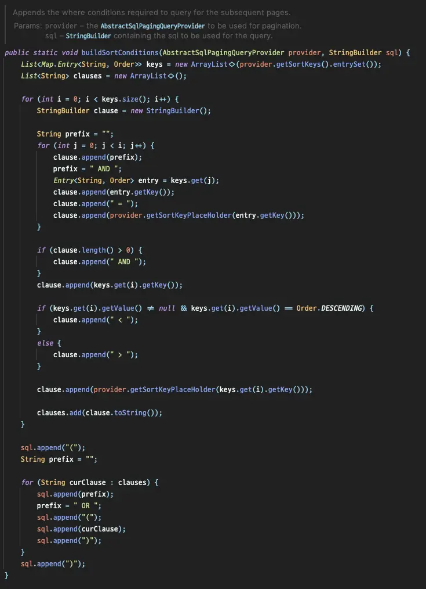
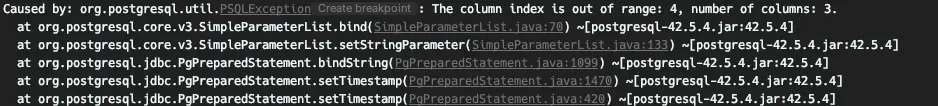
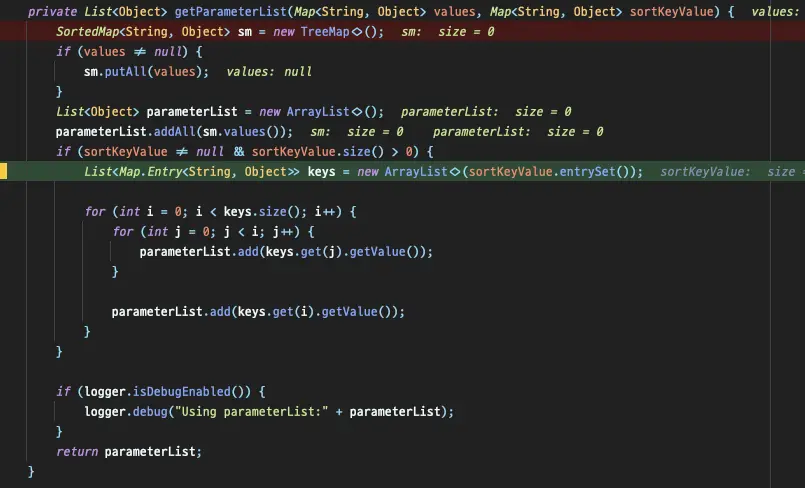

In this article, I will discuss the issues and solutions encountered when querying a table with millions of data using
Spring Batch.

## Environment

- Spring Batch 5.0.1
- PostgreSQL 11

## Problem

While using `JdbcPagingItemReader` to query a large table, I noticed a significant slowdown in query performance over
time and decided to investigate the code in detail.

### Default Behavior

The following query is automatically generated and executed by the `PagingQueryProvider`:

```sql
SELECT *
FROM large_table
WHERE id > ?
ORDER BY id
LIMIT 1000;
```

In Spring Batch, when using `JdbcPagingItemReader`, instead of using an offset, it generates a where clause for
pagination. This allows for fast retrieval of data even from tables with millions of records without any delays.

:::tip

Even with `LIMIT`, using `OFFSET` means reading all previous data again. Therefore, as the amount of data to be read
increases, the performance degrades. For more information, refer to the article[^fn-nth-1].

:::

### Using Multiple Sorting Conditions

**The problem arises when querying a table with composite keys**. When a composite key consisting of 3 columns is used
as the sort key, the generated query looks like this:

```sql
SELECT *
FROM large_table
WHERE ((create_at > ?) OR
       (create_at = ? AND user_id > ?) OR
       (create_at = ? AND user_id = ? AND content_no > ?))
ORDER BY create_at, user_id, content_no
LIMIT 1000;
```

However, **queries with OR operations in the where clause do not utilize indexes effectively**. OR operations require
executing multiple conditions, making it difficult for the optimizer to make accurate decisions. When I examined
the `explain` output, I found the following results:

```log
Limit  (cost=0.56..1902.12 rows=1000 width=327) (actual time=29065.549..29070.808 rows=1000 loops=1)
  ->  Index Scan using th_large_table_pkey on large_table  (cost=0.56..31990859.76 rows=16823528 width=327) (actual time=29065.547..29070.627 rows=1000 loops=1)
"        Filter: ((""create_at"" > '2023-01-28 06:58:13'::create_at without time zone) OR ((""create_at"" = '2023-01-28 06:58:13'::create_at without time zone) AND ((user_id)::text > '441997000'::text)) OR ((""create_at"" = '2023-01-28 06:58:13'::create_at without time zone) AND ((user_id)::text = '441997000'::text) AND ((content_no)::text > '9070711'::text)))"
        Rows Removed by Filter: 10000001
Planning Time: 0.152 ms
Execution Time: 29070.915 ms
```

With a query execution time close to 30 seconds, most of the data is discarded during filtering on the index, resulting
in unnecessary time wastage.

Since PostgreSQL manages composite keys as tuples, writing queries using tuples allows for utilizing the advantages of
Index scan even in complex where clauses.

```sql
SELECT *
FROM large_table
WHERE (create_at, user_id, content_no) > (?, ?, ?)
ORDER BY create_at, user_id, content_no
LIMIT 1000;
```

```log
Limit  (cost=0.56..1196.69 rows=1000 width=327) (actual time=3.204..11.393 rows=1000 loops=1)
  ->  Index Scan using th_large_table_pkey on large_table  (cost=0.56..20122898.60 rows=16823319 width=327) (actual time=3.202..11.297 rows=1000 loops=1)
"        Index Cond: (ROW(""create_at"", (user_id)::text, (content_no)::text) > ROW('2023-01-28 06:58:13'::create_at without time zone, '441997000'::text, '9070711'::text))"
Planning Time: 0.276 ms
Execution Time: 11.475 ms
```

It can be observed that data is directly retrieved through the index without discarding any data through filtering.

Therefore, when the query executed by `JdbcPagingItemReader` uses tuples, it means that even when using composite keys
as sort keys, processing can be done very quickly.

Let's dive into the code immediately.

## Modifying PagingQueryProvider

### Analysis

As mentioned earlier, the responsibility of generating queries lies with the `PagingQueryProvider`. Since I am using
PostgreSQL, the `PostgresPagingQueryProvider` is selected and used.


_The generated query differs based on whether it includes a `group by` clause._

By examining `SqlPagingQueryUtils`'s `buildSortConditions`, we can see how the problematic query is generated.



Within the nested for loop, we can see how the query is generated based on the sort key.

### Customizing `buildSortConditions`

Having directly inspected the code responsible for query generation, I decided to modify this code to achieve the
desired behavior. However, direct overriding of this code is not possible, so I created a new class
called `PostgresOptimizingQueryProvider` and re-implemented the code within this class.

```java
private String buildSortConditions(StringBuilder sql) {
    Map<String, Order> sortKeys = getSortKeys();
    sql.append("(");
    sortKeys.keySet().forEach(key -> sql.append(key).append(", "));
    sql.delete(sql.length() - 2, sql.length());
    if (is(sortKeys, order -> order == Order.ASCENDING)) {
        sql.append(") > (");
    } else if (is(sortKeys, order -> order == Order.DESCENDING)) {
        sql.append(") < (");
    } else {
        throw new IllegalStateException("Cannot mix ascending and descending sort keys"); // Limitation of tuples
    }
    sortKeys.keySet().forEach(key -> sql.append("?, "));
    sql.delete(sql.length() - 2, sql.length());
    sql.append(")");
    return sql.toString();
}
```

### Test Code

To ensure that the newly implemented section works correctly, I validated it through a test code.

```java
@Test
@DisplayName("The Where clause generated instead of Offset is (create_at, user_id, content_no) > (?, ?, ?).")
void test() {
    // given
    PostgresOptimizingQueryProvider queryProvider = new PostgresOptimizingQueryProvider();
    queryProvider.setSelectClause("*");
    queryProvider.setFromClause("large_table");

    Map<String, Order> parameterMap = new LinkedHashMap<>();
    parameterMap.put("create_at", Order.ASCENDING);
    parameterMap.put("user_id", Order.ASCENDING);
    parameterMap.put("content_no", Order.ASCENDING);
    queryProvider.setSortKeys(parameterMap);

    // when
    String firstQuery = queryProvider.generateFirstPageQuery(10);
    String secondQuery = queryProvider.generateRemainingPagesQuery(10);

    // then
    assertThat(firstQuery).isEqualTo("SELECT * FROM large_table ORDER BY create_at ASC, user_id ASC, content_no ASC LIMIT 10");
    assertThat(secondQuery).isEqualTo("SELECT * FROM large_table WHERE (create_at, user_id, content_no) > (?, ?, ?) ORDER BY create_at ASC, user_id ASC, content_no ASC LIMIT 10");
}
```


The successful execution confirms that it is working as intended, and I proceeded to run the batch.


> _Guy: "is it over?"_
>
> _Boy: "Shut up, It'll happen again!"_
>
> -- _Within the Webtoon Hive_

However, the `out of range` error occurred, indicating that the query was not recognized as having changed.



It seems that the parameter injection part is not automatically recognized just because the query has changed, so let's
debug again to find the parameter injection part.

## JdbcOptimizedPagingItemReader

The parameter is directly created by `JdbcPagingItemReader`, and I found that the number of parameters to be injected
into SQL is increased by iterating through `getParameterList` in `JdbcPagingItemReader`.



I thought I could just override this method, but unfortunately it is not possible because it is `private`. After much
thought, I copied the entire `JdbcPagingItemReader` and modified only the `getParameterList` part.

The `getParameterList` method is overridden in `JdbcOptimizedPagingItemReader` as follows:

```java
private List<Object> getParameterList(Map<String, Object> values, Map<String, Object> sortKeyValue) {
    // ...
    // Returns the parameters that need to be set in the where clause without increasing them.
    return new ArrayList<>(sortKeyValue.values());
}
```

There is no need to add `sortKeyValue`, so it is directly added to `parameterList` and returned.

Now, let's run the batch again.

The first query is executed without requiring parameters,

```log
2023-03-13T17:43:14.240+09:00 DEBUG 70125 --- [           main] o.s.jdbc.core.JdbcTemplate               : Executing SQL query [SELECT * FROM large_table ORDER BY create_at ASC, user_id ASC, content_no ASC LIMIT 2000]
```

The subsequent query execution receives parameters from the previous query.

```log
2023-03-13T17:43:14.253+09:00 DEBUG 70125 --- [           main] o.s.jdbc.core.JdbcTemplate               : Executing prepared SQL statement [SELECT * FROM large_table WHERE (create_at, user_id, content_no) > (?, ?, ?) ORDER BY create_at ASC, user_id ASC, content_no ASC LIMIT 2000]
```

The queries are executed exactly as intended! 🎉

For pagination processing with over 10 million records, queries that used to take around 30 seconds now run in the range
of 0.1 seconds, representing a significant performance improvement of nearly 300 times.


Now, regardless of the amount of data, queries can be read within milliseconds without worrying about performance
degradation. 😎

## Conclusion

In this article, I introduced the method used to optimize Spring Batch in an environment with composite keys. However,
there is a drawback to this method: all columns that make up the composite key must have the same sorting condition.
If `desc` or `asc` are mixed within the index condition generated by the composite key, a separate index must be used to
resolve this issue 😢

Let's summarize today's content in one line and conclude the article.

**"Avoid using composite keys as much as possible and use surrogate keys unrelated to the business."**

## Reference

- [Stack overflow](https://stackoverflow.com/questions/34110504/optimize-query-with-offset-on-large-table)

---	

[^fn-nth-1]: https://jojoldu.tistory.com/528

