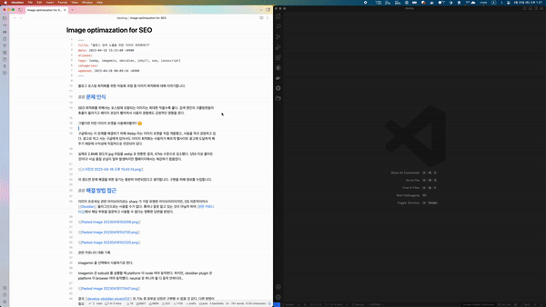
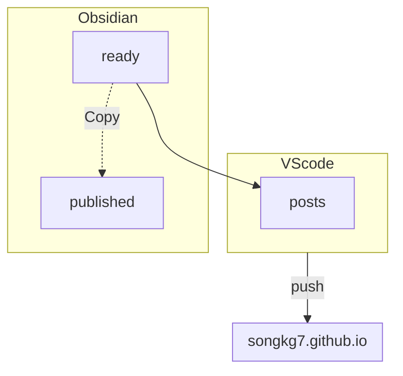

I mostly use the Markdown editor Obsidian for writing, and host my blog on GitHub pages. To maintain the habit of writing without interruption across these two different platforms, I'll share how I go about it.

:::info

This post was inspired by a presentation by [Sungyun](https://github.com/zzsza) from 글또(geultto).

:::

## Gathering Material

In various situations like work, side projects, or studying, I often come across topics I don't know much about. Each time this happens, I create a new note immediately[^fn-nth-1]. In this note, I write a brief summary of 1-2 lines focusing on the keywords I didn't know well.

I don't try to organize in detail from the beginning. I'm not familiar with the topic yet, so it can be tiring. Moreover, the newly learned information may not be immediately important. However, to prevent creating notes on the same topic later, I pay attention to the note title or tag for easy searching.

The key point is that **this process is ongoing**. If similar notes on the topic already exist, they will be enriched. Through repetition, eventually, a good post will emerge.

The initially created notes are stored in a directory named "inbox."

## Learning and Organizing

The notes pile up in the inbox... I need to clear them out, right?

Once I find material that is useful and easy to organize, I study the topic and write a rough draft. Up to this point, I write not for blog purposes but for my own learning. Since it's just a simple memo, the writing style and expression are somewhat flexible. ~~I might add some humor to make the structure of the post more interesting...~~

After writing this draft, I evaluate it to determine if it's suitable for posting on the blog. If the topic has been overly covered in other communities or blogs, I tend not to post it separately for the sake of differentiation.

:::info

However, for content related to personal experiences, such as introducing solutions to problems or sharing personal experiences, even if similar posts exist on other blogs, I try to write them as my feelings and perspectives may differ.

:::

The organized posts are moved to the backlog directory.

## Selecting Blog Posts

While not as many as in the inbox, a certain number of somewhat completed posts accumulate in the backlog. Around 10 posts linger there like a buffer. Over time, if my thoughts on the content change, requiring edits, or if incorrect information is found necessitating further study, some posts are demoted back to the inbox. This serves as a minimal verification process I can personally do to prevent spreading incorrect information. The surviving posts, after enduring all the hardships, are refined from personal learning posts to posts meant for others to see.

Once a post is satisfactory, it is moved to the directory "ready" for blog publication.

## Uploading

Once all preparations for uploading are complete, I use O2 to convert the notes in "ready" to Markdown format and move them to the Jekyll project folder.

:::info

[O2](https://github.com/songkg7/o2) is a community plugin for Obsidian that converts notes written in Obsidian to Markdown format.

:::

_You can see how the image links are automatically converted._

The notes in "ready" are copied to the published directory before being moved to the Jekyll project, where they are stored for backup. All Obsidian-specific syntax is converted to basic Markdown, and if there are attachments, they are copied to the Jekyll project folder along with the notes. Although the attachment file paths change, causing Markdown links that worked in Obsidian to break, there's no need to worry as all this is automated by O2[^fn-nth-2]. 😄 [^fn-nth-3]

Now, I switch tools from Obsidian to VScode. Managing a Jekyll blog sometimes requires dealing with code. This goes beyond what a simple Markdown editor can handle, so continuing to work in Obsidian may present some challenges.

I briefly review the syntax and context, then run `npm run publish` to complete the blog post publication process.

:::info

You can learn more about publishing in [this post](https://haril.dev/blog/2023/04/26/Image-optimazation-for-SEO).

:::

## Proofreading

I regularly review the posts to catch any unnoticed grammatical errors or awkward expressions and refine them gradually. This process doesn't have a set end point; just check the blog from time to time and make corrections consistently.

The blog post pipeline ends here, but I'll briefly explain how to utilize it to write better posts.

## Optional. Data Analysis

Obsidian provides a graph view feature. By utilizing this feature, you can visualize how your notes are organically connected and use it for data analysis.

_In the graph, only the bright green nodes are posts published on the blog._

Most notes are still on topics I'm studying or posts that didn't make the cut for blog publication. From this graph, you can infer the following:

- Nodes in the center with many edges but not published as blog posts likely cover very common topics that I chose not to publish. ~~Or maybe I was just lazy...~~
- Nodes scattered on the outer edges without edges represent fragmented knowledge that I haven't delved deeply into yet. Since they are not linked to any topic, they need further study to connect them internally 😂. These nodes need to be linked internally by learning more about related topics.
- Posts on the outermost edges that have been published represent impulsively published posts during the process of acquiring new knowledge. Since they were impulsively published, it's important to periodically review them for any errors in the content.

Based on this objective data, I strive to expand my knowledge by checking how much I know and what I don't know regularly. 🧐

## Conclusion

In this post, I introduced my writing pipeline and how I use Obsidian for data analysis to accurately understand myself. I hope writing becomes a natural part of your daily life, not just a task!

- Quickly jot down emerging ideas to enable writing without losing the context of your work, making it possible to write consistently. Choose and utilize the appropriate tools according to the situation.
- To make writing feel less like a chore, it's more efficient to add a few minutes consistently each day rather than holding onto writing for hours from scratch. 
- Blog publication can be a tedious task, so automate it as much as possible to keep the workflow simple. Focus on writing!
- Assess how much you know and what you don't know (self-objectification). This helps greatly in selecting blog post topics and determining the direction of your learning.

:::info

All my writing, including drafts that are not posted on the blog, is managed publicly on [GitHub](https://github.com/songkg7/haril-vault).

:::

--- 

[^fn-nth-1]: I've always kept notes nearby since I studied music in the past. It seemed like the best time to come up with something was when I was about to fall asleep. It doesn't seem much different now. Bugs solutions always seem to come to mind just before falling asleep...

[^fn-nth-2]: [O2 Plugin Development Story](https://haril.dev/blog/2023/02/22/develop-obsidian-plugin)

[^fn-nth-3]: Although new bug issues are added with each post... 😭 ~~???: That's a feature~~
