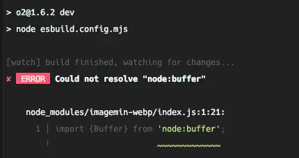

In the process of automating blog posting, we discuss image optimization for SEO. This is a story of failure rather than
success, where we had to resort to Plan B.

:::info

You can check the code on [GitHub](https://github.com/songkg7/songkg7.github.io-legacy/blob/master/tools/imagemin.js).

:::

## Identifying the Problem

For SEO optimization, it is best to have images in blog posts as small as possible. This improves the efficiency of
search engine crawling bots, speeds up page loading, and positively impacts user experience.

So, which image format should we use? 🤔

Google has developed an image format called **WebP** to address this issue and actively recommends its use. For Google,
which profits from advertising, image optimization is directly related to profitability as it allows users to quickly
reach website ads.

In fact, converting a jpg file of about 2.8MB to webp reduced it to around 47kb. That's **more than a 1/50 reduction!**
Although some quality loss occurred, it was hardly noticeable on the webpage.


With this level of improvement, the motivation to solve the problem was more than enough. Let's gather information to
implement it.

## Approach to the Solution

### Plan A. Adding to O2 as a Feature

We have a plugin called [O2](https://github.com/songkg7/o2) that we developed for blog posting. Since we thought that
including the `WebP` conversion task as part of this plugin's functionality would be the most ideal way, we first
attempted this approach.

While `sharp` is the most famous library for image processing, it is OS-dependent and cannot be used with Obsidian
plugins. To confirm this, I asked about it in the Obsidian community and received a clear answer that it cannot be used.


_Related community conversation_

Unable to use `sharp`, we decided to use `imagemin` as an alternative.

However, there was a critical issue: `imagemin` requires the platform to be node for it to work when running esbuild,
but the Obsidian plugin required the platform to be a browser. Setting it to neutral, which should work on both
platforms, didn't work on either...



Since we couldn't find a suitable library to apply to O2 immediately, we decided to implement a simple script to handle
the format conversion task.

### Plan B. npm script

Instead of adding functionality to the plugin, we can easily convert formats by scripting directly within the Jekyll
project.

```javascript
async function deleteFilesInDirectory(dir) {
    const files = fs.readdirSync(dir);

    files.forEach(function (file) {
        const filePath = path.join(dir, file);
        const extname = path.extname(filePath);
        if (extname === '.png' || extname === '.jpg' || extname === '.jpeg') {
            fs.unlinkSync(filePath);
            console.log(`remove ${filePath}`);
        }
    });
}

async function convertImages(dir) {
    const subDirs = fs
        .readdirSync(dir)
        .filter((file) => fs.statSync(path.join(dir, file)).isDirectory());

    await imagemin([`${dir}/*.{png,jpg,jpeg}`], {
        destination: dir,
        plugins: [imageminWebp({quality: 75})]
    });
    await deleteFilesInDirectory(dir);

    for (const subDir of subDirs) {
        const subDirPath = path.join(dir, subDir);
        await convertImages(subDirPath);
    }
}

(async () => {
    await convertImages('assets/img');
})();
```

While this method allows for quick implementation of the desired functionality, it requires users to manually relink the
changed images to the markdown document outside of the process controlled by O2.

If we must use this method, we decided to use regular expressions to change the image extensions linked in all files
to `webp`, thereby skipping the task of relinking images in the document.

```javascript
// omitted
async function updateMarkdownFile(dir) {
    const files = fs.readdirSync(dir);

    files.forEach(function (file) {
        const filePath = path.join(dir, file);
        const extname = path.extname(filePath);
        if (extname === '.md') {
            const data = fs.readFileSync(filePath, 'utf-8');
            const newData = data.replace(
                /(!\^\*]\((.*?)\.(png|jpg|jpeg)\))/g,
                (match, p1, p2, p3) => {
                    return p1.replace(`${p2}.${p3}`, `${p2}.webp`);
                }
            );
            fs.writeFileSync(filePath, newData);
        }
    });
}

(async () => {
    await convertImages('assets/img');
    await updateMarkdownFile('_posts');
})();
```

Then, we wrote a script to run when publishing a blog post.

```bash
#!/usr/bin/env bash

echo "Image optimization️...🖼️"
node tools/imagemin.js

git add .
git commit -m "post: publishing"

echo "Pushing...📦"
git push origin master

echo "Done! 🎉"
```

```bash
./tools/publish
```

Directly running sh in the terminal somehow felt inelegant. Let's add it to `package.json` for a cleaner usage.

```json
{
  "scripts": {
    "publish": "./tools/publish"
  }
}
```

```bash
npm run publish
```


_It works quite well._

For now, we concluded it this way.

## Conclusion

Through this process, the blog posting pipeline has transformed as follows:

**Before**


**After**


Looking at the results alone, it doesn't seem that bad, does it...? 🤔

We wanted to add the image format conversion feature as part of the O2 plugin functionality, but for various reasons, we
couldn't apply it (for now), which is somewhat disappointing. The methods using JS and sh require additional actions
from the user and are not easy to maintain. We need to consistently think about how to bring this feature into O2
internally.

## Reference

- [Sharp](https://sharp.pixelplumbing.com/)
- [Imagemin](https://github.com/imagemin/imagemin)
- [Github issue](https://github.com/songkg7/o2/issues/99)
