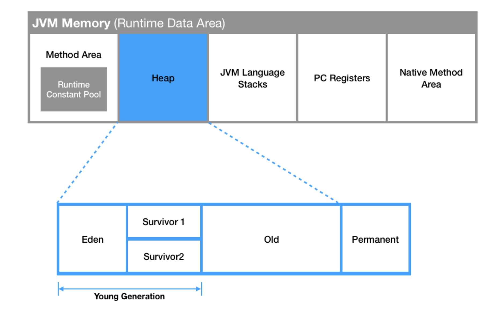
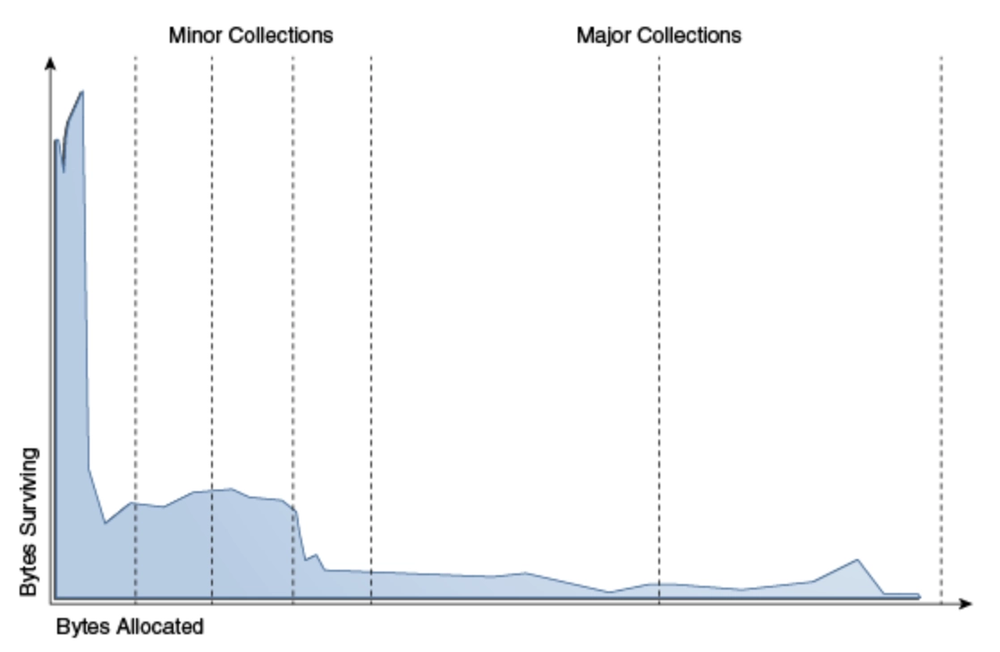
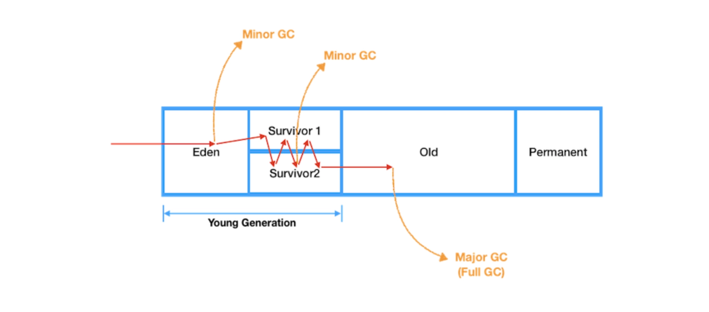
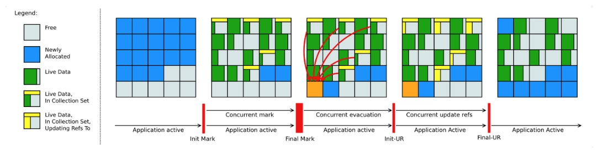
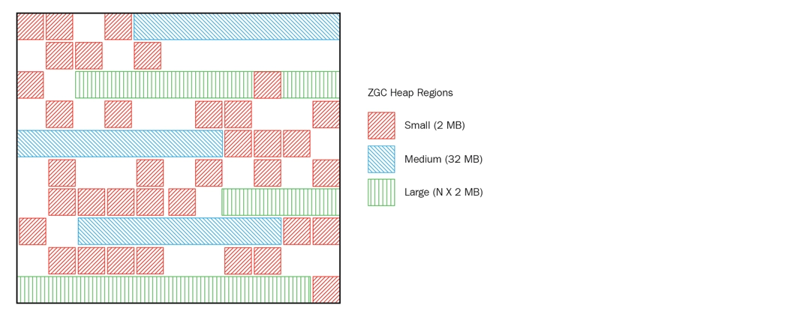

## Overview

Let's delve into the topic of Garbage Collection (GC) in the JVM.

## What is GC?

The JVM memory is divided into several regions.



The Heap region is where objects and arrays created by operations like `new` are stored. Objects or arrays created in the Heap region can be referenced by other objects. GC occurs precisely in this Heap region.

If a Java program continues to run without terminating, data will keep piling up in memory. GC resolves this issue.

How does it resolve it? The JVM identifies **unreachable objects** as targets for GC. Understanding which objects become unreachable can be grasped by looking at the following code.

```java
public class Main {
 public static void main(String[] args) {
  Person person = new Person("a", "soon to be unreferenced");
  person = new Person("b", "reference maintained.");
 }
}
```

When `person` is initially initialized, the created `a` is immediately reassigned to `b` on the next line, becoming an unreachable object. Now, `a` will be released from memory during the next GC.

## Stop the World


_The World! Time, halt! - JoJo's Bizarre Adventure_

Stopping the application's execution to perform GC. **When a "Stop the World" event occurs, all threads except the one executing GC are paused.** Once the GC operation is completed, the paused tasks resume. Regardless of the GC algorithm used, "Stop the World" events occur, and GC tuning typically aims to reduce the time spent in this paused state.

:::warning

Java does not explicitly deallocate memory in program code. Occasionally setting an object to `null` to deallocate it is not a major issue, but calling `System.gc()` can significantly impact system performance and should never be used. Furthermore, `System.gc()` does not guarantee that GC will actually occur.

:::

## Two Areas Where GC Occurs

Since developers do not explicitly deallocate memory in Java, the Garbage Collector is responsible for identifying and removing no longer needed (garbage) objects. The Garbage Collector operates under two main assumptions:

- Most objects quickly become unreachable.
- There are very few references from old objects to young objects.

### Most objects quickly become unreachable

```java
for (int i = 0; i < 10000; i++) {
    NewObject obj = new NewObject();  
    obj.doSomething();
}
```

The 10,000 `NewObject` instances are used within the loop and are not needed outside it. If these objects continue to occupy memory, resources for executing other code will gradually diminish.

### Few references from old objects to young objects

Consider the following code snippet for clarification.

```java
Model model = new Model("value");
doSomething(model);

// model is no longer used
```

The initially created `model` is used within `doSomething` but is unlikely to be used much afterward. While there may be cases where it is reused, GC is designed with the assumption that such occurrences are rare. Looking at statistics from Oracle, most objects are cleaned up by GC shortly after being created, validating this assumption.



This assumption is known as the **weak generational hypothesis**. To maximize the benefits of this hypothesis, the HotSpot VM divides the physical space into two main areas: the Young Generation and the Old Generation.



- Young Generation: This area primarily houses newly created objects. Since most objects quickly become unreachable, many objects are created and then disappear in the Young Generation. When objects disappear from this area, it triggers a Minor GC.
- Old Generation: Objects that survive in the Young Generation without becoming unreachable are moved to the Old Generation. This area is typically larger than the Young Generation, and since it is larger, GC occurs less frequently here. When objects disappear from this area, it triggers a Major GC (or Full GC).

Each object in the Young Generation has an age bit that increments each time it survives a Minor GC. When the age bit exceeds a setting called **MaxTenuringThreshold**, the object is moved to the Old Generation. However, even if the age bit does not exceed the setting, an object can be moved to the Old Generation if there is insufficient memory in the Survivor space.

:::info

The Permanent space is where the addresses of created objects are stored. It is used by the class loader to store meta-information about loaded classes and methods. Prior to Java 7, it existed within the Heap.

:::

## Types of GC

The Old Generation triggers GC when it becomes full. Understanding the different GC methods will help in comprehending the procedures involved.

### Serial GC

> -XX:+UseSerialGC

To understand Serial GC, one must first grasp the Mark-Sweep-Compact algorithm. The first step of this algorithm involves identifying live objects in the Old Generation (Mark). Next, it sweeps through the heap from the front, retaining only live objects (Sweep). In the final step, it fills the heap from the front to ensure objects are stacked contiguously, dividing the heap into sections with and without objects (Compaction).

:::warning

Serial GC is suitable for systems with limited memory and CPU cores. However, using Serial GC can significantly impact application performance.

:::

### Parallel GC

> -XX:+UseParallelGC

- Default GC in Java 8

While the basic algorithm is similar to Serial GC, Parallel GC performs Minor GC in the Young Generation using multiple threads.

### Parallel Old GC

> -XX:+UseParallelOldGC

- An improved version of Parallel GC

As the name suggests, this GC method is related to the Old Generation. Unlike ParallelGC, which only uses multiple threads for the Young Generation, Parallel Old GC performs GC using multiple threads in the Old Generation as well.

### CMS GC (Concurrent Mark Sweep)

This GC was designed to minimize "Stop the World" time by allowing application threads and GC threads to run concurrently. Due to the multi-step process of identifying GC targets, CPU usage is higher compared to other GC methods.

Ultimately, CMS GC was deprecated starting from Java 9 and **completely discontinued in Java 14**.

### G1GC (Garbage First)

> -XX:+UseG1GC

- Released in JDK 7 to replace CMS GC
- Default GC in Java 9+
- Recommended for situations requiring more than 4GB of heap memory and where a "Stop the World" time of around 0.5 seconds is acceptable (For smaller heaps, other algorithms are recommended)

G1GC requires a fresh approach as it is a completely redesigned GC method.

Q. Considering G1GC is the default in later versions, what are the pros and cons compared to the previous CMS?

- Pros
  - G1GC performs compaction while scanning, reducing "Stop the World" time.
  - Provides the ability to compress free memory space without additional "Stop the World" pauses.
  - String Deduplication Optimization
  - Tuning options for size, count, etc.
- Cons
  - During Full GC, it operates single-threaded.
  - Applications with small heap sizes may experience frequent Full GC events.

### Shenandoah GC

> -XX:+UseShenandoahGC

- Released in Java 12
- Developed by Red Hat
- Addresses memory fragmentation issues in CMS and pause issues in G1
- Known for strong concurrency and lightweight GC logic, ensuring consistent pause times regardless of heap size



### ZGC

> -XX:+UnlockExperimentalVMOptions -XX:+UseZGC

- Released in Java 15
- Designed for low-latency processing of large memory sizes (8MB to 16TB)
- Utilizes ZPages similar to G1's Regions, but ZPages are dynamically managed in 2MB multiples (adjusting region sizes dynamically to accommodate large objects)
- One of ZGC's key advantages is that **"Stop the World" time never exceeds 10ms regardless of heap size**



## Conclusion

While there are various GC types available, in most cases, using the default GC provided is sufficient. Tuning GC requires significant effort, involving tasks such as analyzing GC logs and heap dumps. Analyzing GC logs will be covered in a separate article.

## Reference

- [Naver D2](https://d2.naver.com/helloworld/1329)
- [tecoble](https://tecoble.techcourse.co.kr/post/2021-08-30-jvm-gc/)
- [Oracle](https://docs.oracle.com/javase/8/docs/technotes/guides/vm/gctuning/generations.html)
- [How Java Garbage Collection Works](https://mirinae312.github.io/develop/2018/06/04/jvm_gc.html)
- [Java Garbage Collection Principles](https://inpa.tistory.com/entry/JAVA-☕-가비지-컬렉션GC-동작-원리-알고리즘-💯-총정리)
- [Baeldung](https://www.baeldung.com/jvm-garbage-collectors)
