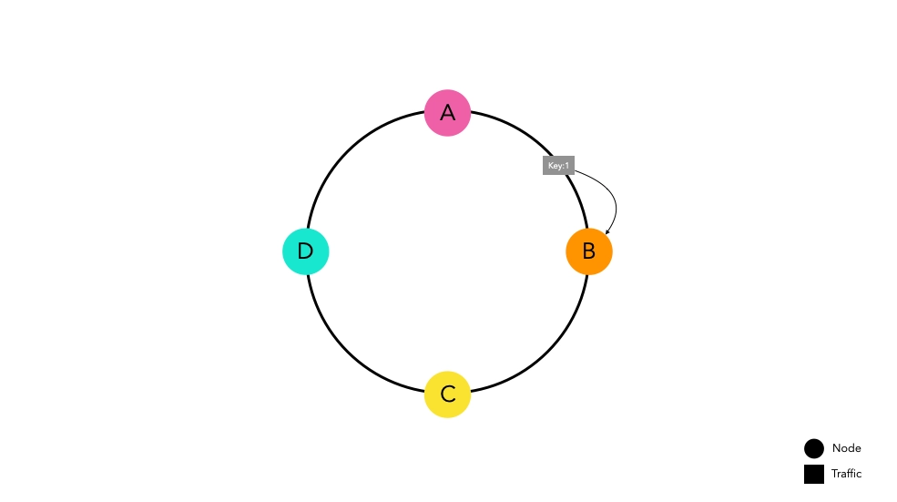
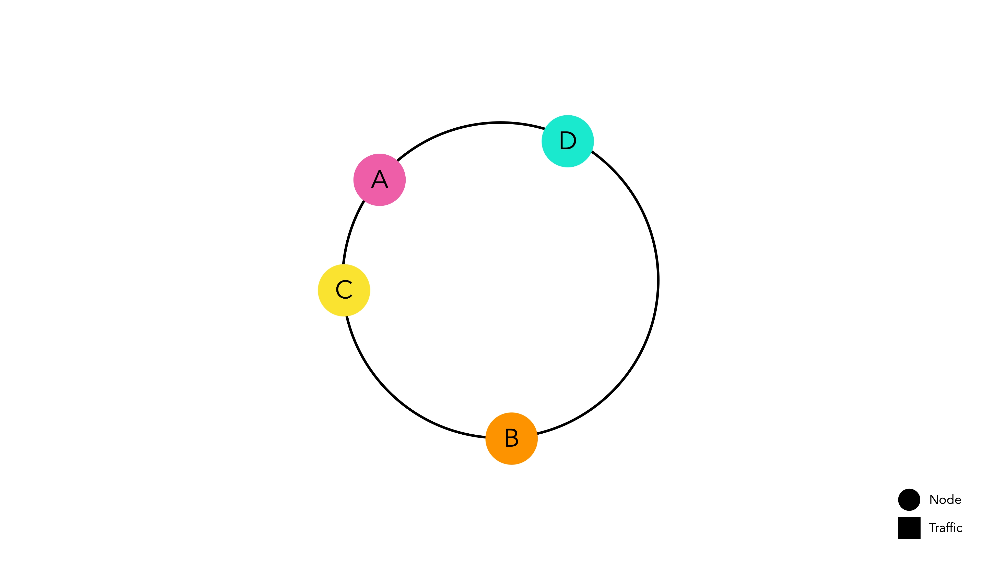
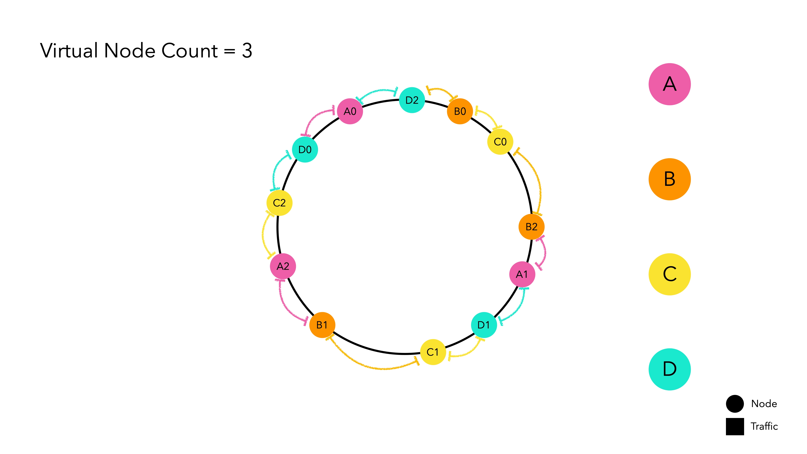
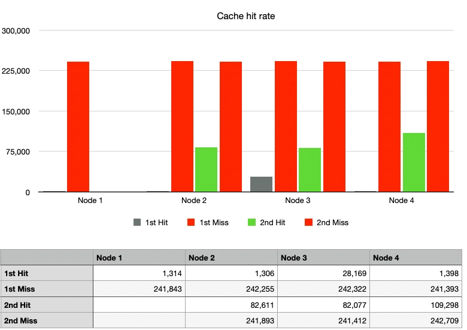
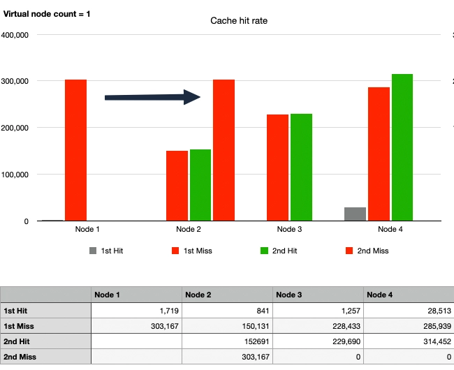
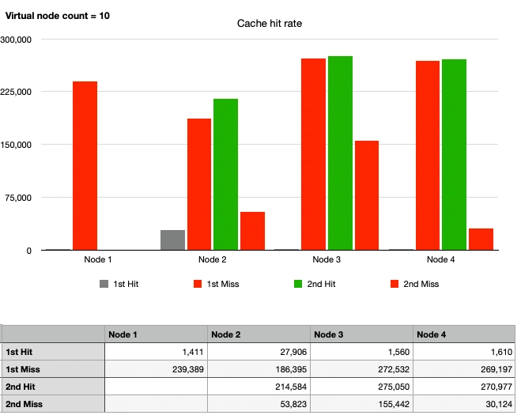
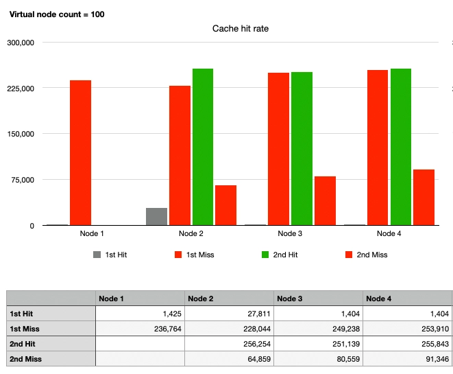

What are the essential components needed to design a large-scale system?

In this article, we will directly implement and discuss Consistent Hashing, which is commonly used in routing systems,
and talk about it based on data.

:::info

You can check the complete code on [Github](https://github.com/songkg7/consistent-hashing-sample).

:::

Since the article is quite lengthy, from now on, we will use '~' for convenience in explanations. 🙏

## What is Hashing?

Before delving into Consistent Hashing, let's briefly touch on hashing.

The dictionary definition of hashing is 'a mathematical function that takes an arbitrary length data string as input and
generates a fixed-size output, typically a hash value or hash code consisting of numbers and strings.'

In simple terms, it means that the same input string will always return the same hash code. This characteristic of
hashing is used for various purposes such as encryption and file integrity verification.

## So, What is Consistent Hashing?

Consistent Hashing is a technique used to evenly distribute data among distributed servers or services.

Even without using Consistent Hashing, it is not impossible to evenly distribute data. However, **Consistent Hashing is
focused on making horizontal scaling easier**. Before exploring Consistent Hashing, let's understand why Consistent
Hashing emerged through a simple hash routing method.

### Node-Based Hash Routing Method

> hash(key) % n


This method efficiently distributes traffic while being simple.

However, it has a significant weakness in horizontal scaling. When the node list changes, there is a high probability
that traffic will be redistributed, leading to routing to new nodes instead of existing nodes.

If you are managing traffic by caching on specific nodes, if a node leaves the group for some reason, it can cause **a
massive cache miss**, leading to service disruptions.


In an experiment with four nodes, it was observed that **if only one node leaves, the cache hit rate drops drastically
to 27%**. We will examine the experimental method in detail in the following paragraphs.

### Consistent Hash Routing Method

Consistent Hashing is a concept designed to minimize the possibility of massive cache misses.


The idea is simple. Create a kind of ring by connecting the start and end of the hash space, then place nodes on the
hash space above the ring. Each node is allocated its hash space and waits for traffic.

:::info

The hash function used to place nodes is independent of modulo operations.

:::

Now, let's assume a situation where traffic enters this router implemented with Consistent Hashing.



Traffic passed through the hash function is routed towards the nearest node on the ring. Node B caches `key1` in
preparation for future requests.

Even in the scenario of a high volume of traffic, traffic will be routed to their respective nodes following the same
principle.

#### Advantages of Consistent Hashing

##### Low probability of cache misses even when the node list changes

Let's consider a situation where Node E is added.


Previously entered keys are placed at the same points as before. Some keys that were placed between Nodes D and C now
point to the new Node E, causing cache misses. However, the rest of the keys placed in other spaces do not experience
cache misses.

Even if there is a network error causing Node C to disappear, the results are similar.


Keys that were directed to Node C now route to Node D, causing cache misses. However, the keys placed in other spaces do
not experience cache misses.

In conclusion, regardless of any changes in the node list, only keys directly related to the changed nodes experience
cache misses. This increases the cache hit rate compared to node-based hash routing, improving overall system
performance.

#### Disadvantages of Consistent Hashing

Like all other designs, Consistent Hashing, which may seem elegant, also has its drawbacks.

##### Difficult to maintain uniform partitions


_Nodes with different sizes of hash spaces are placed on the ring._

It is very difficult to predict the results of a hash function without knowing which key will be generated. Therefore,
Consistent Hashing, which determines the position on the ring based on the hash result, cannot guarantee that nodes will
have uniform hash spaces and be distributed evenly on the ring.

##### Difficult to achieve uniform distribution


_If a node's hash space is too wide, traffic can be concentrated._

This problem arises because nodes are not evenly distributed on the hash ring. If Node D's hash space is abnormally
larger than other nodes, it can lead to a hotspot issue where traffic is concentrated on a specific node, causing
overall system failure.

## Virtual Nodes

The hash space is finite. Therefore, if there are a large number of nodes placed in the hash space, the standard
deviation decreases, meaning that even if one node is removed, the next node will not be heavily burdened. The problem
lies in the fact that in the real world, **the number of physical nodes equates to cost**.

To address this, virtual nodes, which mimic physical nodes, are implemented to solve this intelligently.



Virtual nodes internally point to the hash value of the physical nodes. Think of them as a kind of duplication magic.
The main physical node is not placed on the hash ring, only the replicated virtual nodes wait for traffic on the hash
ring. When traffic is allocated to a virtual node, it is routed based on the hash value of the actual node it
represents.

## DIY Consistent Hashing

> DIY: Do It Yourself

So far, we have discussed the theoretical aspects. Personally, I believe that there is no better way to learn a concept
than **implementing it yourself**. Let's implement it.

### Choosing a Hash Algorithm

It may seem obvious since the name includes hashing, but when implementing Consistent Hashing, selecting an appropriate
hash algorithm is crucial. The speed of the hash function is directly related to performance. Commonly used hash
algorithms are MD5 and SHA-256.

- MD5: Suitable for applications where speed is more important than security. Has a smaller hash space compared to
  SHA-256. 2^128
- SHA-256: Has a longer hash size and stronger encryption properties. Slower than MD5. With a very large hash space of
  about 2^256, collisions are almost non-existent.

For routing, speed is more important than security, and since there are fewer concerns about hash collisions, MD5 is
considered sufficient for implementing the hash function.

```java
public class MD5Hash implements HashAlgorithm {
    MessageDigest instance;

    public MD5Hash() {
        try {
            instance = MessageDigest.getInstance("MD5");
        } catch (NoSuchAlgorithmException e) {
            throw new IllegalStateException("no algorithm found");
        }
    }

    @Override
    public long hash(String key) {
        instance.reset();
        instance.update(key.getBytes());
        byte[] digest = instance.digest();
        long h = 0;
        for (int i = 0; i < 4; i++) {
            h <<= 8;
            h |= (digest[i]) & 0xFF;
        }
        return h;
    }
}
```

:::tip

In Java, you can conveniently implement a hash function using the MD5 algorithm through `MessageDigest`.

:::

### Hash Ring

```java
// Hash the businessKey and find the hashed value (node) placed on the ring.
public T routeNode(String businessKey) {
    if (ring.isEmpty()) { // If the ring is empty, it means there are no nodes, so return null
        return null;
    }
    Long hashOfBusinessKey = this.hashAlgorithm.hash(businessKey);
    SortedMap<Long, VirtualNode<T>> biggerTailMap = ring.tailMap(hashOfBusinessKey);
    Long nodeHash;
    if (biggerTailMap.isEmpty()) {
        nodeHash = ring.firstKey();
    } else {
        nodeHash = biggerTailMap.firstKey();
    }
    VirtualNode<T> virtualNode = ring.get(nodeHash);
    return virtualNode.getPhysicalNode();
}
```

The hash ring is implemented using a `TreeMap`. Since `TreeMap` maintains keys (hash values) in ascending order upon
storage, we can use the `tailMap(key)` method to find values greater than the key (hash value) and connect them to the
largest key if a larger key cannot be found.

:::info

If you are not familiar with `TreeMap`, please refer to this [link](https://coding-factory.tistory.com/557).

:::

### Testing

How effective is Consistent Hashing compared to the standard routing method? Now that we have implemented it ourselves,
let's resolve this question. The rough test design is as follows:

- Process 1 million requests, then introduce changes to the node list and assume the same traffic comes in again.
- 4 physical nodes

The numerical data was quantified through a simple test code[^fn-nth-1], and when graphed, it revealed six cases. Let's
look at each one.

#### Case 1: Simple Hash, No Node Changes


After sending 1 million requests and then another 1 million of the same requests, since there were no changes in the
nodes, the cache hit rate was 100% from the second request onwards.

:::info

Although the cache hit rate was low, the possibility of cache hits even in the first request (gray graph) was due to the
random nature of the keys used in the test, resulting in a low probability of duplicate key values.

:::

Looking at the heights of the graphs for the nodes, we can see that the routing using `hash % N` is indeed distributing
all traffic very evenly.

#### Case 2: Simple Hash, 1 Node Departure



The cache hit rate, indicated by the green graph, significantly decreased. With Node 1 departing, the traffic was
distributed to Nodes 2, 3, and 4. While some traffic luckily hit the cache on the same nodes as before, most of it was
directed to different nodes, resulting in cache misses.

#### Case 3: Consistent Hash, No Node Changes, No Virtual Nodes


:::info

Considering that physical nodes are not placed on the hash ring, using only one virtual node practically means not using
virtual nodes.

:::

Similar to Case 1, the red graph rises first as cache hits cannot occur immediately in the first request. By the second
request, the cache hit rate is 100%, aligning the heights of the green and red graphs.

However, it can be observed that the heights of the graphs for each node are different, indicating the drawback of
Consistent Hashing—**uneven traffic distribution due to non-uniform partitions**.

#### Case 4: Consistent Hash, 1 Node Departure, No Virtual Nodes



After Node 1 departs, the cache hit rate overwhelmingly improved compared to Case 2.

Upon closer inspection, it can be seen that the traffic originally directed to Node 1 then moved to Node 2 in the second
traffic wave. Node 2 processed around 450,000 requests, including cache hits, which is more than twice the amount
processed by Node 3 with 220,000 requests. Meanwhile, the traffic to Nodes 3 and 4 remained unchanged. This illustrates
the advantage of Consistent Hashing while also highlighting a kind of **hotspot phenomenon**.

#### Case 5: Consistent Hash, 1 Node Departure, 10 Virtual Nodes

To achieve uniform partitioning and resolve the hotspot issue, let's apply virtual nodes.



Overall, there is a change in the graphs. The traffic that was supposed to go to Node 1 is now divided among Nodes 2, 3,
and 4. Although the partitions are not evenly distributed, the hotspot issue is gradually being resolved compared to
Case 4. Since 10 virtual nodes seem insufficient, let's increase them further.

#### Case 6: Consistent Hash, 1 Node Departure, 100 Virtual Nodes



Finally, the graphs for Nodes 2, 3, and 4 are similar. After Node 1's departure, there are 100 virtual nodes per
physical node on the hash ring, totaling 300 virtual nodes. In summary:

- It can be seen that traffic is evenly distributed enough to withstand Case 1.
- Even if Node 1 departs, the traffic intended for Node 1 is spread across multiple nodes, preventing the hotspot issue.
- Apart from the traffic directed to Node 1, the cache still hits.

By placing a sufficient number of virtual nodes, the routing method using Consistent Hashing has become highly
advantageous for horizontal scaling compared to the remaining operations, as observed.

## Conclusion

We have examined Consistent Hashing as discussed in Chapter 5 of the fundamentals of large-scale system design. We hope
this has helped you understand what Consistent Hashing is, and why it exists to solve certain problems.

Although not mentioned in a separate case, I was concerned about how many virtual nodes should be added to achieve a
perfectly uniform distribution. Therefore, I increased the number of virtual nodes to 10,000 and found that adding more
virtual nodes had minimal effect. Theoretically, increasing virtual nodes should converge the variance to zero and
achieve a uniform distribution. However, increasing virtual nodes means having many instances on the hash ring, leading
to unnecessary overhead. It requires the task of finding and organizing virtual nodes on the hash ring whenever a new
node is added or removed[^fn-nth-2]. In a live environment, please set an appropriate number of virtual nodes based on
data.

## Reference

- [How Does Java HashMap Work](https://d2.naver.com/helloworld/831311)
- [Designing Consistent Hashing](https://donghyeon.dev/%EC%9D%B8%ED%94%84%EB%9D%BC/2022/03/20/%EC%95%88%EC%A0%95-%ED%95%B4%EC%8B%9C-%EC%84%A4%EA%B3%84/)
- [Lonor/websocket-cluster](https://github.com/Lonor/websocket-cluster)

[^fn-nth-1]: [SimpleHashRouterTest](https://github.com/songkg7/consistent-hashing-sample/blob/main/src/test/java/com/example/consistenthashingsample/router/SimpleHashRouterTest.java)

[^fn-nth-2]: In particular, for a Hash Ring implemented using TreeMap, massive insertions and deletions are somewhat
inefficient as the internal elements need to be rearranged each time.
