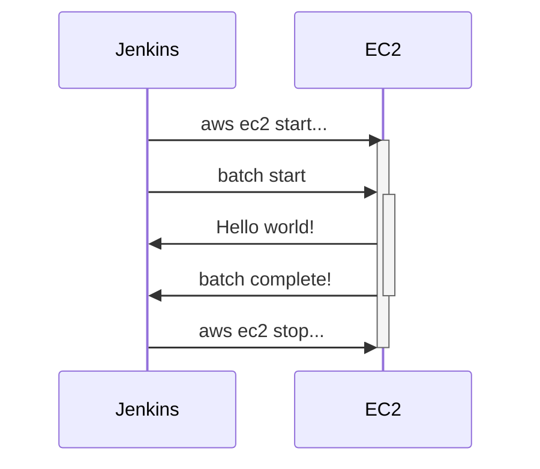
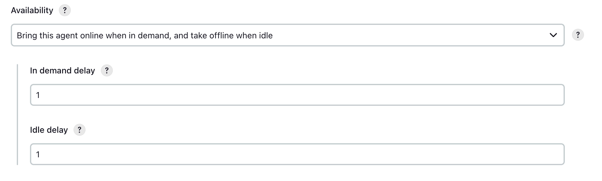
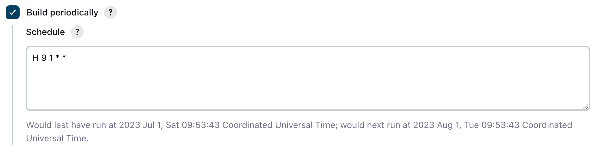

I would like to share a very simple method for optimizing resource costs when dealing with batch applications that need to run at specific times and under specific conditions.

## Problem

1. Batches are only executed at specific times. For tasks like calculations, which need to run at regular intervals like daily, monthly, or yearly.
2. Speed of response is not crucial; ensuring that the batch runs is the priority.
3. Maintaining an EC2 instance for 24 hours just for resources needed at specific times is inefficient.
4. Is it possible to have the EC2 instance ready only when the cloud server resources are needed?

Of course, it is possible. While there are various automation solutions like AWS ECS and AWS EKS, let's assume managing batches and EC2 servers directly with Jenkins and set up the environment.

## Architecture



With this infrastructure design, you can ensure that costs are incurred only when resources are needed for batch execution.

## Jenkins

### Jenkins Node Management Policy



Activates the node only when there are requests waiting in the queue, minimizing unnecessary error logs. Additionally, it transitions to idle state if there is no activity for 1 minute.

## AWS CLI

### Installing AWS CLI

With AWS CLI, you can manage AWS resources in a terminal environment. Use the following command to retrieve a list of currently running instances:

```bash
aws ec2 describe-instances
```

Once you have checked the information for the desired resource, you can specify the target and execute a specific action. The commands are as follows:

#### EC2 start

```bash
aws ec2 start-instances --instance-ids {instanceId}
```

#### EC2 stop

```bash
aws ec2 stop-instances --instance-ids {instanceId}
```

## Scheduling

By writing a cron expression for the batch to run once a month, you can set it up easily.



```text
H 9 1 * *
```

Now, the EC2 instance will remain in a stopped state most of the time and will be activated by Jenkins once a month to process the batch.

## Conclusion

Keeping an EC2 instance in a running state when not in use is inefficient in terms of cost. This article has shown that with Jenkins and simple commands, you can use EC2 only when needed.

While higher-level cloud orchestration tools like EKS can elegantly solve such issues, sometimes a simple approach can be the most efficient. I hope you choose the method that suits your situation best as I conclude this article.