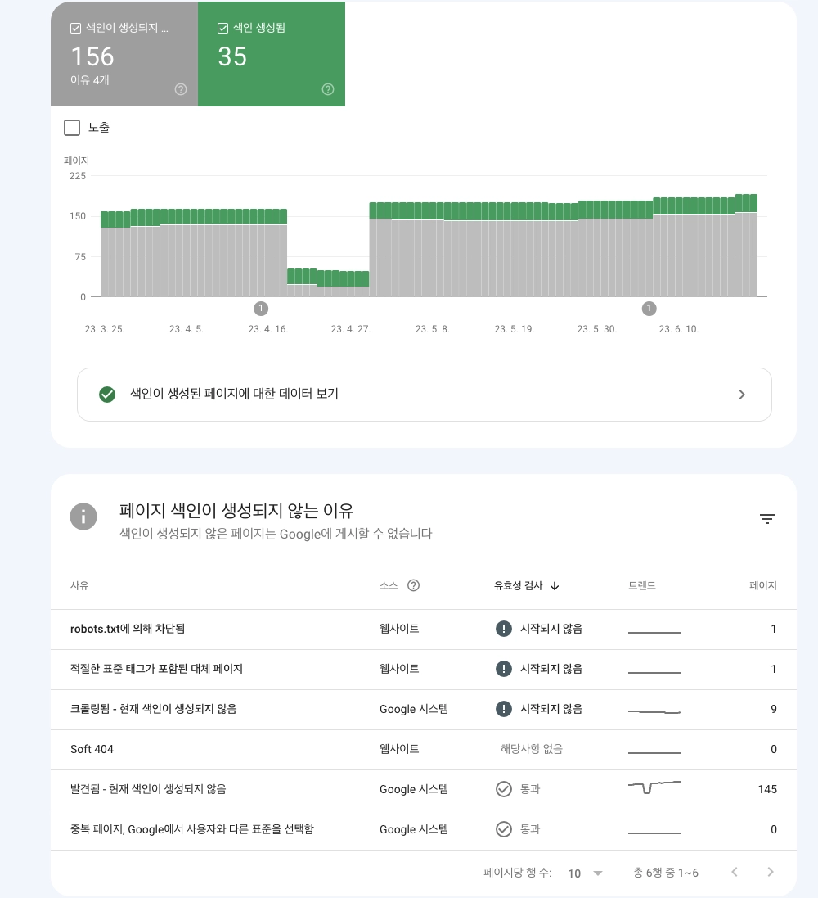

## Overview

This post holds a significant meaning for me. It is intended to be the final entry of the blog journey I have been on
since the beginning of the year. As a review, I will summarize my blogging experience up to this point.

## Criteria for Choosing a Blogging Platform

I was looking for a platform that met the following criteria to facilitate convenient posting:

- Easy use of Markdown
- Convenient image uploading
- Ongoing maintenance (especially for open-source platforms)

While platforms like Tistory lacked robust Markdown support and had cumbersome image uploading processes, Velog,
although popular among developers, seemed neglected recently, so I decided against it. In the end, I found GitHub Page +
Jekyll to be the most rational choice as it fully supports Markdown, makes image uploading easy, and allows for
long-term maintenance. Although managing Jekyll requires some knowledge of Ruby, I had a basic understanding and
committed to learning as needed, and have been operating with this setup to date.

## SEO Struggles

Despite my efforts to get all pages indexed, things haven't gone as smoothly as I hoped. When will the crawling finally
start?

However, this journey has led me to study the field more and realize the importance of patience. Even though it's taking
time for the pages to get indexed, I believe that with increased traffic, indexing will happen naturally. Gradually, I
have noticed an increase in the number of indexed pages. While I am publishing content faster than the indexing speed, I
have to accept that I cannot control the time it takes for the pages to get indexed and appear in search results due to
Google's crawling policies.

## Evolution of Content

Initially, when I started my blog on Tistory, I focused on algorithm problem-solving as I was diving into algorithm
studies.

As I delved into practical work, I realized that algorithm solutions are better explained on algorithmic problem-solving
platforms, and simply listing knowledge felt redundant compared to consulting official documentation. I did not want my
blog to become just another mundane one.

My desire to create a blog that is **distinctive and personal, setting it apart from others** has continued, driving me
to enhance the quality and uniqueness of my content. Some posts that I find personally satisfying
include [my journey of creating open-source projects](https://haril.dev/en/blog/2023/02/22/develop-obsidian-plugin)
and [implementing concepts rather than just reading about them](https://haril.dev/en/blog/2023/06/04/Consistent-Hashing).

:::info

In 2024, it evolved further into a blog using Docusaurus 😄.

:::

## Open-Sourcing Obsidian Plugin

I have developed a plugin called [O2](https://github.com/songkg7/o2) specifically for blog posting. It facilitates the
continuity between Obsidian and Jekyll tasks. Developing this plugin required me to learn TypeScript as well 😅.

Fortunately, around 400 users have joined me in using this plugin as of July 2023. ~~Although most probably uninstalled
it within 10 minutes... DAU 1...~~

Initially, there were many bugs, but now, after addressing numerous minor issues, the plugin has entered a stable phase.
If you are an Obsidian user who uses Jekyll as a blogging platform, I would appreciate it if you could show some
interest in this plugin!

I have also obtained the `plugin dev` role in the Obsidian Discord Community and am actively participating. Feel free to
ask any Obsidian-related questions!

## Growth Metrics

To maintain consistent motivation and direction when starting my blog, I believed that using Google Analytics was
essential. Seeing the graph gradually trend upwards gave me a sense of accomplishment. Some argue that having few
initial blog visitors can have a negative impact, but personally, it motivated me. It sparked a desire to attract more
people to my blog.

Below is the growth rate of my blog over the past year.

Despite the dynamic appearance of the graph, the numbers are not as high compared to many influential bloggers. That's
the paradox of statistics... Nevertheless, the overall upward trend is encouraging.

Participating in the writing program has made me pay more attention to the quality of my posts, and as a result,
external links have started to generate more traffic. Especially, being curated frequently on the **Serfit community
site** has significantly boosted traffic. I am grateful to the curator who selected my mediocre posts. I will strive to
write more diligently and refine my work in the future.

## Future Goals

When summarizing my goals for the second half of this year and the next year, they can be outlined as follows:

1. Strive to publish high-quality, distinctive, and practical posts beyond simple knowledge sharing.
2. Reach over 30,000 new users.
3. Publish at least two posts per month.
4. Start posting in English for language learning purposes.

I am particularly pondering the best approach and platform for English posts. In the future, I would like to post in
languages other than English, so **considering multilingual support** will be crucial. As I progress through the writing
program (please select me for the 9th cohort), I will further refine these plans.

Thank you for accompanying me on my journey so far. I look forward to your continued support 🙏.
