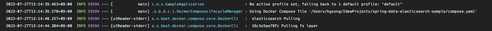

Let's take a brief look at the Docker Compose Support introduced in Spring Boot 3.1.

:::info

Please provide feedback if there are any inaccuracies!

:::

## Overview

When developing with the Spring framework, it seems that using Docker for setting up DB environments is more common than installing them directly on the local machine. Typically, the workflow involves:

1. Using `docker run` before bootRun to prepare the DB in a running state
2. Performing development and validation tasks using bootRun
3. Stopping bootRun and using `docker stop` to stop the container DB

The process of running and stopping Docker before and after development tasks used to be quite cumbersome. However, starting from Spring Boot 3.1, you can use a `docker-compose.yaml` file to synchronize the lifecycle of Spring and Docker containers.

## Contents

First, add the dependency:

```groovy
dependencies {
    // ...
    developmentOnly 'org.springframework.boot:spring-boot-docker-compose'
    // ...
}
```

Next, create a compose file as follows:

```yaml
services:
  elasticsearch:
    image: 'docker.elastic.co/elasticsearch/elasticsearch:7.17.10'
    environment:
      - 'ELASTIC_PASSWORD=secret'
      - 'discovery.type=single-node'
      - 'xpack.security.enabled=false'
    ports:
      - '9200' # random port mapping
      - '9300'
```



During bootRun, the compose file is automatically recognized, and the `docker compose up` operation is executed first.

However, if you are mapping the container port to a random host port, you may need to update the `application.yml` every time `docker compose down` is triggered. Fortunately, starting from Spring Boot 3.1, once you write the compose file, Spring Boot takes care of the rest. It's incredibly convenient!

If you need to change the path to the compose file, simply modify the `file` property:

```yaml
spring:
  docker:
    compose:
      file: infrastructure/compose.yaml
```

There are also properties related to lifecycle management, allowing you to appropriately adjust the container lifecycle. If you don't want the container to stop every time you shut down Boot, you can use the `start_only` option:

```yaml
spring:
  docker:
    compose:
      lifecycle-management: start_and_stop # none, start_only
```

There are various other options available, so exploring them should help you choose what you need.


## Conclusion

No matter how much test code you write, verifying the interaction with the actual DB was essential during the development process. Setting up that environment felt like a tedious chore. While container technology made configuration much simpler, remembering to run `docker` commands before and after starting Spring Boot was definitely a hassle.

Now, starting from Spring Boot 3.1, developers can avoid situations where they forget to start or stop containers, preventing memory consumption. It allows developers to focus more on development. The seamless integration of Docker with Spring is both fascinating and convenient. Give it a try!

## Reference

- [Docker Compose Support in Spring Boot 3.1](https://spring.io/blog/2023/06/21/docker-compose-support-in-spring-boot-3-1)