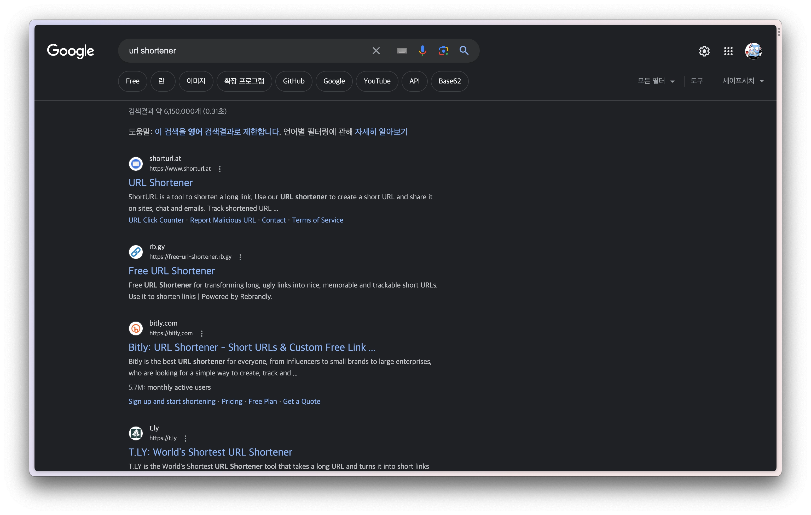
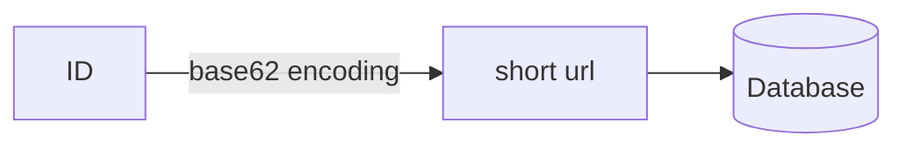
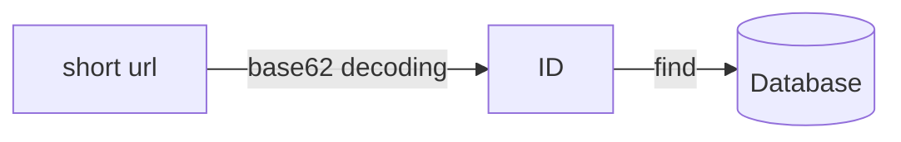
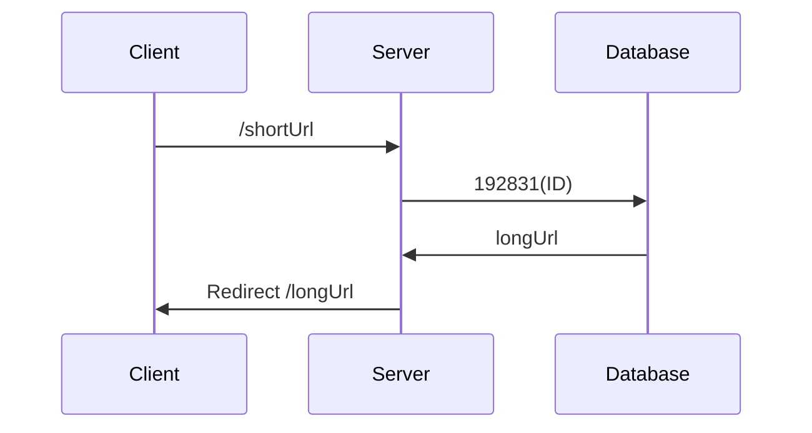

:::info

You can check the code on [GitHub](https://github.com/songkg7/url-shortener-sample).

:::

## Overview

Shortening URLs started to prevent URLs from being fragmented in email or SMS transmissions. However, nowadays, it is
more actively used for sharing specific links on social media platforms like Twitter or Instagram. It improves
readability by not looking verbose and can also provide additional features such as collecting user statistics before
redirecting to the URL.

In this article, we will implement a URL shortener from scratch and explore how it works.

## What is a URL Shortener?

Let's first take a look at the result.

You can run the URL shortener we will implement in this article directly with the following command:

```bash
docker run -d -p 8080:8080 songkg7/url-shortener
```

Here is how to use it. Simply input the long URL you want to shorten as the value of `longUrl`.

```bash
curl -X POST --location "http://localhost:8080/api/v1/shorten" \
    -H "Content-Type: application/json" \
    -d "{
            \"longUrl\": \"https://www.google.com/search?q=url+shortener&sourceid=chrome&ie=UTF-8\"
        }"
# You will receive a random value like tN47tML.
```

Now, if you access `http://localhost:8080/tN47tML` in your web browser,



You will see that it correctly redirects to the original URL.

**Before Shortening**

- https://www.google.com/search?q=url+shortener&sourceid=chrome&ie=UTF-8

**After Shortening**

- http://localhost:8080/tN47tML

Now, let's see how we can shorten URLs.

## Rough Design

### Shortening URLs

1. Generate an ID before storing the longUrl.
2. Encode the ID to base62 to create the shortUrl.
3. Store the ID, shortUrl, and longUrl in the database.

Memory is finite and relatively expensive. RDB can be quickly queried through indexes and is relatively cheaper compared
to memory, so we will use RDB to manage URLs.

To manage URLs, we first need to secure an ID generation strategy. There are various methods for ID generation, but it
may be too lengthy to cover here, so we will skip it. I will simply use the current timestamp for ID generation.

#### Base62 Conversion

By using ULID, you can generate a unique ID that includes a timestamp.

```kotlin
val id: Long = Ulid.fast().time // e.g., 3145144998701, used as a primary key
```

Converting this number to base62, we get the following string.

```
tN47tML
```

This string is stored in the database as the shortUrl.

| id            | short   | long                                                                   |
|---------------|---------|------------------------------------------------------------------------|
| 3145144998701 | tN47tML | https://www.google.com/search?q=url+shortener&sourceid=chrome&ie=UTF-8 |

The retrieval process will proceed as follows:

1. A GET request is made to `localhost:8080/tN47tML`.
2. Decode `tN47tML` from base62.
3. Obtain the primary key 3145144998701 and query the database.
4. Redirect the request to the longUrl.

Now that we have briefly looked at it, let's implement it and delve into more details.

## Implementation

Just like the previous article on Consistent Hashing, we will implement it ourselves. Fortunately, implementing a URL
shortener is not that difficult.

### Model

First, we implement the model to receive requests from users. We simplified the structure to only receive the URL to be
shortened.

```kotlin
data class ShortenRequest(
    val longUrl: String
)
```

We implement a Controller to handle `POST` requests.

```kotlin
@PostMapping("/api/v1/shorten")
fun shorten(@RequestBody request: ShortenRequest): ResponseEntity<ShortenResponse> {
    val url = urlShortenService.shorten(request.longUrl)
    return ResponseEntity.ok(ShortenResponse(url))
}
```

### Base62 Conversion

Finally, the most crucial part. After generating an ID, we encode it to base62 to shorten it. This shortened string
becomes the shortUrl. Conversely, we decode the shortUrl to find the ID and use it to query the database to retrieve the
longUrl.







```kotlin
private const val BASE62 = "0123456789abcdefghijklmnopqrstuvwxyzABCDEFGHIJKLMNOPQRSTUVWXYZ"

class Base62Conversion : Conversion {
    override fun encode(input: Long): String {
        val sb = StringBuilder()
        var num = BigInteger.valueOf(input)
        while (num > BigInteger.ZERO) {
            val remainder = num % BigInteger.valueOf(62)
            sb.append(BASE62[remainder.toInt()])
            num /= BigInteger.valueOf(62)
        }
        return sb.reverse().toString()
    }

    override fun decode(input: String): Long {
        var num = BigInteger.ZERO
        for (c in input) {
            num *= BigInteger.valueOf(62)
            num += BigInteger.valueOf(BASE62.indexOf(c).toLong())
        }
        return num.toLong()

    }
}
```

The length of the shortened URL is inversely proportional to the size of the ID number. The smaller the generated ID
number, the shorter the URL can be made.

If you want the length of the shortened URL to not exceed 8 characters, you should ensure that the size of the ID does
not exceed 62^8. Therefore, how you generate the ID is also crucial. As mentioned earlier, to simplify the content in
this article, we handled this part using a timestamp value.

### Test

Let's send a POST request with `curl` to shorten a random URL.

```bash
curl -X POST --location "http://localhost:8080/api/v1/shorten" \
    -H "Content-Type: application/json" \
    -d "{
            \"longUrl\": \"https://www.google.com/search?q=url+shortener&sourceid=chrome&ie=UTF-8\"
        }"
```

You can confirm that it correctly redirects by accessing http://localhost:8080/{shortUrl}.

## Conclusion

Here are some areas for improvement:

- By controlling the ID generation strategy more precisely, you can further shorten the shortUrl.
    - If there is heavy traffic, you must consider issues related to concurrency.
    - Snowflake
- Using DNS for the host part can further shorten the URL.
- Applying cache to the Persistence Layer can achieve faster responses.
