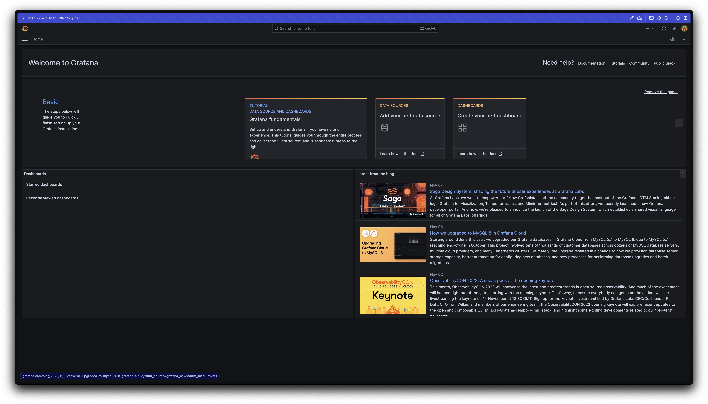

## Overview

> How many concurrent users can a Spring MVC web application accommodate? 🤔

To estimate the approximate number of users a server needs to handle to provide stable service while accommodating many
users, this article explores changes in network traffic focusing on Spring MVC's Tomcat configuration.

For the sake of convenience, the following text will be written in a conversational tone 🙏

:::info

If you find any technical errors, typos, or incorrect information, please let us know in the comments. Your feedback is
greatly appreciated 🙇‍♂️

:::

<!-- truncate -->

## Test Scenario

- Assuming a situation where over 200 users are making API requests simultaneously
- Implementing a 5-second wait time to simulate a delay and prevent the API from responding too quickly
- Adjusting Spring MVC's Tomcat configuration to verify traffic processing capacity
- To prevent contamination of test data, deploying the API on EC2 and generating load locally

## Environment

- EC2 t4g.small (Amazon Linux 2core 2GB 64bit ARM)
- SpringBoot 3.1.5
- Spring MVC
- Spring Actuator
- K6

## Test Application

First, let's implement a simple API.

```java
@RestController
public class HelloController {

    @GetMapping("/hello")
    public String hello() throws InterruptedException {
        TimeUnit.SECONDS.sleep(5); // Simulate processing time
        return "Hello, World!";
    }
}
```

A 5-second delay is added to simulate an overloaded API. Without a delay, requests would be processed too quickly,
making it difficult to observe network behavior. The settings to adjust in this article are as follows:

```yaml
server:
  tomcat:
    threads:
      max: 200                # Total number of threads that can be created
    max-connections: 8192     # Total number of connections that can be established
    accept-count: 100         # Size of the work queue
    connection-timeout: 20000 # Timeout threshold, 20 seconds
```

To facilitate smooth modification of settings on the server, all parts are replaced with system environment variables.

```yaml
server:
  tomcat:
    threads:
      max: ${TOMCAT_MAX_THREADS:200}
    max-connections: ${TOMCAT_MAX_CONNECTIONS:8192}
    accept-count: ${TOMCAT_ACCEPT_COUNT:100}
    connection-timeout: ${TOMCAT_CONNECTION_TIMEOUT:20000}
```

Write a Dockerfile to build the Docker image.

```dockerfile
# Java 17 multi-stage build
FROM gradle:8.4.0-jdk17 as builder
WORKDIR /app
COPY . .
RUN gradle clean build

FROM openjdk:17-ea-11-jdk-slim
WORKDIR /app
COPY --from=builder /app/build/libs/*.jar app.jar
EXPOSE 8080
ENTRYPOINT ["java", "-jar", "app.jar"]
```

Build the Docker image.

```bash
docker build -t sample-server .
```

Preparation for the test application is almost complete. Push the image to a suitable registry and run `docker run` on
EC2. The process of creating an EC2 instance and deploying the image is omitted for brevity.

## K6

[K6](https://k6.io/) is a modern load testing tool developed by Grafana Labs. It allows you to write test scenarios in
JavaScript and simulate a wide range of scenarios. While [Apache JMeter](https://jmeter.apache.org/) is also a good
option for this test, K6 integrates well with Grafana for visualizing test results and is easier to use, allowing you to
easily verify various scenarios. Therefore, K6 is chosen for this test. Recently, K6 is preferred over JMeter.

### Installing K6

```bash
brew install k6
```

### Monitoring Configuration

Run Grafana and InfluxDB using Docker Compose.

```yaml
version: "3.7"

services:
  influxdb:
    image: bitnami/influxdb:1.8.5
    container_name: influxdb
    ports:
      - "8086:8086"
      - "8085:8088"
    environment:
      - INFLUXDB_ADMIN_USER_PASSWORD=bitnami123
      - INFLUXDB_ADMIN_USER_TOKEN=admintoken123
      - INFLUXDB_HTTP_AUTH_ENABLED=false
      - INFLUXDB_DB=myk6db
  granafa:
    image: bitnami/grafana:latest
    ports:
      - "3000:3000"
```

```bash
docker compose up -d
```

Check if InfluxDB is running correctly. If the following command does not work, install the command first
with `brew install influxdb-cli`.

```bash
influx ping
# OK
```

Access http://localhost:3000 to confirm that Grafana is working properly.



:::info

The initial credentials for Grafana are both "admin" for the username and password. Although it will prompt you to
change the password, as this is a test environment, you can skip it.

:::

Set up InfluxDB as a data source and import
the [K6 dashboard](https://grafana.com/grafana/dashboards/2587-k6-load-testing-results/) URL to complete the monitoring
configuration.


_Setting up a monitoring environment in just 5 minutes...!_

### Writing Test Script

To perform a spike test, create the following script.

```js
// spike-test.js
import http from 'k6/http';
import {check} from 'k6';

export const options = {
    scenarios: {
        spike: {
            executor: 'constant-vus',
            vus: 300,
            duration: '1s',
        },
    },
};

export default function () {
    const res = http.get('http://{EC2_INSTANCE_IP}/hello');
    check(res, {'is status 200': (r) => r.status == 200});
};
```

Here are some key points:

- `constant-vus`: An executor that pre-generates a fixed number of users before the test starts
- `vus`: Virtual users, representing the number of users to be used in the test

## Running the Test and Analysis

Run the following command to start the test.

```bash
k6 run --out influxdb=http://localhost:8086/myk6db spike-test.js
```

### 300 requests

Let's start by sending 300 requests. The expected behavior is as follows:

- The max number of threads in the thread pool is 200, and the work queue (acceptCount) is 100. Therefore, 200 requests
  will be processed immediately, followed by the processing of the remaining 100 requests.


As expected, 200 requests are processed first at 5-second intervals, followed by the remaining 100 requests.

### 1000 requests


Again, requests are processed at 5-second intervals. The total processing time is around 25 seconds. While the user who
accessed the API first may receive a response in 5.01 seconds, others may have to wait 25 seconds to see the result.

At this point, the default Tomcat setting's `connection-timeout` of 20 seconds has been exceeded. However, no timeout
errors occurred, and all requests were processed, even if it took longer than 20 seconds. This suggests that
the `connection-timeout` does not start counting from the moment the request is made. More details on this will be
explained later.

### 2000 requests

It's time to face a challenge.

K6 has a `gracefulStop`[^fn-nth-1] feature that safely stops tests that have been running for a certain period of time
before a timeout occurs. The default value is 30 seconds, which can cause the test to stop before a timeout error is
encountered. To run the test for a longer period, the script needs to be modified.

```js
import http from 'k6/http';
import {check} from 'k6';

export const options = {
    scenarios: {
        spike: {
            executor: 'constant-vus',
            vus: 2000,
            duration: '1s',
            gracefulStop: '5m', // Added
        },
    },
};

export default function () {
    const res = http.get('http://54.180.78.85/hello');
    check(res, {'is status 200': (r) => r.status == 200});
};
```


By extending the `gracefulStop` time, the test no longer stops before encountering a timeout error.

### 3000 requests

Another challenge arises.


This time, requests start to experience request timeouts after waiting for about a minute.

With 200 threads processing 3000 requests, users who are unlucky enough to be at the end of the queue need to wait 75
seconds (3000 / 200 * 5 = 75s) to receive a response. To avoid timeouts, the response time needs to be reduced by at
least 15 seconds. Increasing the thread pool size from 200 to around 500 would increase the concurrency and resolve the
issue.

```bash
docker run -d -p "80:8080" \
    -e TOMCAT_MAX_THREADS=500 \
    --name sample-server \
    --restart always \
    123456789012.dkr.ecr.ap-northeast-2.amazonaws.com/sample-server:v1
```

Considering the purpose of this test, increasing the number of threads seems to be the most appropriate solution. By
doing so, the response time was reduced from 75 seconds to 30 seconds, demonstrating that simply adding more threads can
improve performance significantly.

After increasing the thread pool size, the test was run again with 3000 requests.


As expected, all requests were processed without any errors.

### 6000 requests


Although the thread pool was increased to 500, request timeouts occurred again with 6000 requests. It seems that further
increasing the concurrency is necessary. While adding more threads can lead to resource contention, in this case,
increasing the thread count to 1000 was sufficient to handle the load and maintain stability.


### 10k requests

Finally, with minimal configuration changes, 10,000 concurrent requests were achieved. However, new errors, such as "
cannot allocate memory," "connection reset by peer," "request timeout" (occurring at 20 seconds), and "i/o timeout,"
started to appear.


The root cause of these errors was investigated by monitoring the number of TCP connections being accepted at runtime
using the `ss` command in Linux.

```bash
# Monitor TCP connections
watch ss -s
```


_The number of closed connections did not exceed 10k. If connections were being created normally, it would have exceeded
10k._


_Even after waiting a while and repeating the test, only 8293 VUs were successful._

It was confirmed that the server was unable to establish over 10,000 TCP connections. This led to various errors,
indicating that the server was unable to accept new connections. This raised the question of why this was happening.

At this point, several hypotheses were considered, leading to the creation of a few theories:

1. The `max-connections` property may be related to the maximum number of TCP connections the application can handle.
2. The request timeout error occurring around 20 seconds might be related to the `connection-timeout` setting.
3. The `accept-count` property might also be related to the maximum number of TCP connections the application can
   handle (approximately 8293, the sum of 8192 + 100).
4. Increasing `max-connections` might allow the server to handle more connections and avoid connection timeout errors.

The subsequent steps involve verifying each of these hypotheses. To ensure that each test is independent, a new
container was created for each configuration change, as the tests were run on the same server.

#### 1. Max Connections

> Is the `max-connections` property related to the maximum number of TCP connections the application can handle?

First, the `max-connections` value was increased to 20k, and the test was run.


The number of connections exceeded 10k, indicating that the server could handle more connections.


Moreover, all requests were processed without any errors. This suggests that the `max-connections` property is directly
related to the number of connections the OS can accept.

#### 2. Connection Timeout

> Is the request timeout error related to the `connection-timeout` setting, occurring when the server fails to establish
> a TCP connection within 20 seconds?

Next, the `max-connections` was set back to the default value, and the `connection-timeout` was increased to 30 seconds
before running the test.

```yaml
max-connections: 8192
connection-timeout: 30000
```

Despite the increased timeout, request timeouts still occurred after 20 seconds. This indicates that
the `connection-timeout` setting is not related to the connection initiation process.

In fact, this setting is a timeout for closing the connection after it has been established, not for the initial
connection establishment[^fn-nth-2]. The request timeout error occurring around 20 seconds after the test started was
due to the work queue and connection limits being reached, rather than the `connection-timeout` setting.

#### 3. Accept Count

> Is the `accept-count` property related to the maximum number of TCP connections the application can handle?

```yaml
max-connections: 8192
accept-count: 2000 # Queue size
```

The `accept-count` was increased to 2000 to see if it could handle over 10k requests. Would increasing
the `accept-count` allow the server to process more than 10k requests, or would it still fail due to the connection
limit? Let's find out.


The results were impressive. Even though the `max-connections` was not increased, increasing the `accept-count` allowed
the server to handle over 10k requests.

Some blogs suggest that requests waiting in the work queue (`accept-count`) do not establish TCP connections. To verify
this, the application's settings were checked using Actuator, and everything was as expected.


_Actuator is a useful tool for monitoring the status of a running application._

By examining the `ServerProperties` class's JavaDoc, a hint was found that sheds light on this mystery.

```java
/**
 * Maximum number of connections that the server accepts and processes at any
 * given time. Once the limit has been reached, the operating system may still
 * accept connections based on the "acceptCount" property.
 */
private int maxConnections = 8192;

/**
 * Maximum queue length for incoming connection requests when all possible request
 * processing threads are in use.
 */
private int acceptCount = 100;
```

Reviewing the comment for the `maxConnections` field, it states:

> Once the limit has been reached, the operating system may still accept connections based on the "acceptCount"
> property.

This indicates that when the `maxConnections` limit is reached, the OS can still accept additional connections based on
the `acceptCount` value, supporting the hypothesis that the sum of `maxConnections` and `acceptCount` (8192 + 100 =
8293)[^fn-nth-3] is the approximate limit.

In summary:

1. Both `max-connections` and `accept-count` affect the number of connections the application can handle.
2. `threads.max` directly affects the throughput of the application.
3. `connection-timeout` is not related to the request timeout error caused by the server failing to establish a TCP
   connection.
4. Increasing `max-connections` can help avoid timeout errors caused by the server being unable to accept new
   connections.


:::info

If `threads.max`, `max-connections`, and `accept-count` are all set to 1, what will happen? Depending on the throughput,
requests that are not accepted within the time limit will result in a timeout. In the current environment, 3 requests
succeeded, and 7 failed. By increasing `acceptCount` to 10, all requests are accepted, resulting in success.

:::

#### 4. Max Connections and Connection Timeout

> Can increasing `max-connections` help avoid connection timeout errors by establishing connections and avoiding
> timeouts?

As seen in point 2, the `connection-timeout` setting is not related to the request timeout error caused by the server
failing to establish a TCP connection. While increasing `max-connections` can help avoid certain timeouts, the types of
timeouts are different.

#### Conclusion on the 10k Problem

Both `max-connections` and `accept-count` play a significant role in determining the server's ability to handle
connections. When the sum of `max-connections` and `accept-count` exceeds 10k, the server can handle over 10k concurrent
connections with ease. However, it is essential to consider the connection creation cost and thread creation count to
find the right balance.


_Success with over 10k requests_

## How Much Can It Handle?

Without adjusting OS-level settings (such as ulimit), simply modifying the application settings allowed for error-free
processing of up to 15,000 virtual users (VUs).


The settings used were as follows:

```yaml
thread:
  max: 2000
max-connections: 50000
accept-count: 5000
```

While the `max-connections` and `accept-count` values were quite aggressive, there is no guarantee that
setting `max-connections` to a high value will result in all connections being accepted. Even with these settings,
errors occurred when handling over 20k requests, indicating that there may be network issues related to socket or port
allocation. Further investigation is needed to confirm this, and it will be explored in future learning sessions as part
of network studies.

One important point to note is that while the server can accept a large number of connections, this does not necessarily
mean it can process all requests. Even if connections are accepted, if the processing speed is not fast enough, clients
will still experience request timeouts, leading to a large number of requests being terminated due to timeouts within 60
seconds.

> `max-connections` is like a container that can hold a maximum amount of water, and the application's processing
> speed (throughput) is the rate at which the water is poured out. If the water is not completely poured out within a
> set
> time, the OS, as the administrator, will spill the remaining water on the floor.

## Conclusion

- `max-connections` and `accept-count` affect the number of connections the application uses.
- `threads.max` is a crucial property that directly affects throughput.
- `connection-timeout` is

As you learn something, it seems like the things you don't know only increase...

:::info

The code used in the article can be found on GitHub at [test-script](https://github.com/songkg7/spike-test)
and [sample-server](https://github.com/songkg7/sample-server).

:::

## Uncovered Topics

The following are lists of topics that were organized while writing this article, but they may be somewhat off-topic or
considered separate topics to be addressed separately.

- Connect to EC2 with SSM, learn how to use ECR, and set up SSO with AWS Identity Center
- Resolving allocate memory errors may involve increasing server-side memory or setting up swap memory
- Investigate the causes of i/o timeouts
- Examine the differences and operational flows between BIO Connector and NIO Connector
- Explore the similarities and relationships between connections, sockets, and ports, and simultaneous user access

## Reference

- [Visualizing load testing with Grafana K6](https://velog.io/@heka1024/Grafana-k6%EC%9C%BC%EB%A1%9C-%EB%B6%80%ED%95%98-%ED%85%8C%EC%8A%A4%ED%8A%B8%ED%95%98%EA%B8%B0)
- [K6 spike test](https://k6.io/docs/test-types/spike-testing/)
- [100k_concurrent_server](https://shdkej.com/blog/100k_concurrent_server/)
- [spring-boot-configure-tomcat](https://www.baeldung.com/spring-boot-configure-tomcat)
- [https://junuuu.tistory.com/835](https://junuuu.tistory.com/835)
- [Learn about NIO Connector and BIO Connector](https://velog.io/@cjh8746/%EC%95%84%ED%8C%8C%EC%B9%98-%ED%86%B0%EC%BA%A3%EC%9D%98-NIO-Connector-%EC%99%80-BIO-Connector%EC%97%90-%EB%8C%80%ED%95%B4-%EC%95%8C%EC%95%84%EB%B3%B4%EC%9E%90)
- [about-springboot-tomcat-acceptcount-pool](https://stackoverflow.com/questions/65779046/about-springboot-tomcat-acceptcount-pool)
- [tomcat-8.5-doc](https://tomcat.apache.org/tomcat-8.5-doc/config/http.html)

---

[^fn-nth-1]: [K6 graceful stop](https://k6.io/docs/using-k6/scenarios/concepts/graceful-stop/)
[^fn-nth-2]: [spring-boot-configure-tomcat](https://www.baeldung.com/spring-boot-configure-tomcat#3-server-connections)
[^fn-nth-3]: The error margin of 1 is still a mystery.
