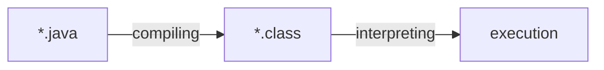

Continuing from the [previous post](https://haril.dev/en/blog/2023/12/10/Java-Hello-World-Deepdive-1/), let's explore
how the code evolves to print "Hello World."

## Chapter 2. Compilation and Disassembly

Programming languages have levels.

The closer a programming language is to human language, the higher-level language it is, and the closer it is to the
language a computer can understand (machine language), the lower-level language it is. Writing programs in a high-level
language makes it easier for humans to understand and increases productivity, but it also creates a gap with machine
language, requiring a process to bridge this gap.

The process of a high-level language descending to a lower level is called **compilation**.

Since Java is not a low-level language, there is a compilation process. Let's take a look at how this compilation
process works in Java.

### Compilation

As mentioned earlier, Java code cannot be directly executed by the computer. To execute Java code, it needs to be
transformed into a form that the computer can read and interpret. This transformation involves the following major
steps:



The resulting `.class` file from compilation is in bytecode. However, it is still not machine code that the computer can
execute. The Java Virtual Machine (JVM) reads this bytecode and further processes it into machine code. We will cover
how the JVM handles this in the final chapter.

First, let's compile the `.java` file to create a `.class` file. You can compile it using the `javac` command.

```java
// VerboseLanguage.java
public class VerboseLanguage {
    public static void main(String[] args) {
        System.out.println("Hello World");
    }
}
```

```bash
javac VerboseLanguage.java
```


You can see that the class file has been created. You can run the class file using the `java` command, and this is the
basic flow of running a Java program.

```bash
java VerboseLanguage
// Hello World
```

Are you curious about the contents of the class file? Wondering how the computer reads and executes the language? What
secrets lie within this file? It feels like opening Pandora's box.

Expecting something, you open it up, and...


_No way!_

Only a brief binary content is displayed.

_Wait, wasn't the result of compilation supposed to be bytecode...?_

Yes, it is bytecode. At the same time, it is also binary code. At this point, let's briefly touch on the differences
between bytecode and binary code before moving on.

Binary Code
: Code composed of 0s and 1s. While machine language is made up of binary code, not all binary code is machine language.

Bytecode
: Code composed of 0s and 1s. However, bytecode is not intended for the machine but for the **VM**. It is converted into
machine code by the VM through processes like the JIT compiler.

Still, as this article claims to be a deep dive, we reluctantly tried to read through the conversion.


_Fortunately, our Pandora's box contains only 0s and 1s, with no other hardships or challenges._

While we succeeded in reading it, it is quite difficult to understand the content with just 0s and 1s 🤔

Now, let's decipher this code.

### Disassembly

During the compilation process, the code is transformed into bytecode composed of 0s and 1s. As seen earlier,
interpreting bytecode directly is quite challenging. Fortunately, the JDK includes tools that help developers read
compiled bytecode, making it useful for debugging purposes.

The process of converting bytecode into a more readable form for developers is called **disassembly**. Sometimes this
process can be confused with decompilation, but decompilation results in a higher-level programming language, not
assembly language. Also, since the `javap` documentation clearly uses the term disassemble, we will follow suit.


:::info

Decompilation refers to representing binary code in a relatively higher-level language, just like before compiling
binary. On the other hand, disassembly represents binary code in a minimal human-readable form (assembler language).

:::

#### Virtual Machine Assembly Language

Let's use `javap` to disassemble the bytecode. The output is much more readable than just 0s and 1s.

```bash
javap -c VerboseLanguage.class
```

```text
Compiled from "VerboseLanguage.java"
public class VerboseLanguage {
  public VerboseLanguage();
    Code:
       0: aload_0
       1: invokespecial #1                  // Method java/lang/Object."<init>":()V
       4: return

  public static void main(java.lang.String[]);
    Code:
       0: getstatic     #7                  // Field java/lang/System.out:Ljava/io/PrintStream;
       3: ldc           #13                 // String Hello World
       5: invokevirtual #15                 // Method java/io/PrintStream.println:(Ljava/lang/String;)V
       8: return
}
```

What can we learn from this?

Firstly, this language is called virtual machine assembly language.

> The Java Virtual Machine code is written in the informal “virtual machine assembly language” output by Oracle's javap
> utility, distributed with the JDK release. - JVM Spec

The format is as follows:

```text
<index> <opcode> [ <operand1> [ <operand2>... ]] [<comment>]
```

index
: Index of the JVM code byte array. It can be thought of as the method's starting offset.

opcode
: Mnemonic symbol representing the set of instructions opcode. We remember the order of the rainbow colors as 'ROYGBIV'
to distinguish the instruction set. If the rainbow colors represent the instruction set, each syllable of 'ROYGBIV' can
be considered as a mnemonic symbol defined to differentiate them.

operandN
: Operand of the instruction. The operand of a computer instruction is the address field. It points to where the data to
be processed is stored in the constant pool.

Let's take a closer look at the main method part of the disassembled result.

```text
Code:
   0: getstatic     #7                  // Field java/lang/System.out:Ljava/io/PrintStream;
   3: ldc           #13                 // String Hello World
   5: invokevirtual #15                 // Method java/io/PrintStream.println:(Ljava/lang/String;)V
   8: return
```

- `invokevirtual`: Call an instance method
- `getstatic`: Get a static field from a class
- `ldc`: Load data into the run-time constant pool.

The `3: ldc #13` on the third line means to put an item at index 13, and the item being put is kindly indicated in the
comment.

_Hello World_

Note that bytecode instructions like `getstatic` and `invokevirtual` are represented by a single-byte opcode number. For
example, `getstatic=0xb2`, `invokevirtual=0xb6`, and so on. It can be understood that Java bytecode instructions also
have a maximum of **256** different opcodes.


_JVM Instruction Set showing the bytecode for invokevirtual_

If we look at the bytecode of the main method in hex, it would be as follows:

```text
b2 00 07 12 0d b6
```

It might still be a bit hard to notice the pattern. As a hint, remember that earlier we mentioned the number before the
opcode is the index in the JVM array. Let's slightly change the representation.

```text
arr = [b2, 00, 07, 12, 0d, b6]
```

- arr[0] = b2 = getstatic
- arr[3] = 12 = ldc
- arr[5] = b6 = invokevirtual

It becomes somewhat clearer what the index meant. The reason for skipping some indices is quite simple: `getstatic`
requires a 2-byte operand, and `ldc` requires a 1-byte operand. Therefore, the `ldc` instruction, which is the next
instruction after `getstatic`, is recorded at index 3, skipping 1 and 2. Similarly, skipping 4, the `invokevirtual`
instruction is recorded at index 5.

Lastly, notice the comment `(Ljava/lang/String;)V` on the 4th line. Through this comment, we can see that in Java
bytecode, classes are represented as `L;`, and void is represented as `V`. Other types also have their unique
representations, summarized as follows:

| Java Bytecode  | Type      | Description                           |
|----------------|-----------|---------------------------------------|
| B              | byte      | signed byte                           |
| C              | char      | Unicode character                     |
| D              | double    | double-precision floating-point value |
| F              | float     | single-precision floating-point value |
| I              | int       | integer                               |
| J              | long      | long integer                          |
| L\<classname>; | reference | an instance of class \<classname>     |
| S              | short     | signed short                          |
| Z              | boolean   | true or false                         |
| [              | reference | one array dimension                   |

Using the `-verbose` option, you can see a more detailed disassembly result, including the constant pool. It would be
interesting to examine the operands and constant pool together.

```text
  Compiled from "VerboseLanguage.java"
public class VerboseLanguage
  minor version: 0
  major version: 65
  flags: (0x0021) ACC_PUBLIC, ACC_SUPER
  this_class: #21                         // VerboseLanguage
  super_class: #2                         // java/lang/Object
  interfaces: 0, fields: 0, methods: 2, attributes: 1
Constant pool:
   #1 = Methodref          #2.#3          // java/lang/Object."<init>":()V
   #2 = Class              #4             // java/lang/Object
   #3 = NameAndType        #5:#6          // "<init>":()V
   #4 = Utf8               java/lang/Object
   #5 = Utf8               <init>
   #6 = Utf8               ()V
   #7 = Fieldref           #8.#9          // java/lang/System.out:Ljava/io/PrintStream;
   #8 = Class              #10            // java/lang/System
   #9 = NameAndType        #11:#12        // out:Ljava/io/PrintStream;
  #10 = Utf8               java/lang/System
  #11 = Utf8               out
  #12 = Utf8               Ljava/io/PrintStream;
  #13 = String             #14            // Hello World
  #14 = Utf8               Hello World
  #15 = Methodref          #16.#17        // java/io/PrintStream.println:(Ljava/lang/String;)V
  #16 = Class              #18            // java/io/PrintStream
  #17 = NameAndType        #19:#20        // println:(Ljava/lang/String;)V
  #18 = Utf8               java/io/PrintStream
  #19 = Utf8               println
  #20 = Utf8               (Ljava/lang/String;)V
  #21 = Class              #22            // VerboseLanguage
  #22 = Utf8               VerboseLanguage
  #23 = Utf8               Code
  #24 = Utf8               LineNumberTable
  #25 = Utf8               main
  #26 = Utf8               ([Ljava/lang/String;)V
  #27 = Utf8               SourceFile
  #28 = Utf8               VerboseLanguage.java
{
  public VerboseLanguage();
    descriptor: ()V
    flags: (0x0001) ACC_PUBLIC
    Code:
      stack=1, locals=1, args_size=1
         0: aload_0
         1: invokespecial #1                  // Method java/lang/Object."<init>":()V
         4: return
      LineNumberTable:
        line 1: 0

  public static void main(java.lang.String[]);
    descriptor: ([Ljava/lang/String;)V
    flags: (0x0009) ACC_PUBLIC, ACC_STATIC
    Code:
      stack=2, locals=1, args_size=1
         0: getstatic     #7                  // Field java/lang/System.out:Ljava/io/PrintStream;
         3: ldc           #13                 // String Hello World
         5: invokevirtual #15                 // Method java/io/PrintStream.println:(Ljava/lang/String;)V
         8: return
      LineNumberTable:
        line 3: 0
        line 4: 8
}
SourceFile: "VerboseLanguage.java"
```

## Conclusion

In the previous chapter, we explored why a verbose process is required to print Hello World. In this chapter, we looked
at the compilation and disassembly processes before printing Hello World. Next, we will finally examine the execution
flow of the Hello World printing method with the JVM.

## Reference

- [Opcode Codes](https://seung-nari.tistory.com/entry/%EC%BB%B4%ED%93%A8%ED%84%B0-%EA%B5%AC%EC%A1%B0-%EB%AA%85%EB%A0%B9%EC%96%B4-%EC%BD%94%EB%93%9C-OP-Code-Mode-Operand)
- [Naver D2](https://d2.naver.com/helloworld/1230)
- JVM specification
