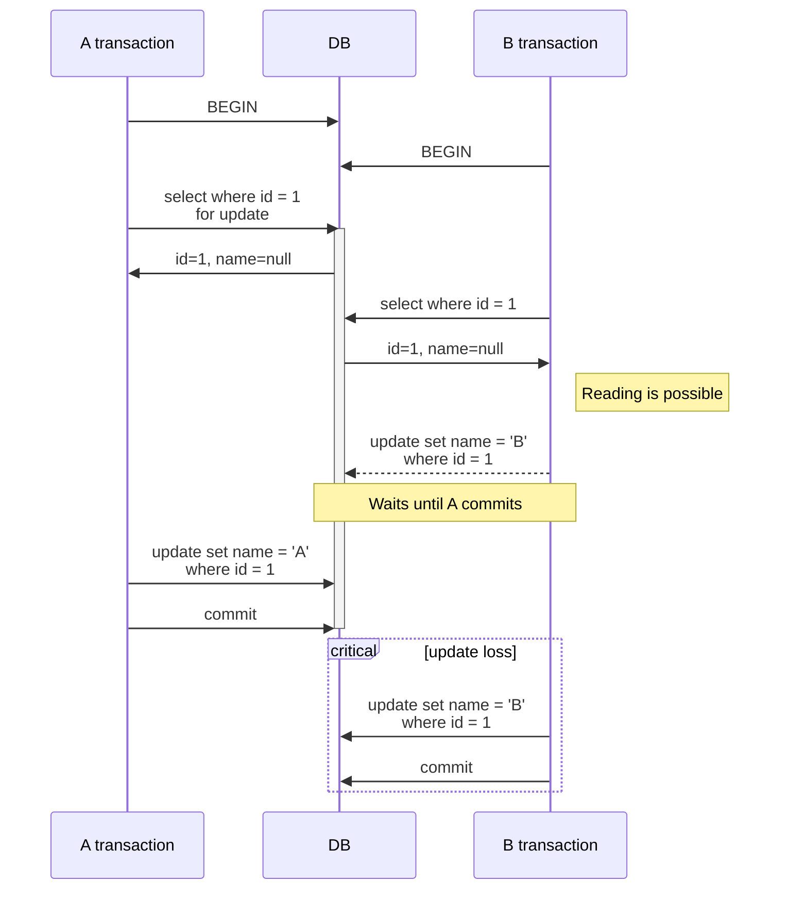
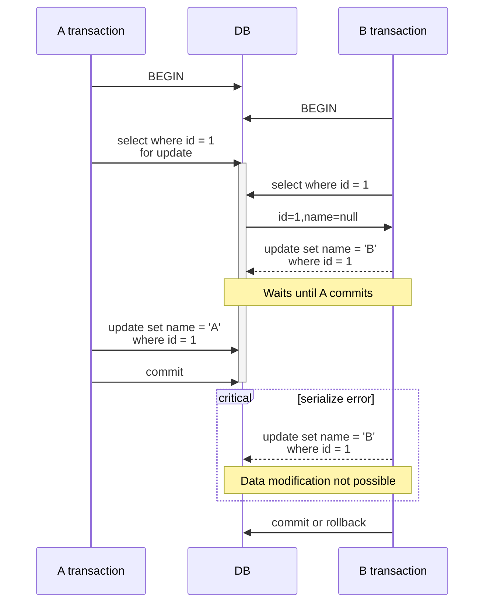
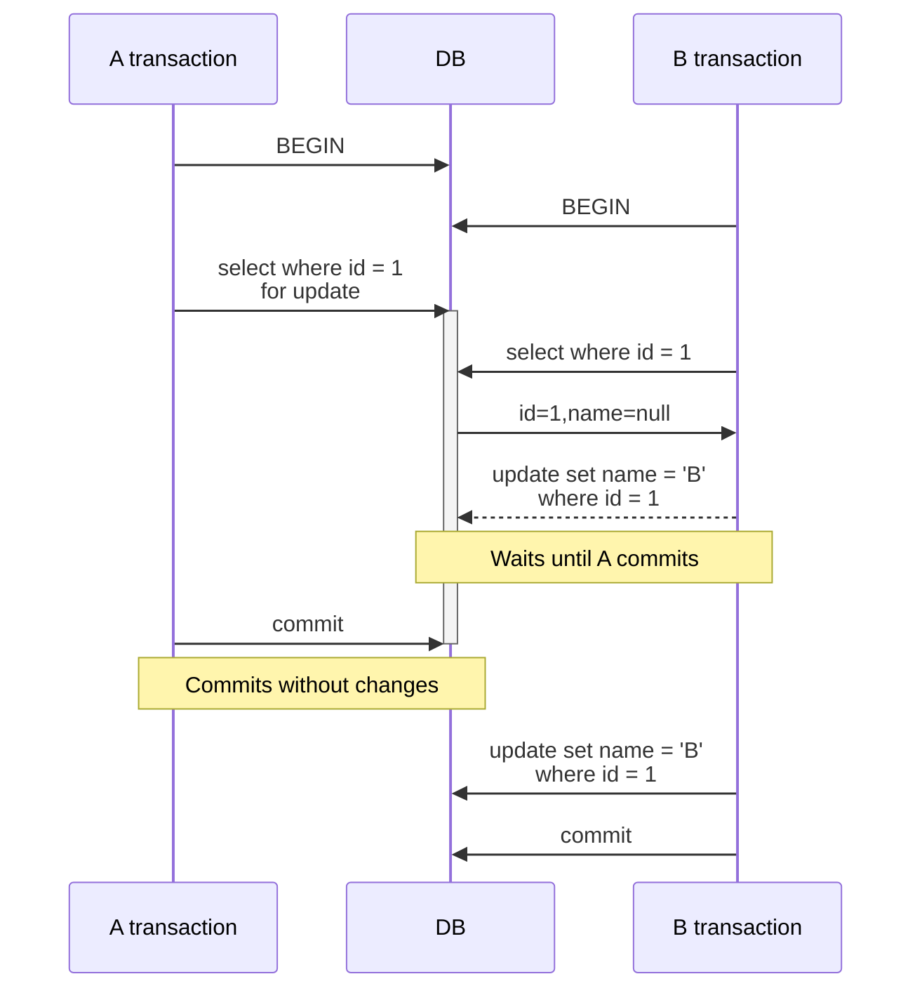
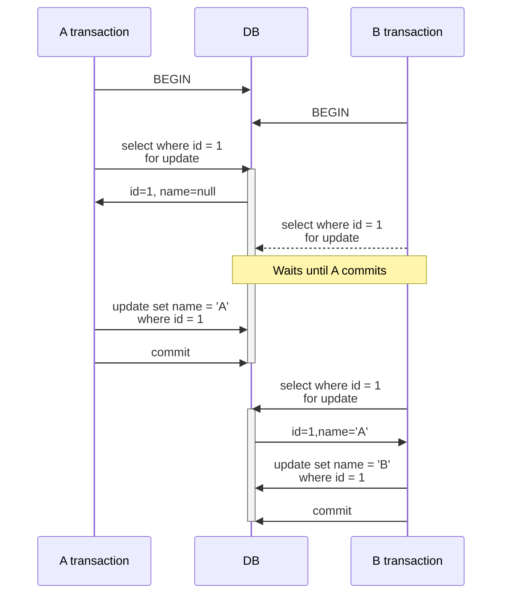

# How SELECT FOR UPDATE Works

In PostgreSQL, the FOR UPDATE lock is used to explicitly lock rows in a table while performing a SELECT query within a transaction. This lock mode is typically used to ensure that the selected rows do not change until the transaction is completed, preventing other transactions from modifying or locking these rows in a conflicting manner.

For example, it can be used to prevent other customers from changing data while a specific customer is going through the ticket booking process.

The cases we will examine in this article are somewhat special:

- How does `select for update` behave if there is a mix of locked reads and unlocked reads?
- If a lock is used initially, is it possible for other transactions to read?
- Can consistent reading of data be guaranteed even if reading methods are mixed?

In PostgreSQL, the `select for update` clause operates differently depending on the **transaction isolation level**. Therefore, it is necessary to examine how it behaves at each isolation level.

Let’s assume a scenario where data is being modified when the following data exists.

| id  | name |
| --- | ---- |
| 1   | null |

<!-- truncate-->

## Read Committed

- PostgreSQL's default isolation level.
- Even if Transaction A locks a row using `select for update`, Transaction B can still read the data.
    - Reading without locks.
- Until Transaction A commits, Transaction B cannot modify the data.
- If Transaction B is waiting for Transaction A to commit, as soon as Transaction A commits, Transaction B can proceed immediately.
- Consistent reading is not guaranteed.
- **Loss of updates can occur.**

### Transaction Interactions in Case of Data Modifications

The area with an Exclusive Lock is highlighted in bold. As you can see from the diagram, PostgreSQL does not prevent reading without locks. Instead, when Transaction B tries to modify a record locked by Transaction A, it must wait until Transaction A completes. Ultimately, **loss of updates is unavoidable**.

If you need to prevent update loss, you should use the Repeatable Read isolation level.

## Repeatable Read

- Even if Transaction A locks a row using `select for update`, Transaction B can still read the data.
- Until Transaction A commits, Transaction B cannot modify the data.
- If Transaction B tries to modify the data, **a serialization error occurs** (Transaction B needs to rollback).
- Consistent reading is guaranteed.
- **Loss of updates does not occur.**

### When Data Modification Transactions Conflict

A serialization error is detected during concurrent modification activities. In this case, developers need to handle the error manually.

### When Data Modification Transactions Do Not Conflict

Suppose Transaction A locks a row but does not modify it, and Transaction B modifies it, what would be the result?

In PostgreSQL, if the commit results do not conflict, all changes are applied.

Transaction A acquired the lock first, but since there are no conflicts, Transaction B's changes are applied without error.

## Serializable

- Almost identical to Repeatable Read.
- Using Serializable doesn't always lead to poor performance. Modern databases' implementation of Serializable is worth considering for its potential benefits.[^fn-nth-1]

## When Both A and B Transactions Call SELECT FOR UPDATE

What happens if both transactions, A and B, invoke `select for update`?

In this scenario, **regardless of the isolation level**, both sides must acquire an Exclusive Lock, and one side must release its lock for the other transaction to gain access.

To ensure all operations are processed sequentially, all transactions should use `select for update` to acquire locks.

## Conclusion

Let’s summarize the key points we've covered:

- The `select for update` statement doesn’t prevent read operations without locks.
- PostgreSQL uses a First-Committer Wins policy to manage concurrency, allowing only the first committed transaction and rejecting others.
    - Be cautious of update losses.
- For safe concurrency control, it’s beneficial for all transactions to utilize `select for update`.

PostgreSQL’s `select for update` does not interfere with read operations at any isolation level. Instead, it triggers errors at the point of commit if data modifications are detected, prompting additional handling. Locks do not necessarily mean that other transactions must wait. The design ensures optimal performance while accommodating various situations, which is an interesting aspect of this feature.

## Reference

- [Locks in PostgreSQL part 3](https://dev.to/mahmoudhossam917/postgresql-locks-part-3-3481#:~:text=The%20FOR%20SHARE%20lock%20mode%20in%20PostgreSQL,ensuring%20data%20consistency%20without%20blocking%20other%20readers)

---

[^fn-nth-1]: [PSQL에서 Serializable 격리수준을 쓰기 무서우신가요?](https://velog.io/@jaquan1227/PSQL-%EC%97%90%EC%84%9C-Serializable-%EA%B2%A9%EB%A6%AC%EC%88%98%EC%A4%80%EC%9D%84-%EC%93%B0%EA%B8%B0-%EB%AC%B4%EC%84%9C%EC%9A%B0%EC%8B%A0%EA%B0%80%EC%9A%94)

